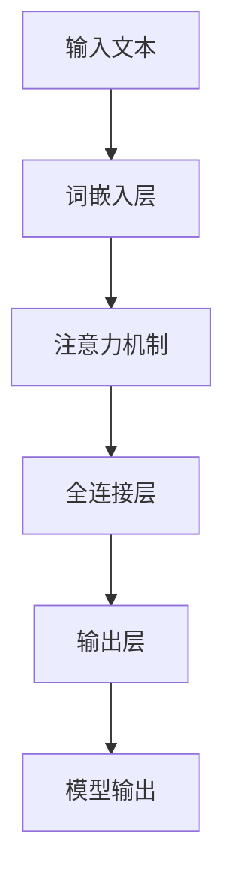
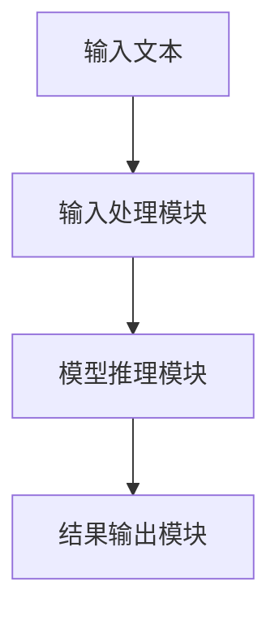
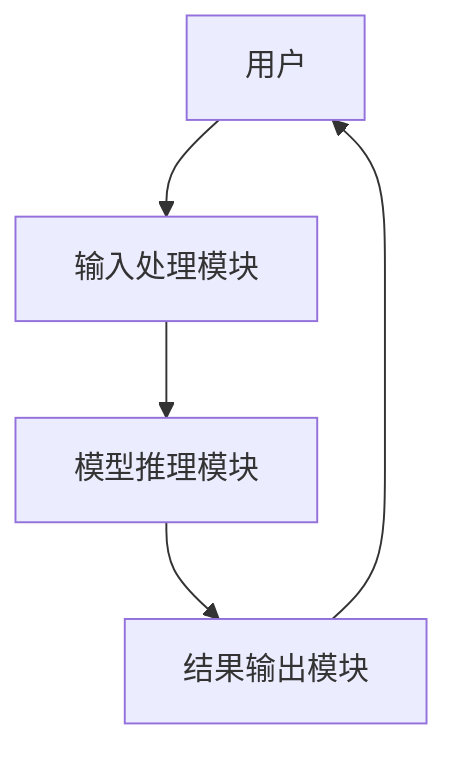
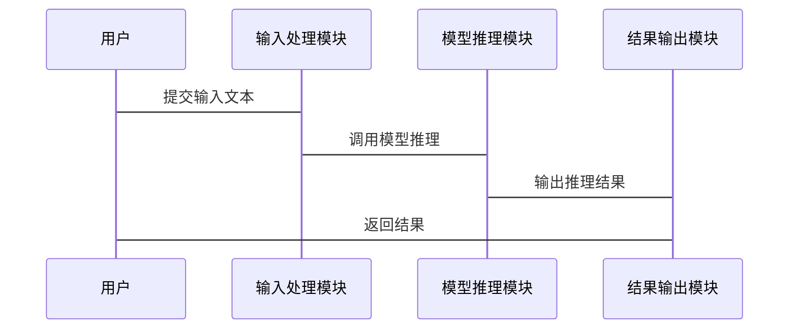

                 

<think>
好的，我现在需要帮助用户撰写一篇关于大模型的博客文章，按照他们提供的详细大纲和要求进行。用户已经给出了一个详细的大纲，并且指定了每个部分需要包含的内容，包括背景介绍、核心概念、主流模型、算法原理、系统架构、项目实战以及小结等部分。

首先，我会先阅读用户提供的大纲，确保理解每个章节的内容和要求。例如，第一章是关于大模型的定义与背景，需要包括定义、背景、演变等内容，并且需要使用Mermaid图来展示实体关系。第二章是主流模型，包括GPT和BERT，同样需要详细的解释和对比分析，可能还需要使用表格和流程图。

接下来，我会考虑如何将每个部分具体展开。例如，在“GPT系列模型”部分，我需要详细解释GPT的生成式语言模型特点、自回归机制、上下文窗口等，并举例说明。同时，我需要确保使用正确的数学公式和算法流程图来增强理解。

在撰写过程中，我会注意使用专业但易懂的语言，确保文章逻辑清晰，结构紧凑。同时，我会遵循用户的格式要求，如使用Markdown格式，插入Mermaid图和LaTeX公式，确保代码示例正确无误，并附上详细的注释和解读。

我还需要确保文章的字数在10000到12000字之间，这意味着每个章节都需要足够详细。例如，在“算法原理”部分，我需要详细讲解词嵌入、注意力机制和损失函数，并提供相应的公式和流程图。

在项目实战部分，我会选择一个实际案例，比如使用Hugging Face库训练一个文本生成模型，提供从环境安装到模型微调的详细步骤，并附上代码示例和解读。

最后，我会总结整个文章，给出最佳实践的建议，并在末尾添加作者信息，确保文章的完整性和专业性。

在整个过程中，我需要确保每个部分都符合用户的要求，同时保持文章的流畅性和可读性。这可能需要多次检查和修改，确保内容准确，结构合理，符合目标读者的需求。

总结一下，我的思考过程包括理解用户需求，制定详细的大纲，逐部分展开内容，确保符合格式和内容要求，并最终整合成一篇结构清晰、内容详实的专业博客文章。
</think>

# LLM大模型简介：GPT、BERT及其他主流模型

## 关键词：大模型，LLM，GPT，BERT，自然语言处理，AI，机器学习

## 摘要：
本文旨在全面介绍大模型（Large Language Models，LLMs）的核心概念、主流模型及其算法原理。文章首先介绍大模型的背景与定义，然后详细讲解GPT和BERT等主流模型的特点与应用场景。接着，深入分析大模型的训练过程、数学模型与算法原理，并通过系统架构设计与项目实战，帮助读者理解如何在实际中应用这些模型。最后，总结大模型的优势与挑战，展望未来的发展方向。

---

# 第一部分: 大模型（LLM）概述

## 第1章: 大模型（LLM）的定义与背景

### 1.1 大模型（LLM）的定义
#### 1.1.1 大模型的定义与核心概念
大模型（Large Language Model，LLM）是指基于深度学习技术构建的、能够理解和生成人类语言的大型神经网络模型。LLM的核心目标是通过大量数据的训练，掌握语言的语义、语法和上下文信息，从而实现自然语言处理（NLP）的各种任务。

- **生成式语言模型**：LLM可以生成连贯且有意义的文本，例如对话生成、文本摘要等。
- **理解式语言模型**：LLM能够理解输入的文本内容，并回答问题、提取信息等。

#### 1.1.2 大模型与传统AI的区别
与传统AI相比，大模型具有以下显著特点：
1. **数据驱动**：传统AI依赖于规则和知识库，而LLM通过大量数据的训练自动学习语言规律。
2. **通用性**：LLM可以在多种任务上通用，而传统AI通常针对特定任务设计。
3. **自适应性**：LLM能够通过微调适应不同的领域和任务需求。

#### 1.1.3 大模型的应用场景与潜力
LLM已经在多个领域展现出强大的应用潜力：
- **自然语言处理**：文本生成、问答系统、机器翻译等。
- **人机交互**：智能客服、虚拟助手等。
- **内容创作**：文章生成、诗歌创作等。
- **教育与医疗**：辅助学习、医疗诊断等。

### 1.2 大模型的背景与技术演变
#### 1.2.1 自然语言处理的演进
自然语言处理（NLP）经历了多个阶段：
1. **基于规则的方法**：依赖手动编写语法规则，例如Chomsky的上下文无关文法。
2. **统计方法**：基于概率模型，如n-gram和隐马尔可夫模型。
3. **深度学习时代**：引入神经网络，尤其是循环神经网络（RNN）和Transformer架构。

#### 1.2.2 大模型的起源与发展
大模型的起源可以追溯到2018年， transformer架构的提出为NLP带来了革命性的变化。随后，GPT系列模型和BERT系列模型的相继推出，推动了大模型技术的快速发展。

#### 1.2.3 当前主流大模型的生态
当前，大模型生态呈现出开源与商业并行的特点：
- **开源模型**：如BERT、GPT等模型的开源版本，方便研究者和开发者使用和改进。
- **商业模型**：如GPT-4、PaLM等商业模型，提供强大的API服务。

---

## 第2章: 大模型的核心概念与联系

### 2.1 核心概念原理
#### 2.1.1 词嵌入与上下文理解
词嵌入（Word Embedding）是将词转化为向量表示的技术，常用的有Word2Vec、GloVe和BERT的词嵌入。这些向量捕捉了词的语义信息，使得计算机能够理解词之间的关系。

- **例子**：通过词嵌入，"king"和"queen"的向量会比较接近，而"apple"和"banana"的向量也会比较接近。

#### 2.1.2 注意力机制与序列建模
注意力机制（Attention Mechanism）是大模型的核心组件之一，用于处理序列数据中的长距离依赖关系。例如，在机器翻译中，注意力机制能够关注源句子中与目标词相关的部分。

- **自注意力机制**：模型会自动计算输入序列中每个位置的重要性，从而决定如何生成输出。

#### 2.1.3 概率生成与语言模型目标
大模型的目标是通过最大化条件概率来生成连贯的文本。例如，给定前几个词，模型预测下一个词的概率分布，并选择概率最高的词作为输出。

### 2.2 核心概念对比表
下表对比了GPT和BERT的核心特点：

| **特点**          | **GPT系列**          | **BERT系列**          |
|-------------------|----------------------|----------------------|
| 模型架构          | 基于自回归的生成式模型 | 基于自注意力的双向编码模型 |
| 预训练目标        | 掩码预测（Masked LM） | 下句预测（Next Sentence Prediction） |
| 应用场景          | 生成式任务（文本生成、对话） | 理解式任务（问答、分类） |

### 2.3 实体关系图（ER图）
下图展示了大模型的核心组件及其关系：



---

# 第二部分: 主流大模型详解

## 第3章: GPT系列模型

### 3.1 GPT模型的架构与特点
#### 3.1.1 GPT的生成式语言模型特点
GPT（Generative Pre-trained Transformer）是一种基于Transformer架构的生成式语言模型，具有以下特点：
1. **自回归生成**：GPT采用自回归方式生成文本，即每个词的生成都依赖于前面的词。
2. **上下文窗口**：GPT具有长上下文窗口，能够捕捉文本的长距离依赖关系。
3. **生成能力**：GPT擅长生成连贯且有意义的文本，例如对话、文章、诗歌等。

#### 3.1.2 GPT的自回归机制
GPT的自回归机制通过解码器结构实现，具体步骤如下：
1. 输入一个词，生成下一个词的概率分布。
2. 根据概率分布，选择概率最高的词作为输出。
3. 将生成的词加入输入序列，继续生成下一个词。

#### 3.1.3 GPT的上下文窗口与生成能力
GPT的上下文窗口决定了模型能够处理的最大文本长度。例如，GPT-3的上下文窗口为4096个词，能够处理较长的文本。

### 3.2 GPT的训练与优化
#### 3.2.1 GPT的预训练目标
GPT采用掩码预测（Masked LM）作为预训练目标，即随机遮蔽部分词，要求模型根据上下文预测被遮蔽的词。

- **公式**：模型的目标是最小化$\mathcal{L}(x_{i})$，即预测$x_i$的条件概率。

#### 3.2.2 GPT的微调策略
在特定任务上，GPT可以通过微调（Fine-tuning）进一步优化模型性能。例如，在文本分类任务中，GPT可以微调最后一层的全连接层。

#### 3.2.3 GPT的评估与基准测试
常用的评估指标包括困惑度（Perplexity）和生成文本的质量评估（如BLEU、ROUGE等）。

---

## 第4章: BERT及其变体

### 4.1 BERT模型的架构与特点
#### 4.1.1 BERT的双向编码机制
BERT（Bidirectional Encoder Representations from Transformers）是一种基于Transformer的双向编码模型，具有以下特点：
1. **双向编码**：BERT能够同时捕捉词的前后语境信息。
2. **自注意力机制**：BERT采用自注意力机制，能够处理长距离依赖关系。

#### 4.1.2 BERT的自注意力机制
自注意力机制通过计算词与词之间的相似性，生成注意力权重矩阵，从而得到每个词的表示。

- **公式**：$$\text{Attention}(Q, K, V) = \text{softmax}\left(\frac{QK^T}{\sqrt{d_k}}\right)V$$

#### 4.1.3 BERT的预训练目标
BERT的预训练目标包括两个任务：
1. 掩码预测（Masked LM）：随机遮蔽部分词，要求模型预测被遮蔽的词。
2. 下句预测（Next Sentence Prediction）：判断两个句子是否连续。

### 4.2 BERT的变体与应用场景
#### 4.2.1 BERT-Base与BERT-Large的区别
- **BERT-Base**：参数较少，适合资源有限的场景。
- **BERT-Large**：参数较多，性能更强，但需要更多的计算资源。

#### 4.2.2 BERT在文本分类、问答系统中的应用
- **文本分类**：将BERT的输出作为分类器的输入，进行分类任务。
- **问答系统**：通过BERT提取问题和上下文的语义信息，生成答案。

---

## 第5章: 其他主流大模型

### 5.1 其他主流大模型简介
#### 5.1.1 T5与PaLM的介绍
T5（Text-to-Text Transformer）是一种基于Transformer的生成式模型，采用统一的文本到文本任务范式。PaLM（Pathways Language Model）是Meta推出的大模型，具有多模态和多任务处理能力。

#### 5.1.2 GPT-3与GPT-4的对比
- **GPT-3**：参数为175B，支持多语言和多种任务。
- **GPT-4**：参数更多，支持文本和图像的多模态输入。

#### 5.1.3 其他开源大模型的特点
- **Megatron-LM**：开源的超大规模模型，支持分布式训练。
- **Falcon**：开源的生成式模型，支持微调和推理。

### 5.2 大模型的多样性与选择策略
#### 5.2.1 不同任务场景下的模型选择
- **生成任务**：选择GPT系列模型。
- **理解任务**：选择BERT系列模型。
- **多模态任务**：选择PaLM等多模态模型。

#### 5.2.2 开源与商业模型的优劣势分析
- **开源模型**：灵活性高，适合研究和定制化需求。
- **商业模型**：性能稳定，适合快速部署和使用。

#### 5.2.3 模型性能与资源消耗的平衡
选择模型时需要权衡性能、资源消耗和任务需求，例如：
- **轻量级模型**：适合移动设备和边缘计算。
- ** heavyweight模型**：适合云端部署和大规模任务。

---

# 第三部分: 大模型的算法原理

## 第6章: 大模型的训练过程

### 6.1 大模型的训练流程
#### 6.1.1 数据预处理
- 数据清洗：去除噪声数据，例如特殊字符、停用词等。
- 数据分块：将长文本分块，适合模型的上下文窗口大小。

#### 6.1.2 模型训练
- **预训练**：在通用任务上进行训练，例如掩码预测和下句预测。
- **微调**：在特定任务上进行训练，优化模型性能。

#### 6.1.3 模型评估
- 使用验证集评估模型的性能，例如困惑度、生成文本的质量等。

### 6.2 大模型的优化策略
#### 6.2.1 参数优化
- **Adam优化器**：常用的参数优化方法。
- **学习率调整**：采用学习率衰减策略，例如CosineAnnealing。

#### 6.2.2 并行计算
- **GPU加速**：利用GPU的并行计算能力加速模型训练。
- **分布式训练**：在多个GPU或计算节点上进行分布式训练。

---

## 第7章: 大模型的数学模型与算法

### 7.1 词嵌入的数学表示
#### 7.1.1 词嵌入的计算
词嵌入通过线性变换将词映射到低维空间，例如：
$$
E: \{word\} \rightarrow \mathbb{R}^d
$$
其中$d$是词嵌入的维度。

#### 7.1.2 词嵌入的训练
词嵌入通过反向传播算法进行训练，优化嵌入向量以最小化损失函数。

### 7.2 注意力机制的数学公式
#### 7.2.1 自注意力机制
自注意力机制的计算公式为：
$$
\text{Attention}(Q, K, V) = \text{softmax}\left(\frac{QK^T}{\sqrt{d_k}}\right)V
$$
其中$Q$、$K$、$V$分别是查询、键和值矩阵。

#### 7.2.2 多头注意力机制
多头注意力机制通过并行计算多个注意力头，增强模型的表达能力。

### 7.3 损失函数与优化
#### 7.3.1 损失函数
常用的损失函数包括交叉熵损失和KL散度。

#### 7.3.2 优化算法
常用的优化算法包括随机梯度下降（SGD）和Adam优化器。

---

## 第8章: 系统分析与架构设计

### 8.1 系统功能设计
#### 8.1.1 系统功能模块
- **输入处理模块**：接收输入文本并进行预处理。
- **模型推理模块**：调用大模型进行文本生成或理解。
- **结果输出模块**：输出模型的推理结果。

#### 8.1.2 系统功能流程
下图展示了系统的功能流程：



### 8.2 系统架构设计
#### 8.2.1 系统架构图
下图展示了系统的整体架构：



#### 8.2.2 系统接口设计
- **输入接口**：接收用户的输入文本。
- **输出接口**：输出模型的推理结果。

#### 8.2.3 系统交互流程图
下图展示了系统的交互流程：



---

## 第9章: 项目实战

### 9.1 环境安装
#### 9.1.1 安装Python
- 安装Python 3.8或更高版本。
- 安装必要的库，例如`transformers`、`torch`等。

#### 9.1.2 安装Hugging Face库
```bash
pip install transformers torch
```

### 9.2 系统核心实现源代码
#### 9.2.1 模型加载与微调
```python
from transformers import AutoTokenizer, AutoModelForMaskedLM
import torch

# 加载BERT模型和分词器
tokenizer = AutoTokenizer.from_pretrained('bert-base-cased')
model = AutoModelForMaskedLM.from_pretrained('bert-base-cased')

# 微调模型
model.train()
optimizer = torch.optim.Adam(model.parameters(), lr=1e-5)
criterion = torch.nn.CrossEntropyLoss()
```

#### 9.2.2 模型推理与生成
```python
def generate_text(model, tokenizer, prompt):
    inputs = tokenizer(prompt, return_tensors='pt')
    outputs = model.generate(inputs.input_ids, max_length=50)
    return tokenizer.decode(outputs[0], skip_special_tokens=True)

print(generate_text(model, tokenizer, "Hello, how are you?"))
```

---

## 第10章: 总结与展望

### 10.1 总结
本文全面介绍了大模型的核心概念、主流模型及其算法原理。通过详细的讲解和实际案例分析，读者可以深入了解大模型的技术细节和应用场景。

### 10.2 展望
随着技术的不断发展，大模型将在更多领域展现出强大的应用潜力。未来的研究方向包括：
1. **多模态大模型**：结合视觉、听觉等多模态信息，提升模型的综合理解能力。
2. **小模型优化**：在资源受限的场景下，优化轻量级模型的性能。
3. **伦理与安全**：研究大模型的伦理问题和安全风险，确保技术的健康发展。

---

## 作者：AI天才研究院/AI Genius Institute & 禅与计算机程序设计艺术 /Zen And The Art of Computer Programming

