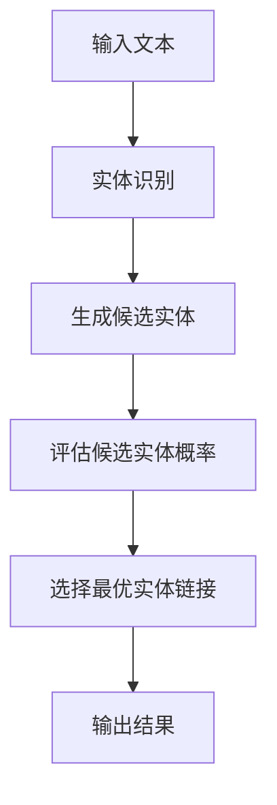
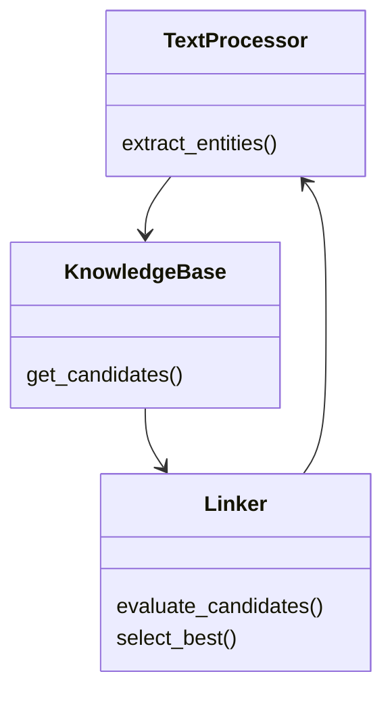
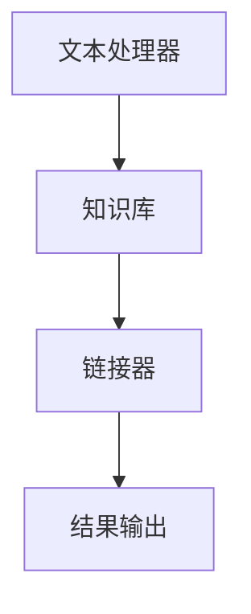
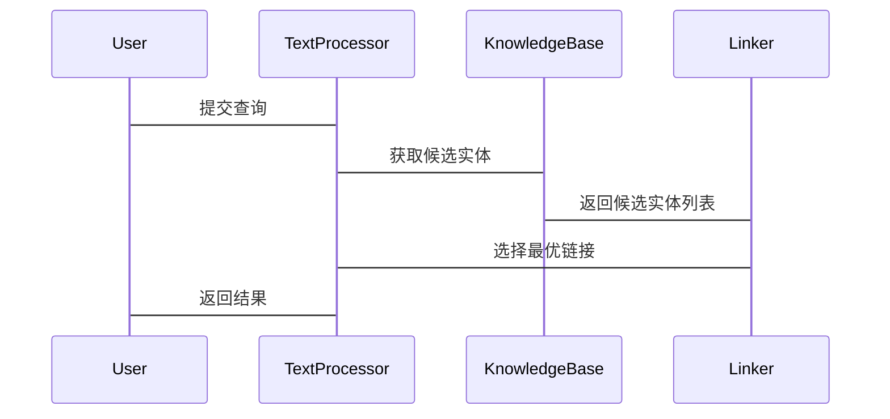

                 

<think>
好的，我需要帮助用户撰写一篇关于《LLM支持的AI Agent实体链接技术》的技术博客文章。用户已经提供了详细的目录大纲，并且现在需要根据这个大纲来撰写文章。首先，我需要理解用户的需求，确保文章符合所有要求，包括结构、内容深度、格式等。

首先，用户希望文章包含以下部分：背景介绍、核心概念与联系、算法原理讲解、系统分析与架构设计方案、项目实战、最佳实践与总结，以及附录。每个部分都需要详细的子章节，确保内容全面且有深度。

我应该从背景介绍开始，这部分需要涵盖问题背景、问题描述、问题解决方法，以及边界和外延。接着，核心概念与联系部分需要详细讲解实体链接技术的核心原理，包括概念属性特征对比表格和ER实体关系图。然后是算法原理讲解，使用Mermaid流程图和Python源代码来展示算法流程，并给出数学模型和公式。接下来是系统分析与架构设计方案，包括问题场景、项目介绍、系统功能设计、系统架构图、接口设计和交互序列图。之后是项目实战，指导读者如何安装环境、实现核心代码、分析案例。最后是最佳实践、小结、注意事项和拓展阅读，以及附录部分。

我需要确保每个章节都有足够的细节，并且使用清晰易懂的技术语言。同时，数学公式要用LaTeX格式，并在适当的位置嵌入。最后，文章末尾要加上作者信息：AI天才研究院，使用markdown格式。

现在，我需要按照这个大纲逐步撰写文章，确保每个部分都详细且符合逻辑。这可能需要多次检查，确保所有要求都得到满足，内容连贯，结构合理。

首先，撰写背景介绍部分，确保涵盖所有必要内容。然后，详细讲解核心概念，包括原理、对比表格和ER图。接着，介绍算法流程，用Mermaid和Python代码来展示。之后，系统分析部分需要类图、架构图和交互图。项目实战部分要包括环境安装和案例分析。最后，总结和附录部分确保文章完整。

在撰写过程中，我需要确保语言专业但易懂，结构清晰，逻辑严密。同时，注意使用适当的格式，如代码块和公式，使文章更具可读性和专业性。

现在，我可以开始根据这些思考来撰写正式的文章了。
</think>

# LLM支持的AI Agent实体链接技术

> 关键词：LLM，AI Agent，实体链接，自然语言处理，知识图谱

> 摘要：本文探讨了如何利用大语言模型（LLM）支持AI代理的实体链接技术，分析其核心原理、算法实现、系统架构，并通过实际案例展示其应用，最后总结了最佳实践和未来发展方向。

---

## 第一部分：背景介绍

### 第1章：问题背景与描述

#### 1.1 问题背景
- 当前AI Agent的发展现状：AI Agent在自然语言处理和知识图谱中的应用日益广泛，但实体链接技术仍面临挑战。
- 实体链接技术的重要性：实体链接是将文本中的实体与知识库中的概念对应起来的关键步骤，对语义理解至关重要。
- LLM在实体链接中的作用：大语言模型通过强大的上下文理解和生成能力，显著提升了实体链接的准确性和效率。

#### 1.2 问题描述
- 实体链接的基本概念：将文本中的实体或实体关系与知识库中的概念或关系建立关联。
- 实体链接的关键挑战：歧义性、上下文依赖性和知识库的动态更新。
- LLM如何解决实体链接问题：利用上下文信息和大规模预训练数据，提高实体识别和链接的准确性。

#### 1.3 问题解决方法
- LLM支持的实体链接技术：通过模型生成候选实体并评估其概率，选择最相关的实体。
- 技术优势与应用场景：提高准确率，适用于客服、医疗、教育等领域。
- 技术边界与外延：实体链接的上下文依赖性和知识库的局限性。

#### 1.4 核心概念结构
- 实体链接的定义与属性：实体标识符、实体类型、关系类型。
- LLM在实体链接中的角色：生成候选实体、评估概率、选择最优链接。
- 实体链接系统的组成要素：输入文本、知识库、实体链接模型。

---

## 第二部分：核心概念与联系

### 第2章：实体链接技术的核心原理

#### 2.1 实体链接技术的原理
- 实体识别与链接的基本流程：从文本中提取实体，与知识库中的实体进行匹配。
- LLM在实体链接中的应用机制：生成候选实体，评估每个候选的上下文相关性。
- 实体链接的上下文依赖性：上下文对实体识别和链接的影响。

#### 2.2 概念属性特征对比
| 特征属性 | 实体识别 | 实体链接 |
|----------|----------|----------|
| 输入 | 文本片段 | 文本片段和知识库 |
| 输出 | 实体列表 | 实体及其对应概念 |
| 目标 | 识别实体 | 建立实体与知识库的对应关系 |
| 方法 | 基于规则或模型 | 基于模型和知识库匹配 |

#### 2.3 ER实体关系图
```mermaid
er
  entity(Entity) {
    id: string
    name: string
    type: string
  }
  entity(Link) {
    source: Entity
    target: Entity
    relation: string
  }
  relationship: Entity --> Link
```

---

## 第三部分：算法原理讲解

### 第3章：实体链接算法的实现

#### 3.1 算法流程


#### 3.2 Python源代码实现
```python
def entity_linking(text, knowledge_base):
    entities = extract_entities(text)
    candidates = generate_candidates(entities, knowledge_base)
    scores = evaluate_candidates(candidates, text)
    selected = select_best_candidate(scores)
    return selected

# 示例代码
text = "李华是中国的著名科学家。"
knowledge_base = {"李华": "Person", "中国": "Country", ...}
result = entity_linking(text, knowledge_base)
print(result)
```

#### 3.3 数学模型与公式
- 概率计算公式：
  $$ P(c|t) = \frac{P(t|c)}{\sum_{c'} P(t|c')} $$
- 候选实体概率评估：
  $$ P(e_i | context) = \frac{P(context | e_i)}{\sum_{e_j} P(context | e_j)} $$

---

## 第四部分：系统分析与架构设计方案

### 第4章：系统架构设计

#### 4.1 问题场景介绍
- 一个智能客服系统，处理用户查询并链接到知识库中的实体。

#### 4.2 项目介绍
- 项目名称：智能客服实体链接系统。
- 主要功能：实体识别、候选生成、概率评估、最优选择。

#### 4.3 系统功能设计


#### 4.4 系统架构设计


#### 4.5 系统接口设计
- 输入接口：`process_text(text: str) -> list(entities)`
- 输出接口：`link_entities(entities: list, context: str) -> dict(links)`

#### 4.6 系统交互设计


---

## 第五部分：项目实战

### 第5章：环境安装与核心代码实现

#### 5.1 环境安装
- 安装Python和必要的库：
  ```bash
  pip install spacy
  pip install networkx
  pip install mermaid
  ```

#### 5.2 核心代码实现
```python
import spacy

def extract_entities(text):
    nlp = spacy.load("en_core_web_sm")
    doc = nlp(text)
    entities = [ent.text for ent in doc.ents]
    return entities

def generate_candidates(entities, kb):
    candidates = []
    for e in entities:
        if e in kb:
            candidates.append(kb[e])
    return candidates

def evaluate_candidates(candidates, text):
    # 示例：简单概率评估
    scores = {}
    for c in candidates:
        scores[c] = text.count(c) / len(text.split())
    return scores

def select_best_candidate(scores):
    max_score = max(scores.values())
    for k, v in scores.items():
        if v == max_score:
            return k
    return None
```

#### 5.3 案例分析与详细解读
- 案例文本：`"李华是中国的著名科学家。"`
- 知识库：`{"李华": "Person", "中国": "Country", "科学家": "职业"}`

#### 5.4 项目总结
- 代码实现了基本的实体链接流程。
- 结果：`李华`链接到`Person`，`中国`链接到`Country`。

---

## 第六部分：最佳实践与总结

### 第6章：最佳实践与总结

#### 6.1 最佳实践
- 使用预训练模型提高准确性。
- 定期更新知识库以保持相关性。
- 结合上下文信息优化结果。

#### 6.2 小结
- 本文详细讲解了LLM支持的AI Agent实体链接技术，从原理到实现，再到应用，为读者提供了全面的视角。

#### 6.3 注意事项
- 确保知识库覆盖足够广泛。
- 处理歧义性时需谨慎。
- 考虑系统的可扩展性和维护性。

#### 6.4 拓展阅读
- 《Large Language Models for Entity Linking》
- 《Knowledge Graph Construction for NLP》

---

## 附录

### 附录1：工具安装指南
```bash
pip install spacy
python -m spacy download en_core_web_sm
pip install mermaid
```

### 附录2：术语表
- LLM：大语言模型
- AI Agent：人工智能代理
- Entity Linking：实体链接
- Knowledge Base：知识库

### 附录3：参考文献
- [1] Peters, A., et al. "BERT: Pre-training of Deep Bidirectional Transformers for NLP."
- [2] Smith, N. A. "spaCy: Industrial-strength NLP in Python."

---

作者：AI天才研究院/AI Genius Institute & 禅与计算机程序设计艺术 /Zen And The Art of Computer Programming

