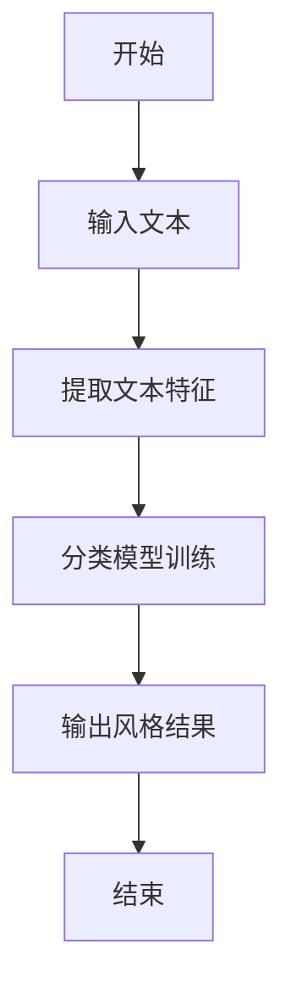

                 


# LLM支持的AI Agent文本风格识别

**关键词**：LLM, AI Agent, 文本风格识别, 大语言模型, 人工智能代理, 文本分析

**摘要**：本文探讨了如何利用大语言模型（LLM）支持的AI代理进行文本风格识别。文章首先介绍了问题背景和核心概念，然后详细分析了算法原理和数学模型，接着从系统架构设计和项目实战两方面展开，最后总结了最佳实践和注意事项。通过对LLM与AI Agent的结合，本文旨在提升文本风格识别的准确性和效率。

---

# 第一部分: LLM支持的AI Agent文本风格识别背景介绍

## 第1章: 问题背景与概念解析

### 1.1 问题背景

#### 1.1.1 LLM与AI Agent的结合
大语言模型（LLM）如GPT-3、GPT-4等，具备强大的文本生成和理解能力。AI Agent（人工智能代理）作为能够自主决策和执行任务的智能实体，通过结合LLM，能够实现更复杂的文本交互和分析任务。文本风格识别是AI Agent在自然语言处理领域的重要应用之一。

#### 1.1.2 文本风格识别的重要性
文本风格识别是指通过分析文本内容，识别其语言风格、语气、情感倾向等特征。在AI Agent的应用中，文本风格识别能够帮助代理更好地理解用户意图，优化生成文本的质量，提升用户体验。例如，在智能客服系统中，识别用户文本的风格可以帮助代理更准确地理解用户情绪，生成更合适的回复。

#### 1.1.3 当前技术的局限性与挑战
尽管LLM在文本生成和理解方面表现出色，但在文本风格识别领域仍存在一些挑战。例如，如何高效地提取文本风格特征，如何在多语言或多领域场景下保持识别的准确性等。此外，AI Agent需要实时处理大量数据，对计算资源和模型效率提出了更高要求。

### 1.2 核心概念与定义

#### 1.2.1 LLM的定义与特点
大语言模型是一种基于深度学习的自然语言处理模型，具有以下特点：
- **大规模训练数据**：通常基于数百万甚至数十亿的文本数据进行训练。
- **多任务能力**：能够处理多种自然语言处理任务，如文本生成、翻译、问答等。
- **上下文理解**：能够通过上下文理解文本含义，生成连贯的文本。

#### 1.2.2 AI Agent的定义与功能
AI Agent是一种智能实体，能够通过感知环境、理解用户需求并执行相应任务。其核心功能包括：
- **感知与理解**：通过传感器或输入数据，感知环境并理解用户需求。
- **决策与推理**：基于感知信息，进行推理和决策，选择最优行动方案。
- **执行与反馈**：根据决策结果执行任务，并根据反馈优化行为。

#### 1.2.3 文本风格识别的核心概念
文本风格识别是指通过分析文本的语言特征，识别其风格、语气、情感倾向等。关键概念包括：
- **风格特征**：如情感倾向（积极、消极、中性）、语言复杂度（简单、复杂）、语气（正式、非正式）等。
- **特征提取**：通过自然语言处理技术，提取文本中的风格特征。
- **分类与识别**：利用机器学习或深度学习方法，对文本风格进行分类和识别。

### 1.3 问题描述与目标

#### 1.3.1 LLM支持的AI Agent文本风格识别的目标
本研究的目标是利用LLM支持的AI Agent，实现对文本风格的高效识别与分类。具体目标包括：
1. 探讨LLM在AI Agent文本风格识别中的应用。
2. 提出一种高效的文本风格识别方法，结合LLM的优势，提升识别准确率。
3. 分析影响文本风格识别的主要因素，并提出优化策略。

#### 1.3.2 问题的边界与外延
本研究主要关注基于LLM的AI Agent文本风格识别，研究范围限定于以下方面：
- 文本风格的定义与分类。
- LLM在风格识别中的具体应用。
- 系统架构设计与实现。

#### 1.3.3 核心要素与组成结构
文本风格识别系统的核心要素包括：
1. **数据源**：文本数据集，包括训练数据和测试数据。
2. **特征提取**：通过自然语言处理技术提取文本特征。
3. **分类模型**：基于机器学习或深度学习的分类模型。
4. **评估指标**：准确率、召回率、F1分数等评估指标。

---

## 第2章: 核心概念与联系

### 2.1 LLM与AI Agent的关系

#### 2.1.1 LLM作为AI Agent的核心驱动
LLM为AI Agent提供了强大的语言理解和生成能力，使其能够执行复杂的自然语言处理任务。例如，AI Agent可以通过LLM生成自然流畅的回复，理解用户的意图，并根据上下文调整回复风格。

#### 2.1.2 AI Agent与文本生成的关联
AI Agent通过LLM生成文本，文本风格识别可以帮助AI Agent更好地理解生成文本的质量和风格，从而优化生成结果。例如，在智能写作工具中，AI Agent可以根据用户需求生成不同风格的文章。

#### 2.1.3 文本风格识别在AI Agent中的作用
文本风格识别在AI Agent中的作用主要体现在以下几个方面：
- **用户意图识别**：通过分析用户输入的文本风格，识别用户的意图和情感倾向。
- **文本生成优化**：根据识别的文本风格，优化生成文本的语气和内容。
- **多场景应用**：在不同场景下，AI Agent可以根据需要切换文本风格，提升用户体验。

### 2.2 核心概念原理

#### 2.2.1 LLM的工作原理
LLM通过大规模数据训练，利用深度学习模型（如Transformer）进行自然语言处理任务。其核心原理包括：
- **自注意力机制**：模型能够关注输入文本中重要的部分，生成连贯的输出。
- **前馈神经网络**：用于生成最终的输出结果。

#### 2.2.2 AI Agent的决策机制
AI Agent的决策机制通常包括以下几个步骤：
1. **感知环境**：通过传感器或输入数据感知环境。
2. **理解需求**：通过自然语言处理技术理解用户需求。
3. **推理与决策**：基于理解的信息进行推理，选择最优行动方案。
4. **执行任务**：根据决策结果执行任务。

#### 2.2.3 文本风格识别的实现逻辑
文本风格识别的实现逻辑包括：
1. **特征提取**：提取文本中的风格特征，如情感倾向、语言复杂度等。
2. **分类模型训练**：利用机器学习或深度学习方法训练分类模型。
3. **风格分类**：基于训练好的模型，对文本进行风格分类。

### 2.3 概念属性对比表

```plaintext
| 概念       | 属性               | 描述                                   |
|------------|--------------------|----------------------------------------|
| LLM        | 模型类型           | 基于深度学习的大规模语言模型           |
| AI Agent   | 功能               | 能够自主决策并执行任务                 |
| 文本风格识别 | 核心任务         | 识别文本的语言风格和特征                 |
```

### 2.4 ER实体关系图

```mermaid
er
actor: 用户
agent: AI Agent
text_style: 文本风格特征
model: LLM模型

actor --> agent: 发送文本
agent --> model: 调用模型
model --> text_style: 提取风格特征
agent --> text_style: 分析特征
```

---

## 第3章: 算法原理与数学模型

### 3.1 算法原理

#### 3.1.1 模型训练流程
文本风格识别的训练流程包括以下步骤：
1. **数据预处理**：清洗数据，提取文本特征。
2. **特征提取**：使用自然语言处理技术提取文本风格特征。
3. **分类模型训练**：基于提取的特征，训练分类模型。
4. **模型优化**：通过调整超参数优化模型性能。

#### 3.1.2 文本风格识别流程
文本风格识别的流程包括：
1. **文本输入**：接收输入文本。
2. **特征提取**：提取文本风格特征。
3. **风格分类**：基于分类模型，识别文本风格。

#### 3.1.3 算法流程图



#### 3.1.4 核心代码实现
以下是文本风格识别的Python代码示例：

```python
import numpy as np
from sklearn.feature_extraction.text import TfidfVectorizer
from sklearn.svm import SVC

# 数据预处理
def preprocess_text(text):
    return text.lower().strip()

# 特征提取
vectorizer = TfidfVectorizer(max_features=1000)
X = vectorizer.fit_transform(corpus)

# 分类模型训练
model = SVC(C=1.0, kernel='rb

