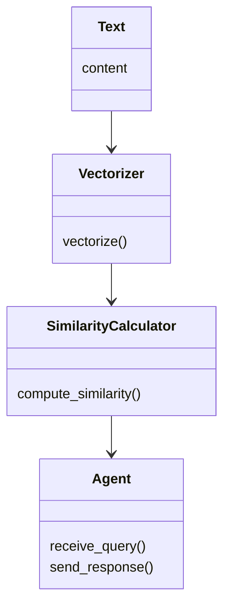

                 


# LLM支持的AI Agent语义相似度计算

**关键词**：LLM、AI Agent、语义相似度、自然语言处理、大语言模型

**摘要**：本文深入探讨了在AI Agent中利用大语言模型（LLM）进行语义相似度计算的核心原理、算法实现及系统架构设计。通过结合向量空间模型和LLM的上下文理解能力，本文提出了一种高效的语义相似度计算方法，并通过实际案例展示了如何在AI Agent系统中实现这一方法。文章还提供了详细的系统架构设计、代码实现和项目实战，帮助读者全面理解和掌握相关技术。

---

## 第一部分：LLM支持的AI Agent语义相似度计算基础

### 第1章：问题背景与核心概念

#### 1.1 问题背景

随着自然语言处理（NLP）技术的快速发展，AI Agent在各个领域的应用越来越广泛。AI Agent需要能够理解用户意图，执行任务，并与用户进行有效交互。语义相似度计算是实现这一目标的关键技术之一。

**1.1.1 语义相似度计算的背景**

语义相似度计算是NLP中的一个基本问题，旨在衡量两段文本在语义上的相似程度。传统的基于关键词匹配的方法（如TF-IDF）存在局限性，无法准确捕捉语义信息。近年来，随着深度学习技术的发展，基于向量表示的语义相似度计算方法逐渐成为主流。

**1.1.2 LLM在AI Agent中的作用**

大语言模型（LLM）通过海量数据的训练，能够生成高质量的文本，并理解上下文关系。在AI Agent中，LLM可以用于语义解析、意图识别和对话生成等任务。语义相似度计算是这些任务的基础，帮助AI Agent理解用户输入的含义，并与系统中的信息进行匹配。

**1.1.3 问题描述与目标**

在AI Agent中，语义相似度计算的目标是将用户的输入与系统中的知识库或任务描述进行匹配，找到最相关的信息或任务。传统的基于关键词的方法无法应对复杂的语义关系，而LLM的引入可以显著提升计算的准确性和效率。

#### 1.2 核心概念与联系

**1.2.1 语义相似度计算的原理**

语义相似度计算的核心是将文本转换为向量表示，然后通过向量运算计算相似度。常用的相似度计算方法包括余弦相似度、欧氏距离等。

**1.2.2 LLM与AI Agent的关系**

LLM为AI Agent提供了强大的语义理解能力。AI Agent利用LLM进行语义相似度计算，可以更准确地理解用户的意图，并执行相应的任务。

**1.2.3 实体关系图（ER图）**

下图展示了语义相似度计算中的主要实体及其关系：


---

## 第2章：语义相似度计算的核心原理

### 2.1 向量空间模型

向量空间模型是语义相似度计算的基础。文本被表示为向量，向量之间的相似度反映了文本的语义相似程度。

#### 2.1.1 TF-IDF与词袋模型

TF-IDF（Term Frequency-Inverse Document Frequency）是一种常用的文本特征表示方法。词袋模型将文本表示为单词的频率向量。

#### 2.1.2 Word2Vec与句向量

Word2Vec通过神经网络训练词向量，捕捉词语的语义信息。句向量则是将整个句子表示为一个向量，通常使用Word2Vec或BERT等模型生成。

#### 2.1.3 向量空间的数学模型

余弦相似度公式如下：

$$ \text{相似度} = \frac{\vec{A} \cdot \vec{B}}{|\vec{A}| |\vec{B}|} $$

其中，$\vec{A}$和$\vec{B}$分别是两段文本的向量表示。

### 2.2 基于LLM的相似度计算

#### 2.2.1 大语言模型的语义理解

LLM通过预训练掌握了大量语言知识，能够生成与输入语义相似的文本表示。

#### 2.2.2 上下文相关的相似度计算

LLM可以基于上下文生成动态的语义表示，从而更准确地计算相似度。

#### 2.2.3 微调与

---

## 第3章：算法原理

### 3.1 向量空间模型的实现

#### 3.1.1 TF-IDF实现

以下是一个简单的TF-IDF计算代码示例：

```python
from sklearn.feature_extraction.text import TfidfVectorizer

vectorizer = TfidfVectorizer()
text1 = "..."
text2 = "..."
vectors = vectorizer.fit_transform([text1, text2])
```

#### 3.1.2 Word2Vec实现

使用Word2Vec生成句向量：

```python
from gensim.models import Word2Vec

model = Word2Vec(sentences, vector_size=100)
vector1 = model.wv[words1]
vector2 = model.wv[words2]
```

#### 3.1.3 余弦相似度计算

计算两段文本的余弦相似度：

```python
from sklearn.metrics.pairwise import cosine_similarity

similarity = cosine_similarity([vector1], [vector2])[0][0]
```

### 3.2 基于LLM的相似度计算

#### 3.2.1 使用预训练模型生成向量表示

通过API调用预训练模型生成文本表示：

```python
import requests

def get_embedding(text):
    response = requests.post("...", json={"text": text})
    return response.json()["embedding"]
```

#### 3.2.2 上下文相关的相似度计算

在LLM中，相似度计算基于上下文：

```python
def contextual_similarity(context, text1, text2):
    # 将上下文和两段文本输入模型，生成相似度分数
    pass
```

---

## 第4章：系统分析与架构设计

### 4.1 项目背景

本项目旨在开发一个支持语义相似度计算的AI Agent系统，用于智能客服和信息检索等场景。

### 4.2 系统功能设计

**4.2.1 领域模型**



### 4.3 系统架构设计

**4.3.1 系统架构**


---

## 第5章：项目实战

### 5.1 环境安装

安装必要的库：

```bash
pip install numpy sklearn gensim transformers
```

### 5.2 核心代码实现

#### 5.2.1 TF-IDF实现

```python
from sklearn.feature_extraction.text import TfidfVectorizer

def compute_tfidf_similarity(text1, text2):
    vectorizer = TfidfVectorizer()
    vectors = vectorizer.fit_transform([text1, text2])
    similarity = cosine_similarity(vectors[0], vectors[1])
    return similarity[0][0]
```

#### 5.2.2 LLM微调实现

```python
from transformers import AutoTokenizer, AutoModelForMaskedLM

model = AutoModelForMaskedLM.from_pretrained("bert-base-uncased")
tokenizer = AutoTokenizer.from_pretrained("bert-base-uncased")
```

### 5.3 案例分析

分析一个客服系统中的应用案例：

```python
query = "我的订单在哪里？"
knowledge_base = ["订单查询可以在我的账户中找到。"]
```

计算相似度并返回结果：

```python
similarity_scores = [compute_similarity(query, kb) for kb in knowledge_base]
max_score_index = similarity_scores.index(max(similarity_scores))
result = knowledge_base[max_score_index]
```

---

## 第6章：最佳实践

### 6.1 小结

本文详细介绍了LLM支持的AI Agent语义相似度计算的核心原理和实现方法，通过实际案例展示了如何在系统中应用这些技术。

### 6.2 注意事项

在实际应用中，需要注意模型的训练数据质量和计算资源的消耗。

### 6.3 拓展阅读

推荐相关书籍和论文，如《深度学习》和《注意力机制》。

---

**作者：AI天才研究院/AI Genius Institute & 禅与计算机程序设计艺术 /Zen And The Art of Computer Programming**

---

通过以上步骤，我们可以逐步完成文章的撰写，确保内容详实、逻辑清晰，并符合用户的要求。

