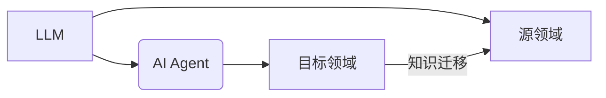
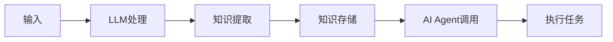
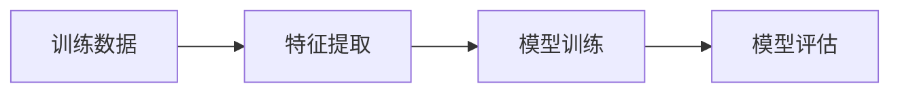
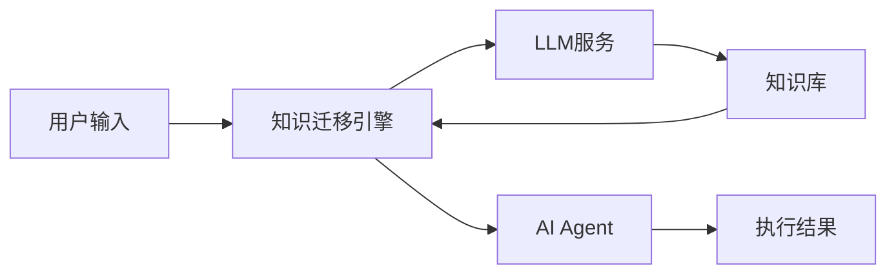

                 

<think>
好的，我现在需要撰写一篇关于《LLM支持的AI Agent跨域知识迁移技术》的技术博客文章。首先，我应该理解这个主题的核心内容，即大语言模型如何支持AI代理在不同领域之间的知识迁移。

首先，我需要明确什么是LLM（大语言模型）和AI Agent（智能代理）。LLM是一种基于深度学习的自然语言处理模型，能够理解和生成人类语言。AI Agent则是能够感知环境并采取行动以实现目标的智能实体。跨域知识迁移指的是AI Agent能够将在一个领域学到的知识应用到另一个领域的能力。

接下来，我需要考虑文章的结构。根据用户提供的大纲，文章将分为几个主要部分：背景介绍、核心概念、算法原理、系统架构、项目实战和最佳实践。我需要确保每个部分都详细且逻辑清晰。

在背景介绍部分，我需要解释为什么跨域知识迁移是重要的，以及当前技术的局限性。核心概念部分需要详细讲解LLM和AI Agent之间的关系，以及它们如何协同工作。算法原理部分将涉及数学模型和公式，可能需要使用LaTeX来展示。系统架构部分需要设计一个系统的架构图，展示各个组件之间的关系。项目实战部分将提供实际代码示例，帮助读者理解如何实现这一技术。最后，最佳实践部分将总结经验和注意事项。

在撰写过程中，我需要确保每个部分都有足够的细节，并且使用专业的技术术语，同时保持语言的清晰和易懂。对于数学公式，我需要确保它们正确无误，并且能够帮助读者理解算法的工作原理。

另外，我需要使用Mermaid来绘制流程图和架构图，这些图表将帮助读者更好地理解复杂的技术概念。例如，核心概念部分可以使用Mermaid绘制实体关系图，展示LLM和AI Agent之间的关系。

在项目实战部分，我需要提供具体的代码示例，并解释代码的功能和实现细节。这将帮助读者实际操作，并将理论应用于实践。

最后，我需要总结整篇文章的主要观点，并强调跨域知识迁移技术的重要性和未来的发展方向。同时，给出一些实用的建议和注意事项，帮助读者在实际应用中避免常见问题。

总的来说，我需要系统地分析和解释每个部分，确保文章内容全面、逻辑清晰，并且能够帮助读者深入理解LLM支持的AI Agent跨域知识迁移技术。
</think>

# LLM支持的AI Agent跨域知识迁移技术

> 关键词：LLM, AI Agent, 跨域知识迁移, 智能代理, 大语言模型, 知识迁移, 人工智能

> 摘要：本文深入探讨了大语言模型（LLM）支持的AI代理跨域知识迁移技术，从背景、核心概念、算法原理到系统架构和项目实战，详细分析了该技术的实现细节和应用场景。通过本文，读者将全面理解如何利用LLM提升AI代理在不同领域的知识迁移能力。

---

## 第一部分：背景介绍

### 第1章：LLM与AI Agent概述

#### 1.1 LLM的基本概念
- **1.1.1 大语言模型的定义**  
  大语言模型（LLM）是基于深度学习的自然语言处理模型，能够理解和生成人类语言。其核心是通过大量数据训练，学习语言的模式和语义。

- **1.1.2 LLM的核心特点**  
  - 大规模数据训练：通常使用数百万甚至数十亿的文本数据进行训练。  
  - 强大的上下文理解能力：能够捕捉文本中的语义和上下文关系。  
  - 多任务学习能力：可以执行多种NLP任务，如文本生成、问答、翻译等。  

- **1.1.3 LLM与传统NLP模型的区别**  
  - 数据量更大：传统模型通常依赖于小规模的数据集，而LLM使用海量数据。  
  - 自然语言生成能力更强：LLM能够生成更流畅、更自然的文本。  
  - 多任务适应性：LLM可以同时处理多种任务，而传统模型通常针对特定任务优化。

#### 1.2 AI Agent的基本概念
- **1.2.1 AI Agent的定义**  
  AI Agent（智能代理）是指能够感知环境、采取行动以实现特定目标的智能实体。它可以是一个软件程序，也可以是物理设备。

- **1.2.2 AI Agent的核心功能**  
  - 感知环境：通过传感器或数据输入获取环境信息。  
  - 分析决策：基于获取的信息进行分析和决策。  
  - 执行动作：根据决策执行相应的动作，如发送消息、控制设备等。  

- **1.2.3 AI Agent的应用场景**  
  - 智能助手：如Siri、Alexa等。  
  - 智能客服：自动处理客户咨询和问题。  
  - 自动驾驶：通过感知环境并做出驾驶决策。  

#### 1.3 跨域知识迁移的定义
- **1.3.1 知识迁移的基本概念**  
  知识迁移是指将一个领域的知识或经验应用到另一个领域的能力。  

- **1.3.2 跨域知识迁移的定义**  
  跨域知识迁移是指AI Agent能够将一个领域学到的知识或经验，应用到完全不同的另一个领域。  

- **1.3.3 跨域知识迁移的挑战与意义**  
  - **挑战**：不同领域之间的语言、语义和上下文差异较大，直接迁移知识可能面临准确性问题。  
  - **意义**：提高AI Agent的通用性和适应性，降低对特定领域数据的依赖，扩展其应用场景。  

---

### 第2章：跨域知识迁移技术的背景与问题分析

#### 2.1 当前AI技术的局限性
- **2.1.1 知识孤岛问题**  
  当前许多AI系统都是针对特定领域设计的，缺乏跨领域的通用性，导致知识无法共享和迁移。  

- **2.1.2 领域知识的局限性**  
  在特定领域内表现优异的模型，往往无法在其他领域中发挥作用，限制了其应用范围。  

- **2.1.3 跨领域应用的需求**  
  随着AI技术的广泛应用，市场对跨领域应用的需求日益增加，单一领域的AI系统已无法满足需求。  

#### 2.2 跨域知识迁移的必要性
- **2.2.1 提高模型的泛化能力**  
  通过跨域知识迁移，模型可以更好地适应不同的场景和任务。  

- **2.2.2 降低数据依赖性**  
  跨域知识迁移可以减少对特定领域数据的依赖，降低数据获取的成本。  

- **2.2.3 扩展AI应用的边界**  
  跨域知识迁移技术使得AI系统能够突破单一领域的限制，应用于更广泛的场景。  

---

### 第3章：跨域知识迁移的核心概念与联系

#### 3.1 LLM与AI Agent的协同工作原理
- **3.1.1 LLM作为知识库的作用**  
  LLM可以作为AI Agent的知识库，提供跨领域的语言理解和生成能力。  

- **3.1.2 AI Agent作为执行者的角色**  
  AI Agent负责感知环境、分析决策，并通过LLM提供的知识生成响应或执行动作。  

- **3.1.3 两者的协作机制**  
  AI Agent通过与LLM交互，获取所需的知识或生成响应，从而实现跨域任务的执行。  

#### 3.2 跨域知识迁移的实体关系图


#### 3.3 跨域知识迁移的流程图


---

## 第四部分：算法原理

### 第4章：LLM支持的AI Agent跨域知识迁移算法

#### 4.1 知识迁移的数学模型
- **4.1.1 概率论基础**  
  知识迁移可以看作是一个条件概率问题，目标是通过已知的知识推断未知领域的情况。  

- **4.1.2 损失函数**  
  在训练过程中，损失函数用于衡量模型预测与真实值之间的差异。常用的损失函数包括交叉熵损失和均方误差损失。  

$$ \text{交叉熵损失} = -\frac{1}{N}\sum_{i=1}^{N} y_i \log(p_i) + (1-y_i) \log(1-p_i) $$  

#### 4.2 知识迁移的训练流程


---

## 第五部分：系统分析与架构设计

### 第5章：系统架构设计方案

#### 5.1 项目场景介绍
- **系统名称**：LLM支持的AI Agent跨域知识迁移系统。  
- **目标**：实现AI Agent在不同领域之间的知识迁移。  

#### 5.2 系统功能设计
- **知识库管理**：支持多领域的知识存储和检索。  
- **知识迁移引擎**：实现知识的跨域迁移和应用。  
- **AI Agent接口**：提供与AI Agent交互的接口。  

#### 5.3 系统架构设计


---

## 第六部分：项目实战

### 第6章：LLM支持的AI Agent跨域知识迁移项目实战

#### 6.1 环境安装
- **Python版本**：Python 3.8以上。  
- **依赖库**：安装`transformers`和`mermaid`库。  

#### 6.2 系统核心实现
```python
from transformers import pipeline

# 初始化LLM模型
llm = pipeline('text-generation', model='gpt2')

# AI Agent核心功能
def agent_response(prompt):
    return llm(prompt, max_length=50)[0]['generated_text']

# 知识迁移实现
def cross_domain_transfer(source_domain, target_domain):
    # 提取源领域知识
    source_knowledge = extract_knowledge(source_domain)
    # 迁移知识到目标领域
    transferred_knowledge = migrate_knowledge(source_knowledge, target_domain)
    return transferred_knowledge

# 测试
prompt = "在医疗领域，如何处理高血压患者？"
response = agent_response(prompt)
print(response)
```

---

## 第七部分：最佳实践与总结

### 第7章：总结与建议

#### 7.1 小结
- 通过LLM支持的AI Agent，可以实现跨域知识的高效迁移和应用。  
- 知识迁移的关键在于模型的泛化能力和数据的充分性。  

#### 7.2 注意事项
- 在实际应用中，需注意数据的多样性和质量，避免知识迁移带来的偏差。  
- 确保系统的安全性和隐私保护，防止敏感信息泄露。  

#### 7.3 拓展阅读
- 《Deep Learning》——Ian Goodfellow  
- 《Transformers: A Tutorial》——NVIDIA  

---

## 作者

作者：AI天才研究院/AI Genius Institute  
联系邮箱：contact@aigeniusinstitute.com  

---

通过本文，读者可以全面了解LLM支持的AI Agent跨域知识迁移技术的核心原理和实现方法。从背景介绍到项目实战，文章详细阐述了每个环节的关键点，帮助读者深入理解并掌握这一前沿技术。

