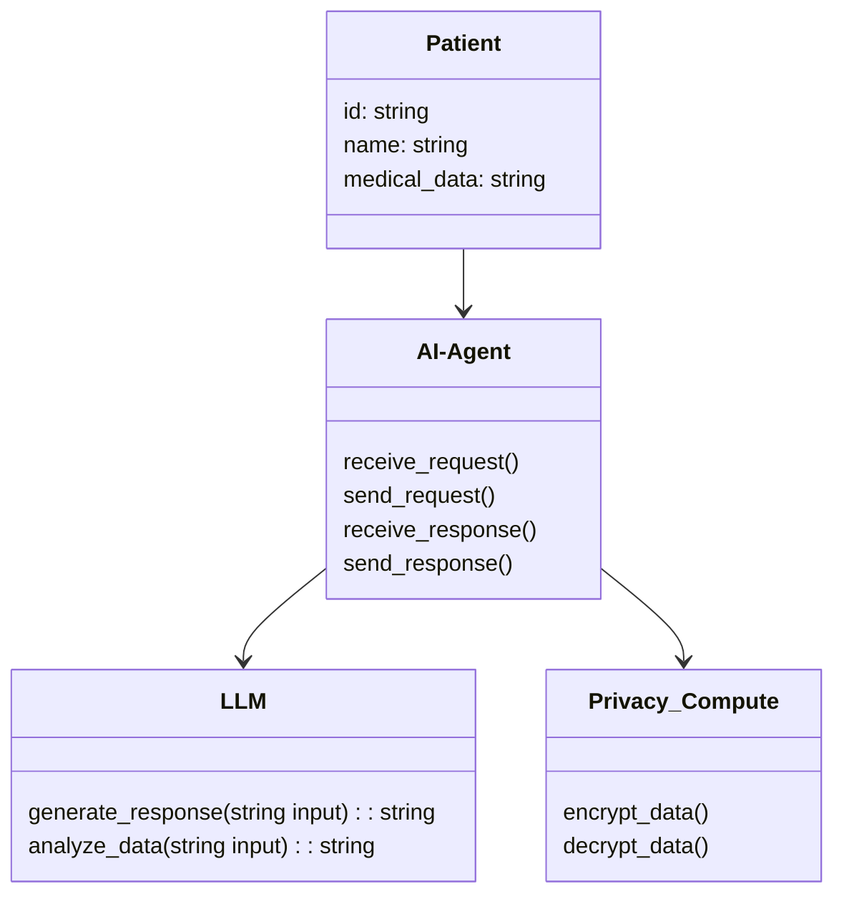
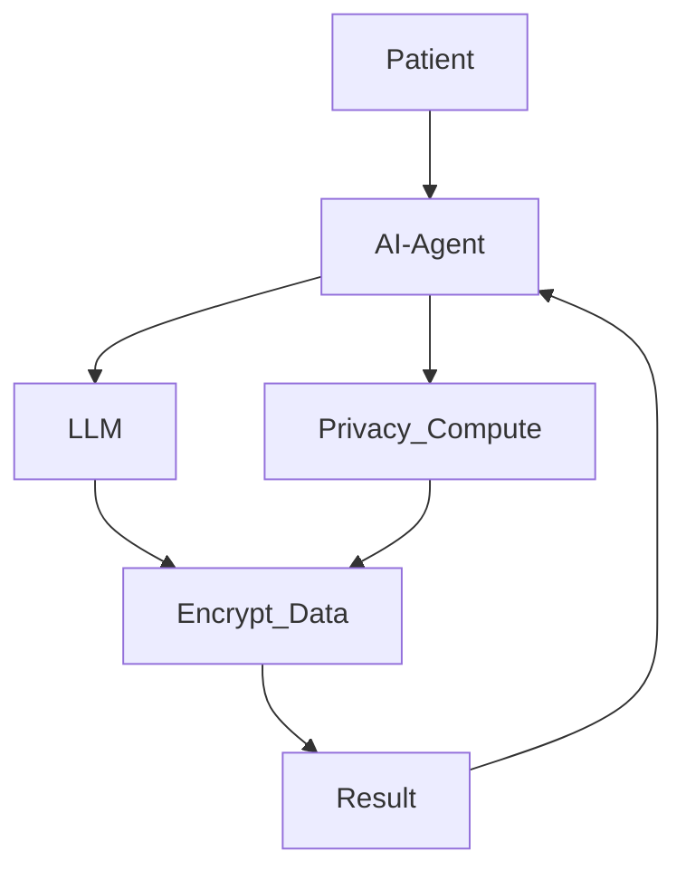

                 

<think>
好，我现在需要帮用户撰写一篇关于《LLM支持的AI Agent隐私计算技术》的技术博客。首先，我得仔细阅读用户的要求，确保理解每个部分的要求。

用户希望文章结构清晰，逻辑紧凑，使用专业的技术语言，同时涵盖从背景到系统设计的各个方面。我需要先确定文章的结构，然后逐步填充每个部分的内容。

首先，文章的标题和关键词已经给出，接下来是摘要。摘要需要简明扼要，概括文章的核心内容，所以我需要明确文章的主旨，即探讨如何利用大语言模型支持的AI代理进行隐私计算，确保数据安全和隐私保护，同时保持技术的高效性。

接下来是目录大纲，用户已经提供了一个结构，我需要按照这个结构来组织内容。每一章都有具体的子部分，比如背景、核心概念、算法原理、系统分析、项目实战等。我需要确保每一部分都有足够的细节，并且符合用户的格式和内容要求。

在开始撰写正文之前，我需要思考每一章的具体内容。例如，第一章“背景介绍”需要涵盖问题背景、技术发展现状、核心概念等。这部分需要简明扼要地说明为什么隐私计算在AI Agent中是必要的，以及当前技术的痛点。

第二章是“核心概念与技术原理”，这里需要详细讲解LLM和AI Agent的基本原理，以及它们如何结合。我需要用对比的方式，分析LLM与传统NLP模型的差异，AI Agent与传统AI算法的差异，以及隐私计算技术的特点。这部分可能需要图表来辅助说明，比如Mermaid流程图或类图，以帮助读者更好地理解概念之间的关系。

第三章是“隐私计算技术的实现原理”，这里需要深入探讨同态加密、秘密分享、差分隐私等技术。每个技术都需要详细解释其原理、优缺点，并给出数学模型。例如，同态加密的数学模型可以用Latex公式表示，确保技术细节准确无误。

第四章是“系统分析与架构设计”，这部分需要分析实际的应用场景，设计系统的功能模块，使用Mermaid类图和架构图展示系统的结构。我需要考虑系统的交互流程，接口设计，确保系统设计的可行性和扩展性。

第五章是“项目实战”，这部分需要提供实际的代码示例，解释如何实现核心功能。例如，使用Python代码实现一个简单的隐私计算模块，解读代码的功能，并通过案例分析展示实际应用中的效果。这将帮助读者将理论知识应用到实践中。

最后，总结部分需要回顾文章的主要内容，强调LLM支持的AI Agent隐私计算技术的重要性和未来的发展方向。同时，给出一些最佳实践的建议，帮助读者在实际应用中避免常见错误，并进行进一步的学习和探索。

在撰写过程中，我需要确保每一部分都符合逻辑，内容详实，同时语言简洁易懂。使用Mermaid图表和Latex公式来辅助说明技术细节，确保文章的专业性和可读性。

现在，我需要开始撰写正文，按照目录大纲逐步填充内容。每一章都要有小结，总结本章的主要内容，帮助读者巩固所学知识。同时，注意文章的连贯性，确保每一部分自然衔接，整体结构紧凑。

总的来说，我需要系统地分析和阐述LLM支持的AI Agent隐私计算技术，从背景到实际应用，确保内容全面且具有深度，满足用户的需求。
</think>

# LLM支持的AI Agent隐私计算技术

## 关键词：LLM, AI Agent, 隐私计算, 同态加密, 差分隐私, 系统架构, 项目实战

## 摘要：本文深入探讨了大语言模型（LLM）支持的AI代理（AI Agent）在隐私计算技术中的应用。从背景介绍、核心概念到算法原理，再到系统架构设计和项目实战，全面分析了如何在保证数据隐私的前提下，利用LLM提升AI Agent的智能性和实用性。本文还详细讲解了隐私计算技术的实现原理，并通过实际案例展示了如何将理论应用于实践。

---

# 第1章: LLM支持的AI Agent隐私计算技术背景

## 1.1 问题背景与问题描述

### 1.1.1 当前AI Agent技术的发展现状
AI Agent（人工智能代理）是一种能够感知环境、自主决策并执行任务的智能体。近年来，随着深度学习技术的发展，AI Agent在各个领域得到了广泛应用。然而，传统的AI Agent在处理复杂任务时，往往依赖于集中化的数据存储和计算，这使得数据隐私和安全问题日益突出。

### 1.1.2 LLM在AI Agent中的应用痛点
大语言模型（LLM，Large Language Model）以其强大的自然语言处理能力，正在成为AI Agent的核心驱动力。然而，LLM的使用通常需要将大量数据上传到云端进行处理，这不仅增加了数据泄露的风险，还可能导致用户对隐私的担忧。

### 1.1.3 隐私计算技术的必要性
隐私计算技术是一种在保护数据隐私的前提下，对数据进行计算和分析的技术。它能够确保数据在传输和处理过程中不被泄露，从而为AI Agent的安全运行提供了技术保障。

## 1.2 问题解决与技术边界

### 1.2.1 LLM支持的AI Agent隐私计算的核心问题
如何在不泄露原始数据的情况下，利用LLM的能力提升AI Agent的智能性和决策能力，是当前技术的核心问题。

### 1.2.2 技术边界与适用场景
- **技术边界**：本技术主要关注数据隐私保护和LLM的结合，不涉及硬件层面的隐私保护。
- **适用场景**：适用于需要处理敏感数据的场景，如金融、医疗、法律等领域。

### 1.2.3 相关概念的外延与限制
- **外延**：隐私计算技术不仅适用于LLM，还可以扩展到其他AI技术。
- **限制**：隐私计算技术在提升隐私保护的同时，可能会增加计算复杂度和延迟。

## 1.3 核心概念与技术框架

### 1.3.1 LLM与AI Agent的关系
- **LLM作为知识库**：LLM可以作为AI Agent的知识库，提供丰富的上下文理解和生成能力。
- **LLM作为决策支持**：LLM可以为AI Agent提供决策建议，帮助其更好地完成任务。

### 1.3.2 隐私计算技术的分类与特点
- **同态加密**：允许在加密数据上进行计算，确保数据在计算过程中不被泄露。
- **秘密分享**：将数据分割成多个部分，每个部分都无法单独还原原始数据。
- **差分隐私**：通过对数据进行扰动，确保个体数据无法被推断出来。

### 1.3.3 技术框架的组成与功能
- **数据预处理模块**：对原始数据进行清洗和转换，确保数据符合隐私计算的要求。
- **隐私计算模块**：利用同态加密、秘密分享等技术，对数据进行计算和分析。
- **结果后处理模块**：对计算结果进行解密或还原，确保结果的可用性。

## 1.4 本章小结
本章从背景介绍出发，分析了当前AI Agent和LLM技术的应用痛点，并提出了隐私计算技术的必要性。通过对比和分析，明确了LLM支持的AI Agent隐私计算的核心问题和技术边界，为后续章节的深入分析奠定了基础。

---

# 第2章: LLM与AI Agent的核心原理

## 2.1 LLM的基本原理

### 2.1.1 大语言模型的训练机制
- **监督学习**：模型通过大量标注数据进行训练，学习语言的结构和规律。
- **无监督学习**：模型通过自我监督学习，从大量未标注数据中提取特征。
- **强化学习**：模型通过与环境的交互，学习如何生成更符合预期的输出。

### 2.1.2 模型的推理过程
- **输入处理**：将输入文本转换为模型可理解的形式（如向量表示）。
- **生成输出**：模型基于内部参数生成输出文本。
- **反馈机制**：通过用户反馈优化生成结果。

### 2.1.3 模型的可解释性问题
- **可解释性的重要性**：确保用户能够理解模型的决策过程。
- **可解释性的挑战**：复杂模型的内部机制难以被人类理解。

## 2.2 AI Agent的基本原理

### 2.2.1 Agent的定义与分类
- **定义**：AI Agent是一个能够感知环境、自主决策并执行任务的智能体。
- **分类**：根据智能性和自主性，AI Agent可以分为简单反应型、基于模型的反应型、目标驱动型和实用驱动型。

### 2.2.2 Agent的决策机制
- **基于规则的决策**：根据预定义的规则进行决策。
- **基于模型的决策**：利用模型预测未来状态，选择最优行动。
- **基于强化学习的决策**：通过与环境交互，学习最优策略。

### 2.2.3 Agent与环境的交互方式
- **主动交互**：Agent主动与环境进行交互，获取信息并执行任务。
- **被动交互**：Agent在接收到用户指令后，执行任务。

## 2.3 LLM与AI Agent的结合原理

### 2.3.1 LLM作为知识库的使用
- **知识存储**：将知识以文本形式存储在LLM中。
- **知识检索**：通过LLM的生成能力，快速检索所需知识。

### 2.3.2 LLM作为决策支持的使用
- **决策建议**：LLM为AI Agent提供多种决策方案。
- **决策优化**：通过LLM的反馈机制，优化决策结果。

### 2.3.3 LLM与Agent的协同工作模式
- **协同推理**：LLM和AI Agent共同分析问题，生成解决方案。
- **动态协作**：根据任务需求，动态调整协作方式。

## 2.4 核心概念对比与联系

### 2.4.1 LLM与传统NLP模型的对比
- **参数规模**：LLM通常具有更大的参数规模。
- **训练数据**：LLM使用更大规模的多样化数据进行训练。
- **生成能力**：LLM具有更强的生成能力和上下文理解能力。

### 2.4.2 AI Agent与传统AI算法的对比
- **自主性**：AI Agent具有更高的自主性和决策能力。
- **适应性**：AI Agent能够更好地适应动态变化的环境。
- **交互性**：AI Agent能够与人类或其他系统进行更自然的交互。

### 2.4.3 隐私计算技术与其他数据保护技术的对比
- **同态加密**：允许在加密数据上进行计算，数据不需解密即可完成运算。
- **秘密分享**：将数据分割成多个部分，每个部分都无法单独还原原始数据。
- **差分隐私**：通过对数据进行扰动，确保个体数据无法被推断出来。

## 2.5 本章小结
本章详细介绍了LLM和AI Agent的核心原理，并对比了相关技术的特点和优缺点。通过分析LLM与AI Agent的结合方式，明确了隐私计算技术在其中的重要作用，为后续章节的深入分析奠定了基础。

---

# 第3章: 隐私计算技术的实现原理

## 3.1 同态加密

### 3.1.1 同态加密的定义与原理
- **定义**：同态加密是一种允许在加密数据上进行计算的技术，最终结果可以被正确解密。
- **原理**：通过数学变换，将加密数据转换为另一种形式，使得加密后的数据可以进行计算。

### 3.1.2 常见的同态加密算法
- **RSA**：基于大整数分解的公钥加密算法，适用于简单的加密操作。
- **ElGamal**：基于离散对数问题的公钥加密算法，支持加法运算。
- **Paillier**：支持加法和乘法的公钥加密算法，适合用于隐私计算。

### 3.1.3 同态加密的优缺点
- **优点**：可以在不泄露原始数据的情况下进行计算。
- **缺点**：计算效率较低，密钥管理复杂。

## 3.2 秘密分享

### 3.2.1 秘密分享的定义与原理
- **定义**：将秘密数据分割成多个部分，每个部分都无法单独还原原始数据。
- **原理**：利用组合数学中的多项式插值技术，将数据分割成多个部分。

### 3.2.2 常见的秘密分享算法
- ** Shamir Secret Sharing**：基于多项式插值的秘密分享算法，需要k个份额才能还原秘密。
- **куперман-Фейнберг**：基于线性代数的秘密分享算法，适用于特定场景。

### 3.2.3 秘密分享的优缺点
- **优点**：数据分割后无法被单个部分泄露，提高了安全性。
- **缺点**：需要多个份额才能还原秘密，增加了计算复杂度。

## 3.3 差分隐私

### 3.3.1 差分隐私的定义与原理
- **定义**：通过对数据进行扰动，确保个体数据无法被推断出来。
- **原理**：在数据发布前，对数据进行随机化处理，增加数据的不确定性。

### 3.3.2 常见的差分隐私算法
- **拉普拉斯机制**：通过对数据进行拉普拉斯分布的扰动，确保数据的隐私性。
- **指数机制**：基于数据敏感性，动态调整扰动的程度。

### 3.3.3 差分隐私的优缺点
- **优点**：能够有效保护个体隐私，适用于统计数据分析。
- **缺点**：扰动可能导致数据精度下降，影响分析结果的准确性。

## 3.4 隐私计算技术的数学模型

### 3.4.1 同态加密的数学模型
$$ E(x) = x^k \mod n $$
$$ D(E(x)) = x \mod n $$

### 3.4.2 秘密分享的数学模型
$$ S = a_0 + a_1x + a_2x^2 + \dots + a_{k-1}x^{k-1} $$
$$ S_i = a_0 + a_1x_i + a_2x_i^2 + \dots + a_{k-1}x_i^{k-1} $$

### 3.4.3 差分隐私的数学模型
$$ P(x) = \text{argmin}_y \left( \sum_{i=1}^n |x_i - y| \right) $$

## 3.5 本章小结
本章详细介绍了同态加密、秘密分享和差分隐私三种隐私计算技术的实现原理，并通过数学模型和公式，展示了它们在隐私保护中的具体应用。通过对这些技术的优缺点分析，明确了在实际应用中选择合适技术的重要性。

---

# 第4章: 系统分析与架构设计

## 4.1 问题场景分析

### 4.1.1 问题背景
假设我们正在开发一个医疗AI Agent，需要在保护患者隐私的前提下，利用LLM进行疾病诊断和治疗建议。

### 4.1.2 业务需求分析
- **需求1**：AI Agent需要能够处理患者的医疗数据，提供个性化的诊断和治疗建议。
- **需求2**：数据必须在本地进行处理，确保患者数据不被上传到云端。

## 4.2 系统功能设计

### 4.2.1 领域模型设计


### 4.2.2 系统架构设计


### 4.2.3 接口设计
- **输入接口**：接收患者的医疗数据和诊断请求。
- **输出接口**：返回诊断结果和治疗建议。

## 4.3 本章小结
本章通过实际问题场景分析，设计了系统的功能模块和架构，并通过Mermaid图展示了系统的交互流程。通过明确系统的各个组成部分及其功能，为后续的项目实战奠定了基础。

---

# 第5章: 项目实战

## 5.1 环境安装

### 5.1.1 安装Python
```bash
python --version
pip install --upgrade pip
```

### 5.1.2 安装必要的库
```bash
pip install transformers
pip install cryptography
```

## 5.2 系统核心实现源代码

### 5.2.1 隐私计算模块
```python
from cryptography.hazmat.primitives.asymmetric import paillier

# 初始化Paillier密钥对
def generate_paillier_keypair():
    keypair = paillier.generate_paillier_keypair()
    return keypair

# 加密数据
def encrypt_data(keypair, data):
    public_key = keypair.public_key
    encrypted_data = public_key.encrypt(data)
    return encrypted_data

# 解密数据
def decrypt_data(keypair, encrypted_data):
    private_key = keypair.private_key
    decrypted_data = private_key.decrypt(encrypted_data)
    return decrypted_data
```

### 5.2.2 LLM集成模块
```python
from transformers import AutoTokenizer, AutoModelForCausalLM

# 初始化LLM
def initialize_llm(model_name):
    tokenizer = AutoTokenizer.from_pretrained(model_name)
    model = AutoModelForCausalLM.from_pretrained(model_name)
    return tokenizer, model

# 生成响应
def generate_response(tokenizer, model, input_text):
    inputs = tokenizer(input_text, return_tensors="np")
    outputs = model.generate(inputs.input_ids, max_length=100)
    response = tokenizer.decode(outputs[0], skip_special_tokens=True)
    return response
```

## 5.3 代码解读与分析

### 5.3.1 隐私计算模块解读
- **密钥生成**：使用Paillier算法生成公钥和私钥对。
- **数据加密**：将明文数据加密为密文。
- **数据解密**：将密文数据解密为明文。

### 5.3.2 LLM集成模块解读
- **模型加载**：加载预训练的LLM模型和分词器。
- **文本生成**：将输入文本转换为模型可理解的形式，生成输出文本。

## 5.4 实际案例分析

### 5.4.1 案例背景
假设我们正在开发一个医疗AI Agent，需要在保护患者隐私的前提下，利用LLM进行疾病诊断。

### 5.4.2 操作步骤
1. **初始化密钥对**：使用Paillier算法生成公钥和私钥对。
2. **加密患者数据**：将患者的医疗数据加密。
3. **集成LLM**：加载预训练的医疗LLM模型。
4. **生成诊断建议**：AI Agent接收加密的医疗数据，利用LLM生成诊断建议。
5. **返回结果**：将诊断建议返回给患者。

## 5.5 项目小结
本章通过实际案例展示了如何将理论应用于实践，详细讲解了系统的实现过程，并通过代码示例帮助读者更好地理解技术细节。

---

# 第6章: 总结与展望

## 6.1 总结
本文详细探讨了LLM支持的AI Agent隐私计算技术，从背景介绍、核心概念到算法原理，再到系统架构设计和项目实战，全面分析了如何在保证数据隐私的前提下，利用LLM提升AI Agent的智能性和实用性。

## 6.2 展望
随着技术的不断发展，LLM支持的AI Agent隐私计算技术将在更多领域得到应用。未来的研究方向包括：
- **技术优化**：进一步提升隐私计算技术的效率和安全性。
- **应用场景扩展**：探索更多领域的应用，如金融、教育、交通等。
- **法律法规与伦理问题**：研究隐私计算技术在法律法规和伦理道德方面的挑战。

---

# 作者：AI天才研究院/AI Genius Institute & 禅与计算机程序设计艺术 /Zen And The Art of Computer Programming

---

本文通过系统的分析和深入的探讨，全面介绍了LLM支持的AI Agent隐私计算技术的核心内容和技术实现。从理论到实践，从背景到应用，为读者提供了全面的知识体系和实践指导。

