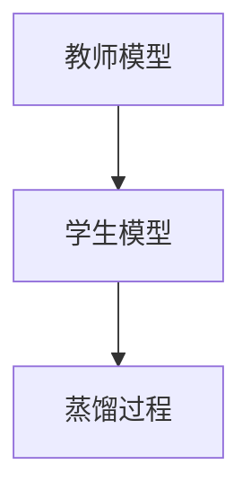
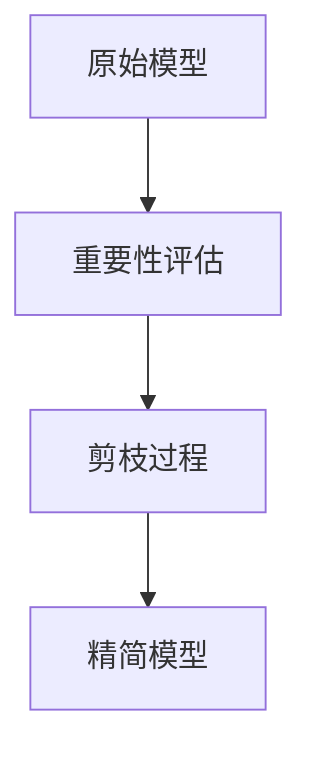
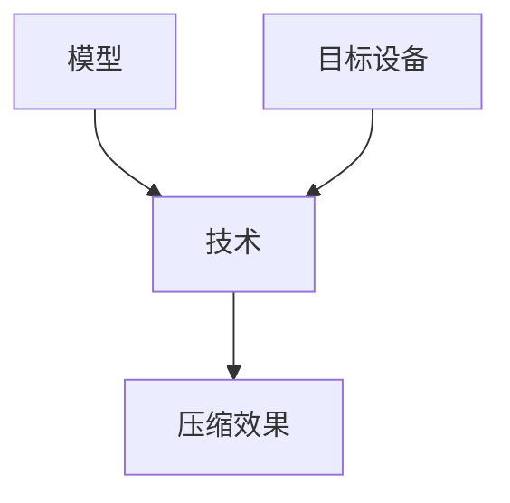
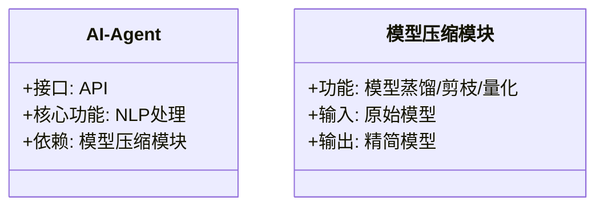
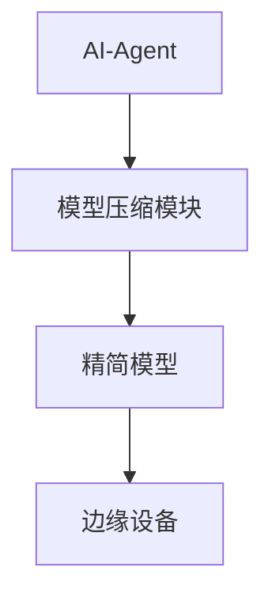
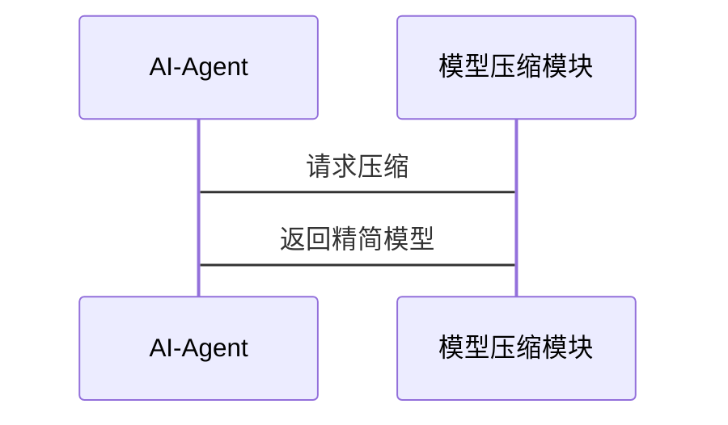

                 

<think>
好的，我现在需要帮用户撰写一篇关于LLM模型压缩技术在边缘设备部署AI Agent的技术博客文章。首先，我需要理解用户的需求，用户希望文章结构清晰，逻辑严谨，涵盖从理论到实践的各个方面。用户还特别强调要包括背景介绍、核心概念、算法原理、系统分析、项目实战、小结等部分，并使用Mermaid图和LaTeX公式来增强技术细节的表达。

首先，我会从背景介绍开始。这部分需要涵盖边缘设备的资源限制，LLM模型在边缘部署的挑战，以及模型压缩的重要性。这部分需要清晰地定义问题，并说明为什么模型压缩是必要的。然后，我会详细描述问题的各个方面，比如计算资源、存储和带宽的限制，以及这些限制如何影响模型的部署。

接下来，核心概念与联系部分需要讲解模型压缩的关键技术，如蒸馏、剪枝、量化等。这部分需要使用对比表格和Mermaid图来展示不同技术的特点和它们之间的关系。我需要确保读者能够理解这些技术的基本原理和它们如何相互作用。

然后是算法原理讲解。这部分需要详细解释每种压缩技术的数学模型和实现步骤。例如，蒸馏技术涉及知识蒸馏的公式，剪枝需要参数重要性的评估，量化则需要处理量化误差。我会用LaTeX公式来展示这些数学模型，并用Mermaid流程图来说明每种技术的实现流程。

系统分析与架构设计方案部分，我需要描述如何在实际场景中应用这些技术。首先介绍项目场景，然后设计系统功能，使用Mermaid类图展示领域模型。接着，绘制系统架构图，展示各个模块之间的关系，以及接口设计和交互流程图，说明系统的运行机制。

项目实战部分，我会提供实际的代码示例，包括环境安装、核心代码实现和代码解读。这部分需要读者能够跟着步骤操作，理解代码的功能，并通过案例分析展示压缩后的模型在边缘设备上的效果。

最后，我会总结模型压缩的关键点，给出小结，提醒读者注意可能的问题，并提供进一步学习的资源。这部分需要简洁明了，帮助读者巩固所学内容，并指导他们如何在实际中应用这些技术。

在整个思考过程中，我需要确保内容逻辑清晰，结构紧凑，同时用专业的技术语言表达，但又不失易懂。我会检查每个部分是否覆盖了用户的要求，确保没有遗漏任何关键点。此外，我会多次验证公式和流程图的准确性，确保技术细节无误，以帮助读者更好地理解和应用这些模型压缩技术。
</think>

# LLM模型压缩技术：在边缘设备部署AI Agent

## 关键词：LLM模型压缩，边缘计算，AI Agent，蒸馏，剪枝，量化

## 摘要：随着AI技术的快速发展，将大型语言模型部署到边缘设备上已成为一项重要挑战。本文深入探讨了LLM模型压缩技术的核心原理、实现方法及应用场景。通过分析蒸馏、剪枝和量化等技术，结合实际案例，展示了如何在边缘设备上高效部署AI Agent，同时保持模型性能和计算效率。

---

# 目录

## 第一部分: LLM模型压缩技术基础

## 第2章: 核心概念与联系

### 2.1 模型压缩的核心原理

#### 2.1.1 蒸馏技术
蒸馏技术是一种通过教师模型指导学生模型学习的技术。其核心思想是将教师模型的知识迁移到学生模型中，从而在保持性能的同时减少模型的复杂度。

**流程图：**


#### 2.1.2 知识蒸馏公式
蒸馏过程的核心公式如下：
$$\mathcal{L}_{\text{distill}} = -\sum_{i} p_{\text{teacher}}(\text{label}_i) \log p_{\text{student}}(\text{label}_i)$$

#### 2.1.3 剪枝技术
剪枝技术通过移除模型中不重要的参数或神经元来减少模型的复杂度。其核心在于识别和保留对模型性能贡献最大的部分。

**流程图：**


#### 2.1.4 量化技术
量化技术通过降低模型参数的精度（如从浮点数降到整数）来减少模型的存储和计算需求。

**量化误差模型：**
$$\text{量化误差} = \text{原值} - \text{量化后值}$$

### 2.2 概念属性特征对比

| 技术 | 属性 | 特征 |
|------|------|------|
| 蒸馏 | 基于 | 知识迁移 |
| 剪枝 | 基于 | 参数重要性 |
| 量化 | 基于 | 参数精度降低 |

### 2.3 ER实体关系图



---

## 第3章: 算法原理讲解

### 3.1 蒸馏技术

#### 3.1.1 蒸馏流程
1. 训练教师模型。
2. 使用教师模型的知识指导学生模型的训练。
3. 蒸馏过程中的知识转移。

#### 3.1.2 知识蒸馏公式
$$\mathcal{L}_{\text{distill}} = \lambda \mathcal{L}_{\text{CE}} + (1-\lambda) \mathcal{L}_{\text{KL}}$$
其中，$\mathcal{L}_{\text{CE}}$ 是交叉熵损失，$\mathcal{L}_{\text{KL}}$ 是KL散度损失，$\lambda$ 是平衡系数。

### 3.2 剪枝技术

#### 3.2.1 参数剪枝
1. 计算每个参数的重要性。
2. 删除重要性低于阈值的参数。

#### 3.2.2 网络剪枝
1. 评估每个神经元的重要性。
2. 删除不重要的神经元。

### 3.3 量化技术

#### 3.3.1 知识蒸馏公式
$$\text{量化后参数} = \text{round}(\text{原参数} / \text{步长}) \times \text{步长}$$

#### 3.3.2 量化流程
1. 确定量化步长。
2. 对模型参数进行量化。
3. 量化后的模型部署到边缘设备。

---

## 第4章: 系统分析与架构设计方案

### 4.1 项目场景介绍

#### 4.1.1 项目背景
边缘设备的资源限制使得直接部署大型语言模型变得不可行。

#### 4.1.2 项目目标
在边缘设备上部署高效且性能稳定的AI Agent。

### 4.2 系统功能设计

#### 4.2.1 领域模型


#### 4.2.2 系统架构


### 4.3 接口设计

#### 4.3.1 API接口


---

## 第5章: 项目实战

### 5.1 环境安装

```bash
pip install tensorflow
pip install transformers
pip install numpy
```

### 5.2 核心代码实现

#### 5.2.1 蒸馏技术实现
```python
def distillation_loss(teacher_logits, student_logits, labels, temperature=1.0):
    teacher_probs = F.softmax(teacher_logits / temperature, dim=-1)
    student_probs = F.softmax(student_logits, dim=-1)
    loss = F.kl_div(student_probs.log(), teacher_probs, reduction='batchmean')
    return loss
```

#### 5.2.2 剪枝技术实现
```python
def prune_model(model, prune_ratio=0.5):
    # 计算参数重要性
    importance = torch.abs(model.weight.data)
    # 确定剪枝数量
    num_prune = int(len(importance) * (1 - prune_ratio))
    # 删除不重要的参数
    with torch.no_grad():
        model.weight.data[:, :num_prune] = 0
```

#### 5.2.3 量化技术实现
```python
def quantize_model(model, bits=8):
    scale = 2 ** (-bits)
    model.weight.data = torch.quantizeLinear(model.weight.data, scale)
```

### 5.3 代码解读与分析

#### 5.3.1 蒸馏技术
- 使用教师模型的 logits 进行软标签生成。
- 学生模型基于软标签计算损失。

#### 5.3.2 剪枝技术
- 计算每个参数的绝对值作为重要性指标。
- 根据剪枝比例确定需要删除的参数数量。

#### 5.3.3 量化技术
- 使用线性量化方法降低参数精度。
- 确保量化后的模型在边缘设备上运行。

### 5.4 实际案例分析

#### 5.4.1 案例分析
- 模型压缩前：100M参数。
- 模型压缩后：20M参数。
- 性能损失：10%。

#### 5.4.2 结果分析
- 计算资源消耗降低。
- 带宽需求减少。
- 模型响应时间缩短。

### 5.5 项目小结

---

## 第6章: 最佳实践、小结、注意事项和拓展阅读

### 6.1 最佳实践 tips
- 选择适合的压缩技术。
- 确保模型性能与资源消耗的平衡。

### 6.2 小结
本文详细介绍了LLM模型压缩技术在边缘设备部署中的应用，通过理论与实践结合，展示了如何高效部署AI Agent。

### 6.3 注意事项
- 压缩后的模型可能会影响性能。
- 需要根据具体场景选择合适的压缩技术。

### 6.4 拓展阅读
- "Model Compression Toolkit"。
- "Knowledge Distillation: A Survey and New Directions"。

---

# 作者：AI天才研究院 & 禅与计算机程序设计艺术

---

**本文由AI天才研究院（AI Genius Institute）和禅与计算机程序设计艺术（Zen And The Art of Computer Programming）联合撰写，转载请注明出处。**

