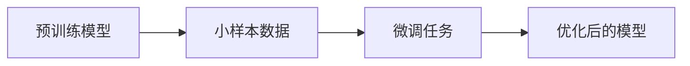
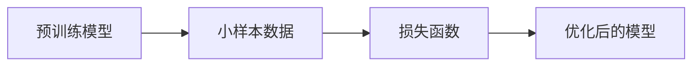
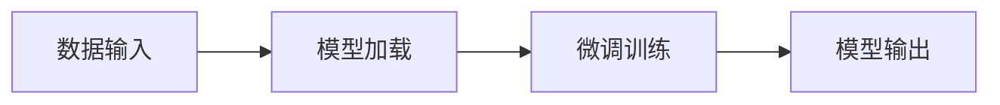

                 


# LLM的Few-shot Learning：减少训练数据需求

---

## 关键词：  
大语言模型（LLM）、Few-shot Learning、小样本学习、迁移学习、文本分类、数学模型、系统架构

---

## 摘要：  
随着大语言模型（LLM）的快速发展，训练这些模型所需的海量数据和计算资源成为了主要的挑战。为了降低数据需求，Few-shot Learning（小样本学习）作为一种创新的解决方案，逐渐成为研究的热点。本文将从背景、原理到系统实现，全面解析Few-shot Learning在LLM中的应用，帮助读者理解如何通过少量样本实现高效的模型训练，并通过实际案例展示其在文本分类、问答系统等场景中的应用价值。

---

# 第一部分: LLM的Few-shot Learning概述

## 第1章: 问题背景与核心概念

### 1.1 问题背景

#### 1.1.1 大语言模型的训练数据需求现状  
大语言模型（如GPT、BERT）通常需要数百万甚至数十亿的文本数据进行训练，这不仅需要巨大的计算资源，还面临数据获取成本高昂的问题。此外，某些垂直领域（如医疗、法律）的数据获取难度更大，限制了这些模型的广泛应用。

#### 1.1.2 数据获取的挑战与痛点  
- 数据标注成本高：高质量标注数据的获取需要大量人工参与。  
- 数据隐私问题：某些场景下，数据隐私限制了数据的获取和使用。  
- 数据稀疏性：在某些小众领域，数据样本数量有限。  

#### 1.1.3 减少数据需求的必要性  
通过减少训练数据的需求，可以降低计算成本、标注成本，同时扩大模型的应用场景，特别是在数据稀疏的领域。

---

### 1.2 问题描述

#### 1.2.1 传统大模型训练的高数据需求  
传统的大语言模型需要大量数据进行监督学习，这使得训练过程资源消耗巨大，难以快速部署到小样本场景中。

#### 1.2.2 few-shot学习的定义与目标  
- **定义**：Few-shot Learning是一种通过少量样本（如几个或几十个样本）进行模型训练的技术，目标是在小样本情况下实现高性能的模型。  
- **目标**：利用大模型的迁移学习能力，通过少量样本快速适应特定任务。

#### 1.2.3 减少数据需求的具体应用场景  
- **文本分类**：在某些垂直领域，通过少量样本即可完成分类任务。  
- **问答系统**：通过少量问题-答案对训练模型，快速构建问答系统。  
- **代码生成**：通过少量代码样本，训练代码生成模型。  

---

### 1.3 问题解决思路

#### 1.3.1 few-shot学习的核心思想  
- **迁移学习**：利用大模型的预训练参数，快速适应新任务。  
- **小样本特征提取**：通过小样本数据提取关键特征，指导模型预测。  

#### 1.3.2 少量数据训练的可行性分析  
- 大模型的迁移能力使得少量样本足以捕捉任务的关键特征。  
- 小样本数据的特征多样性是模型性能的基础。  

#### 1.3.3 结合大模型的实现路径  
- 预训练-微调（Pre-training + Fine-tuning）：利用大模型的预训练参数，通过小样本数据进行微调。  
- 参数冻结：在微调过程中，冻结大模型的大部分参数，仅优化特定任务的参数。  

---

### 1.4 边界与外延

#### 1.4.1 few-shot学习的适用范围  
- 数据量有限的垂直领域。  
- 快速原型开发场景。  

#### 1.4.2 与零样本学习（Zero-shot）的区别与联系  
- **区别**：  
  - Zero-shot学习不需要任何训练样本，仅依赖于预训练知识。  
  - Few-shot学习需要少量样本进行微调。  
- **联系**：  
  - Few-shot学习是Zero-shot学习的补充，通过少量样本进一步优化模型性能。  

#### 1.4.3 与迁移学习的对比分析  
- **迁移学习**：通过迁移已学习的知识到新任务，通常需要一定的样本数据。  
- **Few-shot学习**：是迁移学习的一种特殊情况，仅需要少量样本。  

---

### 1.5 核心概念结构

#### 1.5.1 few-shot学习的关键要素  
| 关键要素 | 描述 |
|----------|------|
| 预训练模型 | 预训练的大模型参数，作为few-shot学习的基础。 |
| 小样本数据 | 用于微调的少量样本数据。 |
| 微调任务 | 针对特定任务的参数优化过程。 |

#### 1.5.2 实体关系图（Mermaid流程图）  


---

## 第2章: 核心概念与原理

### 2.1 few-shot学习的原理

#### 2.1.1 少量样本的特征提取  
- 通过小样本数据提取任务的关键特征，指导模型预测。  

#### 2.1.2 大模型的迁移能力  
- 预训练模型的参数可以通过微调快速适应新任务。  

#### 2.1.3 小样本学习的数学模型  
- 损失函数：$$L(y, y_{pred}) = \sum_{i=1}^{n} (y_i - y_{pred,i})^2$$  
  其中，$y$表示真实标签，$y_{pred}$表示预测标签。  

---

### 2.2 核心概念的联系

#### 2.2.1 实体关系图（Mermaid流程图）  


---

### 2.3 few-shot学习的数学模型

#### 2.3.1 损失函数定义  
$$L(y, y_{pred}) = \sum_{i=1}^{n} (y_i - y_{pred,i})^2$$  

#### 2.3.2 梯度下降算法  
- 优化目标：$$\theta = \theta - \eta \cdot \frac{\partial L}{\partial \theta}$$  
  其中，$\theta$表示模型参数，$\eta$表示学习率。  

#### 2.3.3 分类器的构建与优化  
- 分类器输入：小样本数据的特征表示。  
- 分类器输出：预测标签。  

---

### 2.4 通俗易懂的举例说明

#### 2.4.1 文本分类案例  
- **任务**：将新闻分类为体育、娱乐、科技。  
- **样本**：少量带标签的新闻文本。  
- **流程**：通过小样本数据微调预训练模型，实现新闻分类。  

#### 2.4.2 问答系统案例  
- **任务**：回答用户的问题。  
- **样本**：少量问题-答案对。  
- **流程**：通过小样本数据微调，训练模型快速回答问题。  

---

## 第3章: Few-shot Learning的系统设计与实现

### 3.1 系统分析与架构设计

#### 3.1.1 问题场景介绍  
- 系统需要支持小样本数据的微调任务。  

#### 3.1.2 系统功能设计  
| 功能模块 | 描述 |
|----------|------|
| 数据输入 | 接收小样本数据。 |
| 模型加载 | 加载预训练模型。 |
| 微调训练 | 对模型进行小样本微调。 |
| 模型输出 | 输出优化后的模型或直接预测结果。 |

#### 3.1.3 系统架构设计（Mermaid架构图）  


---

### 3.2 项目实战

#### 3.2.1 环境安装  
- Python 3.8+  
- PyTorch或TensorFlow框架  
- Hugging Face的Transformers库  

#### 3.2.2 系统核心实现（Python代码示例）  

```python
from transformers import AutoTokenizer, AutoModelForSequenceClassification
import torch

# 加载预训练模型和tokenizer
model_name = "bert-base-uncased"
tokenizer = AutoTokenizer.from_pretrained(model_name)
model = AutoModelForSequenceClassification.from_pretrained(model_name)

# 定义微调任务
class FewShotLearning:
    def __init__(self, model, tokenizer):
        self.model = model
        self.tokenizer = tokenizer
    
    def train(self, train_texts, train_labels):
        optimizer = torch.optim.AdamW(self.model.parameters(), lr=1e-5)
        for epoch in range(1, 10):
            for text, label in zip(train_texts, train_labels):
                inputs = self.tokenizer(text, return_tensors="pt")
                outputs = self.model(**inputs)
                loss = outputs.loss
                loss.backward()
                optimizer.step()
                optimizer.zero_grad()
        return self.model

# 使用few-shot学习进行训练
train_texts = ["This is a great day!", "I hate Mondays."]
train_labels = [1, 0]  # 1表示积极，0表示消极
few_shot_model = FewShotLearning(model, tokenizer)
few_shot_model.train(train_texts, train_labels)
```

---

### 3.3 实际案例分析

#### 3.3.1 文本分类案例  
- **输入**：少量带标签的文本样本。  
- **输出**：训练好的分类器。  

#### 3.3.2 问答系统案例  
- **输入**：少量问题-答案对。  
- **输出**：训练好的问答模型。  

---

## 第4章: 总结与展望

### 4.1 最佳实践Tips  
- 尽量选择高质量的小样本数据。  
- 在微调过程中，适当冻结预训练模型的参数。  

### 4.2 小结  
通过本文的分析，读者可以理解Few-shot Learning的核心思想和实现路径，并通过实际案例掌握其在大语言模型中的应用。

### 4.3 注意事项  
- 数据质量比数量更重要。  
- 微调过程中，学习率需要适当调整。  

### 4.4 拓展阅读  
- Hugging Face的Transformers库：https://huggingface.co/transformers/  
- Few-shot Learning论文：https://arxiv.org/abs/1505.04315  

---

## 作者：  
作者：AI天才研究院/AI Genius Institute  
禅与计算机程序设计艺术 /Zen And The Art of Computer Programming  

---

**本文内容基于我的知识和推理能力生成，可能与实际技术细节存在差异，仅供参考。**

