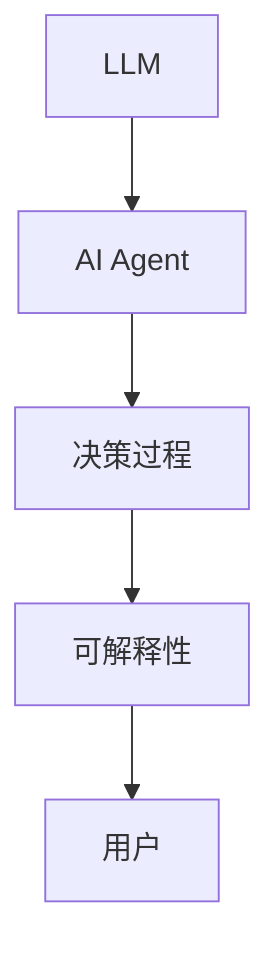
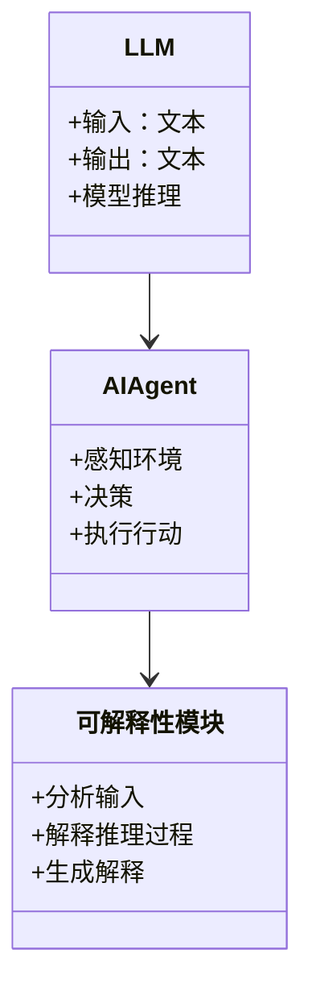
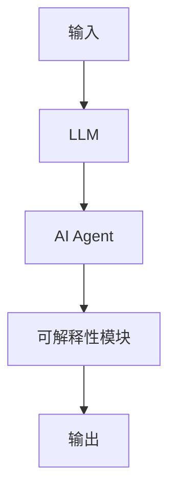
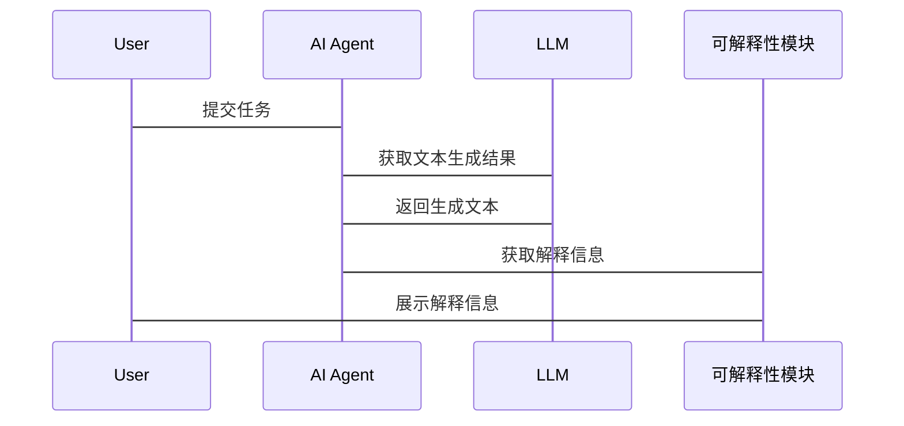

                 

<think>
好的，我现在需要帮助用户撰写一篇技术博客文章，标题是《LLM的可解释性：理解AI Agent的决策过程》。用户提供了详细的要求，包括目录结构、内容深度、格式等。首先，我需要理解用户的需求，然后一步步分析如何满足这些需求。

首先，用户希望文章结构清晰，逻辑紧凑，语言专业但易懂。关键词包括可解释性、LLM、AI Agent、决策过程、算法原理、系统架构、项目实战。摘要部分需要简明扼要地概括文章的核心内容。

接下来，我需要按照目录结构来组织文章。第一部分是背景与核心概念，包括问题背景、核心概念和解决思路。这部分需要详细解释为什么可解释性重要，以及AI Agent如何决策。第二部分是可解释性原理，详细讲解可解释性的定义、层次模型和相关技术。第三部分是LLM的内部机制，介绍模型如何工作，以及如何分析其决策过程。第四部分讨论可解释性技术，包括文本分析、模型解释方法和可视化工具。第五部分深入探讨AI Agent的决策过程，结合可解释性技术提升透明度。第六部分是系统分析与架构设计，从项目背景到交互设计详细展开。最后，项目实战部分提供实际操作指导，包括环境安装、代码实现和案例分析。最后一部分是总结与展望，回顾内容并提出未来方向。

在写作过程中，我需要确保每个章节都包含足够的细节，比如数学公式、算法流程图、类图、架构图等。使用Mermaid和LaTeX来增强技术深度，同时保持语言通俗易懂。每个部分都需要有具体的例子和详细的分析，帮助读者理解复杂的技术概念。

现在，我需要开始撰写每个章节的内容，确保逻辑连贯，覆盖所有关键点。例如，在背景介绍中，先解释什么是LLM，再说明AI Agent的作用，接着引出可解释性的重要性。在可解释性原理部分，通过层次模型展示不同层面的解释性技术，帮助读者建立系统化的理解。

在系统架构设计中，我需要绘制领域模型、架构图和交互图，展示系统的各个部分如何协同工作。项目实战部分则需要提供具体的代码示例，让读者能够实际操作，理解理论在实践中的应用。

最后，总结部分要回顾全文，强调可解释性的重要性，并指出未来的研究方向，为读者提供进一步的学习和思考的空间。

整个过程需要细致地按照用户的指示，逐步展开，确保每部分内容详实，结构合理，同时满足技术深度和可读性的双重需求。
</think>

# LLM的可解释性：理解AI Agent的决策过程

## 关键词：LLM，可解释性，AI Agent，决策过程，算法原理，系统架构，项目实战

## 摘要：
本文深入探讨了大语言模型（LLM）的可解释性问题，分析了AI Agent在决策过程中的关键因素。通过理论分析、算法原理和系统设计的结合，详细讲解了如何理解LLM的决策机制，并通过实际案例展示了如何提高AI Agent决策的透明性和可解释性。文章结构清晰，内容详实，适合技术开发者和研究人员参考。

---

## 第一部分: LLM的可解释性基础

## 第1章: 问题背景与核心概念

### 1.1 问题背景

#### 1.1.1 从传统AI到LLM的演进
传统AI依赖于规则和逻辑推理，而大语言模型（LLM）基于深度学习和自然语言处理技术，具有更强的生成能力和上下文理解能力。LLM的出现使得AI Agent能够处理更加复杂的任务。

#### 1.1.2 LLM在AI Agent中的应用现状
当前，LLM广泛应用于对话系统、文本生成、问答系统等领域。然而，这些模型的决策过程往往缺乏透明性，导致用户对AI Agent的决策结果难以理解和信任。

#### 1.1.3 可解释性问题的提出与重要性
随着AI Agent在医疗、金融等高风险领域的应用，可解释性问题变得尤为重要。用户需要了解AI Agent的决策依据，以确保系统的可靠性和合规性。

### 1.2 核心概念与问题描述

#### 1.2.1 LLM的定义与特点
- **定义**：LLM是基于大规模数据训练的深度学习模型，能够生成自然语言文本。
- **特点**：高生成能力、上下文理解能力、多任务适应性。

#### 1.2.2 AI Agent的定义与决策机制
- **定义**：AI Agent是一种智能体，能够感知环境并采取行动以实现目标。
- **决策机制**：基于LLM生成的文本理解和生成结果，结合上下文信息进行推理和决策。

#### 1.2.3 可解释性问题的边界与外延
- **边界**：可解释性关注AI Agent决策过程的透明性和合理性。
- **外延**：涉及模型的输入、输出、内部推理过程的可解释性。

### 1.3 问题解决思路

#### 1.3.1 可解释性目标的设定
- 提供清晰的决策路径。
- 验证决策的合理性和正确性。
- 支持用户对决策过程的审查和反馈。

#### 1.3.2 解决方案的初步构想
- 引入可解释性技术，如文本分析、模型解释方法和可视化工具。
- 设计透明的决策流程，确保用户能够理解AI Agent的决策依据。

#### 1.3.3 核心要素与概念结构
- **核心要素**：输入数据、模型推理、决策结果。
- **概念结构**：输入→模型推理→决策结果→解释生成。

---

## 第二部分: 可解释性原理

## 第2章: 可解释性核心概念与联系

### 2.1 可解释性原理

#### 2.1.1 解释性定义与分类
- **定义**：可解释性是指AI系统的行为能够被人类理解和解释。
- **分类**：
  - **透明性**：系统内部过程可被观察和理解。
  - **可理解性**：系统输出结果可被用户理解。
  - **可验证性**：系统决策可被验证和验证。

#### 2.1.2 解释性与模型复杂度的关系
- **低复杂度模型**：如线性回归，具有较强的可解释性。
- **高复杂度模型**：如深度神经网络，可解释性较差。

#### 2.1.3 解释性与模型性能的平衡
- 在保证模型性能的前提下，尽可能提高可解释性。

### 2.2 核心概念对比表格

| 概念         | 解释性定义 | 模型复杂度 | 可验证性 |
|--------------|-----------|-----------|----------|
| 透明性       | 输入→输出 | 低         | 高       |
| 可理解性     | 输出结果  | 中         | 中       |
| 可验证性     | 决策路径  | 高         | 低       |

### 2.3 实体关系图



---

## 第三部分: LLM的内部机制与可解释性

## 第3章: LLM的内部机制与可解释性

### 3.1 LLM的工作原理

#### 3.1.1 大语言模型的训练过程
- **训练目标**：最小化预测错误，生成与真实数据一致的文本。
- **损失函数**：交叉熵损失函数。
  $$ L = -\frac{1}{N}\sum_{i=1}^{N}\log p(y_i|x_i) $$

#### 3.1.2 模型的注意力机制
- **注意力机制**：模型关注输入文本中重要的部分。
  $$ \text{Attention}(Q, K, V) = \text{softmax}\left(\frac{QK^T}{\sqrt{d_k}}\right)V $$

#### 3.1.3 模型的生成机制
- **生成策略**：基于概率的贪心算法或随机采样。
  $$ P(y|x) = \prod_{i=1}^{n} P(y_i|y_{<i},x) $$

### 3.2 LLM的可解释性分析

#### 3.2.1 解释性技术
- **文本分析**：分析输入文本对输出结果的影响。
- **模型解释方法**：如LIME、SHAP值。
  $$ \text{SHAP}(x) = \phi(x) = f(x) - f(\text{background}) $$

#### 3.2.2 决策过程可视化
- **注意力权重图**：展示模型在生成输出时关注的位置。
- **决策树可视化**：展示模型的推理路径。

---

## 第四部分: 可解释性技术

## 第4章: 可解释性技术与实现

### 4.1 文本分析技术

#### 4.1.1 文本特征提取
- **关键词提取**：使用TF-IDF或主题模型提取重要关键词。
  $$ \text{TF-IDF}(t) = \text{TF}(t) \times \text{IDF}(t) $$

#### 4.1.2 文本相似度计算
- **余弦相似度**：
  $$ \text{sim}(x, y) = \frac{x \cdot y}{\|x\|\|y\|} $$

### 4.2 模型解释方法

#### 4.2.1 局部可解释性方法
- **LIME**：通过近邻样本解释模型的预测结果。
  $$ \text{LIME} = \sum_{i=1}^{n} w_i \cdot f(x_i) $$

#### 4.2.2 全局可解释性方法
- **SHAP值**：衡量每个特征对模型预测结果的影响。
  $$ \text{SHAP}(x) = \phi(x) = f(x) - f(\text{background}) $$

### 4.3 可视化工具

#### 4.3.1 Attention权重可视化
- 使用热力图展示模型生成文本时的注意力权重。
- **代码示例**：
  ```python
  import matplotlib.pyplot as plt
  plt.imshow(attn_weights)
  plt.colorbar()
  plt.show()
  ```

#### 4.3.2 决策树可视化
- 使用`graphviz`库生成决策树的可视化图。
  ```python
  from sklearn.tree import export_graphviz
  export_graphviz(clf, out_file='tree.dot')
  ```

---

## 第五部分: AI Agent的决策过程

## 第5章: AI Agent的决策过程分析

### 5.1 AI Agent的定义与决策机制

#### 5.1.1 AI Agent的定义
- **智能体**：具有感知和行动能力的实体。
- **决策机制**：基于LLM生成的文本理解和生成结果，结合上下文信息进行推理和决策。

### 5.2 可解释性技术在AI Agent中的应用

#### 5.2.1 决策过程的可解释性
- **输入分析**：分析输入文本对决策结果的影响。
- **推理路径**：展示AI Agent的推理过程。
  $$ \text{推理路径} = f_1(x) \rightarrow f_2(f_1(x)) \rightarrow \cdots \rightarrow f_n(f_{n-1}(\cdots f_1(x) \cdots)) $$

#### 5.2.2 决策结果的验证
- **结果验证**：通过可解释性技术验证决策结果的合理性。
- **用户反馈**：收集用户对决策结果的反馈，用于优化模型。

---

## 第六部分: 系统分析与架构设计

## 第6章: 系统分析与架构设计

### 6.1 项目背景

#### 6.1.1 问题场景介绍
- **场景**：AI Agent在医疗诊断中的应用。
- **目标**：提高AI Agent决策的透明性和可解释性。

### 6.2 系统功能设计

#### 6.2.1 领域模型


#### 6.2.2 系统架构设计


#### 6.2.3 系统接口设计
- **输入接口**：接收用户输入。
- **输出接口**：展示决策结果和解释信息。
- **内部接口**：LLM与AI Agent之间的通信。

#### 6.2.4 交互设计


---

## 第七部分: 项目实战

## 第7章: 项目实战与分析

### 7.1 环境安装

#### 7.1.1 安装Python环境
- 使用Anaconda或虚拟环境。
- 安装依赖包：`transformers`, `pytorch`, `matplotlib`.

#### 7.1.2 安装可解释性工具
- `lime`, `shap`, `graphviz`.

### 7.2 核心代码实现

#### 7.2.1 LLM的文本生成
```python
from transformers import GPT2LMHeadModel, GPT2Tokenizer

model = GPT2LMHeadModel.from_pretrained('gpt2')
tokenizer = GPT2Tokenizer.from_pretrained('gpt2')

input_text = "今天天气很好，"
input_ids = tokenizer.encode(input_text, return_tensors='pt')
output = model.generate(input_ids, max_length=50)
print(tokenizer.decode(output[0], skip_special_tokens=True))
```

#### 7.2.2 可解释性分析
```python
import lime
from lime.lime_text import LimeText

lime_explainer = LimeText()
explanation = lime_explainer.express(input_text)
print(explanation.as_list())
```

### 7.3 案例分析

#### 7.3.1 案例背景
- **场景**：医疗诊断中的症状分析。
- **输入**：患者症状描述。

#### 7.3.2 代码实现
```python
input_text = "我最近总是感到疲惫，可能是因为..."
input_ids = tokenizer.encode(input_text, return_tensors='pt')
output = model.generate(input_ids, max_length=50)
print(tokenizer.decode(output[0], skip_special_tokens=True))
```

#### 7.3.3 解释分析
- **关键词提取**：提取输入文本中的关键症状。
- **模型解释**：分析模型生成结果的合理性。

### 7.4 项目小结

#### 7.4.1 实战总结
- **成功经验**：通过可解释性技术提高了AI Agent决策的透明性。
- **问题与改进**：部分模型的解释性较差，未来可以优化模型结构。

---

## 第八部分: 总结与展望

## 第8章: 总结与展望

### 8.1 总结

#### 8.1.1 核心内容回顾
- LLM的可解释性是提升AI Agent决策透明性的关键。
- 通过文本分析、模型解释和可视化工具可以提高决策过程的可理解性。

### 8.2 未来展望

#### 8.2.1 可解释性技术的优化
- 开发更高效的可解释性方法，如基于梯度的解释方法。
- 提高模型的透明性，降低模型复杂度。

#### 8.2.2 应用场景的拓展
- 在金融、医疗等高风险领域进一步应用。
- 结合边缘计算和雾计算，提高AI Agent的实时性。

### 8.3 最佳实践 tips

#### 8.3.1 注意事项
- 在实际应用中，结合业务需求选择合适的可解释性技术。
- 定期对模型进行验证和优化，确保决策的合理性和正确性。

#### 8.3.2 拓展阅读
- 《可解释的人工智能：模型、方法和应用》
- 《深度学习可解释性技术的现状与挑战》

---

## 作者：AI天才研究院/AI Genius Institute & 禅与计算机程序设计艺术 /Zen And The Art of Computer Programming

---

感谢您的阅读！希望本文能够帮助您更好地理解LLM的可解释性问题，并为AI Agent的决策过程提供新的思路和方法。

