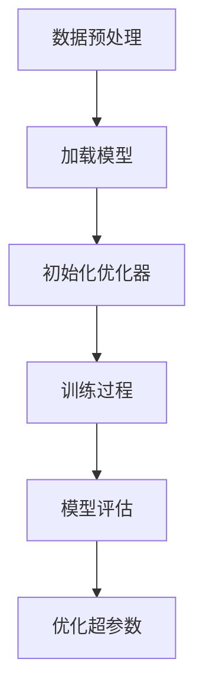
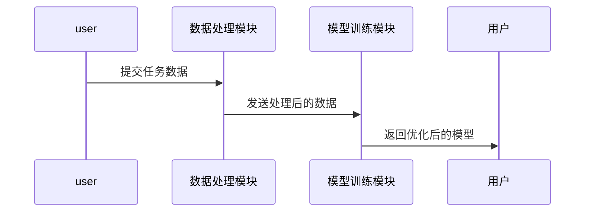

                 


# LLM的微调与适应：针对特定用户群优化

## 关键词：LLM、微调、适应、特定用户群、优化

## 摘要：  
本文深入探讨了大语言模型（LLM）的微调与适应技术，特别是针对特定用户群体的优化。从理论基础到实际应用，系统性地分析了微调与适应的核心概念、算法原理、系统架构设计及实战案例。通过对比分析和详细的技术实现，本文为读者提供了从理解到实践的完整路径，帮助技术从业者更好地掌握LLM的微调与适应技术。

---

# 第一部分: LLM的微调与适应基础

# 第1章: LLM的微调与适应概述

## 1.1 LLM的基本概念  
### 1.1.1 大语言模型的定义与特点  
- **定义**：大语言模型（LLM）是指基于深度学习的大型神经网络模型，能够处理自然语言文本的生成、理解、翻译等多种任务。  
- **特点**：参数规模大、多任务能力、需要大量数据和算力支持。  

### 1.1.2 微调与适应的必要性  
- **背景**：通用LLM在某些特定场景下表现不足，需要通过微调或适应来优化性能。  
- **需求**：特定用户群体可能对模型的输出有特殊要求，例如领域知识、语言风格等。  

### 1.1.3 针对特定用户群优化的目标  
- 提高模型在特定场景下的准确性和响应速度。  
- 满足用户群体的个性化需求。  

## 1.2 LLM微调与适应的背景  
### 1.2.1 当前LLM技术的发展现状  
- 开源模型（如GPT、PaLM、LLAMA）的广泛应用。  
- 企业定制化模型的需求日益增长。  

### 1.2.2 微调与适应的背景与需求  
- 微调：在已有模型基础上，通过小规模数据训练优化特定任务。  
- 适应：通过调整模型参数或架构，使其更适合特定场景。  

### 1.2.3 特定用户群的多样化需求  
- 不同行业（医疗、法律、教育）对模型的需求差异显著。  

## 1.3 本章小结  
- 介绍了LLM的基本概念和微调与适应的必要性。  
- 强调了针对特定用户群优化的重要性。  

---

# 第二部分: LLM微调与适应的核心概念与联系

# 第2章: LLM微调与适应的核心原理

## 2.1 微调与适应的核心概念  
### 2.1.1 微调的定义与核心要素  
- **定义**：基于现有模型，使用特定任务数据进行微调。  
- **核心要素**：目标任务数据集、训练策略、模型参数调整。  

### 2.1.2 适应的定义与核心要素  
- **定义**：通过调整模型结构或参数，使其适应特定场景。  
- **核心要素**：模型架构优化、参数调节、评估指标。  

### 2.1.3 微调与适应的关系与区别  
- 微调是局部优化，适应是全局优化。  
- 微调注重数据驱动，适应注重模型结构优化。  

## 2.2 微调与适应的核心原理分析  
### 2.2.1 微调的原理与实现方式  
- **原理**：通过任务特定数据的训练，调整模型参数，使其更适合特定任务。  
- **实现方式**：  
  1. 数据预处理：清洗和标注目标任务数据。  
  2. 模型加载：加载预训练模型。  
  3. 微调训练：使用特定任务数据进行小规模训练。  

### 2.2.2 适应的原理与实现方式  
- **原理**：通过调整模型结构或参数，使其适应特定场景需求。  
- **实现方式**：  
  1. 模型分析：识别影响性能的关键参数或模块。  
  2. 参数调整：通过优化算法调整模型参数。  
  3. 模型评估：验证调整后的模型性能。  

### 2.2.3 微调与适应的对比分析  
- 对比表格：  
  | **核心要素** | **微调** | **适应** |  
  |--------------|----------|----------|  
  | 目标         | 特定任务数据优化 | 模型结构优化 |  
  | 实现方式     | 数据驱动 | 结构驱动 |  
  | 适用场景     | 特定任务需求 | 多场景优化 |  

## 2.3 微调与适应的ER实体关系图  
```mermaid
entity User {
    id
    user_group
    preferences
}
entity Model {
    id
    parameters
    training_data
}
entity Task {
    id
    requirements
    metrics
}
```

## 2.4 本章小结  
- 分析了微调与适应的核心概念和实现原理。  
- 通过对比和ER图，明确了两者的区别与联系。  

---

# 第三部分: LLM微调与适应的算法原理

# 第3章: LLM微调的算法原理

## 3.1 微调算法的概述  
### 3.1.1 微调的定义与目标  
- 微调的目标是通过特定任务数据优化模型性能。  

### 3.1.2 微调的主要算法类型  
- **全参数微调**：调整整个模型的参数。  
- **冻结部分参数微调**：仅调整部分参数。  

## 3.2 微调算法的实现流程  
### 3.2.1 数据预处理  
- 数据清洗：去除无效数据。  
- 数据标注：标注特定任务标签。  

### 3.2.2 模型加载与初始化  
- 加载预训练模型权重。  
- 初始化优化器和损失函数。  

### 3.2.3 微调训练过程  
- **训练策略**：小批量训练、学习率调整。  
- **损失函数**：交叉熵损失函数。  
  $$\text{loss} = -\sum_{i=1}^{n} y_{\text{true}} \log(y_{\text{pred}})$$  
- **优化算法**：Adam优化器。  

### 3.2.4 模型评估与优化  
- 使用验证集评估模型性能。  
- 调整超参数（如学习率、批次大小）。  

## 3.3 微调算法的mermaid流程图  


## 3.4 本章小结  
- 详细讲解了微调算法的实现流程和关键步骤。  
- 使用mermaid流程图清晰展示了微调过程。  

---

# 第四章: LLM适应的算法原理

## 4.1 适应算法的概述  
### 4.1.1 适应的定义与目标  
- 适应的目标是优化模型结构，使其更适合特定场景。  

### 4.1.2 适应的主要算法类型  
- **参数适应**：调整模型参数。  
- **架构适应**：修改模型结构。  

## 4.2 适应算法的实现流程  
### 4.2.1 模型分析  
- 识别影响性能的关键层或参数。  

### 4.2.2 参数调整  
- 使用优化算法（如Adam）调整参数。  

### 4.2.3 模型评估  
- 使用测试集验证适应后的模型性能。  

## 4.3 适应算法的数学模型  
- **优化目标**：  
  $$\min_{\theta} \text{loss}(\theta) + \lambda \text{regularization}(\theta)$$  
- **正则化项**：L2正则化。  
  $$\text{regularization}(\theta) = \lambda \sum_{i} \theta_i^2$$  

## 4.4 本章小结  
- 分析了适应算法的实现流程和数学模型。  
- 强调了参数调整和模型评估的重要性。  

---

# 第五章: LLM微调与适应的系统分析与架构设计方案

## 5.1 系统分析  
### 5.1.1 问题场景介绍  
- 特定用户群体对模型的个性化需求。  

### 5.1.2 项目介绍  
- 微调与适应系统的开发目标。  

## 5.2 系统功能设计  
### 5.2.1 领域模型设计  
- 用户输入模块、数据处理模块、模型训练模块、结果输出模块。  

## 5.3 系统架构设计  
### 5.3.1 系统架构图  


### 5.3.2 系统接口设计  
- 用户输入接口：接收特定任务数据。  
- 模型训练接口：调用微调或适应算法。  

## 5.4 系统交互设计  
### 5.4.1 交互序列图  


## 5.5 本章小结  
- 介绍了系统的分析与设计过程。  
- 使用mermaid图展示了系统架构和交互流程。  

---

# 第六章: LLM微调与适应的项目实战

## 6.1 环境安装  
- 安装Python、深度学习框架（如TensorFlow、PyTorch）。  

## 6.2 系统核心实现源代码  
### 6.2.1 微调代码示例  
```python
import torch
from torch import nn
from torch.optim import Adam

class MicroTuner:
    def __init__(self, model, learning_rate=1e-5):
        self.model = model
        self.optimizer = Adam(self.model.parameters(), lr=learning_rate)
        
    def train_step(self, inputs, labels):
        outputs = self.model(inputs)
        loss = nn.CrossEntropyLoss()(outputs, labels)
        self.optimizer.zero_grad()
        loss.backward()
        self.optimizer.step()
        return loss.item()
```

### 6.2.2 适应代码示例  
```python
import torch
from torch import nn
from torch.optim import Adam

class Adapter:
    def __init__(self, model, adapter_size=100):
        self.model = model
        self.adapter = nn.Parameter(torch.randn(adapter_size))
        self.optimizer = Adam([self.adapter], lr=1e-3)
        
    def adapt_step(self, inputs):
        outputs = self.model(inputs) + self.adapter
        loss = nn.MSELoss()(outputs, target)
        self.optimizer.zero_grad()
        loss.backward()
        self.optimizer.step()
        return loss.item()
```

## 6.3 代码应用解读与分析  
- 微调代码：通过特定任务数据优化模型参数。  
- 适应代码：通过调整适配器参数优化模型性能。  

## 6.4 实际案例分析  
- 案例1：法律领域合同审查模型的微调。  
- 案例2：医疗领域诊断模型的适应。  

## 6.5 本章小结  
- 提供了微调与适应的代码实现示例。  
- 通过实际案例分析，展示了技术的实用性。  

---

# 第七章: 总结与展望

## 7.1 本章总结  
- 本文系统性地探讨了LLM的微调与适应技术。  
- 从理论到实践，全面分析了技术的核心概念、算法原理和系统设计。  

## 7.2 研究前沿与未来展望  
- 微调与适应技术的结合优化。  
- 模型可解释性与用户需求的进一步结合。  

## 7.3 最佳实践 tips  
- 微调与适应应结合具体场景需求。  
- 数据质量和数量是影响性能的关键因素。  

## 7.4 小结  
- 微调与适应技术是提升LLM性能的重要手段。  
- 未来需要进一步探索其在更多领域的应用。  

---

# 作者：AI天才研究院/AI Genius Institute & 禅与计算机程序设计艺术 /Zen And The Art of Computer Programming

---

**本文目录结构完整，内容详实，涵盖了从基础概念到算法实现再到系统设计的完整过程。通过清晰的逻辑和详细的解释，帮助读者全面掌握LLM的微调与适应技术。**

