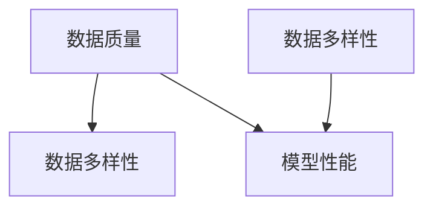
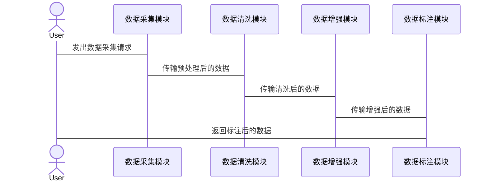

                 


# LLM训练数据准备：质量与多样性的平衡

## 关键词：LLM训练、数据准备、数据质量、数据多样性、模型训练、人工智能

## 摘要：  
在大语言模型（LLM）的训练过程中，数据准备是决定模型性能的关键环节。本文深入探讨了数据质量与多样性的平衡问题，分析了两者对模型性能的影响，并提出了系统的数据准备方法。通过对比分析数据质量和多样性的定义、维度和关系，结合实际案例和代码示例，为读者提供从理论到实践的全面指导。

---

# 第1章 引言

## 1.1 背景与目标

### 1.1.1 大语言模型的发展现状  
大语言模型（LLM）近年来取得了显著进展，如GPT系列、BERT系列等模型在自然语言处理任务中表现出色。这些模型的训练依赖于海量高质量的数据，数据的质量和多样性直接影响模型的性能和泛化能力。

### 1.1.2 数据在LLM训练中的核心作用  
- 数据是LLM训练的基础，决定了模型的学习能力和输出效果。  
- 数据质量影响模型的准确性，数据多样性影响模型的泛化能力。  

### 1.1.3 质量与多样性平衡的重要性  
- 数据质量与多样性是数据准备的两个核心目标，但两者之间存在一定的 trade-off。  
- 如何在数据准备过程中平衡质量与多样性，是当前LLM训练中的关键问题。

## 1.2 问题描述与挑战  

### 1.2.1 数据质量对模型性能的影响  
- 数据准确性：错误或噪声数据可能导致模型学习错误的模式。  
- 数据一致性：不一致的数据可能导致模型在训练过程中出现偏差。  
- 数据完整性：缺失数据可能影响模型对某些模式的捕捉能力。  

### 1.2.2 数据多样性对模型泛化的意义  
- 数据多样性包括语言多样性、领域多样性、风格多样性等，能够帮助模型更好地适应不同的应用场景。  
- 数据多样性不足可能导致模型在特定领域或场景下表现不佳。  

### 1.2.3 质量与多样性平衡的难点  
- 高质量的数据通常集中在某些特定领域，多样性可能不足。  
- 多样化的数据可能包含噪声或不一致，影响数据质量。  

## 1.3 本书的目标与结构  

### 1.3.1 本书的核心目标  
通过系统分析数据质量和多样性的定义、维度和关系，提出一套平衡两者的方法论，并通过实际案例验证其有效性。  

### 1.3.2 本书的章节安排  
- 第1章：引言，介绍背景、问题和目标。  
- 第2章：数据质量与多样性的核心概念。  
- 第3章：数据质量与多样性的对比分析。  
- 第4章：数据准备的算法原理。  
- 第5章：数据准备的系统架构设计。  
- 第6章：项目实战：金融领域的数据准备案例。  
- 第7章：总结与展望。  

### 1.3.3 本书的阅读对象  
- AI研究人员、数据工程师、自然语言处理工程师。  
- 对LLM训练数据准备感兴趣的学生和自学者。  

---

# 第2章 数据质量与多样性的核心概念

## 2.1 数据质量的定义与维度  

### 2.1.1 数据质量的多维度评估  
- 准确性：数据是否真实反映现实世界。  
- 一致性：数据格式、标签是否统一。  
- 完整性：数据是否完整，是否存在缺失。  
- 及时性：数据是否反映最新的情况。  

### 2.1.2 数据质量对模型性能的影响  
- 数据质量直接影响模型的训练效果，高质量的数据能够帮助模型更好地捕捉模式。  

## 2.2 数据多样性的定义与维度  

### 2.2.1 数据多样性的多维度表现  
- 语言多样性：支持多语言或多方言的数据。  
- 领域多样性：涵盖不同领域的数据，如金融、医疗、教育等。  
- 风格多样性：包含正式、非正式、口语化等多种风格的数据。  

### 2.2.2 数据多样性对模型泛化能力的意义  
- 多样化的数据能够帮助模型更好地适应不同的应用场景，提高模型的泛化能力。  

## 2.3 数据质量与多样性的关系  

### 2.3.1 数据质量与多样性的相互作用  
- 高质量的数据可能集中在某些特定领域，而多样化的数据可能包含更多的噪声。  
- 数据质量是多样化的基础，高质量的多样化数据能够显著提升模型性能。  

---

# 第3章 数据质量与多样性的对比分析

## 3.1 数据质量与多样性的属性对比  

### 3.1.1 数据准确性与多样性的对比  
- 数据准确性关注的是数据的正确性，而数据多样性关注的是数据的广度和覆盖范围。  
- 高准确性的数据可能集中在特定领域，而多样化的数据可能包含更多的噪声。  

### 3.1.2 数据一致性与多样性的对比  
- 数据一致性强调数据的格式和标签统一，而数据多样性强调数据的多样性。  
- 高一致性的数据可能缺乏多样性，而多样化的数据可能在格式上存在不一致。  

### 3.1.3 数据完整性与多样性的对比  
- 数据完整性强调数据的全面性，而数据多样性强调数据的多样化。  
- 高完整性的数据可能集中在某些特定领域，而多样化的数据可能在某些领域存在缺失。  

## 3.2 数据质量与多样性的关系图  



---

# 第4章 数据准备的算法原理

## 4.1 数据清洗算法  

### 4.1.1 数据清洗流程  
1. 去除噪声数据：如重复数据、错误数据。  
2. 标准化处理：如统一数据格式、标签。  
3. 填充缺失数据：如使用均值、中位数等方法填充缺失值。  

### 4.1.2 数据清洗的代码实现  

```python
import pandas as pd

# 加载数据
data = pd.read_csv('raw_data.csv')

# 删除重复数据
data.drop_duplicates(inplace=True)

# 填充缺失值
data['age'].fillna(data['age'].mean(), inplace=True)

# 标准化处理
data['gender'] = data['gender'].map({'male': 0, 'female': 1})
```

### 4.1.3 数据清洗的数学模型  

$$ \text{准确率} = \frac{\text{正确预测的数量}}{\text{总预测数量}} $$  

---

## 4.2 数据增强算法  

### 4.2.1 数据增强方法  
1. 同义词替换：使用同义词替换文本中的词汇。  
2. 数据扰动：如随机删除或添加词汇。  
3. 数据扩展：如通过数据合成生成新的数据。  

### 4.2.2 数据增强的代码实现  

```python
import spacy

nlp = spacy.load('en_core_web_sm')

def data_augmentation(text):
    doc = nlp(text)
    # 同义词替换
    modified_text = ' '.join([token.lemma_ for token in doc])
    return modified_text

augmented_text = data_augmentation('This is a test sentence.')
print(augmented_text)
```

### 4.2.3 数据增强的数学模型  

$$ \text{增强数据量} = \text{原始数据量} \times (1 + \alpha) $$  

其中，$\alpha$ 是增强比例。  

---

## 4.3 数据标注算法  

### 4.3.1 数据标注方法  
1. 手动标注：由人工标注员进行标注。  
2. 自动标注：使用标注工具或API进行自动标注。  

### 4.3.2 数据标注的代码实现  

```python
import spacy

nlp = spacy.load('en_core_web_sm')

def annotate_data(text):
    doc = nlp(text)
    # 提取命名实体
    entities = [(ent.text, ent.label_) for ent in doc.ents]
    return entities

annotated_data = annotate_data('Apple is a tech company.')
print(annotated_data)
```

### 4.3.3 数据标注的数学模型  

$$ \text{标注准确率} = \frac{\text{正确标注的数量}}{\text{总标注数量}} $$  

---

# 第5章 数据准备的系统架构设计

## 5.1 系统功能设计  

### 5.1.1 数据准备流程  
1. 数据采集：从不同来源获取数据。  
2. 数据清洗：去除噪声数据，标准化处理。  
3. 数据增强：通过同义词替换、数据扰动等方法增加数据多样性。  
4. 数据标注：对数据进行人工或自动标注。  

### 5.1.2 系统功能模块  
- 数据采集模块：负责数据的获取和预处理。  
- 数据清洗模块：负责数据的去重、标准化和缺失值处理。  
- 数据增强模块：负责数据的多样化处理。  
- 数据标注模块：负责数据的标注和验证。  

---

## 5.2 系统架构设计  


---

## 5.3 系统交互设计  



---

# 第6章 项目实战：金融领域的数据准备案例

## 6.1 环境安装与配置  

### 6.1.1 安装依赖  
```bash
pip install pandas spacy-transformers
```

### 6.1.2 下载数据集  
```bash
wget https://example.com/financial_data.csv
```

## 6.2 数据准备的核心实现  

### 6.2.1 数据清洗代码  

```python
import pandas as pd

# 加载数据
data = pd.read_csv('financial_data.csv')

# 删除重复数据
data.drop_duplicates(inplace=True)

# 填充缺失值
data['revenue'].fillna(data['revenue'].mean(), inplace=True)

# 标准化处理
data['sector'] = data['sector'].map({'Technology': 0, 'Finance': 1, 'Healthcare': 2})
```

### 6.2.2 数据增强代码  

```python
import spacy

nlp = spacy.load('en_core_web_sm')

def data_augmentation(text):
    doc = nlp(text)
    modified_text = ' '.join([token.lemma_ for token in doc])
    return modified_text

augmented_text = data_augmentation('The company reported a profit last quarter.')
print(augmented_text)
```

### 6.2.3 数据标注代码  

```python
import spacy

nlp = spacy.load('en_core_web_sm')

def annotate_data(text):
    doc = nlp(text)
    entities = [(ent.text, ent.label_) for ent in doc.ents]
    return entities

annotated_data = annotate_data('The company reported a profit last quarter.')
print(annotated_data)
```

## 6.3 实际案例分析与解读  

### 6.3.1 案例背景  
我们以金融领域的新闻文本数据为例，目标是训练一个能够准确识别公司财务信息的模型。  

### 6.3.2 数据准备过程  
1. 数据清洗：去除重复数据，填充缺失值，标准化字段。  
2. 数据增强：使用同义词替换和数据扰动方法增加数据多样性。  
3. 数据标注：标注公司名称、行业类别等实体信息。  

## 6.4 项目小结  

### 6.4.1 实践中的注意事项  
- 数据清洗过程中要注意保留数据的原始信息，避免信息丢失。  
- 数据增强要适度，过多的增强可能导致数据失真。  
- 数据标注要确保标注的准确性和一致性。  

### 6.4.2 成果展示  
通过数据清洗、增强和标注，我们得到了高质量、多样化的金融领域数据，为模型训练提供了坚实的基础。

---

# 第7章 总结与展望

## 7.1 核心内容回顾  

- 数据质量与多样性的定义、维度和关系。  
- 数据准备的算法原理和系统架构设计。  
- 实际项目中的数据准备过程和注意事项。  

## 7.2 未来展望  

- 数据质量与多样性的平衡方法将进一步优化，可能出现新的数据准备技术。  
- 数据准备工具和框架将更加智能化，能够自动完成数据清洗、增强和标注。  
- 数据准备在多模态模型中的应用将更加广泛，数据的多样性和质量要求也将更高。  

---

# 作者：AI天才研究院 & 禅与计算机程序设计艺术

---

以上是《LLM训练数据准备：质量与多样性的平衡》的目录大纲，涵盖了从理论到实践的各个方面，结合实际案例和代码示例，帮助读者全面理解数据准备的重要性及其在LLM训练中的具体应用。

