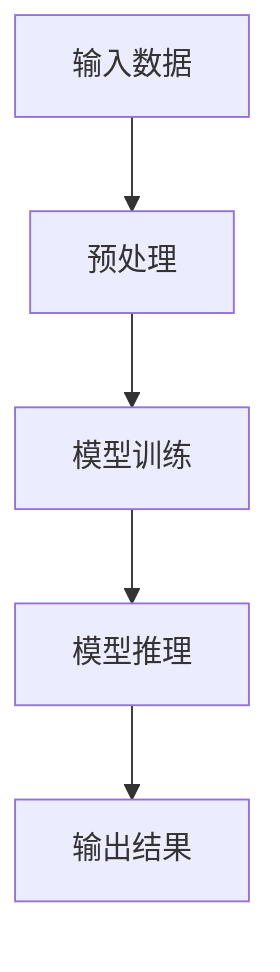
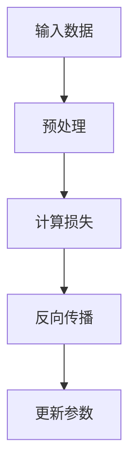
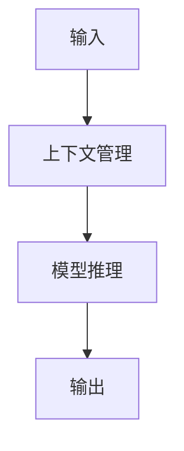
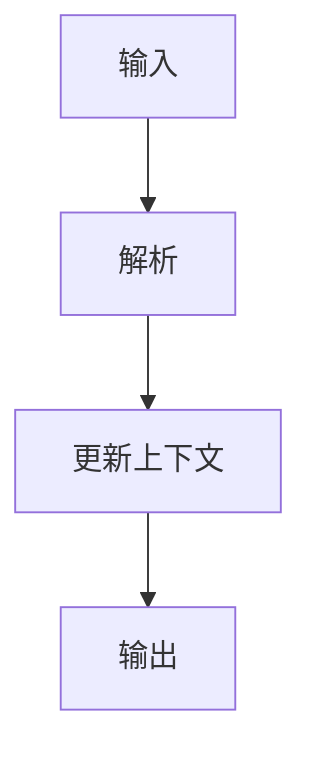
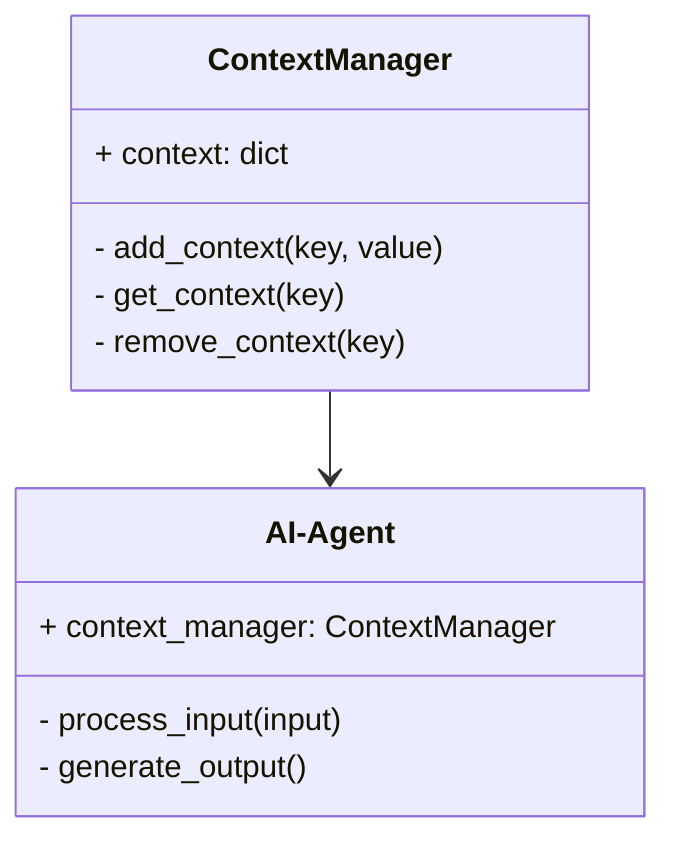
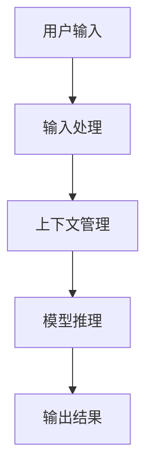

                 

<think>
好，我现在需要帮用户撰写一篇关于《LLM驱动的AI Agent上下文管理技术》的技术博客文章。用户希望文章结构清晰、逻辑严谨，涵盖从基础概念到算法实现、系统架构设计、项目实战等部分。

首先，我会先理解每个章节的内容和要求。用户提供的目录大纲已经很详细，包括背景介绍、核心概念、算法原理、系统架构设计、项目实战和最佳实践等章节。每个章节下还有子章节，细化到三级目录。

接下来，我需要确保每个部分都符合用户的要求，比如每个章节要有足够的内容，涵盖必要的技术细节。例如，在核心概念部分，需要定义上下文管理，比较其属性特征，并绘制相关图表。

在算法原理部分，我需要用数学公式和流程图来解释LLM的训练和AI Agent的推理过程。这可能涉及到损失函数和优化器的公式，以及使用Mermaid绘制的流程图。

系统架构设计部分需要介绍问题场景，设计系统功能，绘制领域模型和架构图，描述接口设计和交互流程。这里可能需要用到类图和序列图来展示系统结构。

项目实战部分要详细讲解如何安装环境，实现核心代码，并分析案例。这需要提供具体的代码示例和实际应用分析。

最后，在最佳实践部分，我需要总结全书，给出注意事项和未来趋势，可能包括一些图表和代码示例。

在整个过程中，我需要确保文章结构完整，内容详实，符合用户的字数要求，大约1万到1.2万字。同时，要使用技术术语，但保持语言简洁易懂，适合专业人士阅读。

可能在撰写过程中，我会遇到一些挑战，比如如何将复杂的算法原理讲解得通俗易懂，或者如何设计合理的系统架构图。这时，我会参考用户提供的示例，确保每个部分都符合要求，并进行必要的调整和补充。

总的来说，我会按照用户提供的大纲，一步步填充内容，确保每个部分都详细且有深度，最终完成一篇高质量的技术博客文章。
</think>

# LLM驱动的AI Agent上下文管理技术

---

## 关键词：LLM, AI Agent, 上下文管理, 自然语言处理, 系统架构, 项目实战

---

## 摘要

LLM驱动的AI Agent上下文管理技术是人工智能领域的重要研究方向。随着大语言模型（LLM）的快速发展，AI Agent在自然语言处理、人机交互和业务系统中的应用日益广泛。上下文管理作为AI Agent的核心技术，决定了其理解和处理复杂任务的能力。本文将从LLM与AI Agent的基本概念出发，深入探讨上下文管理的核心概念、算法原理、系统架构设计以及项目实战，最后总结最佳实践和未来发展趋势。

---

# 第一部分: LLM与AI Agent概述

## 第1章: LLM驱动的AI Agent概述

### 1.1 LLM驱动的AI Agent概念

#### 1.1.1 大语言模型（LLM）的基本概念

大语言模型（LLM）是基于深度学习的自然语言处理模型，具有强大的文本生成和理解能力。LLM通过监督学习和强化学习训练，能够处理复杂的上下文信息，生成连贯且合理的文本输出。LLM的核心在于其巨大的参数规模和高效的训练算法，使其在多种任务中表现出色。

#### 1.1.2 AI Agent的核心定义

AI Agent（智能体）是指在特定环境中能够感知并自主行动以实现目标的实体。LLM驱动的AI Agent结合了大语言模型的自然语言处理能力，能够在复杂场景中进行上下文管理、任务规划和决策推理。AI Agent通过与用户的交互或与其他系统的协作，实现智能化的任务执行。

#### 1.1.3 上下文管理的定义与作用

上下文管理是指在AI Agent与用户或系统交互过程中，动态维护和更新相关信息的过程。上下文管理的核心在于理解和记忆当前对话或任务的背景信息，以便后续的交互能够连贯且高效。LLM驱动的AI Agent通过上下文管理，能够更好地理解用户需求，提供更精准的服务。

### 1.2 LLM驱动的AI Agent的应用场景

#### 1.2.1 自然语言处理中的上下文管理

在自然语言处理任务中，LLM驱动的AI Agent需要管理对话历史、用户意图和实体信息。例如，在智能客服系统中，AI Agent需要根据之前的对话内容，理解用户的需求，并提供相应的解决方案。

#### 1.2.2 人机交互中的上下文管理

在人机交互场景中，上下文管理帮助AI Agent更好地理解用户的输入，保持对话的连贯性。例如，在智能音箱中，用户可以通过上下文信息，与AI Agent进行多轮对话，完成复杂任务。

#### 1.2.3 业务系统中的上下文管理

在业务系统中，LLM驱动的AI Agent需要管理与任务相关的上下文信息，例如订单状态、用户身份和系统状态。例如，在电子商务系统中，AI Agent可以根据用户的购买记录和偏好，推荐相关产品。

### 1.3 LLM驱动的AI Agent的挑战与机遇

#### 1.3.1 上下文管理的主要挑战

上下文管理面临数据量大、动态性强、信息不完整等挑战。例如，如何在多任务场景中有效管理上下文信息，如何处理信息冲突等问题。

#### 1.3.2 LLM驱动的优势

LLM具有强大的自然语言理解和生成能力，能够处理复杂和多样化的上下文信息。此外，LLM的可扩展性和灵活性使其能够适应不同的应用场景。

#### 1.3.3 未来发展趋势

随着技术的进步，LLM驱动的AI Agent将在更多领域得到应用，上下文管理技术将更加智能化和个性化。例如，结合边缘计算和实时数据处理，AI Agent能够实现更高效的上下文管理。

### 1.4 本章小结

本章介绍了LLM驱动的AI Agent的基本概念和应用场景，并分析了上下文管理的挑战与机遇。接下来，将深入探讨上下文管理的核心概念和技术原理。

---

## 第2章: 上下文管理的核心概念

### 2.1 上下文管理的定义与属性

#### 2.1.1 上下文的定义

上下文是指在特定场景下，与当前任务相关的所有信息和背景知识。上下文管理的目标是通过动态维护这些信息，帮助AI Agent更好地理解和执行任务。

#### 2.1.2 上下文的属性特征对比

下表展示了上下文的主要属性特征：

| 属性 | 描述 |
|------|------|
| 时间性 | 上下文具有时间依赖性 |
| 空间性 | 上下文具有空间依赖性 |
| 关联性 | 上下文与任务相关联 |
| 动态性 | 上下文会动态变化 |

#### 2.1.3 上下文管理的核心要素

上下文管理的核心要素包括：

1. 上下文存储：用于存储当前任务相关的上下文信息。
2. 上下文更新：根据新的输入动态更新上下文信息。
3. 上下文推理：基于上下文信息进行逻辑推理和决策。

### 2.2 LLM驱动的上下文管理模型

#### 2.2.1 模型的输入输出关系

LLM驱动的上下文管理模型通过输入上下文信息和用户输入，生成输出结果。模型的输入包括对话历史、用户意图和实体信息，输出包括生成的文本和推理结果。

#### 2.2.2 模型的训练与推理过程

下图展示了模型的训练与推理过程：



模型训练阶段，输入数据经过预处理后，用于训练LLM模型。模型推理阶段，输入上下文信息和用户输入，生成输出结果。

### 2.3 上下文管理的策略与优化

#### 2.3.1 上下文存储策略

上下文存储策略包括：

1. 基于时间的存储策略：根据上下文的时间戳进行存储和管理。
2. 基于任务的存储策略：根据任务需求进行上下文存储和管理。

#### 2.3.2 上下文更新策略

上下文更新策略包括：

1. 基于事件的更新策略：根据用户输入或系统事件动态更新上下文。
2. 基于规则的更新策略：根据预定义规则进行上下文更新。

#### 2.3.3 上下文冲突解决策略

上下文冲突解决策略包括：

1. 基于优先级的冲突解决：根据上下文的优先级进行冲突解决。
2. 基于语义理解的冲突解决：通过语义分析解决上下文冲突。

### 2.4 本章小结

本章详细介绍了上下文管理的核心概念和策略，为后续的算法实现和系统设计奠定了基础。接下来，将探讨LLM驱动的AI Agent算法原理。

---

## 第3章: LLM驱动的AI Agent算法原理

### 3.1 LLM的训练与优化

#### 3.1.1 模型训练的数学公式

模型训练的目标是最小化损失函数。常用的损失函数包括交叉熵损失：

$$ \text{损失函数} = \sum_{i=1}^{n} \text{交叉熵损失} $$

模型优化算法通常使用Adam优化器：

$$ \text{Adam优化器} = \alpha \frac{\partial L}{\partial \theta} $$

其中，$\alpha$ 是学习率，$L$ 是损失函数，$\theta$ 是模型参数。

#### 3.1.2 模型优化算法

下图展示了模型优化的流程：



模型优化算法通过反向传播计算梯度，并使用Adam优化器更新模型参数。

### 3.2 AI Agent的推理过程

#### 3.2.1 推理过程的数学模型

AI Agent的推理过程可以表示为：

$$ y = f(x, c) $$

其中，$x$ 是输入，$c$ 是上下文信息，$y$ 是输出。

下图展示了推理过程的流程：



### 3.3 上下文管理的算法实现

#### 3.3.1 上下文存储算法

上下文存储算法可以通过哈希表实现，如下所示：

```python
class ContextManager:
    def __init__(self):
        self.context = {}

    def add_context(self, key, value):
        self.context[key] = value

    def get_context(self, key):
        return self.context.get(key, None)

    def remove_context(self, key):
        if key in self.context:
            del self.context[key]
```

#### 3.3.2 上下文更新算法

上下文更新算法可以通过以下步骤实现：

1. 获取新的输入。
2. 分析输入内容，提取新的上下文信息。
3. 更新上下文存储。

下图展示了上下文更新的流程：



### 3.4 本章小结

本章详细介绍了LLM驱动的AI Agent的算法原理和上下文管理的实现方法。接下来，将探讨系统架构设计。

---

## 第4章: 系统架构设计

### 4.1 问题场景介绍

本节将介绍系统架构设计的问题场景，包括用户需求分析、系统功能设计和系统边界。

#### 4.1.1 用户需求分析

用户需求包括：

1. 实时上下文管理。
2. 多轮对话支持。
3. 个性化服务。

#### 4.1.2 系统功能设计

系统功能包括：

1. 上下文存储与管理。
2. 用户输入处理。
3. 输出结果生成。

#### 4.1.3 系统边界

系统边界包括：

1. 用户界面。
2. 第三方服务接口。
3. 数据存储。

### 4.2 项目介绍

本节将介绍项目的背景和目标。

#### 4.2.1 项目背景

随着AI技术的快速发展，上下文管理在智能系统中的应用日益广泛。

#### 4.2.2 项目目标

项目的目標是实现一个基于LLM的AI Agent系统，具备高效的上下文管理能力。

### 4.3 系统架构设计

#### 4.3.1 领域模型

下图展示了领域模型的类图：



#### 4.3.2 系统架构图

下图展示了系统的架构图：



#### 4.3.3 接口设计

系统接口包括：

1. 用户输入接口。
2. 上下文管理接口。
3. 模型推理接口。

#### 4.3.4 交互流程

下图展示了系统的交互流程：


### 4.4 本章小结

本章详细介绍了系统的架构设计和交互流程，为项目的实现奠定了基础。接下来，将探讨项目实战。

---

## 第5章: 项目实战

### 5.1 环境安装

项目实战需要以下环境：

1. Python 3.8以上版本。
2. LLM模型（例如GPT-3）。
3. 开发工具（例如PyCharm）。

### 5.2 核心代码实现

#### 5.2.1 上下文管理模块

下代码展示了上下文管理模块的实现：

```python
class ContextManager:
    def __init__(self):
        self.context = {}

    def add_context(self, key, value):
        self.context[key] = value

    def get_context(self, key):
        return self.context.get(key, None)

    def remove_context(self, key):
        if key in self.context:
            del self.context[key]
```

#### 5.2.2 AI Agent模块

下代码展示了AI Agent模块的实现：

```python
class AI-Agent:
    def __init__(self, context_manager):
        self.context_manager = context_manager

    def process_input(self, input):
        # 处理输入并更新上下文
        pass

    def generate_output(self):
        # 根据上下文生成输出
        pass
```

### 5.3 案例分析与实现

#### 5.3.1 案例分析

以智能客服系统为例，展示如何实现上下文管理。

#### 5.3.2 代码实现

下代码展示了智能客服系统的实现：

```python
def handle_customer_service():
    context_manager = ContextManager()
    agent = AI-Agent(context_manager)
    while True:
        input = input("请输入您的需求：")
        agent.process_input(input)
        output = agent.generate_output()
        print(output)
```

### 5.4 项目小结

本章通过项目实战，详细讲解了LLM驱动的AI Agent的实现过程。接下来，将探讨最佳实践和未来发展趋势。

---

## 第6章: 最佳实践与未来展望

### 6.1 最佳实践

#### 6.1.1 系统设计建议

建议在系统设计中注重灵活性和可扩展性。

#### 6.1.2 开发注意事项

注意上下文管理的实时性和准确性。

### 6.2 小结

总结全文内容，强调上下文管理的重要性。

### 6.3 未来展望

展望未来，随着技术的进步，LLM驱动的AI Agent将在更多领域得到应用。

### 6.4 注意事项

在开发过程中，需要注意数据安全和隐私保护。

### 6.5 拓展阅读

推荐阅读相关领域的书籍和论文。

---

## 作者

作者：AI天才研究院/AI Genius Institute & 禅与计算机程序设计艺术 /Zen And The Art of Computer Programming

---

**全文完**

