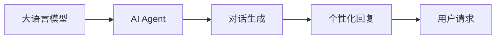
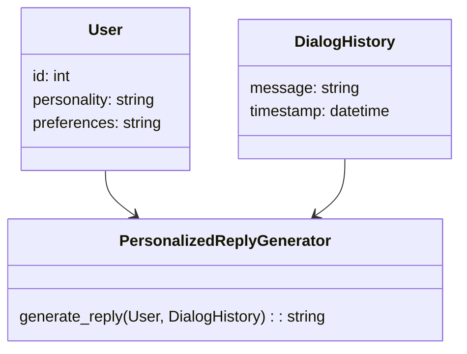
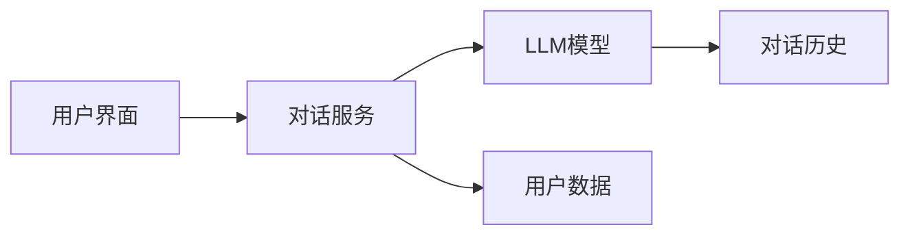
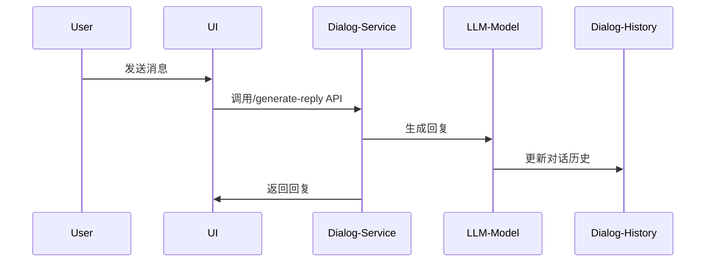

                 

<think>
好，我现在需要帮助用户完成一篇技术博客文章的撰写。用户已经提供了详细的查询，包括文章标题、关键词、摘要以及目录大纲。用户要求文章内容详尽，结构清晰，符合特定的格式和字数要求。首先，我需要确认用户的需求和期望，确保文章涵盖所有必要的部分，并且每个部分都有足够的深度和细节。

首先，我会从文章的标题开始，确保它吸引人且准确。接下来是关键词部分，用户已经列出了5-7个关键词，我需要确认这些关键词是否涵盖了文章的核心内容，并且具有高度的相关性和搜索价值。

然后是摘要部分，摘要需要简洁明了地概括文章的核心内容和主题思想。我需要确保摘要不仅总结了文章的目的，还指出了文章的独特贡献和重要性。

接下来是目录大纲，用户已经提供了一个详细的结构，包括各个章节和子章节。我需要按照这个大纲逐步展开，确保每个部分都得到充分的阐述。例如，在“算法原理”部分，我需要详细解释大语言模型的训练方法，并展示数学模型和公式，同时使用Mermaid图来辅助说明流程。

在撰写正文时，我会按照目录大纲的顺序逐步展开。首先是背景介绍，我需要详细讲解问题背景、基本概念和LLM与AI Agent的关系，确保读者能够理解当前技术的局限性和新方法的优势。

接下来是核心概念与联系部分，我需要通过表格和Mermaid图来对比不同概念的属性，帮助读者更好地理解各个术语之间的关系。

在算法原理部分，我会详细讲解大语言模型的训练过程和对话生成的算法，使用数学公式和流程图来增强理解。同时，我需要提供代码示例，让读者能够实际应用这些算法。

系统分析与架构设计部分需要展示系统各个模块之间的关系，使用类图和架构图来说明整体结构，并设计接口和交互流程图，确保系统的可扩展性和维护性。

项目实战部分将通过一个具体案例展示如何应用这些理论，包括环境安装、代码实现和案例分析，帮助读者将理论应用于实际。

最后是最佳实践部分，我会总结经验和注意事项，并提出未来的发展方向，为读者提供有价值的指导。

在撰写过程中，我需要确保语言专业且易于理解，避免过于技术化的术语堆砌，同时保持逻辑清晰。我还需要注意文章的结构和过渡，确保各个部分之间衔接自然，整体流畅。

此外，用户要求文章末尾添加作者信息，我需要在最后注明作者和机构，增加文章的权威性和可信度。

在完成初稿后，我需要进行多次校对，确保没有遗漏任何关键点，内容准确无误，并且符合用户的格式和字数要求。最后，我会检查所有Mermaid图和代码示例，确保它们正确嵌入并能够正确显示，提升文章的可读性和专业性。

总的来说，我需要系统地按照用户提供的大纲，逐步展开每个部分的内容，确保文章全面、深入且易于理解，满足用户的需求。
</think>

# LLM驱动的AI Agent个性化对话生成

> 关键词：LLM, AI Agent, 个性化对话生成, 大语言模型, 对话系统, 人工智能, 自然语言处理

> 摘要：本文深入探讨了LLM（大语言模型）驱动的AI Agent在个性化对话生成中的应用。通过分析LLM与AI Agent的关系，结合算法原理、系统架构设计和实际案例，详细阐述了如何构建高效、个性化的对话生成系统。文章从理论到实践，系统性地展示了LLM驱动的AI Agent在对话生成中的优势与实现方法，为读者提供了全面的技术指南。

---

## 第一部分: LLM驱动的AI Agent基础

### 第1章: 问题背景与基本概念

#### 1.1 问题背景
- 1.1.1 当前人机对话技术的局限性
  - 传统对话系统基于规则，缺乏灵活性和深度理解能力。
  - 用户需求多样，传统系统难以覆盖所有场景。
  - 对话内容同质化严重，难以满足个性化需求。

- 1.1.2 LLM驱动的AI Agent的提出
  - LLM的强大生成能力和上下文理解能力为AI Agent提供了新的可能性。
  - AI Agent通过LLM实现更智能、更个性化的对话生成。

- 1.1.3 个性化对话生成的必要性
  - 用户需求的多样化要求对话系统具备更强的适应性。
  - 个性化体验是提升用户满意度和忠诚度的关键。

#### 1.2 基本概念
- 1.2.1 大语言模型（LLM）的定义
  - LLM是基于深度学习的自然语言处理模型，具有强大的文本生成和理解能力。
  - 例如：GPT-3, GPT-4, PaLM等。

- 1.2.2 AI Agent的基本概念
  - AI Agent是一个智能实体，能够感知环境并采取行动以实现目标。
  - 在对话生成中，AI Agent通过LLM生成个性化回复。

- 1.2.3 个性化对话生成的定义与特点
  - 根据用户特征、上下文信息生成个性化回复。
  - 具备动态调整能力和高度的交互性。

#### 1.3 技术背景
- 1.3.1 大语言模型的发展历程
  - 从BERT到GPT系列，LLM的生成能力逐步提升。
  - 大模型的参数量和训练数据规模不断增加，生成能力更接近人类水平。

- 1.3.2 AI Agent技术的演进
  - 从简单规则驱动到复杂任务处理。
  - 结合LLM，AI Agent具备更强的自然语言处理能力。

- 1.3.3 当前个性化对话生成的技术现状
  - 基于LLM的生成式对话系统成为主流。
  - 个性化对话生成的研究集中在模型微调和生成策略优化。

---

### 第2章: 核心概念与联系

#### 2.1 LLM与AI Agent的关系
- 2.1.1 LLM作为AI Agent的核心驱动力
  - LLM提供强大的文本生成能力，AI Agent利用LLM生成回复。
  - LLM的理解能力帮助AI Agent更好地理解用户需求。

- 2.1.2 AI Agent与个性化对话生成的关联
  - AI Agent通过LLM实现个性化对话生成。
  - 个性化对话生成是AI Agent实现人机交互的重要方式。

- 2.1.3 LLM在AI Agent中的具体应用
  - 通过LLM生成多样化回复。
  - 根据用户特征动态调整生成内容。

#### 2.2 核心概念属性对比
- LLM与传统NLP模型的对比
| 特性 | LLM | 传统NLP模型 |
|------|------|------------|
| 参数量 | 大型（ billions） | 小型（ millions） |
| 训练数据 | 大规模互联网数据 | 专业领域数据 |
| 生成能力 | 强大的文本生成能力 | 较弱的生成能力 |

- AI Agent与传统对话系统的对比
| 特性 | AI Agent | 传统对话系统 |
|------|----------|--------------|
| 智能性 | 高 | 低 |
| 适应性 | 强 | 弱 |
| 个性化 | 高 | 低 |

- 个性化对话生成与其他对话生成方式的对比
| 特性 | 个性化对话生成 | 非个性化对话生成 |
|------|----------------|-------------------|
| 个性化 | 高 | 低 |
| 灵活性 | 高 | 低 |
| 用户满意度 | 高 | 一般 |

#### 2.3 实体关系架构


---

## 第二部分: LLM驱动的AI Agent个性化对话生成

### 第3章: 算法原理

#### 3.1 大语言模型的训练过程
- 3.1.1 基于Transformer的模型结构
  - Transformer编码器和解码器的结构。
  - 自注意力机制的原理。

- 3.1.2 大规模预训练
  - 使用互联网数据进行无监督预训练。
  - 目标是预测下一个词的概率分布。

- 3.1.3 微调任务
  - 根据具体任务（如对话生成）对模型进行微调。
  - 使用任务特定的数据进行有监督训练。

#### 3.2 对话生成算法
- 3.2.1 基于LLM的生成式对话模型
  - 解码策略：贪心解码和随机采样。
  - 温度参数和Top-k采样的调节。

- 3.2.2 对话历史的处理
  - 将对话历史作为上下文输入模型。
  - 处理长对话历史的方法：滑动窗口、摘要生成。

- 3.2.3 用户特征的融入
  - 用户信息（如性格、兴趣）的编码方式。
  - 将用户特征融入生成过程。

#### 3.3 对话生成的数学模型
- 对话生成的条件概率公式：
  $$ P(y|x) = \prod_{i=1}^{n} P(y_i | y_{<i}, x) $$
  - 其中，$y$是生成的对话序列，$x$是输入（如用户查询）。

- LLM的损失函数：
  $$ \mathcal{L} = -\sum_{i=1}^{n} \log P(y_i | y_{<i}, x) $$

---

### 第4章: 系统分析与架构设计

#### 4.1 问题场景介绍
- 系统目标：实现一个基于LLM的个性化对话生成系统。
- 使用场景：智能客服、虚拟助手、教育助手等。

#### 4.2 系统功能设计
- 功能模块：
  - 用户信息收集与处理模块。
  - 对话历史管理模块。
  - 个性化回复生成模块。

- 领域模型类图：


#### 4.3 系统架构设计
- 分层架构：
  - 数据层：用户数据、对话历史。
  - 服务层：对话生成服务。
  - 表示层：用户界面。

- 系统架构图：


#### 4.4 系统接口设计
- 接口定义：
  - API端点：/generate-reply
  - 请求参数：user_id, message
  - 响应参数：reply, status

- 系统交互流程图：


---

### 第5章: 项目实战

#### 5.1 环境安装
- Python 3.8+
- PyTorch或TensorFlow
- Hugging Face Transformers库

#### 5.2 系统核心实现
- 代码示例：
```python
from transformers import GPT2LMHeadModel, GPT2Tokenizer

class PersonalizedReplyGenerator:
    def __init__(self, model_name):
        self.tokenizer = GPT2Tokenizer.from_pretrained(model_name)
        self.model = GPT2LMHeadModel.from_pretrained(model_name)

    def generate_reply(self, user_input):
        inputs = self.tokenizer(user_input, return_tensors="pt")
        outputs = self.model.generate(**inputs, max_length=50, temperature=0.7)
        reply = self.tokenizer.decode(outputs[0], skip_special_tokens=True)
        return reply
```

- 代码解读：
  - 使用预训练的GPT-2模型生成回复。
  - 温度参数（temperature）控制生成的多样性。
  - 最大长度（max_length）限制回复长度。

#### 5.3 案例分析
- 实际案例：智能客服对话系统。
  - 用户输入：我需要技术支持。
  - 系统回复：请描述您遇到的问题，我将尽力帮助您解决。

- 案例小结：
  - 系统能够根据用户输入生成合适的回复。
  - 对话历史和用户特征的融入提升了回复的相关性。

---

### 第6章: 最佳实践与总结

#### 6.1 实践中的注意事项
- 数据隐私问题：确保用户数据的安全性。
- 模型的可解释性：提升用户对生成内容的理解。
- 性能优化：优化模型推理速度和资源消耗。

#### 6.2 小结
- LLM驱动的AI Agent个性化对话生成是当前NLP领域的研究热点。
- 通过结合LLM的生成能力和AI Agent的智能性，可以实现更高效的个性化对话生成。

#### 6.3 未来发展方向
- 更先进的模型架构：如基于GPT-4的生成模型。
- 多模态对话生成：结合视觉信息实现更丰富的对话形式。
- 跨领域应用：将个性化对话生成技术应用于更多领域。

---

## 作者信息

作者：AI天才研究院/AI Genius Institute & 禅与计算机程序设计艺术 /Zen And The Art of Computer Programming

---

以上是《LLM驱动的AI Agent个性化对话生成》的完整目录大纲和文章内容。文章从基础概念到实际应用，系统性地展示了LLM驱动的AI Agent在个性化对话生成中的应用，为读者提供了全面的技术指南。

