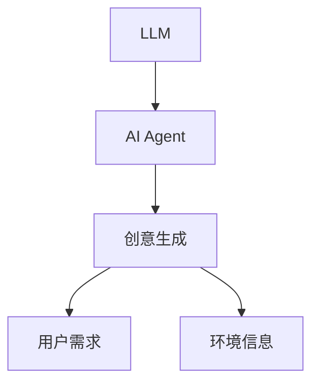
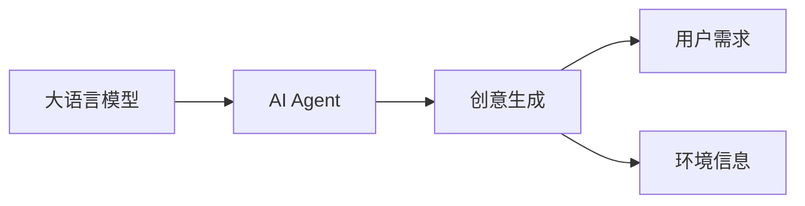
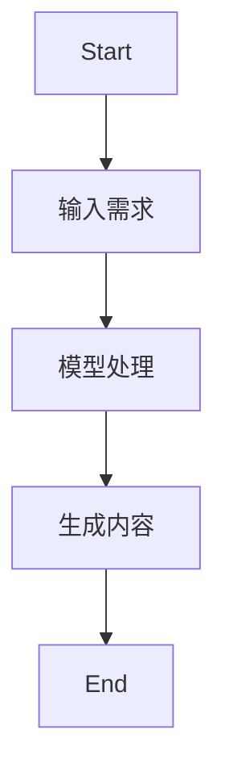
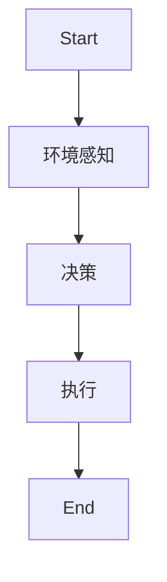
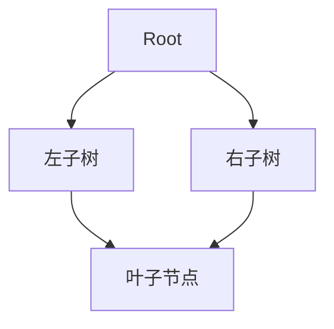
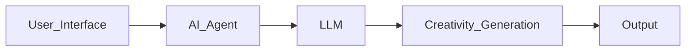
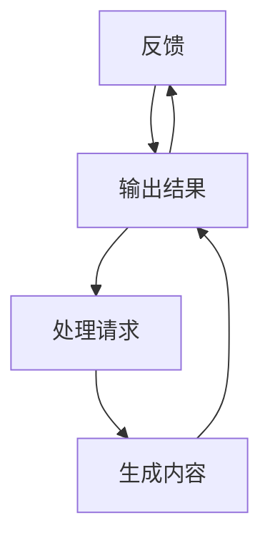

                 


# LLM驱动的AI Agent创意生成：突破思维局限

## 关键词：LLM, AI Agent, 创意生成, 思维局限, 人工智能, 大语言模型

## 摘要：
本文探讨了利用大语言模型（LLM）驱动AI代理（AI Agent）进行创意生成的方法，分析了传统创意生成的局限性，详细阐述了LLM和AI Agent的核心原理及其在创意生成中的应用。通过系统架构设计和项目实战，展示了如何突破思维局限，实现高效的创意生成。文章最后总结了最佳实践，为读者提供了深入的指导。

---

# 第1章: LLM驱动的AI Agent创意生成背景介绍

## 1.1 问题背景与描述

### 1.1.1 创意生成的挑战与局限性
创意生成在许多领域（如设计、写作、产品开发等）中至关重要，但传统方法依赖于固定的规则和模式，难以突破思维定式。人类和计算机的创意生成能力有限，尤其是在复杂和模糊的问题上。

### 1.1.2 LLM在创意生成中的优势
大语言模型（LLM）具有强大的语言理解和生成能力，能够处理大量数据并生成多样化的内容。LLM可以提供丰富的上下文信息，帮助生成更具创意和深度的内容。

### 1.1.3 AI Agent在创意生成中的角色定位
AI Agent作为LLM的载体，能够根据用户需求和环境信息，动态调整生成策略，提供更个性化的创意输出。

## 1.2 问题解决思路

### 1.2.1 LLM驱动AI Agent的核心思想
将LLM作为AI Agent的核心驱动力，利用其强大的语言生成能力，结合Agent的环境感知和任务执行能力，实现高效的创意生成。

### 1.2.2 创意生成的流程与方法
创意生成通常包括需求分析、内容生成、优化调整等阶段。通过LLM和AI Agent的结合，可以实现自动化、个性化的创意生成流程。

### 1.2.3 突破思维局限的关键技术
通过LLM的上下文理解和生成能力，结合AI Agent的动态调整和执行能力，突破传统创意生成的局限性。

## 1.3 边界与外延

### 1.3.1 LLM驱动AI Agent的适用范围
适用于需要语言生成和创造性思维的领域，如内容创作、产品设计、市场营销等。

### 1.3.2 创意生成的边界条件
创意生成需考虑用户需求、数据限制、模型能力等边界条件，确保生成结果的合理性和可行性。

### 1.3.3 相关技术的对比与区别
与传统创意生成方法相比，LLM驱动的AI Agent具有更高的效率和创造力，但需要依赖大量的数据和计算资源。

## 1.4 核心要素与概念结构

### 1.4.1 LLM的核心要素
- **训练数据**：多样化的数据集，包括文本、图像等。
- **模型结构**：深度神经网络，如Transformer架构。
- **生成机制**：基于概率的生成方法，如Beam Search。

### 1.4.2 AI Agent的组成与功能
- **感知模块**：环境信息采集和理解。
- **决策模块**：基于LLM生成创意内容。
- **执行模块**：输出生成的内容并进行调整。

### 1.4.3 创意生成的系统架构
- **输入层**：用户需求和环境信息。
- **处理层**：LLM生成创意内容。
- **输出层**：AI Agent调整并输出结果。

## 1.5 本章小结
本章介绍了创意生成的挑战与局限性，分析了LLM和AI Agent在创意生成中的作用，明确了其核心要素和系统架构。

---

# 第2章: LLM与AI Agent核心概念与联系

## 2.1 LLM的基本原理

### 2.1.1 大语言模型的定义与特点
LLM是一种基于深度学习的模型，能够理解和生成自然语言文本。其特点包括强大的上下文理解和生成能力。

### 2.1.2 LLM的训练机制
基于大量数据的预训练，采用自监督学习方法，如语言模型的预测任务。

### 2.1.3 LLM的输出机制
通过解码过程生成文本，通常采用贪心算法或随机采样方法。

## 2.2 AI Agent的基本原理

### 2.2.1 AI Agent的定义与分类
AI Agent是一种智能体，能够感知环境、执行任务并做出决策。分类包括简单反射式Agent、基于模型的规划Agent等。

### 2.2.2 AI Agent的核心功能
- **感知**：获取环境信息。
- **决策**：基于信息做出选择。
- **执行**：执行任务并输出结果。

### 2.2.3 AI Agent的交互方式
通过自然语言处理技术实现人机交互，提供实时反馈和调整。

## 2.3 LLM与AI Agent的关系

### 2.3.1 LLM作为AI Agent的核心驱动力
LLM为AI Agent提供强大的语言生成能力，使其能够生成多样化的内容。

### 2.3.2 AI Agent作为LLM的应用载体
AI Agent为LLM提供应用场景，使其能够在复杂环境中执行任务。

### 2.3.3 两者结合的创新点
通过结合LLM的语言生成能力和AI Agent的环境感知能力，实现更高效、更具创造性的任务执行。

## 2.4 核心概念对比

### 2.4.1 LLM与传统NLP模型的对比
| 特性       | LLM                         | 传统NLP模型                     |
|------------|------------------------------|----------------------------------|
| 模型复杂度 | 高                           | 较低                            |
| 上下文理解 | 强大                         | 较弱                            |
| 应用场景   | 多样化                       | 有限                            |

### 2.4.2 AI Agent与传统自动化系统的对比
| 特性       | AI Agent                     | 传统自动化系统                  |
|------------|------------------------------|----------------------------------|
| 智能性     | 高                           | 低                             |
| 可定制性   | 强大                         | 较弱                            |
| 适应性     | 高                           | 较低                            |

## 2.5 实体关系与系统架构

### 2.5.1 实体关系图


### 2.5.2 系统架构图


## 2.6 本章小结
本章详细解释了LLM和AI Agent的基本原理，分析了它们在创意生成中的作用，并通过对比和图表展示了两者的关系和系统架构。

---

# 第3章: LLM驱动AI Agent创意生成的算法原理

## 3.1 算法流程与实现

### 3.1.1 LLM的生成算法


### 3.1.2 AI Agent的决策算法


## 3.2 核心算法实现

### 3.2.1 LLM的数学模型
```latex
$$P(\text{output} | \text{input}) = \prod_{i=1}^{n} P(w_i | w_{i-1}, \ldots, w_1)$$
```

### 3.2.2 AI Agent的决策树


## 3.3 代码实现与应用

### 3.3.1 LLM的Python实现
```python
def generate_content(model, input_text):
    output = model.generate(input_text)
    return output
```

### 3.3.2 AI Agent的交互代码
```python
class AI_Agent:
    def __init__(self, model):
        self.model = model
    
    def perceive_environment(self, input):
        # 处理输入
        pass
    
    def make_decision(self, input):
        # 生成决策
        return self.model.generate(input)
    
    def execute_action(self, decision):
        # 输出结果
        return decision
```

## 3.4 算法原理总结
本章通过详细讲解LLM和AI Agent的算法流程，展示了它们在创意生成中的具体实现和数学模型。

---

# 第4章: 系统分析与架构设计方案

## 4.1 项目场景介绍

### 4.1.1 项目目标
实现一个基于LLM的AI Agent系统，用于创意生成。

### 4.1.2 项目需求
- 实现自然语言交互
- 提供多样化的创意生成
- 支持实时反馈和调整

## 4.2 系统功能设计

### 4.2.1 领域模型类图
```mermaid
classDiagram
    class LLM:
        generate(text: str) -> str
    class AI_Agent:
        perceive() -> info
        decide(info) -> decision
        execute(decision) -> result
    class User_Interface:
        input_request() -> text
        output_result(result)
```

### 4.2.2 系统架构图


## 4.3 接口与交互设计

### 4.3.1 接口设计
- 用户输入接口：`input_request()`
- 生成结果接口：`output_result()`

### 4.3.2 交互流程图


## 4.4 系统架构总结
本章通过系统架构设计，展示了LLM驱动AI Agent创意生成的整体结构和各部分功能。

---

# 第5章: 项目实战与实现

## 5.1 环境安装与配置

### 5.1.1 安装Python与相关库
```bash
pip install transformers
pip install torch
```

### 5.1.2 安装LLM模型
```bash
pip install transformers
pip install torch
```

## 5.2 系统核心代码实现

### 5.2.1 LLM模型实现
```python
from transformers import GPT2LMHeadModel, GPT2Tokenizer

model = GPT2LMHeadModel.from_pretrained('gpt2')
tokenizer = GPT2Tokenizer.from_pretrained('gpt2')
```

### 5.2.2 AI Agent实现
```python
class AI_Agent:
    def __init__(self, model, tokenizer):
        self.model = model
        self.tokenizer = tokenizer
    
    def perceive(self, input_text):
        # 处理输入
        inputs = self.tokenizer.encode(input_text, return_tensors='pt')
        return inputs
    
    def decide(self, inputs):
        outputs = self.model.generate(inputs, max_length=50, temperature=1.0)
        return outputs
    
    def execute(self, outputs):
        return self.tokenizer.decode(outputs[0], skip_special_tokens=True)
```

## 5.3 代码应用与解读

### 5.3.1 LLM模型的应用
```python
input_text = "写一篇关于人工智能的文章"
inputs = tokenizer.encode(input_text, return_tensors='pt')
outputs = model.generate(inputs, max_length=500)
result = tokenizer.decode(outputs[0], skip_special_tokens=True)
print(result)
```

### 5.3.2 AI Agent的交互流程
```python
agent = AI_Agent(model, tokenizer)
user_input = input("请输入创意需求：")
inputs = agent.perceive(user_input)
outputs = agent.decide(inputs)
result = agent.execute(outputs)
print("生成结果：", result)
```

## 5.4 项目总结与分析
本章通过具体实现，展示了如何利用LLM和AI Agent进行创意生成，分析了代码的功能和应用场景。

---

# 第6章: 总结与展望

## 6.1 本章总结
本文详细探讨了LLM驱动AI Agent创意生成的方法，分析了其核心原理和系统架构，展示了具体的实现和应用。

## 6.2 未来展望
未来，LLM和AI Agent在创意生成中的应用将更加广泛，模型的性能和交互方式将不断提升，为用户带来更高效、更个性化的创意体验。

---

# 作者：AI天才研究院 & 禅与计算机程序设计艺术

---

以上是《LLM驱动的AI Agent创意生成：突破思维局限》的技术博客文章的详细目录大纲和部分章节内容。

