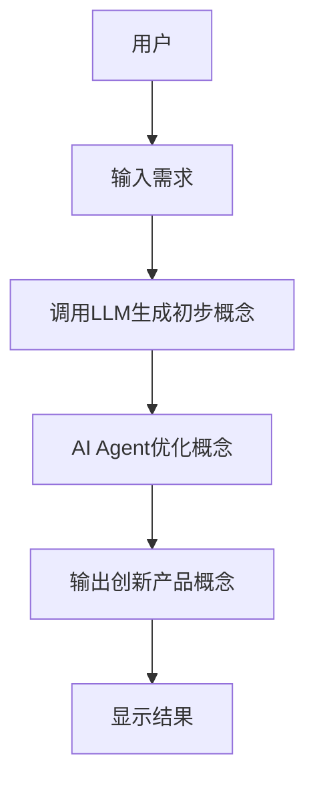
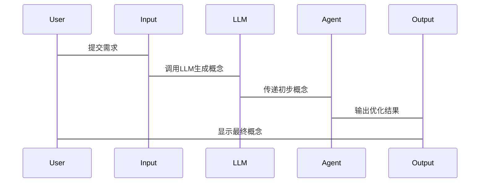

                 


# LLM驱动的AI Agent创新产品概念生成器

## 关键词：LLM, AI Agent, 创新产品概念, 生成式AI, 人工智能, 技术博客

## 摘要：本文探讨了LLM驱动的AI Agent在创新产品概念生成中的应用，详细分析了其核心原理、算法流程、系统架构及实际案例，为开发者提供了全面的技术指导。

---

# 第一部分: LLM驱动的AI Agent背景介绍

## 第1章: 问题背景与概念背景

### 1.1 当前AI技术的发展现状
近年来，人工智能（AI）技术发展迅猛，尤其是在大语言模型（LLM）领域取得了显著进展。LLM不仅能够处理复杂文本，还能通过与AI代理（AI Agent）结合，实现更高级的智能任务。

### 1.2 LLM在AI Agent中的应用背景
AI Agent作为能够自主决策和执行任务的智能体，结合LLM的自然语言处理能力，能够更高效地生成创新产品概念。LLM为AI Agent提供了强大的理解与生成能力，使其能够处理多样化的用户需求。

### 1.3 创新产品概念生成器的需求与挑战
创新产品概念生成器旨在通过LLM和AI Agent的结合，帮助用户快速生成创新的产品想法。然而，这一过程中面临数据多样性、模型调优和实际应用落地等多重挑战。

---

# 第二部分: 核心概念与联系

## 第2章: LLM与AI Agent的核心原理

### 2.1 LLM的基本原理
LLM基于大规模神经网络，通过深度学习训练，能够理解上下文并生成连贯文本。其核心包括编码器-解码器结构和自注意力机制，使得模型能够捕捉文本中的长距离依赖关系。

### 2.2 AI Agent的定义与工作原理
AI Agent是具备感知环境、自主决策和执行任务的智能体。它能够与用户交互，理解需求，并通过调用其他服务或系统完成任务。AI Agent的关键在于其任务规划和执行能力。

### 2.3 LLM驱动AI Agent的实现机制
通过将LLM作为AI Agent的“大脑”，AI Agent能够理解用户需求并生成创新的产品概念。LLM负责文本生成和理解，而AI Agent负责任务规划和执行。

---

# 第三部分: 算法原理讲解

## 第3章: LLM驱动AI Agent的算法原理

### 3.1 基于LLM的生成式AI工作流程
生成式AI的工作流程包括输入处理、生成初稿、优化调整和输出结果。LLM通过自回归方式逐个生成字符，结合beam search或随机采样技术优化生成质量。

### 3.2 AI Agent的多轮对话机制
AI Agent通过多轮对话理解用户需求，每次交互逐步细化产品概念。对话过程中，AI Agent会根据用户反馈调整生成内容，确保最终结果符合用户期望。

### 3.3 创新产品概念生成的算法逻辑
创新产品概念生成器通过LLM生成初步概念，AI Agent优化并细化这些概念。最终，生成器输出用户认可的创新产品概念。

---

# 第四部分: 系统分析与架构设计

## 第4章: 系统架构设计

### 4.1 系统功能设计
创新产品概念生成器系统主要包括用户输入模块、LLM调用模块、AI Agent优化模块和结果输出模块。用户输入需求后，系统通过LLM生成初步概念，并通过AI Agent优化，最终输出结果。

### 4.2 系统架构图


### 4.3 系统接口设计
系统主要接口包括用户输入接口、LLM API调用接口和结果输出接口。各模块通过标准API进行通信，确保系统高效运行。

### 4.4 系统交互流程图


---

# 第五部分: 项目实战

## 第5章: 项目实战与实现

### 5.1 环境安装
为了运行创新产品概念生成器，需要安装以下环境：
- Python 3.8+
- LLM模型（如GPT-3.5-turbo）
- 相关依赖库（如openai、python-dotenv）

### 5.2 核心代码实现
以下是生成器的核心代码示例：
```python
import openai
from dotenv import load_dotenv

load_dotenv()

def generate_concept(user_input):
    # 调用LLM生成初步概念
    response = openai.ChatCompletion.create(
        model="gpt-3.5-turbo",
        messages=[{"role": "user", "content": user_input}]
    )
    initial_concept = response.choices[0].message.content

    # AI Agent优化概念
    optimized_concept = optimize_concept(initial_concept)

    return optimized_concept

def optimize_concept(concept):
    # 示例优化逻辑
    return f"优化后的概念：{concept}"
```

### 5.3 代码应用解读
上述代码展示了如何通过调用LLM生成初步概念，并通过AI Agent进行优化。用户输入需求后，系统首先生成初步概念，然后AI Agent对其进行优化，最终输出结果。

### 5.4 案例分析
以智能家居产品为例，用户输入“设计一款智能灯泡”。系统通过LLM生成初步概念，如“一款能够通过手机APP控制的智能灯泡”。AI Agent优化后，可能生成更具体的概念，如“一款支持语音控制、亮度调节和定时开关的智能灯泡”。

---

# 第六部分: 最佳实践与总结

## 第6章: 最佳实践与小结

### 6.1 最佳实践
- 确保LLM模型的性能和稳定性，选择合适的模型参数
- 定期优化AI Agent的对话逻辑，提高生成效率
- 通过用户反馈不断改进系统，提升生成结果的质量

### 6.2 小结
LLM驱动的AI Agent创新产品概念生成器通过结合生成式AI和智能代理技术，为用户提供了高效的概念生成工具。未来，随着技术的发展，生成器将更加智能化和个性化，为创新产品开发提供更多可能性。

---

# 作者：AI天才研究院/AI Genius Institute & 禅与计算机程序设计艺术 /Zen And The Art of Computer Programming

