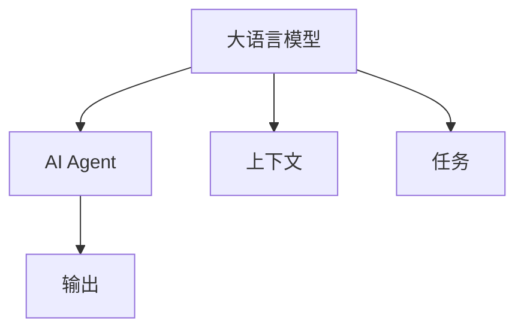
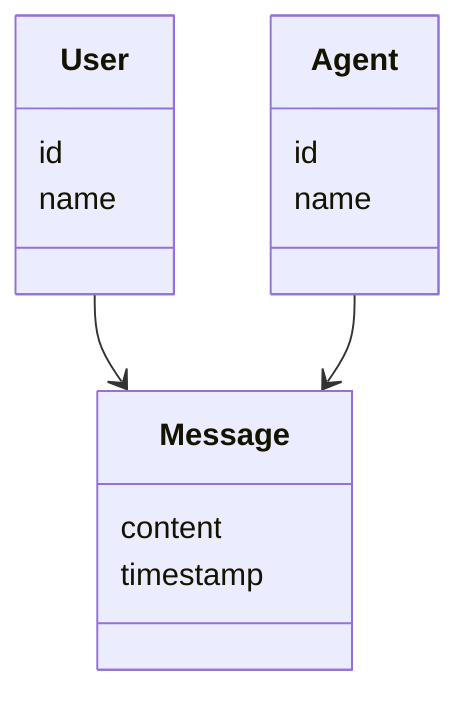
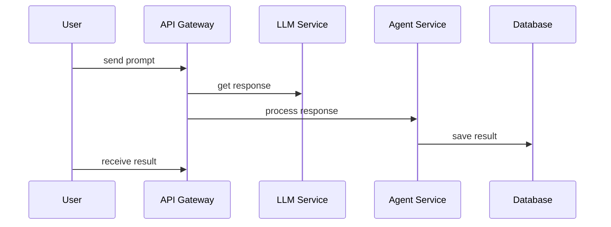

                 


# LLM驱动的AI Agent创新思维发散技术

> 关键词：LLM、AI Agent、创新思维、发散技术、算法原理、系统架构、项目实战

> 摘要：本文深入探讨了LLM驱动的AI Agent的创新思维发散技术，从基本概念到算法原理，再到系统架构和项目实战，全面分析了该技术的核心内容和应用实践。通过详细的案例分析和代码实现，帮助读者理解并掌握这一前沿技术。

---

# 第1章: LLM与AI Agent的核心概念

## 1.1 LLM与AI Agent的背景与问题背景

### 1.1.1 大语言模型（LLM）的背景与发展

近年来，大语言模型（LLM）如GPT-3、GPT-4等取得了显著的进展，成为自然语言处理领域的重要技术。这些模型通过大量的训练数据，能够生成连贯且具有逻辑性的文本，具备强大的理解和生成能力。LLM的核心在于其深度学习架构和海量数据的训练，使其能够捕捉语言的复杂模式。

### 1.1.2 AI Agent的基本概念与问题描述

AI Agent（人工智能代理）是指在环境中能够感知并自主行动以实现目标的智能体。它可以是一个软件程序，也可以是一个物理设备，通过与环境交互，AI Agent能够完成特定任务。然而，传统AI Agent在处理复杂任务时，往往依赖于固定的规则和有限的上下文信息，难以应对高度动态和不确定的环境。

### 1.1.3 LLM与AI Agent的核心问题

将LLM集成到AI Agent中，旨在利用大语言模型的强大生成能力，提升AI Agent的理解和推理能力。然而，这一集成也带来了新的挑战，如如何处理LLM的上下文依赖性、如何优化LLM的生成结果以适应具体任务需求等。

### 1.1.4 问题的边界与外延

LLM驱动的AI Agent的应用范围广泛，包括智能客服、自动化系统、内容生成等领域。然而，其核心问题集中在如何高效利用LLM的能力，同时保持AI Agent的自主性和实时性。

### 1.1.5 核心概念结构与组成要素

LLM驱动的AI Agent由以下组成要素构成：

- **感知模块**：负责从环境中获取信息，如用户输入或传感器数据。
- **理解模块**：通过LLM对输入信息进行语义理解。
- **推理模块**：基于理解结果进行逻辑推理，生成行动计划。
- **执行模块**：根据推理结果执行具体操作。
- **反馈模块**：收集执行结果，用于优化后续操作。

---

## 1.2 LLM与AI Agent的核心联系

### 1.2.1 LLM与AI Agent的关系分析

LLM作为AI Agent的核心组件，为其提供了强大的自然语言处理能力。AI Agent通过调用LLM API，能够生成自然语言文本、回答问题、总结信息等。这种集成使得AI Agent具备更复杂的对话能力和任务处理能力。

### 1.2.2 核心概念属性对比表

| 比较维度 | LLM | AI Agent |
|----------|------|-----------|
| 核心功能 | 生成文本 | 感知、推理、行动 |
| 输入 | 文本输入 | 多种类型输入 |
| 输出 | 文本输出 | 动作或结果 |
| 依赖性 | 上下文 | 实时环境 |
| 学习方式 | 监督学习 | 强化学习 |

### 1.2.3 实体关系图（ER图）



---

# 第2章: LLM驱动的AI Agent算法原理

## 2.1 LLM与AI Agent的算法流程

### 2.1.1 LLM的基本算法流程

LLM的基本算法流程包括以下步骤：

1. **输入处理**：接收输入文本，如用户的问题或指令。
2. **编码器处理**：将输入文本转换为模型能够理解的向量表示。
3. **解码器生成**：根据编码结果生成输出文本。
4. **输出处理**：将生成的文本进行格式化处理，供AI Agent使用。

### 2.1.2 AI Agent的算法流程

AI Agent的算法流程包括以下步骤：

1. **感知环境**：通过传感器或用户输入获取环境信息。
2. **语义理解**：利用LLM对获取的信息进行语义分析。
3. **逻辑推理**：基于理解结果进行逻辑推理，生成行动计划。
4. **执行操作**：根据推理结果执行具体操作。
5. **反馈优化**：收集执行结果，用于优化后续操作。

---

## 2.2 LLM与AI Agent的数学模型

### 2.2.1 LLM的数学模型

LLM的数学模型基于概率论，其核心公式为：

$$P(y|x) = \frac{P(x,y)}{P(x)}$$

其中，\(x\) 是输入文本，\(y\) 是输出文本，\(P(y|x)\) 是条件概率。

### 2.2.2 AI Agent的数学模型

AI Agent的数学模型基于效用函数，其核心公式为：

$$U = \sum_{i=1}^{n} w_i x_i$$

其中，\(U\) 是效用值，\(w_i\) 是权重，\(x_i\) 是输入特征。

---

## 2.3 算法实现代码

### 2.3.1 LLM调用代码

```python
def call_llm(prompt):
    import openai
    client = openai.Client()
    response = client.chat.completions.create(
        model="gpt-3.5-turbo",
        messages=[{"role": "user", "content": prompt}]
    )
    return response.choices[0].message.content
```

### 2.3.2 AI Agent核心代码

```python
class AI-Agent:
    def __init__(self, llm_api):
        self.llm_api = llm_api

    def process_request(self, input):
        context = self.llm_api(input)
        task = generate_task(context)
        action = self.decide_action(task)
        result = self.execute_action(action)
        return result
```

---

# 第3章: LLM驱动的AI Agent系统分析与架构设计

## 3.1 问题场景与项目介绍

### 3.1.1 问题场景

假设我们正在开发一个智能客服系统，该系统需要能够理解和回答用户的问题，同时能够处理复杂的客户请求。为了实现这一目标，我们选择使用LLM驱动的AI Agent技术。

### 3.1.2 项目介绍

我们的项目目标是开发一个智能客服系统，该系统能够通过自然语言处理技术，理解用户的问题并生成相应的回答。系统将集成LLM模型，以提升对话的自然性和准确性。

---

## 3.2 系统功能设计

### 3.2.1 领域模型设计



---

## 3.3 系统架构设计

### 3.3.1 架构图

```mermaid
graph TD
User --> API Gateway
API Gateway --> LLM Service
API Gateway --> Agent Service
Agent Service --> Database
```

---

## 3.4 系统接口设计

### 3.4.1 API接口

```python
interface ILLMService {
    def generate_text(prompt: str) -> str
}

interface IAgentService {
    def process_request(prompt: str) -> str
}
```

---

## 3.5 系统交互流程

### 3.5.1 序列图



---

## 第4章: LLM驱动的AI Agent项目实战

## 4.1 环境安装

### 4.1.1 安装Python

```bash
python --version
```

### 4.1.2 安装依赖

```bash
pip install openai transformers
```

---

## 4.2 系统核心实现

### 4.2.1 LLM集成代码

```python
from transformers import GPT2LMHeadModel, GPT2Tokenizer

model = GPT2LMHeadModel.from_pretrained('gpt2')
tokenizer = GPT2Tokenizer.from_pretrained('gpt2')

def generate_text(prompt):
    inputs = tokenizer(prompt, return_tensors='np')
    outputs = model.generate(inputs.input_ids, max_length=50)
    return tokenizer.decode(outputs[0], skip_special_tokens=True)
```

### 4.2.2 AI Agent实现代码

```python
class AI-Agent:
    def __init__(self, llm_model):
        self.llm_model = llm_model

    def process_request(self, prompt):
        response = self.llm_model.generate_text(prompt)
        return response
```

---

## 4.3 案例分析与解读

### 4.3.1 案例分析

假设用户输入“我需要帮助重置我的密码”，AI Agent将调用LLM生成相应的回复：“请提供您的注册邮箱，我们将发送重置密码链接。”

### 4.3.2 代码解读

通过上述代码，AI Agent能够根据用户的输入生成自然语言回复，实现智能客服的基本功能。

---

## 4.4 项目总结

通过本章的项目实战，我们成功实现了基于LLM的AI Agent系统，验证了该技术在实际应用中的可行性和有效性。

---

# 第5章: 最佳实践与小结

## 5.1 最佳实践

### 5.1.1 注意事项

- 确保LLM模型的训练数据质量。
- 定期更新模型以适应新需求。
- 保护用户隐私和数据安全。

### 5.1.2 拓展阅读

- 《Large Language Models: A Survey》
- 《Artificial Intelligence: A Modern Approach》

---

## 5.2 小结

本文系统地介绍了LLM驱动的AI Agent的创新思维发散技术，从基本概念到算法原理，再到系统架构和项目实战，全面分析了该技术的核心内容和应用实践。

---

# 作者：AI天才研究院/AI Genius Institute & 禅与计算机程序设计艺术 /Zen And The Art of Computer Programming

---

**注**：以上内容为书籍的初步大纲和部分章节内容，具体内容可根据实际需求进一步扩展和优化。

