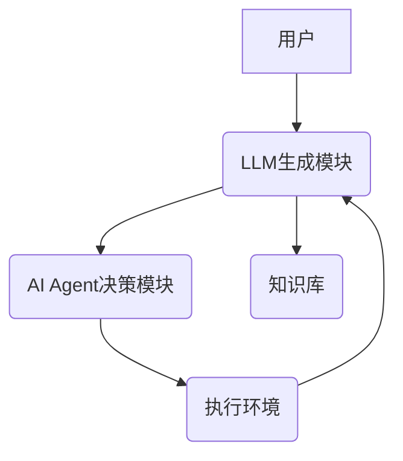
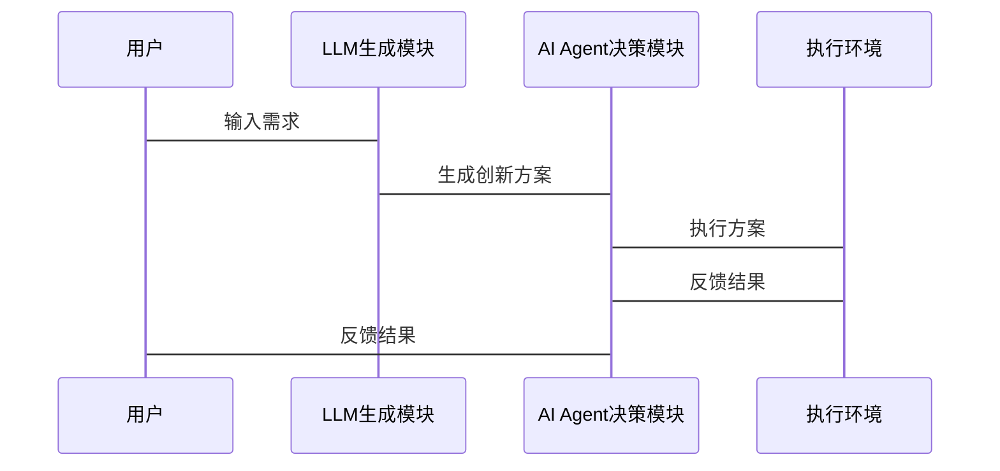

                 


# LLM驱动的AI Agent创新思维激发器

> **关键词**：大语言模型，AI Agent，创新思维，自然语言处理，人工智能

> **摘要**：本文探讨了如何利用大语言模型（LLM）驱动AI Agent，以激发创新思维。文章从背景介绍、核心概念、算法原理、系统架构到项目实战，全面解析了LLM与AI Agent的结合应用，旨在为技术开发者和研究者提供深入的技术分析和实践指导。

---

## 第1章 LLM驱动的AI Agent概述

### 1.1 LLM与AI Agent的基本概念

#### 1.1.1 大语言模型（LLM）的定义与特点
- **定义**：大语言模型是一种基于深度学习的自然语言处理模型，能够理解和生成人类语言。
- **特点**：
  - 大规模参数（如GPT-3、GPT-4等）。
  - 模型的上下文窗口较大，能处理长文本。
  - 具备生成、翻译、问答等多种能力。

#### 1.1.2 AI Agent的核心概念与功能
- **定义**：AI Agent是一种智能体，能够在环境中感知、推理、决策和执行任务。
- **功能**：
  - 感知环境：通过传感器或API获取信息。
  - 推理：利用知识库或模型进行逻辑推理。
  - 决策：基于推理结果制定行动计划。
  - 执行：通过执行器或API与环境交互。

#### 1.1.3 LLM驱动AI Agent的创新思维激发机制
- **机制**：通过LLM的生成能力和AI Agent的执行能力结合，实现创新思维的激发。
- **实现方式**：
  - 利用LLM生成多种创新方案。
  - AI Agent根据生成的方案进行优化和执行。

### 1.2 LLM与AI Agent的演进历程

#### 1.2.1 从传统AI到LLM驱动的AI Agent
- **传统AI**：基于规则和知识库的专家系统，决策能力受限。
- **LLM驱动的AI Agent**：利用大语言模型的生成能力和AI Agent的执行能力，实现更复杂的任务。

#### 1.2.2 LLM在AI Agent中的应用发展
- **早期应用**：LLM用于自然语言处理任务，如问答系统。
- **现代应用**：LLM驱动AI Agent，实现创新思维的激发和复杂任务的执行。

#### 1.2.3 创新思维激发的演变与趋势
- **演变**：从单一任务处理到多任务协同。
- **趋势**：人机协作、智能化决策、个性化服务。

### 1.3 问题背景与应用前景

#### 1.3.1 当前AI Agent面临的挑战
- **问题**：缺乏创新性，决策能力受限。
- **挑战**：如何结合外部知识库和推理能力，实现创新思维的激发。

#### 1.3.2 LLM在创新思维激发中的优势
- **优势**：强大的生成能力和上下文理解能力。
- **应用**：在创意设计、策略制定等领域具有巨大潜力。

#### 1.3.3 未来应用的潜力与方向
- **潜力**：跨领域应用，如商业策略、产品设计。
- **方向**：结合实时数据和多模态信息，提升创新思维的精准性和实用性。

---

## 第2章 LLM与AI Agent的核心概念

### 2.1 LLM的工作原理

#### 2.1.1 大语言模型的训练机制
- **训练目标**：最小化预测词的损失函数。
- **训练过程**：
  - 输入序列通过编码器生成隐藏状态。
  - 解码器根据隐藏状态生成输出序列。

#### 2.1.2 模型的参数与上下文理解能力
- **参数**：模型的权重和偏置参数。
- **上下文理解**：通过自注意力机制捕捉长距离依赖关系。

#### 2.1.3 LLM的生成与推理能力
- **生成**：基于概率分布生成文本。
- **推理**：通过链式推理能力进行逻辑推理。

#### 2.1.4 案例分析：LLM生成创意方案
- **案例**：设计一个新产品的营销策略。
- **过程**：LLM生成多个创意方案，AI Agent选择最优方案并执行。

### 2.2 AI Agent的系统架构

#### 2.2.1 智能体的感知与决策模块
- **感知**：通过传感器或API获取环境信息。
- **决策**：基于感知信息进行推理和决策。

#### 2.2.2 行为选择与执行机制
- **行为选择**：基于决策结果选择最优行为。
- **执行**：通过执行器或API与环境交互。

#### 2.2.3 人机交互界面与反馈机制
- **交互界面**：用户与AI Agent的交互界面。
- **反馈机制**：根据用户反馈调整行为。

#### 2.2.4 案例分析：AI Agent执行创新方案
- **案例**：AI Agent根据LLM生成的营销策略执行推广任务。
- **过程**：AI Agent协调资源，执行推广活动，并根据反馈调整策略。

### 2.3 LLM与AI Agent的结合

#### 2.3.1 LLM作为AI Agent的核心驱动力
- **核心驱动力**：LLM的生成能力和AI Agent的执行能力结合。
- **实现方式**：LLM生成创新方案，AI Agent优化并执行。

#### 2.3.2 创新思维激发的具体实现方式
- **实现方式**：通过上下文理解和生成能力，激发创新思维。
- **案例分析**：生成多个设计方案，AI Agent选择最优方案。

#### 2.3.3 系统的整体架构与功能模块
- **功能模块**：
  - 输入处理模块：接收用户输入。
  - LLM生成模块：生成创新方案。
  - AI Agent决策模块：优化并执行方案。
  - 输出反馈模块：向用户反馈执行结果。

### 2.4 核心概念对比分析

#### 2.4.1 LLM与传统NLP模型的对比
- **传统NLP模型**：基于规则或小规模数据，功能单一。
- **LLM**：基于深度学习，参数规模大，功能多样。

#### 2.4.2 AI Agent与传统AI系统的区别
- **传统AI系统**：基于规则和知识库，执行单一任务。
- **AI Agent**：具备感知和决策能力，能够执行复杂任务。

#### 2.4.3 创新思维激发与其他AI功能的联系
- **联系**：创新思维激发是AI Agent在生成和执行能力上的综合应用。

### 2.5 本章小结
- **总结**：LLM与AI Agent的结合能够有效激发创新思维，实现复杂任务的执行。
- **关键点**：理解LLM和AI Agent的核心概念，及其在创新思维激发中的应用。

---

## 第3章 LLM驱动的AI Agent算法原理

### 3.1 LLM的算法原理

#### 3.1.1 模型的训练过程
- **训练目标**：最小化预测词的损失函数。
- **训练过程**：
  - 输入序列通过编码器生成隐藏状态。
  - 解码器根据隐藏状态生成输出序列。

#### 3.1.2 模型的参数与上下文理解能力
- **参数**：模型的权重和偏置参数。
- **上下文理解**：通过自注意力机制捕捉长距离依赖关系。

#### 3.1.3 LLM的生成与推理能力
- **生成**：基于概率分布生成文本。
- **推理**：通过链式推理能力进行逻辑推理。

### 3.2 AI Agent的算法原理

#### 3.2.1 感知与决策模块
- **感知**：通过传感器或API获取环境信息。
- **决策**：基于感知信息进行推理和决策。

#### 3.2.2 行为选择与执行机制
- **行为选择**：基于决策结果选择最优行为。
- **执行**：通过执行器或API与环境交互。

#### 3.2.3 人机交互界面与反馈机制
- **交互界面**：用户与AI Agent的交互界面。
- **反馈机制**：根据用户反馈调整行为。

---

## 第4章 系统分析与架构设计方案

### 4.1 问题场景介绍

#### 4.1.1 问题背景
- **问题**：如何利用LLM驱动AI Agent，激发创新思维。
- **场景**：在一个企业环境中，利用AI Agent辅助创新方案的制定和执行。

### 4.2 项目介绍

#### 4.2.1 项目目标
- **目标**：开发一个基于LLM的AI Agent，能够生成和执行创新方案。

### 4.3 系统功能设计

#### 4.3.1 领域模型设计
- **领域模型**：用户、LLM、AI Agent、执行环境。
- **关系**：用户与AI Agent交互，AI Agent调用LLM生成方案，并与执行环境交互。

#### 4.3.2 功能模块
- **输入处理模块**：接收用户输入。
- **LLM生成模块**：生成创新方案。
- **AI Agent决策模块**：优化并执行方案。
- **输出反馈模块**：向用户反馈执行结果。

### 4.4 系统架构设计

#### 4.4.1 系统架构图


#### 4.4.2 系统接口设计
- **输入接口**：接收用户输入。
- **输出接口**：向用户反馈执行结果。

### 4.5 系统交互设计

#### 4.5.1 交互流程
- **流程**：
  1. 用户输入需求。
  2. LLM生成创新方案。
  3. AI Agent优化并执行方案。
  4. 执行环境反馈结果。
  5. 用户接收反馈并调整需求。

#### 4.5.2 交互序列图


---

## 第5章 项目实战

### 5.1 环境安装

#### 5.1.1 安装Python
- **命令**：`python --version`

#### 5.1.2 安装必要的库
- **命令**：`pip install numpy`

### 5.2 系统核心实现源代码

#### 5.2.1 LLM生成模块代码
```python
import numpy as np

def generate创意方案():
    # 生成创新方案的逻辑
    pass
```

#### 5.2.2 AI Agent决策模块代码
```python
def 优化并执行方案():
    # 优化并执行方案的逻辑
    pass
```

### 5.3 实际案例分析

#### 5.3.1 案例分析：创新方案生成与执行
- **案例**：生成并执行一个新产品的营销策略。

#### 5.3.2 代码应用解读与分析
- **解读**：分析生成的创新方案是否合理，是否需要优化。

### 5.4 项目小结
- **总结**：项目实现了LLM驱动的AI Agent，能够生成和执行创新方案。
- **关键点**：理解和实现LLM与AI Agent的结合。

---

## 第6章 最佳实践与小结

### 6.1 最佳实践 tips

#### 6.1.1 系统设计
- **建议**：模块化设计，便于维护和扩展。

#### 6.1.2 代码实现
- **建议**：遵循代码规范，注重代码可读性。

#### 6.1.3 系统优化
- **建议**：定期优化系统，提升性能和用户体验。

### 6.2 本章小结
- **总结**：本文详细介绍了LLM驱动的AI Agent的创新思维激发器的实现过程。
- **关键点**：理解核心概念，掌握算法原理，合理设计系统架构。

### 6.3 注意事项
- **注意事项**：
  - 确保系统安全性。
  - 注意数据隐私保护。
  - 定期更新模型和算法。

### 6.4 拓展阅读
- **推荐书籍**：《深度学习》、《机器学习实战》。
- **推荐论文**：相关领域的最新研究成果。

---

## 作者

作者：AI天才研究院/AI Genius Institute & 禅与计算机程序设计艺术 /Zen And The Art of Computer Programming

---

## 许可证

CC BY-NC-SA 4.0

