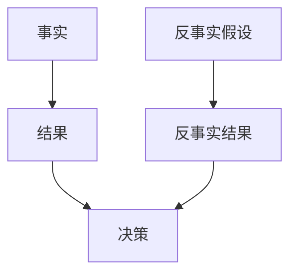
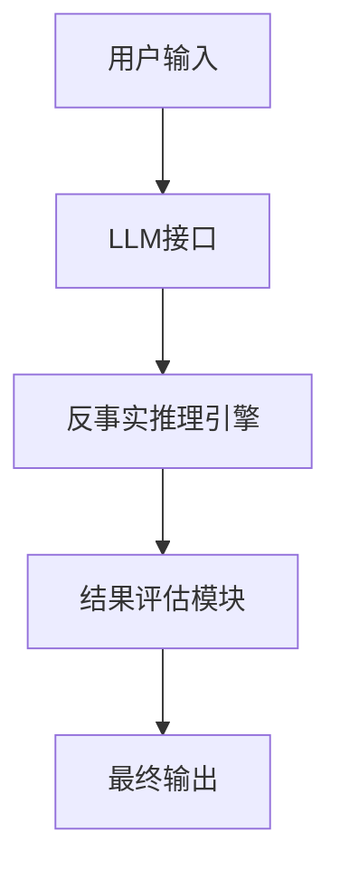
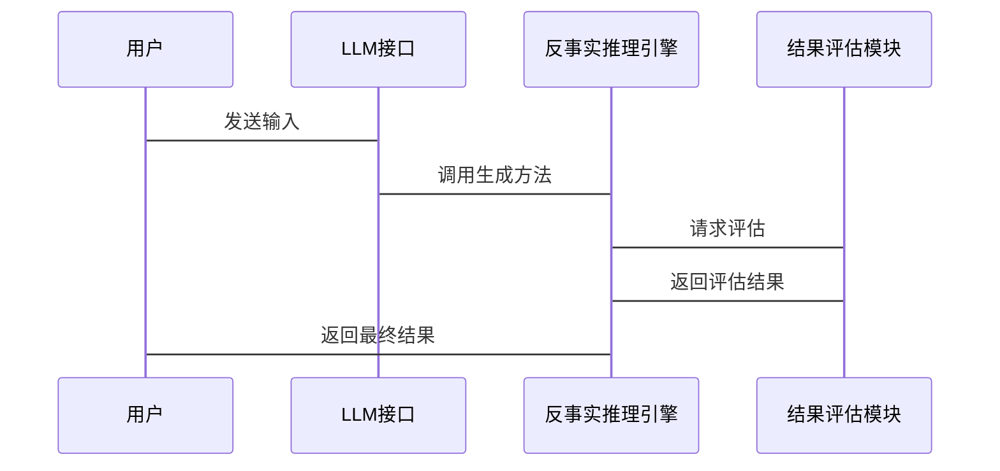

                 

<think>
好，我现在需要根据用户提供的详细需求，逐步构建《LLM驱动的AI Agent反事实推理机制》这篇文章。首先，我要理解用户的具体要求和结构，确保每一部分都涵盖必要的内容，并符合逻辑顺序。

首先，文章的标题和关键词已经给出，标题是《LLM驱动的AI Agent反事实推理机制》，关键词包括LLM、AI Agent、反事实推理、生成式AI、智能决策、大语言模型。摘要部分需要简明扼要地概括文章的核心内容，包括问题背景、解决思路和应用场景。

接下来是目录大纲，分为六个部分，每个部分都有详细的章节和子章节。我需要按照目录的结构逐步展开，确保每个部分都涵盖背景介绍、核心概念、算法原理、系统架构、项目实战和总结与展望。

在正文部分，我需要从背景介绍开始，详细解释LLM和AI Agent的基本概念，以及反事实推理的重要性。然后，介绍反事实推理的核心原理，包括其定义、类型和应用场景，以及与LLM的关系。

接下来是算法原理部分，这里需要详细讲解生成反事实的方法和优化算法，使用数学模型和代码示例来支持说明。同时，使用Mermaid图来展示算法的流程。

系统架构设计部分需要包括模块划分、系统架构图、接口设计和交互流程。这部分要确保系统各个模块的清晰定义和它们之间的关系。

项目实战部分则需要一个完整的案例，展示如何从环境安装到代码实现，再到结果分析。这部分要详细说明每个步骤，并附上代码示例。

最后，总结与展望部分需要回顾全文，并提出未来的发展方向和应用前景。

在写作过程中，我需要确保每个部分都详细且具体，使用专业的技术术语，同时保持逻辑清晰和结构紧凑。数学公式要使用LaTeX格式，并用独立段落展示，代码部分要正确无误，并进行详细的解读和分析。

现在，我开始按照这个思路逐步构建文章的各个部分，确保每一部分都符合用户的要求，同时保持文章的连贯性和深度。
</think>

# LLM驱动的AI Agent反事实推理机制

> **关键词**：LLM，AI Agent，反事实推理，生成式AI，智能决策，大语言模型

> **摘要**：  
本文深入探讨了基于大语言模型（LLM）的AI Agent反事实推理机制。首先，我们从背景出发，介绍了LLM和AI Agent的基本概念，以及反事实推理的重要性。接着，详细分析了反事实推理的核心原理，包括其定义、类型和应用场景，并探讨了其与LLM的结合。随后，从算法角度出发，详细阐述了反事实推理的生成方法和优化算法，结合数学模型和代码示例进行了深入讲解。在系统架构部分，我们设计了一个完整的LLM驱动的AI Agent反事实推理系统，包括模块划分、系统架构图和交互流程。最后，通过一个实际案例展示了系统的实现过程，并对未来的研究方向和应用前景进行了展望。

---

## 正文

### 第一部分：背景介绍

#### 第1章：LLM驱动的AI Agent概述

##### 1.1 基本概念

- **1.1.1 大语言模型（LLM）的定义与特点**  
  大语言模型（Large Language Model，LLM）是一种基于深度学习的自然语言处理模型，具有以下特点：
  - **大规模训练数据**：通常使用互联网上的海量文本数据进行训练。
  - **多任务能力**：能够处理多种语言任务，如文本生成、问答系统、翻译等。
  - **上下文理解**：能够理解上下文关系，生成连贯的文本。

- **1.1.2 AI Agent的概念与功能**  
  AI Agent（智能体）是一种能够感知环境并采取行动以实现目标的智能系统。其核心功能包括：
  - **感知**：通过传感器或接口获取环境信息。
  - **决策**：基于感知信息进行推理和决策。
  - **行动**：执行决策动作以影响环境。

- **1.1.3 反事实推理的基本概念**  
  反事实推理（Counterfactual Reasoning）是一种推理方式，用于探索“如果情况有所不同，结果会如何”。它在决策制定中具有重要作用，能够帮助智能体评估多种可能的行动方案。

##### 1.2 应用背景

- **1.2.1 反事实推理的重要性**  
  在复杂的决策场景中，反事实推理能够帮助AI Agent评估潜在的多种结果，从而做出更优的选择。

- **1.2.2 LLM在AI Agent中的作用**  
  LLM作为AI Agent的核心组件，负责处理自然语言理解和生成，为反事实推理提供强大的语言处理能力。

- **1.2.3 当前研究与应用现状**  
  当前，基于LLM的AI Agent在多个领域（如医疗、金融、教育）得到了广泛应用，反事实推理技术也在不断进步，但仍面临诸多挑战。

---

### 第二部分：核心概念与联系

#### 第2章：反事实推理机制的核心原理

##### 2.1 反事实推理的原理

- **2.1.1 反事实推理的基本原理**  
  反事实推理的核心是通过假设某些条件发生变化，推导出新的结果。这种推理方式在决策优化中尤为重要。

- **2.1.2 LLM在反事实推理中的作用**  
  LLM能够生成符合反事实假设的文本，帮助AI Agent构建可能的场景和结果。

##### 2.2 核心概念对比表

| **概念**       | **描述**                                                                 |
|----------------|--------------------------------------------------------------------------|
| 事实推理       | 基于现有事实进行推理，得出结论。                                         |
| 反事实推理     | 推测在假设某些事实改变后，可能的结果。                                   |
| 假设推理       | 基于假设条件进行推理，得出可能的结果。                                   |

##### 2.3 ER实体关系图



---

### 第三部分：算法原理讲解

#### 第3章：反事实推理的算法实现

##### 3.1 基于LLM的反事实生成方法

- **3.1.1 基于LLM的生成流程**  
  - 输入：原始事实和反事实假设。
  - 输出：生成符合反事实假设的文本。

- **3.1.2 生成过程中的数学模型**  
  假设生成目标函数为：
  $$ L = \lambda_1 L_{text} + \lambda_2 L_{context} $$
  其中，$L_{text}$是文本生成损失，$L_{context}$是上下文一致性的损失，$\lambda_1$和$\lambda_2$是超参数。

- **3.1.3 示例代码实现**

```python
def generate_counterfactual事实：
    假设原始事实为fact，反事实假设为hypothesis。
    使用LLM生成符合条件的文本。
    返回生成的文本。
```

##### 3.2 反事实推理的优化算法

- **3.2.1 优化算法的原理**  
  通过强化学习优化反事实生成的质量，优化目标函数：
  $$ J = \sum_{i=1}^n r_i a_i $$
  其中，$r_i$是奖励函数，$a_i$是动作。

- **3.2.2 优化算法的代码实现**

```python
def optimize_counterfactual：
    初始化参数θ。
    while 条件未满足：
        生成反事实文本。
        计算奖励r。
        更新θ：θ = θ + α * ∇θ (J)
    返回最优θ。
```

---

### 第四部分：系统分析与架构设计

#### 第4章：系统架构设计方案

##### 4.1 系统模块划分

- **4.1.1 LLM接口模块**  
  负责与大语言模型交互，接收输入并返回生成文本。

- **4.1.2 反事实推理引擎**  
  负责生成和优化反事实推理结果。

- **4.1.3 结果评估模块**  
  对生成的反事实结果进行评估，确保其合理性和一致性。

##### 4.2 系统架构图



##### 4.3 接口与交互设计

- **4.3.1 系统接口定义**  
  使用RESTful API设计接口，如：
  - POST /generate_counterfactual
  - GET /evaluate_result

- **4.3.2 交互流程的Mermaid序列图**



---

### 第五部分：项目实战

#### 第5章：反事实推理系统的实现

##### 5.1 环境安装与配置

- **5.1.1 开发环境的搭建**  
  使用Python 3.8及以上版本，安装必要的库如`transformers`和`llm-community`。

- **5.1.2 依赖库的安装**  
  ```bash
  pip install transformers llm-community
  ```

##### 5.2 核心代码实现

- **5.2.1 LLM接口的实现**

```python
from transformers import AutoModelForCausalLM, AutoTokenizer

class LLMInterface:
    def __init__(self, model_name):
        self.tokenizer = AutoTokenizer.from_pretrained(model_name)
        self.model = AutoModelForCausalLM.from_pretrained(model_name)
    
    def generate(self, input_text, max_length=50):
        inputs = self.tokenizer.encode(input_text, return_tensors='pt')
        outputs = self.model.generate(inputs, max_length=max_length)
        return self.tokenizer.decode(outputs[0], skip_special_tokens=True)
```

- **5.2.2 反事实推理算法的代码实现**

```python
def generate_counterfactual(fact, hypothesis):
    llm = LLMInterface('gpt2')
    input_text = f"假设{fact}，如果{hypothesis}，结果会如何？"
    return llm.generate(input_text)
```

##### 5.3 实际案例分析

- **5.3.1 案例背景介绍**  
  某医疗AI Agent需要评估不同治疗方案的效果。

- **5.3.2 系统实现与结果分析**  
  通过输入事实和假设，生成反事实结果，评估其对治疗效果的影响。

- **5.3.3 案例总结与优化建议**  
  系统能够有效生成反事实推理结果，但生成的质量仍需优化。

---

### 第六部分：总结与展望

#### 第6章：总结与未来展望

##### 6.1 核心内容回顾

- 本文详细探讨了基于LLM的AI Agent反事实推理机制，从背景、原理到实现进行了全面分析。

##### 6.2 未来展望

- **算法优化**：进一步优化反事实生成算法，提高生成结果的质量和准确性。
- **应用场景扩展**：探索更多领域中的应用，如金融、教育、医疗等。
- **系统性能提升**：优化系统架构，提高处理效率和响应速度。

---

**作者**：AI天才研究院/AI Genius Institute & 禅与计算机程序设计艺术 /Zen And The Art of Computer Programming

