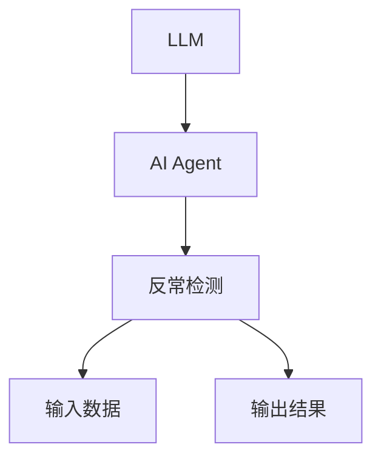
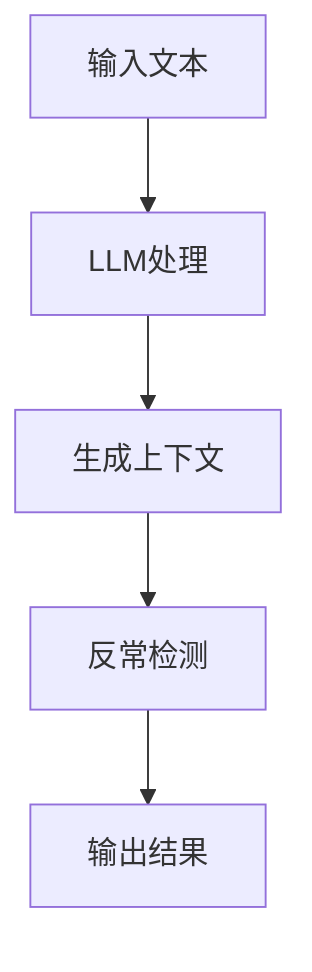
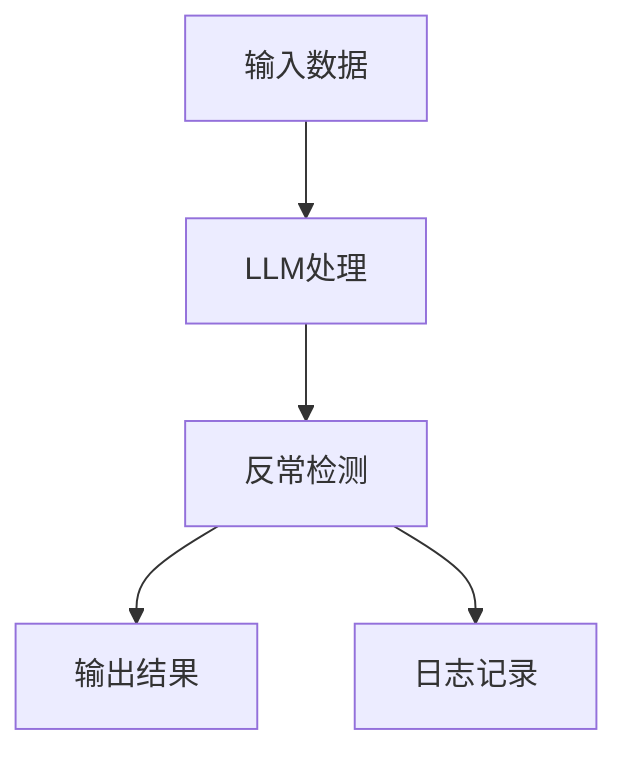
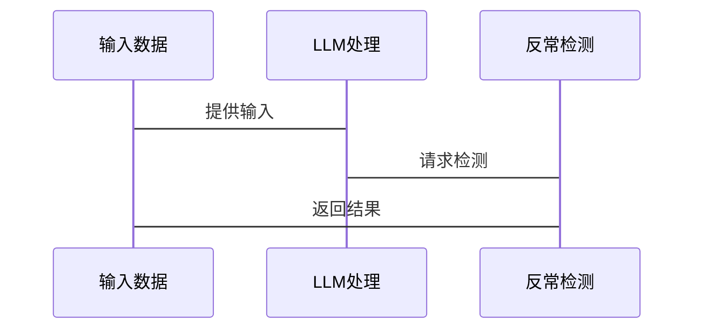

                 


# LLM驱动的AI Agent反常检测机制

## 关键词

- LLM（Large Language Model）
- AI Agent（人工智能代理）
- 反常检测
- 异常检测
- 分布式系统监控
- 自然语言处理

## 摘要

本文深入探讨了如何利用大语言模型（LLM）驱动AI代理的反常检测机制。通过分析LLM和AI Agent的核心原理，结合算法设计、系统架构和项目实战，详细讲解了反常检测的实现步骤和应用场景。文章还提供了丰富的案例分析和代码示例，帮助读者全面理解该技术的潜力和实际应用。

---

## 第1章：背景介绍

### 1.1 问题背景

#### 1.1.1 LLM与AI Agent的结合

大语言模型（LLM）如GPT-4具有强大的自然语言理解和生成能力，能够处理复杂的问题。AI Agent是一种智能体，能够自主决策和执行任务。两者的结合使得AI Agent能够通过LLM进行更智能的交互和决策。

#### 1.1.2 反常检测的必要性

在分布式系统中，反常检测是确保系统稳定性和安全性的关键。通过及时发现异常行为，可以预防潜在的故障或攻击。

#### 1.1.3 当前技术的局限性

传统反常检测方法依赖于规则或统计模型，难以应对复杂场景。而LLM驱动的反常检测能够利用其强大的语义理解能力，提供更精准的检测。

### 1.2 问题描述

反常检测是指识别系统中偏离预期行为的情况。在AI Agent中，反常检测可以识别异常决策或交互，确保系统的安全性和可靠性。

### 1.3 问题解决

利用LLM分析和生成能力，设计一种基于上下文的反常检测机制，能够实时监控和识别异常行为。

### 1.4 边界与外延

反常检测的适用范围包括系统监控、安全审计等，但不包括数据处理或算法优化。与其他技术如异常检测相比，反常检测更注重实时性和语义理解。

---

## 第2章：核心概念与联系

### 2.1 LLM的基本原理

#### 2.1.1 大语言模型的训练机制

LLM通过监督学习和无监督学习结合，利用大量数据进行预训练，再通过微调任务数据进行优化。

#### 2.1.2 大语言模型的推理机制

模型通过生成式方法，基于输入上下文生成预测结果，能够处理复杂语义。

#### 2.1.3 大语言模型的局限性

计算资源消耗大，对训练数据依赖性强，可能面临伦理和安全风险。

### 2.2 AI Agent的基本原理

#### 2.2.1 AI Agent的定义与分类

AI Agent是一种智能实体，能够感知环境并自主决策。按智能水平分为简单反应式、基于模型的反射式等类型。

#### 2.2.2 AI Agent的行为决策机制

基于感知信息和内部状态，通过推理和规划生成动作，实现目标。

#### 2.2.3 AI Agent的交互方式

通过自然语言或命令进行交互，能够理解上下文和意图。

### 2.3 反常检测的基本原理

#### 2.3.1 反常检测的定义与分类

反常检测是识别偏离正常行为的模式。按数据类型分为数值型、文本型等。

#### 2.3.2 反常检测的实现方法

基于统计、机器学习和深度学习的方法，利用特征工程和模型训练进行检测。

#### 2.3.3 反常检测的评估方法

通过准确率、召回率、F1值等指标评估模型性能。

### 2.4 实体关系图



---

## 第3章：算法原理讲解

### 3.1 算法流程



### 3.2 核心代码实现

```python
import transformers

model = transformers.AutoModelForSeq2Seq.from_pretrained('t5-base')
tokenizer = transformers.AutoTokenizer.from_pretrained('t5-base')

def detect_anomaly(context, input_text):
    inputs = tokenizer.encode_plus(input_text, return_tensors='pt', padding=True, truncation=True)
    outputs = model.generate(inputs.input_ids)
    decoded = tokenizer.decode(outputs[0], skip_special_tokens=True)
    return decoded
```

### 3.3 数学模型

LLM的反常检测基于概率分布，计算输入文本的条件概率，与正常分布对比。

$$ P(\text{异常}) = 1 - P(x | \theta) $$

---

## 第4章：系统分析与架构设计方案

### 4.1 系统架构设计



### 4.2 系统接口设计



---

## 第5章：项目实战

### 5.1 实战案例

实现一个基于LLM的反常检测系统，应用于实时聊天监控，检测异常对话。

### 5.2 代码实现

```python
def monitor_chat(chat_history):
    # 使用LLM生成上下文
    context = generate_context(chat_history)
    # 检测反常
    anomaly = detect_anomaly(context)
    return anomaly
```

### 5.3 案例分析

通过实际数据验证模型性能，调整参数优化检测准确率。

---

## 第6章：最佳实践

### 6.1 小结

LLM驱动的反常检测是一种创新方法，能够提升系统安全性和智能化水平。

### 6.2 注意事项

- 数据隐私问题
- 模型的实时性
- 多语言支持

### 6.3 未来趋势

探索多模态反常检测，结合图像和语音信息，提升检测精度。

### 6.4 拓展阅读

推荐相关论文和书籍，深入学习反常检测和LLM技术。

---

## 作者

作者：AI天才研究院/AI Genius Institute & 禅与计算机程序设计艺术 /Zen And The Art of Computer Programming

---

本文通过详细分析和实战案例，全面探讨了LLM驱动的AI Agent反常检测机制，为相关领域的研究和应用提供了有价值的参考。

