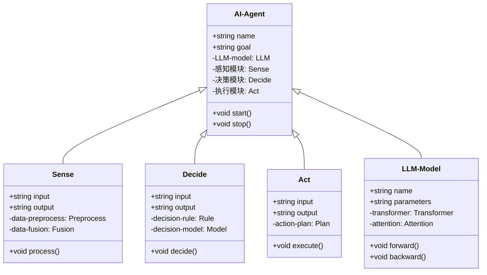

                 


# LLM驱动的AI Agent多模态融合处理

> 关键词：LLM, AI Agent, 多模态融合, 大语言模型, 多模态数据, AI驱动, 多模态处理

> 摘要：本文将详细介绍LLM（大语言模型）在AI Agent中的应用，探讨如何通过多模态数据的融合来提升AI Agent的智能性和实用性。文章从AI Agent的基本概念、多模态数据融合的意义、LLM的核心原理、多模态融合的算法与数学模型、系统架构设计、项目实战以及最佳实践等方面展开，深入分析LLM驱动的AI Agent多模态融合处理的技术细节和实现方法。

---

## 第1章: AI Agent与多模态数据融合概述

### 1.1 AI Agent的基本概念

#### 1.1.1 AI Agent的定义与分类
AI Agent（人工智能代理）是指能够感知环境、自主决策并执行任务的智能实体。根据功能和应用场景的不同，AI Agent可以分为以下几类：
- **反应式AI Agent**：基于当前感知做出实时反应，适用于需要快速响应的任务。
- **认知式AI Agent**：具备复杂的推理和规划能力，能够处理复杂的决策问题。
- **混合式AI Agent**：结合反应式和认知式的特点，适用于复杂多变的环境。

#### 1.1.2 多模态数据的定义与特点
多模态数据指的是来自不同感官渠道的数据，如文本、图像、语音、视频、传感器数据等。其特点包括：
- **多样性**：数据来源多样，能够提供更全面的信息。
- **互补性**：不同模态的数据可以相互补充，提升信息的理解和处理能力。
- **复杂性**：多模态数据的处理需要综合考虑多种数据类型，增加了处理的难度。

#### 1.1.3 LLM在AI Agent中的作用
大语言模型（LLM）通过其强大的语言理解和生成能力，为AI Agent提供了以下优势：
- **自然语言处理**：能够理解并生成人类语言，提升AI Agent与用户的交互能力。
- **知识整合**：能够整合多种数据源的信息，为多模态数据的融合提供支持。
- **动态适应**：能够根据上下文动态调整输出，增强AI Agent的适应性。

---

### 1.2 多模态融合的意义

#### 1.2.1 多模态数据融合的背景
在AI Agent的应用中，单一模态的数据往往无法提供足够的信息支持决策。例如，在智能客服场景中，仅依赖文本交互无法完全理解用户的情感和意图。因此，多模态数据的融合成为必要。

#### 1.2.2 多模态融合的优势与挑战
- **优势**：
  - 提供更全面的信息，提升决策的准确性。
  - 增强系统的鲁棒性，减少单一模态数据的局限性。
- **挑战**：
  - 数据异构性问题：不同模态的数据格式和特征空间差异大。
  - 数据量问题：多模态数据的处理需要更多的计算资源。
  - 融合方法的选择：如何有效地将不同模态的数据结合起来是一个难点。

#### 1.2.3 LLM驱动的多模态融合应用前景
随着LLM技术的不断发展，多模态数据的融合将更加智能化和高效。未来的AI Agent将能够更好地理解和处理复杂场景中的多模态信息，为各行业带来更强大的智能化能力。

---

### 1.3 本章小结
本章主要介绍了AI Agent的基本概念、多模态数据的定义与特点，以及LLM在AI Agent中的作用。同时，探讨了多模态数据融合的意义、优势与挑战，为后续章节的深入分析奠定了基础。

---

## 第2章: LLM的基本原理

### 2.1 大语言模型的结构与特点

#### 2.1.1 Transformer模型的结构
Transformer模型由编码器和解码器两部分组成，其核心思想是通过自注意力机制捕捉序列中的全局依赖关系。其结构如下：
- **编码器**：将输入序列映射到一个中间表示空间。
- **解码器**：根据编码器的输出生成目标序列。

#### 2.1.2 注意力机制的作用
注意力机制通过计算输入序列中每个位置的重要性权重，帮助模型聚焦于关键信息。其公式为：
$$
\text{Attention}(Q, K, V) = \text{softmax}\left(\frac{QK^T}{\sqrt{d_k}}\right)V
$$

其中，$Q$、$K$、$V$分别是查询、键和值向量，$d_k$是键的维度。

#### 2.1.3 LLM的训练与优化
大语言模型的训练通常采用自监督学习，通过最大化上下文的概率来优化模型参数。常用的优化算法包括Adam和AdamW，损失函数通常采用交叉熵损失。

---

### 2.2 LLM的输入输出机制

#### 2.2.1 输入处理流程
LLM的输入通常经过以下步骤：
1. **分词**：将输入文本划分为词或短语。
2. **嵌入**：将词或短语映射为向量表示。
3. **编码**：通过编码器将输入序列编码为一个中间表示。

#### 2.2.2 输出生成原理
LLM的输出生成通常采用贪心搜索或采样方法：
- **贪心搜索**：每次选择概率最高的词生成下一个词。
- **采样方法**：基于概率分布随机选择词，如Top-k采样或温度采样。

#### 2.2.3 LLM的上下文理解能力
LLM通过自注意力机制能够理解上下文关系，从而生成连贯且合理的输出。

---

## 第3章: AI Agent的核心原理

### 3.1 AI Agent的感知与决策

#### 3.1.1 感知模块的功能与实现
感知模块负责从环境中获取信息，通常包括以下步骤：
1. **数据采集**：获取多模态数据，如图像、语音等。
2. **数据预处理**：对数据进行清洗、归一化等处理。
3. **特征提取**：将数据转换为特征向量。

#### 3.1.2 决策模块的逻辑与算法
决策模块基于感知到的信息做出决策，常用的算法包括：
- **基于规则的决策**：根据预定义的规则进行决策。
- **基于模型的决策**：利用机器学习模型进行预测。

#### 3.1.3 执行模块的实现与优化
执行模块负责根据决策结果执行动作，优化方法包括：
- **局部优化**：针对单个动作进行优化。
- **全局优化**：考虑整体目标进行优化。

---

### 3.2 AI Agent的多模态融合处理

#### 3.2.1 多模态数据的采集与预处理
多模态数据的采集需要考虑数据的多样性和实时性。预处理步骤包括：
- **数据清洗**：去除噪声和冗余数据。
- **数据对齐**：将不同模态的数据对齐到同一时间轴。
- **数据融合**：将不同模态的数据结合在一起。

#### 3.2.2 多模态数据的融合方法
常用的多模态融合方法包括：
- **特征级融合**：在特征层面上进行融合，如将图像特征和文本特征拼接。
- **决策级融合**：在决策层面上进行融合，如将多个模态的决策结果进行投票或加权。

#### 3.2.3 LLM在多模态融合中的应用
LLM可以作为多模态融合的核心模块，通过其强大的语言理解能力，将不同模态的信息进行整合和解释。

---

## 第4章: LLM与AI Agent的结合原理

### 4.1 LLM驱动AI Agent的实现流程

#### 4.1.1 数据输入与模型调用
AI Agent通过感知模块获取多模态数据，并将其输入到LLM中进行处理。

#### 4.1.2 多模态数据的融合处理
LLM通过对多模态数据的融合，生成更准确的上下文理解和决策结果。

#### 4.1.3 输出结果的生成与反馈
LLM生成输出结果后，AI Agent通过执行模块将结果反馈到环境中，并根据反馈进一步优化。

---

### 4.2 LLM与AI Agent的协同工作

#### 4.2.1 协同机制的定义与实现
协同机制是指LLM与AI Agent之间的协作方式，通常包括：
- **信息共享**：LLM将处理后的信息共享给AI Agent。
- **任务分配**：根据任务需求，分配不同的模态数据处理任务。

#### 4.2.2 协同过程中的问题与解决方案
- **问题**：数据异构性可能导致协同困难。
- **解决方案**：通过数据转换和特征提取，将不同模态的数据统一到一个特征空间。

---

## 第5章: 多模态融合的算法与数学模型

### 5.1 多模态数据融合的算法原理

#### 5.1.1 基于概率的融合算法
基于概率的融合算法通过计算各个模态数据的概率分布，然后进行加权融合。其公式为：
$$
P(y|x_1, x_2) = \frac{P(x_1|y)P(x_2|y)P(y)}{P(x_1, x_2)}
$$

#### 5.1.2 基于规则的融合算法
基于规则的融合算法通过预定义的规则对各个模态数据进行融合，适用于场景简单但规则明确的情况。

#### 5.1.3 基于深度学习的融合算法
基于深度学习的融合算法通过构建神经网络模型，自动学习多模态数据的特征表示。常用的模型包括多模态Transformer和图神经网络。

---

### 5.2 LLM驱动的多模态融合算法

#### 5.2.1 基于LLM的多模态数据预处理
LLM通过自注意力机制对多模态数据进行预处理，提取关键特征。

#### 5.2.2 多模态数据的特征提取与融合
通过特征提取和融合，将不同模态的数据转化为统一的特征向量，然后输入到LLM中进行处理。

#### 5.2.3 LLM的输出与反馈
LLM生成输出结果后，通过反馈机制不断优化模型参数。

---

## 第6章: 系统分析与架构设计

### 6.1 项目介绍

#### 6.1.1 项目背景
本项目旨在开发一个基于LLM的AI Agent，能够处理多模态数据，提升决策的准确性和智能化。

#### 6.1.2 系统功能设计
系统功能包括：
- **数据采集**：采集多模态数据。
- **数据处理**：对数据进行预处理和融合。
- **模型调用**：调用LLM进行处理。
- **结果输出**：生成并输出最终结果。

---

### 6.2 系统架构设计

#### 6.2.1 领域模型（类图）


---

## 第7章: 项目实战

### 7.1 环境安装与配置

```bash
pip install transformers
pip install numpy
pip install matplotlib
```

### 7.2 核心实现代码

```python
import torch
import torch.nn as nn
import torch.optim as optim

class LLM(nn.Module):
    def __init__(self, input_dim, hidden_dim, output_dim):
        super(LLM, self).__init__()
        self.encoder = nn.Linear(input_dim, hidden_dim)
        self.decoder = nn.Linear(hidden_dim, output_dim)
        self.activation = nn.ReLU()

    def forward(self, x):
        x = self.encoder(x)
        x = self.activation(x)
        x = self.decoder(x)
        return x

# 数据准备
input_data = torch.randn(100, input_dim)
target_output = torch.randn(100, output_dim)

# 模型训练
model = LLM(input_dim, hidden_dim, output_dim)
criterion = nn.MSELoss()
optimizer = optim.Adam(model.parameters(), lr=0.001)

for epoch in range(100):
    outputs = model(input_data)
    loss = criterion(outputs, target_output)
    loss.backward()
    optimizer.step()
    print(f"Epoch: {epoch}, Loss: {loss.item()}")
```

---

## 第8章: 最佳实践与总结

### 8.1 最佳实践 tips

- **数据质量**：确保输入数据的多样性和准确性。
- **模型优化**：定期对模型进行调优和更新。
- **系统测试**：进行全面的系统测试，确保各模块协同工作。

### 8.2 小结
本文详细探讨了LLM驱动的AI Agent多模态融合处理的技术细节，从基本概念到实际应用，全面分析了多模态数据融合的意义、算法与实现方法。

### 8.3 注意事项
- 在实际应用中，需注意数据隐私和安全问题。
- 多模态数据的融合需要结合具体场景进行优化。

### 8.4 拓展阅读
- 《Deep Learning》 - Ian Goodfellow
- 《Transformers in Action》 - Analytics Vidhya

---

## 作者信息

作者：AI天才研究院/AI Genius Institute & 禅与计算机程序设计艺术 /Zen And The Art of Computer Programming

