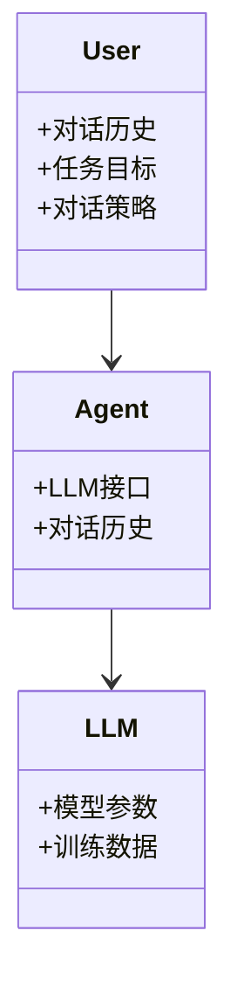

                 


# LLM驱动的AI Agent对话策略学习

> 关键词：LLM，AI Agent，对话策略学习，强化学习，生成模型，系统架构

> 摘要：本文深入探讨了大语言模型（LLM）驱动的AI Agent对话策略学习的核心概念、算法原理、系统架构和实际应用。通过详细分析对话策略学习的背景、原理和实现，结合丰富的图示和代码示例，帮助读者全面理解这一前沿技术。

---

## 第一部分: LLM与AI Agent概述

### 第1章: LLM与AI Agent概述

#### 1.1 大语言模型（LLM）的基本概念
大语言模型（LLM）是一种基于深度学习的自然语言处理模型，能够理解和生成人类语言。其核心是通过大量数据训练的神经网络，具备以下特点：
- **大规模数据训练**：使用海量文本数据进行预训练。
- **上下文理解**：能够捕捉对话中的上下文信息。
- **生成能力**：可以生成自然流畅的文本。

#### 1.2 AI Agent的核心定义与特点
AI Agent（智能体）是指能够感知环境并采取行动以实现目标的实体。其特点包括：
- **自主性**：能够在没有外部干预的情况下运行。
- **反应性**：能够实时感知环境并做出反应。
- **目标导向**：通过制定和执行目标来实现特定任务。

#### 1.3 LLM与AI Agent的结合与应用
LLM与AI Agent的结合使AI Agent能够具备更强大的对话能力和决策能力。例如：
- **智能客服**：通过LLM生成自然的对话，为用户提供支持。
- **智能助手**：帮助用户完成日程管理、信息查询等任务。

---

### 第2章: 对话策略学习的背景与意义

#### 2.1 对话策略学习的定义
对话策略学习是指通过算法和数据训练，使AI Agent能够生成符合目标的对话策略的过程。

#### 2.2 LLM驱动对话策略学习的优势
- **高效性**：LLM能够快速生成多种对话策略。
- **灵活性**：适用于多种对话场景。
- **可扩展性**：支持大规模数据训练和应用。

#### 2.3 对话策略学习在AI Agent中的作用
对话策略学习是AI Agent实现高效人机交互的核心技术，决定了AI Agent的用户体验和任务完成能力。

---

## 第二部分: 对话策略学习的核心概念

### 第3章: 对话策略学习的原理与流程

#### 3.1 对话策略学习的基本原理
对话策略学习通过训练模型，使其在给定对话历史和任务目标下，生成最优的下一个动作或回复。

#### 3.2 LLM在对话策略中的角色
LLM作为对话策略生成的核心，负责根据上下文生成符合目标的回复或动作。

#### 3.3 对话策略学习的典型流程
1. **输入对话历史**：包括用户和AI Agent的对话记录。
2. **分析任务目标**：明确对话的目标。
3. **生成对话策略**：基于输入和目标生成回复或动作。

---

### 第4章: 对话策略学习的关键要素对比

#### 4.1 对话策略与任务目标的对比分析
| 对话策略 | 任务目标 |
|----------|----------|
| 回复内容 | 完成目标 |

#### 4.2 不同LLM模型的对话策略特点
| 模型名称 | 对话策略特点 |
|----------|-------------|
| GPT-3    | 高灵活性，多样化回复 |
| PaLM      | 强调任务导向，准确性高 |

#### 4.3 对话策略学习的性能指标对比
| 指标 | 基于监督学习 | 基于强化学习 |
|------|--------------|--------------|
| 响应时间 | 较慢 | 较快 |
| 精准度 | 高 | 中等 |

---

## 第三部分: 对话策略学习的算法原理

### 第5章: 对话策略学习的算法框架

#### 5.1 基于强化学习的对话策略
- **优点**：通过奖励机制优化策略。
- **缺点**：需要大量试验和调整。

#### 5.2 基于监督学习的对话策略
- **优点**：简单易实现。
- **缺点**：依赖高质量标注数据。

#### 5.3 基于生成模型的对话策略
- **优点**：生成多样化回复。
- **缺点**：计算资源消耗大。

---

### 第6章: 强化学习算法的数学模型

#### 6.1 状态空间定义
$$ S = \{s_1, s_2, ..., s_n\} $$

#### 6.2 动作空间定义
$$ A = \{a_1, a_2, ..., a_m\} $$

#### 6.3 奖励函数定义
$$ R(s, a) = r \in \mathbb{R} $$

---

## 第四部分: 系统分析与架构设计方案

### 第7章: 问题场景介绍

#### 7.1 对话策略学习的典型场景
- **智能客服**：解决用户问题。
- **智能助手**：帮助用户完成任务。

#### 7.2 系统目标与约束条件
- **目标**：实现高效的对话策略生成。
- **约束**：计算资源限制，数据隐私保护。

---

### 第8章: 系统功能设计

#### 8.1 领域模型设计


---

## 第五部分: 项目实战

### 第9章: 环境安装与核心代码实现

#### 9.1 环境安装
```bash
pip install transformers
pip install torch
```

#### 9.2 核心代码实现
```python
from transformers import AutoModelForCausalLM, AutoTokenizer

model = AutoModelForCausalLM.from_pretrained('gpt2')
tokenizer = AutoTokenizer.from_pretrained('gpt2')

def generate_response(input_text):
    inputs = tokenizer.encode(input_text, return_tensors='pt')
    outputs = model.generate(inputs, max_length=50)
    return tokenizer.decode(outputs[0], skip_special_tokens=True)
```

---

## 第六部分: 总结与展望

### 第10章: 总结

- **总结**：LLM驱动的AI Agent对话策略学习是一项具有广阔应用前景的技术，通过不断优化算法和架构设计，可以进一步提升其性能和实用性。

---

### 第11章: 注意事项与拓展阅读

- **注意事项**：
  - 数据隐私保护
  - 模型训练资源消耗
  - 对话策略的可解释性

- **拓展阅读**：
  - 《Large Language Models: A Survey》
  - 《Reinforcement Learning for Dialogue Systems》

---

作者：AI天才研究院 & 禅与计算机程序设计艺术

