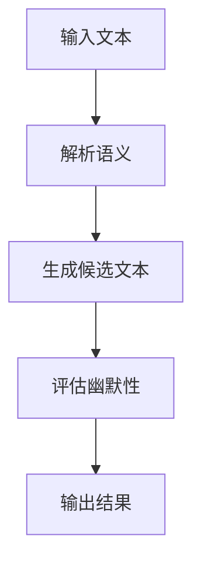
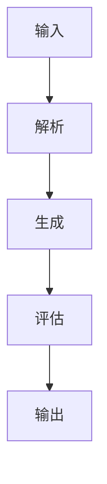
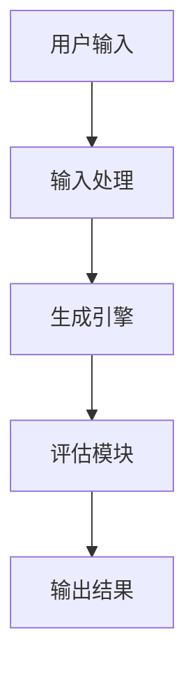
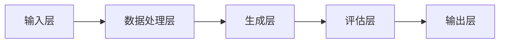

                 


# LLM驱动的AI Agent幽默感生成器

> 关键词：LLM、AI Agent、幽默感生成、自然语言处理、大语言模型

> 摘要：本文探讨了如何利用大语言模型（LLM）构建具备幽默能力的AI代理。通过分析幽默感的定义、生成机制以及AI Agent的核心原理，文章详细介绍了基于LLM的幽默感生成算法，并通过系统架构设计和项目实战展示了实际应用。最后，总结了最佳实践和未来发展方向。

---

# 第一部分: 背景介绍与核心概念

## 第1章: 背景介绍

### 1.1 幽默感的定义与特征
幽默感是人类独有的高级认知能力，通过讽刺、双关语、夸张等手法触发笑声或愉悦感。幽默感具有多维度定义，包括语言、情境和文化差异，其核心特征包括出人意料性、简洁性、关联性和情感共鸣。

### 1.2 AI Agent与LLM的结合
AI Agent作为智能体，能够理解和执行任务。LLM通过自然语言处理能力，使AI Agent具备生成幽默内容的能力。LLM驱动的AI Agent结合了语言理解和生成的优势，具备实时互动和自适应学习的特点。

## 第2章: 核心概念与联系

### 2.1 LLM与AI Agent的关系
- LLM的核心原理：基于大量数据训练，生成与上下文相关的文本。
- AI Agent的核心原理：通过感知环境和执行动作，完成任务。
- LLM与AI Agent的协同工作流程：AI Agent利用LLM生成幽默内容，动态调整输出以适应用户反馈。

### 2.2 幽默感生成的数学模型
- 幽默感生成的数学公式：
  $$ Humor = P(relevance \mid context) \times P( surpriseness \mid context) $$
  其中，P(relevance)表示内容的相关性概率，P(surpriseness)表示意外性概率。
- 幽默感生成的算法流程图（Mermaid）：


---

# 第二部分: 算法原理

## 第3章: 幽默感生成的算法原理

### 3.1 基于LLM的幽默感生成算法
- 算法输入与输出：
  - 输入：用户输入的文本或情境。
  - 输出：生成的幽默内容。
- 算法流程图（Mermaid）：

- 代码实现示例：
```python
def generate_humor(input_text):
    # 解析输入
    context = parse(input_text)
    # 生成候选文本
    candidates = generate(context)
    # 评估幽默性
    scores = evaluate_humor(candidates)
    # 返回最高分
    return candidates[scores.index(max(scores))]
```

### 3.2 基于强化学习的幽默感优化
- 强化学习的基本原理：通过奖励机制优化生成结果。
- 幽默感优化的强化学习模型：
  $$ R = r_{1} \times P(humor \mid context) + r_{2} \times P(relevance \mid context) $$
  其中，r1和r2是奖励系数，分别对应幽默性和相关性。

---

# 第三部分: 系统分析与架构设计

## 第4章: 系统分析

### 4.1 系统功能需求分析
- 用户需求分析：用户希望AI Agent生成幽默对话。
- 系统功能模块划分：输入处理、生成引擎、评估模块。
- 系统功能流程图（Mermaid）：


### 4.2 系统架构设计
- 系统架构图（Mermaid）：

- 模块交互关系：输入层接收数据，数据处理层解析，生成层生成内容，评估层优化，输出层呈现结果。

---

# 第四部分: 项目实战

## 第5章: 项目实战

### 5.1 环境搭建与安装
- 开发环境配置：推荐使用Python 3.8及以上版本。
- 依赖库安装：`pip install transformers torch numpy`
- 开发工具选择：使用PyCharm或VS Code。

### 5.2 核心代码实现
- 幽默感生成器的代码实现：
```python
from transformers import GPT2LMHeadModel, GPT2Tokenizer

def generate_humor(input_text):
    model = GPT2LMHeadModel.from_pretrained('gpt2')
    tokenizer = GPT2Tokenizer.from_pretrained('gpt2')
    inputs = tokenizer(input_text, return_tensors='np')
    outputs = model.generate(inputs.input_ids, max_length=100)
    return tokenizer.decode(outputs[0], skip_special_tokens=True)
```

### 5.3 实际案例分析
- 案例1：输入“为什么电脑会生病？”生成“因为它感染了病毒！”
- 案例2：输入“如何保持快乐？”生成“每天给AI Agent讲个笑话！”

---

# 第五部分: 最佳实践

## 第6章: 最佳实践

### 6.1 小结
- 本文详细介绍了LLM驱动的AI Agent在幽默感生成中的应用，展示了系统的构建和实现过程。

### 6.2 注意事项
- 数据质量：确保训练数据多样化，避免生成低俗或冒犯内容。
- 算法优化：持续改进评估机制，提升生成效果。

### 6.3 拓展阅读
- 建议阅读《Large Language Models: A Survey》和《Humor Generation in NLP》。

---

# 作者：AI天才研究院/AI Genius Institute & 禅与计算机程序设计艺术 /Zen And The Art of Computer Programming

