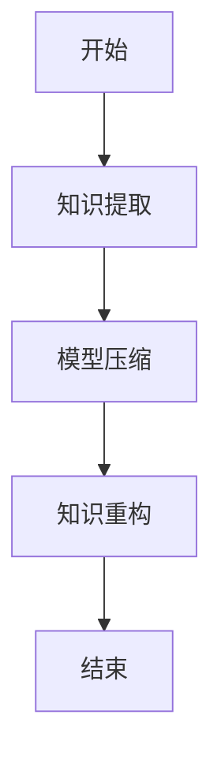
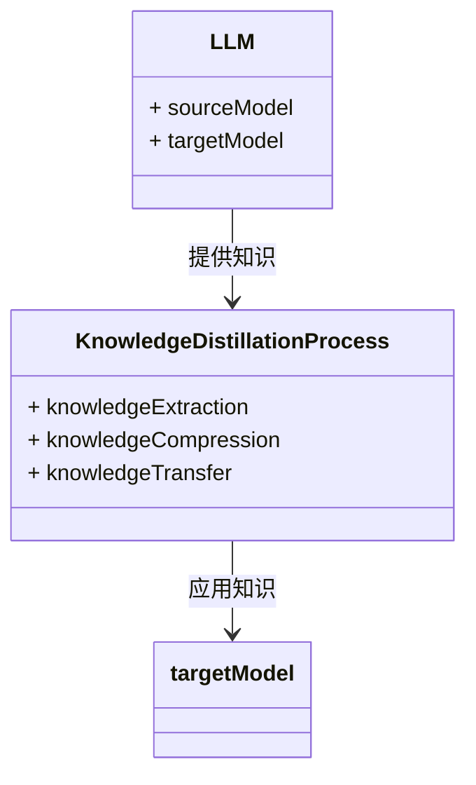
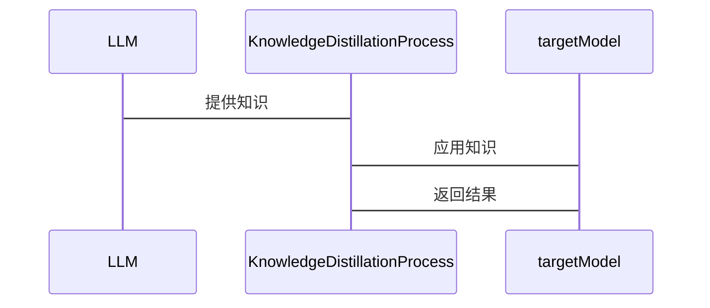

                 

<think>
嗯，我现在需要帮用户撰写一篇关于《LLM驱动的AI Agent知识蒸馏技术》的技术博客文章。用户已经提供了一个详细的目录大纲，我需要按照这个大纲来写文章。首先，我得理解每个部分的要求，确保内容覆盖所有必要的技术细节，并且用清晰易懂的语言表达出来。

首先，文章标题和关键词已经确定了。我需要先写摘要，简明扼要地概述文章的核心内容。接下来是背景介绍部分，我需要详细讲解LLM和AI Agent的背景，以及知识蒸馏技术的重要性。这部分可能需要我查找一些资料，确认LLM和AI Agent的最新发展，以及知识蒸馏在其中的作用。

然后是核心概念部分，我得解释知识蒸馏技术的基本原理，对比不同的蒸馏方法，可能还需要画一个ER实体关系图，展示各个实体之间的关系。这可能有点挑战，因为我要用Mermaid图来表示，需要确保图表清晰明了。

接下来是算法原理，这部分需要详细讲解蒸馏算法，包括流程图和数学模型。我得用Mermaid画出算法的流程图，然后写出相应的数学公式，可能需要使用LaTeX来排版。这部分我需要确保公式推导正确，例子通俗易懂。

系统分析与架构设计部分，我需要描述问题场景，设计系统的功能模块，并用Mermaid类图展示。这可能涉及到系统架构的整体设计，确保各个模块协同工作，同时设计接口和交互序列图，展示系统的运行流程。

项目实战部分，我需要提供环境安装说明，给出核心代码的实现，解读代码的功能，并通过案例分析展示实际应用。这可能需要我实际编写或查找相关代码示例，确保代码正确且易于理解。

最后是最佳实践，我需要总结整个过程，给出小结、注意事项和扩展阅读的内容，帮助读者更好地理解和应用知识蒸馏技术。

在写作过程中，我需要确保每个部分都有足够的细节，同时保持逻辑连贯，结构清晰。可能需要多次修改，确保每个章节的内容充实，图表准确，公式无误。另外，我要注意用词专业，但又要让读者容易理解，避免过于晦涩的技术术语堆砌。

总的来说，我需要一步步完成每个部分，从背景到概念，再到算法、系统设计、项目实战和总结，确保整篇文章内容全面，结构合理，符合用户的要求。
</think>

# LLM驱动的AI Agent知识蒸馏技术

## 关键词：LLM, AI Agent, 知识蒸馏, 模型压缩, 机器学习

## 摘要：LLM驱动的AI Agent知识蒸馏技术探讨了如何有效地从大型语言模型中提取和应用知识，以增强AI代理的能力。本文详细分析了知识蒸馏的核心原理，通过数学模型和算法流程图，结合实际案例，展示了如何在AI Agent中实现高效的模型压缩和知识表示，最终提升系统的性能和可扩展性。

---

# 目录大纲：《LLM驱动的AI Agent知识蒸馏技术》

## 第一部分：背景介绍

### 第1章：LLM驱动的AI Agent概述

#### 1.1 问题背景
- 1.1.1 AI Agent的发展历程
  - 人工智能代理（AI Agent）的概念与定义
  - 历史发展：从简单规则引擎到复杂智能系统
- 1.1.2 LLM在AI Agent中的作用
  - 大型语言模型（LLM）的崛起
  - LLM如何增强AI Agent的自然语言处理能力
- 1.1.3 知识蒸馏技术的必要性
  - 高效利用LLM知识的挑战
  - 知识蒸馏技术在AI Agent中的应用价值

#### 1.2 问题描述
- 1.2.1 LLM驱动AI Agent的挑战
  - 计算资源消耗高
  - 模型复杂度增加带来的性能瓶颈
- 1.2.2 知识蒸馏的目标与意义
  - 减少模型大小，提升推理速度
  - 降低依赖，增强可解释性
- 1.2.3 现有技术的局限性
  - 传统蒸馏方法的不足
  - 知识表示的准确性问题

#### 1.3 问题解决
- 1.3.1 知识蒸馏的核心思想
  - 知识蒸馏的定义与目标
  - 通过蒸馏过程提取和重构知识
- 1.3.2 LLM与AI Agent的结合
  - LLM作为知识源的作用
  - AI Agent作为知识应用的载体
- 1.3.3 知识蒸馏的技术路径
  - 从LLM到AI Agent的知识传递过程

#### 1.4 边界与外延
- 1.4.1 知识蒸馏的适用范围
  - 适合场景：复杂任务中的知识传递
  - 不适合场景：实时数据处理
- 1.4.2 技术边界与限制
  - 知识蒸馏的性能瓶颈
  - 模型压缩的精度损失问题
- 1.4.3 相关领域的联系
  - 知识蒸馏与迁移学习的关系
  - 知识蒸馏在自然语言处理中的应用

#### 1.5 概念结构与核心要素
- 1.5.1 核心概念的组成
  - 知识蒸馏：源模型、目标模型、蒸馏过程
  - AI Agent：任务驱动、环境交互、知识应用
- 1.5.2 各要素的相互关系
  - LLM作为知识源，AI Agent作为知识应用者
  - 蒸馏过程作为知识传递的桥梁
- 1.5.3 系统整体架构
  - 知识蒸馏系统的整体框架
  - 各模块的功能与交互关系

---

## 第二部分：核心概念与联系

### 第2章：知识蒸馏技术原理

#### 2.1 核心原理
- 2.1.1 知识蒸馏的基本流程
  - 知识蒸馏的定义与核心流程
  - 源模型与目标模型的关系
- 2.1.2 模型压缩与知识提取
  - 模型压缩的必要性
  - 知识提取的策略与方法
- 2.1.3 知识表示与重构
  - 知识表示的形式与方法
  - 知识重构的过程与目标

#### 2.2 核心概念对比
- 2.2.1 不同蒸馏方法的特征对比（表格形式）

| 蒸馏方法 | 源模型 | 目标模型 | 蒸馏过程 | 优点 | 缺点 |
|----------|--------|----------|----------|------|------|
| 直接蒸馏 | 大型模型 | 小型模型 | 参数调整 | 易实现 | 精度损失 |
| 间接蒸馏 | 大型模型 | 小型模型 | 知识重构 | 精度保持较好 | 实现复杂 |
| 对比蒸馏 | 大型模型 | 小型模型 | 对比学习 | 鲁棒性高 | 计算成本高 |

#### 2.3 ER实体关系图
- 2.3.1 实体关系图（Mermaid图）

```mermaid
erDiagram
    actor LLM {
        sourceModel
        targetModel
    }
    actor KnowledgeDistillationProcess {
        knowledgeExtraction
        knowledgeCompression
        knowledgeTransfer
    }
    LLM --> KnowledgeDistillationProcess : 提供知识
    KnowledgeDistillationProcess --> targetModel : 应用知识
```

---

## 第三部分：算法原理讲解

### 第3章：蒸馏算法原理

#### 3.1 算法概述
- 3.1.1 蒸馏算法的基本步骤
  - 知识提取
  - 模型压缩
  - 知识重构

#### 3.2 算法流程图
- 3.2.1 蒸馏过程的Mermaid流程图



#### 3.3 算法实现
- 3.3.1 Python代码实现示例

```python
def knowledge_distillation(source_model, target_model, data_loader, epochs=100):
    # 知识提取
    source_outputs = source_model.predict(data_loader)
    # 模型压缩
    compressed_model = compress_model(target_model)
    # 知识重构
    for epoch in range(epochs):
        # 知识蒸馏过程
        loss = distillation_loss(source_outputs, compressed_model.predict(data_loader))
        # 反向传播与优化
        compressed_model.backward(loss)
        compressed_model.optimize()
    return compressed_model
```

### 第4章：数学模型与公式

#### 4.1 模型压缩公式
- 4.1.1 参数缩减的数学表达（公式）

$$
\text{compressed\_params} = \text{source\_params} \times \alpha
$$

其中，$\alpha$ 是压缩比例因子。

#### 4.2 知识蒸馏公式
- 4.2.1 蒸馏损失函数的数学推导

$$
\text{loss} = -\sum_{i=1}^{n} y_i \log p_i + (1-\lambda)\sum_{i=1}^{n} y_i \log q_i
$$

其中，$\lambda$ 是蒸馏系数，$y_i$ 是真实标签，$p_i$ 是源模型预测概率，$q_i$ 是目标模型预测概率。

---

## 第四部分：系统分析与架构设计

### 第5章：系统架构设计

#### 5.1 问题场景介绍
- 5.1.1 系统目标与范围
  - 知识蒸馏的目标
  - 系统适用的场景

#### 5.2 功能设计
- 5.2.1 领域模型Mermaid类图



#### 5.3 系统架构
- 5.3.1 系统架构设计Mermaid图


#### 5.4 系统接口设计
- 5.4.1 系统接口描述
  - 输入接口：LLM输出的知识表示
  - 输出接口：优化后的模型

#### 5.5 系统交互序列图
- 5.5.1 系统交互的Mermaid序列图



---

## 第五部分：项目实战

### 第6章：项目实战

#### 6.1 环境安装
- 6.1.1 安装必要的库
  - Python 3.8+
  - TensorFlow或PyTorch
  - Mermaid图生成工具

#### 6.2 核心代码实现
- 6.2.1 Python代码实现

```python
def main():
    source_model = LLM()
    target_model = AI-Agent()
    data_loader = prepare_data()
    distilled_model = knowledge_distillation(source_model, target_model, data_loader)
    evaluate(distilled_model)

if __name__ == "__main__":
    main()
```

#### 6.3 代码解读与分析
- 6.3.1 代码功能解读
  - 知识蒸馏过程的代码实现
  - 模型压缩与知识重构的具体步骤

#### 6.4 案例分析与详细讲解
- 6.4.1 案例分析
  - 具体案例的背景与目标
  - 实施过程与结果展示
- 6.4.2 详细讲解
  - 代码实现的细节分析
  - 系统架构的具体实现方式

#### 6.5 项目小结
- 6.5.1 项目总结
  - 项目完成情况
  - 遇到的挑战与解决方案
- 6.5.2 经验分享
  - 开发过程中的经验与教训
  - 对后续工作的建议

---

## 第六部分：最佳实践

### 第7章：最佳实践

#### 7.1 小结
- 7.1.1 总结全文
  - 知识蒸馏技术的核心要点
  - LLM与AI Agent结合的优势

#### 7.2 注意事项
- 7.2.1 开发中的注意事项
  - 模型压缩的精度损失问题
  - 知识蒸馏的适用场景选择
- 7.2.2 系统设计中的常见问题
  - 系统架构的合理性
  - 知识表示的准确性

#### 7.3 拓展阅读
- 7.3.1 推荐阅读资料
  - 相关技术论文
  - 知识蒸馏技术的最新进展
- 7.3.2 其他相关资源
  - 开发工具与库的推荐
  - 优秀项目案例分析

---

## 作者：AI天才研究院/AI Genius Institute & 禅与计算机程序设计艺术 /Zen And The Art of Computer Programming

---

通过以上目录大纲，我们可以清晰地看到文章的结构和内容安排。接下来，我将根据这个大纲，逐步展开每一部分的具体内容，确保文章逻辑清晰、技术细节到位，同时保持语言的专业性和可读性。

