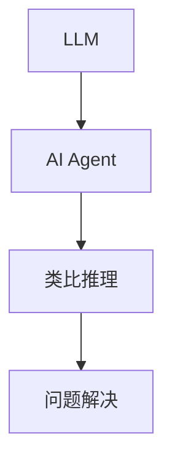
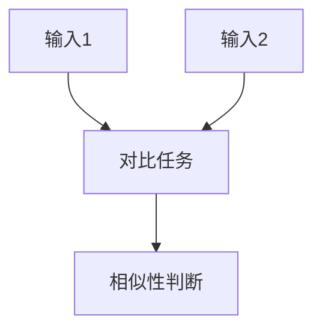
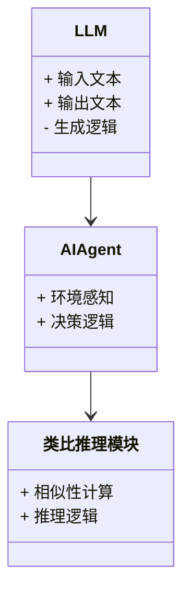
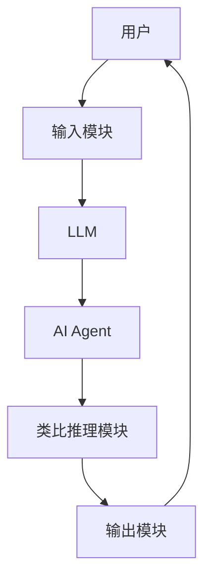

                 


# LLM驱动的AI Agent类比推理能力增强

> **关键词**：LLM、AI Agent、类比推理、自然语言处理、人工智能  
> **摘要**：本文探讨如何通过大语言模型（LLM）提升AI代理的类比推理能力，分析了技术背景、核心概念、算法原理、系统架构，并通过案例展示了实际应用，最后总结了实践经验。

---

## 第一部分：背景介绍

### 第1章：问题背景

#### 1.1 问题背景

在人工智能领域，AI代理（AI Agent）的应用越来越广泛。AI代理能够通过与环境交互，自主决策并执行任务。然而，当前AI代理的类比推理能力较弱，难以处理复杂的逻辑推理和跨领域的知识迁移问题。类比推理是AI代理理解复杂问题和做出决策的关键能力，如何增强这一能力成为当前研究的重点。

#### 1.2 问题描述

类比推理是指通过比较不同事物之间的相似性，推导出新的结论或解决问题的方法。传统的AI代理主要依赖规则和数据统计，难以处理动态变化和复杂场景。而大语言模型（LLM）具有强大的语言理解和生成能力，能够通过大量数据学习类比推理的模式。因此，结合LLM与AI代理，可以有效增强类比推理能力。

#### 1.3 问题解决

通过LLM驱动的AI代理，可以利用模型的上下文理解和生成能力，提升类比推理的准确性和灵活性。具体方法包括：监督微调、对比学习、知识图谱结合等。

#### 1.4 边界与外延

本研究的边界主要集中在LLM驱动的AI代理类比推理能力的提升，不涉及代理的其他功能，如规划和决策。外延则包括未来可能扩展到的领域，如情感计算和多模态推理。

---

## 第二部分：核心概念与联系

### 第2章：核心概念

#### 2.1 核心概念

- **大语言模型（LLM）**：基于Transformer架构，通过大量数据训练，具备强大的文本生成和理解能力。
- **AI代理（AI Agent）**：能够感知环境、自主决策并执行任务的智能体。
- **类比推理**：通过比较不同事物的相似性，推导出新的结论或解决方案。

#### 2.2 对比分析

| 特性         | LLM                 | AI Agent            | 类比推理             |
|--------------|---------------------|----------------------|---------------------|
| 功能         | 语言生成与理解       | 感知与执行任务       | 推理相似性           |
| 输入         | 文本数据             | 环境信息             | 结构化数据或文本     |
| 输出         | 文本生成             | 动作或决策           | 推理结果             |
| 应用场景       | 自然语言处理         | 机器人、智能助手       | 复杂问题解决         |

#### 2.3 实体关系图



---

## 第三部分：算法原理讲解

### 第3章：算法实现

#### 3.1 对比学习算法

对比学习是一种通过比较不同样本的相似性来提升模型学习能力的方法。在类比推理中，对比学习可以用于训练模型识别不同问题之间的相似性。



#### 3.2 相似性度量

使用余弦相似度或欧氏距离来衡量两个向量的相似性。

$$ \text{余弦相似度} = \frac{\vec{a} \cdot \vec{b}}{|\vec{a}| |\vec{b}|} $$

$$ \text{欧氏距离} = \sqrt{(a_1 - b_1)^2 + (a_2 - b_2)^2} $$

---

## 第四部分：系统分析与架构设计

### 第4章：系统架构

#### 4.1 领域模型



#### 4.2 系统架构



---

## 第五部分：项目实战

### 第5章：实战案例

#### 5.1 实施步骤

1. 环境配置：安装Python和相关库。
2. 模型训练：使用监督微调方法训练LLM。
3. 代码实现：编写AI Agent和类比推理模块。
4. 测试：设计测试用例，验证推理能力。

#### 5.2 核心代码

```python
def contrastive_learning(input1, input2):
    # 计算向量表示
    vec1 = model.encode(input1)
    vec2 = model.encode(input2)
    # 计算相似度
    similarity = cosine_similarity(vec1, vec2)
    return similarity
```

---

## 第六部分：最佳实践

### 第6章：经验总结

#### 6.1 最佳实践

- **数据质量**：确保训练数据多样化和高质量。
- **模型选择**：根据任务选择合适的LLM模型。
- **持续优化**：通过反馈机制不断优化推理能力。

#### 6.2 小结

本文详细探讨了如何通过LLM提升AI代理的类比推理能力，从理论到实践，为研究人员和开发者提供了参考。

#### 6.3 注意事项

- 数据隐私问题
- 模型计算资源消耗
- 系统的可解释性

#### 6.4 拓展阅读

- 大语言模型的最新研究
- AI代理的多模态推理
- 对比学习的深入应用

---

## 作者信息

作者：AI天才研究院/AI Genius Institute & 禅与计算机程序设计艺术 /Zen And The Art of Computer Programming

