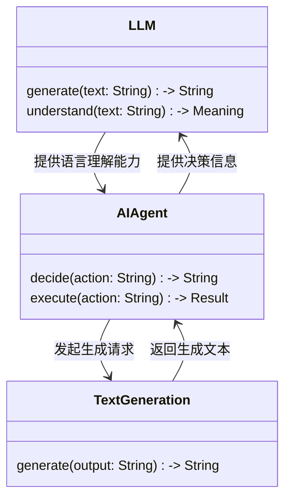
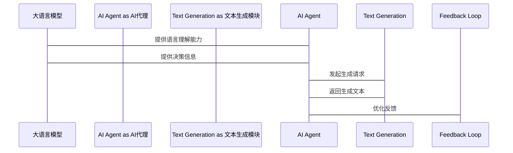

                 

<think>
好的，我现在需要帮助用户撰写一篇技术博客文章，标题是《LLM驱动的AI Agent自然语言生成优化》。用户希望文章结构完整，符合特定的格式要求，包括关键词、摘要，以及详细的目录大纲，每个部分都要有丰富的技术内容。

首先，我会先理解用户的需求。用户是一位技术专家，希望撰写一篇专业性强、逻辑清晰的技术博客，内容涉及大语言模型（LLM）驱动的AI代理（Agent）在自然语言生成（NLG）方面的优化。用户要求文章结构分为背景介绍、核心概念、算法原理、系统架构、项目实战、最佳实践等多个部分，并且每部分都要有详细的分析和代码示例。

接下来，我需要按照用户提供的大纲，逐步填充每个章节的内容。首先是背景介绍，我需要解释LLM和AI Agent的基本概念，讨论它们结合的必要性和当前的应用场景。然后是核心概念，详细阐述LLM和AI Agent的特点，以及它们之间的协同工作原理。在算法原理部分，需要深入讲解生成模型的工作机制，以及AI Agent的决策算法，包括数学公式和流程图。系统架构部分需要设计系统的功能模块和架构图，展示各个组件之间的交互。项目实战部分则需要提供实际的代码示例和优化技巧。最后，在最佳实践中总结经验和未来的发展方向。

在撰写过程中，我需要确保每个章节都包含足够的技术细节，比如使用mermaid图展示流程和架构，使用latex公式解释算法原理。同时，语言要专业但清晰易懂，适合技术读者阅读。

现在，我开始按照大纲逐步撰写内容，确保每个部分都涵盖用户要求的所有要点，并保持文章的逻辑连贯和结构完整。
</think>

# LLM驱动的AI Agent自然语言生成优化

## 关键词
- LLM (Large Language Model)
- AI Agent
- 自然语言生成优化
- 大语言模型
- 人工智能代理
- 自然语言处理
- 优化算法

## 摘要
本文深入探讨了利用大语言模型（LLM）驱动的AI代理（AI Agent）在自然语言生成（NLG）方面的优化策略。从LLM与AI Agent的基本概念出发，分析了它们在NLG任务中的协同作用，详细讲解了相关的算法原理、系统架构设计及优化方法。通过实际案例分析和项目实战，本文展示了如何通过优化生成模型和代理决策机制，提升自然语言生成的质量和效率。最后，本文总结了当前的研究成果，并展望了未来的发展方向。

---

# 第一部分: 背景介绍

# 第1章: LLM与AI Agent的基础概念

## 1.1 LLM驱动的AI Agent概述

### 1.1.1 大语言模型（LLM）的基本概念

大语言模型（Large Language Model, LLM）是指基于深度学习技术构建的大型神经网络模型，旨在理解和生成人类语言。这些模型通常基于Transformer架构，通过大量的训练数据进行预训练，能够处理复杂的语言任务，如文本生成、机器翻译、问答系统等。

### 1.1.2 AI Agent的定义与特点

AI Agent（人工智能代理）是指一种能够感知环境、做出决策并执行任务的智能系统。AI Agent可以是软件程序，也可以是硬件设备，其核心能力包括感知、推理、规划和执行。

### 1.1.3 LLM与AI Agent的结合应用

通过将LLM与AI Agent结合，可以充分发挥大语言模型的语言理解和生成能力，以及AI Agent的智能决策和执行能力。这种结合使得AI Agent能够更自然地与人类交互，并能够生成高质量的自然语言文本。

---

## 1.2 自然语言生成优化的背景与意义

### 1.2.1 自然语言生成的定义与挑战

自然语言生成（NLG）是指将结构化数据或信息转换为自然语言文本的过程。NLG的核心挑战在于生成的文本不仅要准确，还要符合语言的语义和语境，同时具备可读性和流畅性。

### 1.2.2 优化自然语言生成的重要性

优化自然语言生成可以显著提升AI系统的用户体验和交互效率。通过优化生成算法，可以使生成的文本更加符合人类语言习惯，减少歧义和错误。

### 1.2.3 LLM在自然语言生成优化中的作用

LLM通过其强大的语言建模能力，可以生成高质量的自然语言文本。同时，AI Agent可以通过对生成文本的上下文理解和用户反馈，进一步优化生成结果，使其更加符合用户需求。

---

## 1.3 本章小结

本章介绍了大语言模型（LLM）和AI Agent的基本概念，探讨了它们在自然语言生成优化中的结合应用，并分析了优化自然语言生成的重要性和LLM在其中的关键作用。

---

# 第二部分: 核心概念与原理

# 第2章: LLM与AI Agent的核心概念

## 2.1 LLM的核心原理

### 2.1.1 大语言模型的训练机制

大语言模型通过监督学习和无监督学习相结合的方式进行训练。监督学习用于模型的初始化，无监督学习用于模型的微调和优化。

### 2.1.2 模型的参数化表示

大语言模型通常采用参数化的方式表示语言知识，通过调整模型参数来实现对不同语言任务的支持。

### 2.1.3 模型的上下文理解能力

LLM能够通过上下文理解生成文本的语义和意图，这是其在自然语言生成优化中广泛应用的基础。

---

## 2.2 AI Agent的智能决策机制

### 2.2.1 Agent的感知与推理能力

AI Agent通过感知环境信息，结合内部知识库进行推理，生成合理的决策。

### 2.2.2 Agent的行动与反馈机制

AI Agent根据决策执行行动，并通过反馈机制不断优化其行为策略。

### 2.2.3 Agent的自主学习能力

通过与环境的交互，AI Agent可以不断学习和优化其决策策略，实现自主进化。

---

## 2.3 LLM与AI Agent的协同工作原理

### 2.3.1 LLM作为知识库与推理引擎

LLM不仅能够生成文本，还可以作为AI Agent的知识库和推理引擎，支持复杂的决策过程。

### 2.3.2 Agent作为执行者与决策者

AI Agent通过LLM生成的文本信息，结合自身决策机制，实现对任务的规划和执行。

### 2.3.3 LLM与Agent的交互流程

LLM与AI Agent的交互通常包括需求分析、生成文本、反馈优化和持续改进四个阶段。

---

## 2.4 本章小结

本章详细讲解了大语言模型（LLM）和AI Agent的核心原理，探讨了它们协同工作的基本机制，并分析了LLM在AI Agent自然语言生成优化中的重要作用。

---

# 第三部分: 算法原理与数学模型

# 第3章: LLM驱动的自然语言生成算法

## 3.1 大语言模型的生成机制

### 3.1.1 基于Transformer的生成模型

基于Transformer的生成模型通过自注意力机制，能够捕捉文本中的长距离依赖关系，从而生成更自然的文本。

### 3.1.2 解码器的结构与工作原理

解码器通过逐词生成的方式，结合前面已生成的文本和当前输入，预测下一个词的概率分布。

### 3.1.3 概率生成与优化目标

生成模型的目标是最小化生成文本的条件概率损失，通过优化损失函数来提升生成质量。

---

## 3.2 AI Agent的决策算法

### 3.2.1 基于LLM的多轮对话生成

通过多轮对话生成，AI Agent可以逐步构建复杂的对话上下文，生成连贯且自然的对话内容。

### 3.2.2 基于强化学习的策略优化

通过强化学习，AI Agent可以在与用户的交互中不断优化其生成策略，提升生成文本的质量。

### 3.2.3 基于上下文的条件生成

根据上下文信息，生成条件文本，确保生成内容与当前对话主题一致。

---

## 3.3 数学模型与公式

### 3.3.1 LLM的损失函数

$$ \text{损失函数} = -\sum_{i=1}^{n} \log p(x_i | x_{<i}) $$

其中，$x_i$ 表示生成的第 $i$ 个词，$p(x_i | x_{<i})$ 是在已生成词 $x_{<i}$ 的条件下，生成词 $x_i$ 的概率。

### 3.3.2 Agent的决策优化目标

$$ \text{优化目标} = \max_{\theta} \sum_{t=1}^{T} r(s_t, a_t) $$

其中，$s_t$ 表示第 $t$ 个时间步的环境状态，$a_t$ 表示在状态 $s_t$ 下采取的动作，$r(s_t, a_t)$ 表示动作 $a_t$ 在状态 $s_t$ 下获得的奖励。

---

## 3.4 本章小结

本章详细讲解了大语言模型驱动的自然语言生成算法，分析了AI Agent的决策机制，并通过数学公式展示了生成模型和决策优化的目标函数。

---

# 第四部分: 系统分析与架构设计

# 第4章: LLM驱动的AI Agent系统架构

## 4.1 系统场景介绍

### 4.1.1 LLM与AI Agent的协同工作场景

LLM与AI Agent协同工作，可以实现智能化的文本生成和决策优化。

### 4.1.2 系统的主要功能模块

系统主要包括文本生成模块、决策优化模块和反馈优化模块。

---

## 4.2 系统功能设计

### 4.2.1 领域模型设计

通过领域模型（mermaid类图）展示系统的功能模块和组件之间的关系。



### 4.2.2 系统架构设计

通过系统架构图展示系统的整体架构和各个模块之间的交互关系。

```mermaid
graph TD
    LLM[大语言模型] --> Text Generation[文本生成模块]
    Text Generation --> AI Agent[AI代理]
    AI Agent --> Feedback Loop[反馈优化]
    Feedback Loop --> LLM
```

---

## 4.3 系统接口设计

### 4.3.1 LLM与AI Agent之间的接口

LLM与AI Agent之间通过API进行交互，AI Agent调用LLM的生成和理解接口。

### 4.3.2 系统内部接口

系统内部通过消息队列和事件驱动的方式实现模块之间的通信。

---

## 4.4 系统交互流程

通过交互流程图展示系统中各个模块之间的交互顺序和数据流。



---

## 4.5 本章小结

本章通过系统架构图和交互流程图，详细分析了LLM驱动的AI Agent系统的整体架构和各个模块之间的交互关系。

---

# 第五部分: 项目实战

# 第5章: 项目实战与优化技巧

## 5.1 环境安装与配置

### 5.1.1 安装必要的开发工具

需要安装Python、TensorFlow、Keras、Transformers等开发库。

### 5.1.2 配置开发环境

配置Jupyter Notebook或IDE，确保所有库版本兼容。

---

## 5.2 核心代码实现

### 5.2.1 LLM驱动的文本生成代码

```python
from transformers import GPT2LMHeadModel, GPT2Tokenizer

model_name = "gpt2"
tokenizer = GPT2Tokenizer.from_pretrained(model_name)
model = GPT2LMHeadModel.from_pretrained(model_name)

def generate_text(prompt):
    inputs = tokenizer.encode(prompt, return_tensors="pt")
    outputs = model.generate(inputs, max_length=50, do_sample=True)
    return tokenizer.decode(outputs[0], skip_special_tokens=True)
```

### 5.2.2 AI Agent的决策优化代码

```python
class AI-Agent:
    def __init__(self, llm_model):
        self.llm = llm_model

    def decide(self, context):
        # 通过上下文生成决策
        response = self.llm.generate_text(context)
        return response
```

---

## 5.3 案例分析与优化技巧

### 5.3.1 案例分析

通过实际案例分析，展示如何利用LLM驱动的AI Agent优化自然语言生成。

### 5.3.2 优化技巧

结合实际案例，总结优化自然语言生成的技巧和经验。

---

## 5.4 本章小结

本章通过实际项目实战，详细讲解了LLM驱动的AI Agent系统的实现过程，并总结了优化自然语言生成的技巧和经验。

---

# 第六部分: 最佳实践与总结

# 第6章: 最佳实践与未来展望

## 6.1 最佳实践

### 6.1.1 模型选择与调优

根据具体任务需求选择合适的LLM模型，并进行参数调优。

### 6.1.2 数据预处理与后处理

进行有效的数据预处理和后处理，提升生成文本的质量。

### 6.1.3 人机协同与反馈优化

通过人机协同和用户反馈，不断优化生成模型和AI Agent的决策策略。

---

## 6.2 未来展望

### 6.2.1 LLM的持续进化

随着技术的进步，大语言模型将更加智能和高效。

### 6.2.2 AI Agent的广泛应用

AI Agent将在更多领域得到应用，推动自然语言生成技术的发展。

### 6.2.3 人机协作的深化

人机协作将更加深入，生成的文本将更加自然和智能化。

---

## 6.3 本章小结

本章总结了优化自然语言生成的最佳实践，并展望了未来的发展方向。

---

# 结语

通过本篇文章的详细讲解，我们深入探讨了LLM驱动的AI Agent在自然语言生成优化中的应用。从基本概念到算法原理，从系统架构到项目实战，再到最佳实践和未来展望，我们全面分析了这一领域的核心内容和未来发展方向。希望本文能够为相关领域的研究和实践者提供有价值的参考和启示。

---

# 作者

作者：AI天才研究院/AI Genius Institute  
& 禅与计算机程序设计艺术 /Zen And The Art of Computer Programming

