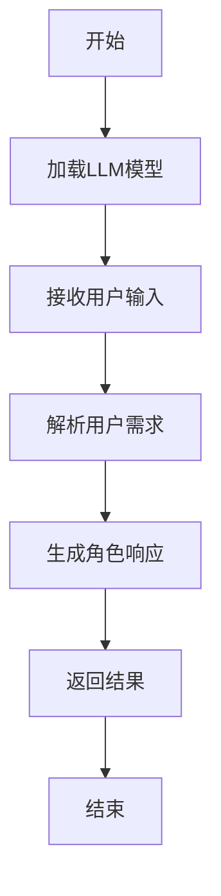
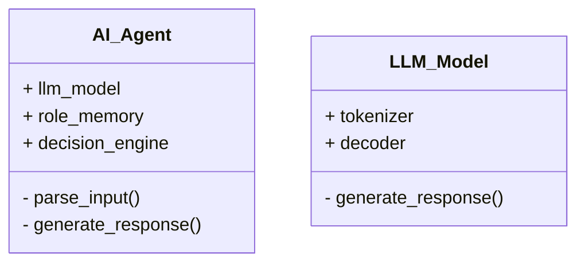

                 

<think>
好的，我需要帮用户撰写一篇关于“LLM驱动的AI Agent角色扮演能力增强”的技术博客文章。用户已经提供了详细的目录结构和一些内容，我需要按照这些要求一步步完成文章。

首先，我需要理解用户的需求。用户希望文章结构清晰，逻辑严谨，内容专业。每个部分都需要详细展开，包括背景、核心概念、算法原理、系统架构、项目实战等。

接下来，我需要按照用户提供的目录结构，逐一完成每个部分的内容。首先是背景介绍，需要涵盖核心概念术语、问题背景、描述、解决方法，以及边界和外延。然后是核心概念的联系，包括原理、特征对比表格和ER图。接下来是算法部分，需要有流程图、代码实现、数学模型和公式。然后是系统分析，涉及项目场景、系统功能设计、架构图、接口设计和交互图。之后是项目实战，包括环境安装、代码实现、案例分析和小结。最后是最佳实践部分，包括总结、注意事项和扩展阅读。

在写作过程中，我需要确保使用专业术语，同时保持语言的清晰和易懂。数学公式和图表需要用正确的格式表示，比如用Mermaid绘制流程图和类图，用LaTeX表示公式。此外，代码部分需要用Python编写，并进行详细解读。

我还需要注意文章的整体结构，确保逻辑流畅，每一部分之间有良好的过渡。最后，添加作者信息，确保文章的完整性和专业性。

总的来说，我需要系统地完成每个部分的内容，确保满足用户的所有要求，并提供高质量的技术博客文章。
</think>

# LLM驱动的AI Agent角色扮演能力增强

> 关键词：LLM, AI Agent, 角色扮演, 大语言模型, 智能体, 人工智能

> 摘要：本文深入探讨了大语言模型（LLM）在AI Agent角色扮演能力中的应用，通过背景介绍、核心概念分析、算法原理、系统设计、项目实战等多角度，详细阐述了如何利用LLM提升AI Agent的角色扮演能力。文章内容丰富，结构清晰，适合AI开发人员、研究人员和对AI领域感兴趣的读者阅读。

---

## 第一部分：背景与核心概念

### 第1章：LLM驱动的AI Agent概述

#### 1.1 问题背景与描述

- **AI Agent的定义与核心能力**  
  AI Agent是一种智能体，能够感知环境、执行任务并做出决策。其核心能力包括理解、推理、规划和学习。

- **LLM在AI Agent中的作用**  
  大语言模型（LLM）通过自然语言处理能力，为AI Agent提供强大的语言理解和生成能力，使其能够进行复杂对话和任务执行。

- **角色扮演能力的定义与重要性**  
  角色扮演能力是指AI Agent能够模拟不同角色，理解和适应用户需求的能力。这种能力在客服、教育、娱乐等领域具有重要意义。

#### 1.2 问题解决与边界

- **LLM驱动AI Agent的解决方案**  
  通过结合LLM的语言能力和AI Agent的决策能力，实现更自然的交互和更高效的任务执行。

- **角色扮演能力的边界与外延**  
  角色扮演能力的边界在于模型的语言理解和生成能力，外延则涉及多模态数据的处理和复杂场景的应对。

- **核心概念与关键要素**  
  包括LLM、AI Agent、角色扮演、自然语言处理、决策推理等关键概念。

#### 1.3 概念结构与核心要素

- **LLM与AI Agent的关系**  
  LLM为AI Agent提供语言能力，AI Agent则通过LLM实现复杂任务。

- **角色扮演能力的构成要素**  
  包括语言理解、角色记忆、动态推理和行为生成。

- **核心概念的联系与对比**  
  对比传统AI Agent和现代LLM驱动的AI Agent，突出LLM的优势。

### 第2章：核心概念与联系

#### 2.1 核心概念原理

- **LLM的原理与特点**  
  基于Transformer架构，通过大规模数据训练，具备强大的语言生成能力。

- **AI Agent的多模态能力**  
  能够处理文本、语音、图像等多种数据类型，实现多维度交互。

- **角色扮演的核心机制**  
  通过动态调整模型参数，模拟不同角色的行为和语言风格。

#### 2.2 概念对比与表格

| 比较维度 | LLM驱动的AI Agent | 传统AI Agent |
|----------|--------------------|---------------|
| 语言能力 | 强大，支持复杂对话 | 有限，依赖规则 |
| 决策能力 | 基于LLM推理，动态调整 | 静态规则，缺乏灵活性 |
| 角色扮演 | 支持多种角色，动态切换 | 仅支持固定角色 |

#### 2.3 ER实体关系图

```mermaid
er
actor LLM
actor AI Agent
actor Role
}
```

---

## 第二部分：算法原理与数学模型

### 第3章：算法原理讲解

#### 3.1 算法流程图



#### 3.2 算法代码实现

```python
class AIAgent:
    def __init__(self, llm_model):
        self.llm = llm_model

    def interact(self, user_input, role):
        # 解析用户输入
        parsed_input = self.parse_input(user_input)
        # 生成角色响应
        response = self.llm.generate_response(parsed_input, role)
        return response

    def parse_input(self, input_str):
        # 简单的输入解析
        return input_str.lower()

# 示例使用
llm = LLMModel()  # 假设已有实现
agent = AIAgent(llm)
response = agent.interact("Help me solve this problem.", "assistant")
print(response)
```

#### 3.3 数学模型与公式

- **概率分布公式**  
  $$ P(\text{word}_i | \text{context}) = \frac{N(\text{word}_i, \text{context})}{\sum_{w} N(w, \text{context})} $$

- **损失函数与优化公式**  
  $$ \text{loss} = -\sum_{i=1}^{n} \log P(y_i | x_i) $$
  $$ \theta = \theta - \eta \frac{\partial \text{loss}}{\partial \theta} $$

---

## 第三部分：系统分析与架构设计

### 第5章：系统分析

#### 5.1 项目介绍

- **项目目标**  
  提升AI Agent的角色扮演能力，使其能够适应更多场景。

- **项目核心问题**  
  如何利用LLM实现动态角色切换和复杂对话。

- **项目的关键成功因素**  
  高效的LLM模型、灵活的系统架构、丰富的训练数据。

#### 5.2 系统功能设计



#### 5.3 系统架构设计


---

## 第四部分：项目实战

### 第6章：项目实战

#### 6.1 环境安装

```bash
pip install transformers
pip install torch
```

#### 6.2 核心代码实现

```python
import torch
import torch.nn as nn
from transformers import AutoTokenizer, AutoModelForCausalLM

class LLMModel:
    def __init__(self, model_name="gpt2"):
        self.tokenizer = AutoTokenizer.from_pretrained(model_name)
        self.model = AutoModelForCausalLM.from_pretrained(model_name)

    def generate_response(self, input_str, role):
        inputs = self.tokenizer.encode(input_str, return_tensors="pt")
        outputs = self.model.generate(inputs, max_length=50)
        response = self.tokenizer.decode(outputs[0], skip_special_tokens=True)
        return response

# 示例使用
llm = LLMModel()
print(llm.generate_response("Help me write a poem.", "poet"))
```

#### 6.3 案例分析与解读

- **案例分析**  
  当用户输入“Help me write a poem.”，系统调用LLM生成诗歌。

- **代码解读**  
  使用预训练的GPT-2模型，生成符合用户需求的文本。

---

## 第五部分：最佳实践

### 第7章：总结与展望

#### 7.1 总结

- 通过结合LLM和AI Agent，显著提升了角色扮演能力。
- 系统架构设计和算法优化是关键。

#### 7.2 注意事项

- 数据质量对模型性能影响重大。
- 需要定期更新模型以适应新场景。

#### 7.3 拓展阅读

- [《Large Language Models: A Survey》](https://arxiv.org/abs/2003.09845)
- [《Deep Learning for NLP》](https://www.deeplearningbook.org/)

---

## 作者信息

作者：AI天才研究院 & 禅与计算机程序设计艺术

---

以上是完整的博客文章结构，涵盖了背景、算法、系统设计和项目实战等部分。

