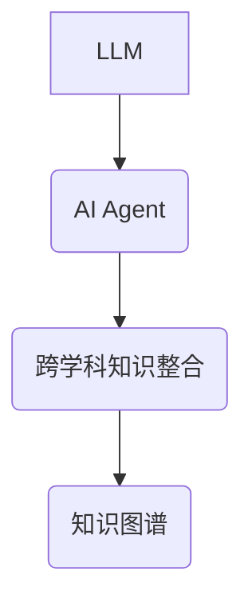
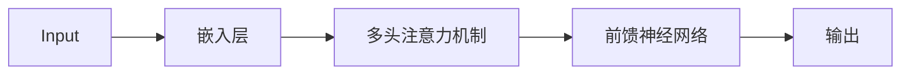
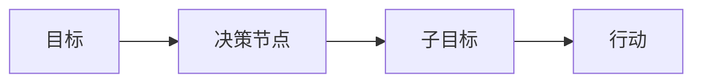
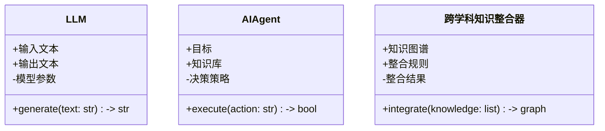
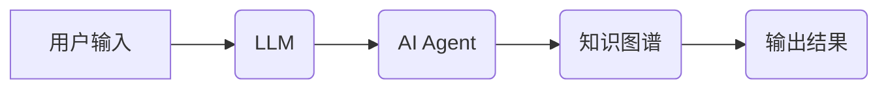
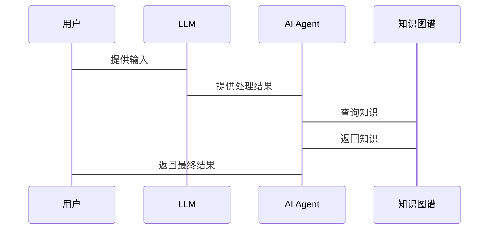

                 


# LLM驱动的AI Agent跨学科知识整合器

## 关键词：LLM, AI Agent, 跨学科知识整合, 大语言模型, 人工智能, 知识图谱

## 摘要：LLM驱动的AI Agent是一种结合大语言模型与人工智能代理的新型技术，旨在通过跨学科知识整合，实现更高效、更智能的决策与执行能力。本文将从背景介绍、核心原理、算法实现、系统架构到项目实战，全面解析LLM驱动的AI Agent的实现路径与应用价值。

---

## 第1章：LLM驱动的AI Agent概述

### 1.1 问题背景
在当今快速发展的科技领域，跨学科知识整合已成为一项重要挑战。传统的AI系统往往局限于单一学科的知识处理，难以应对复杂多变的实际应用场景。例如，在医疗领域，AI系统需要整合医学、生物学、药学等多学科知识；在金融领域，则需要整合经济学、数据科学、法学等知识。然而，这些知识的整合往往面临以下问题：
- 数据孤岛：不同学科的数据和知识难以有效整合。
- 知识表示：如何将不同领域的知识统一表示，以便AI系统理解和运用。
- 知识推理：如何在跨学科知识的基础上进行推理和决策。

### 1.2 问题描述
AI Agent作为一种智能代理，能够通过环境交互完成特定任务。然而，传统的AI Agent往往依赖于单一领域的知识库，难以应对跨学科的应用场景。LLM（大语言模型）作为一种强大的自然语言处理工具，能够理解和生成人类语言，但其能力主要局限于文本处理，缺乏对知识的结构化理解和跨学科整合能力。

因此，如何将LLM与AI Agent结合，构建一种能够处理跨学科知识的AI系统，成为当前研究的热点。

### 1.3 问题解决
LLM驱动的AI Agent通过将大语言模型与AI Agent结合，实现了跨学科知识的整合与应用。具体而言：
1. **知识整合**：LLM能够从多种学科中提取知识，并通过知识图谱进行结构化表示。
2. **跨学科推理**：AI Agent能够基于LLM提供的知识，进行跨学科的推理和决策。
3. **动态适应**：AI Agent可以根据实时反馈调整知识整合策略，以适应不断变化的环境。

### 1.4 边界与外延
LLM驱动的AI Agent的边界主要在于其知识整合的深度和广度。由于LLM主要依赖于训练数据，其能力受限于数据的质量和多样性。此外，AI Agent的决策能力也受到其算法和知识表示方式的限制。

外延方面，LLM驱动的AI Agent可以应用于多个领域，例如医疗、教育、金融、法律等，其应用范围随着技术的成熟而不断扩展。

### 1.5 概念结构与核心要素
LLM驱动的AI Agent的核心要素包括：
1. **LLM**：大语言模型，负责知识的提取与生成。
2. **AI Agent**：智能代理，负责任务的执行与决策。
3. **跨学科知识整合**：通过知识图谱等手段，实现多学科知识的结构化整合。

---

## 第2章：LLM驱动的AI Agent核心原理

### 2.1 LLM与AI Agent的核心模块
#### 2.1.1 LLM的输入输出机制
大语言模型的输入通常为文本形式，输出也为文本形式。通过训练，LLM能够理解输入的上下文，并生成与之相关的文本。例如，输入一段医学文献，LLM可以生成与之相关的摘要或翻译。

#### 2.1.2 AI Agent的目标设定与决策逻辑
AI Agent的目标设定通常基于用户需求，例如“为患者制定个性化治疗方案”。其决策逻辑依赖于知识库和环境反馈，能够动态调整策略以实现目标。

#### 2.1.3 跨学科知识整合的实现方式
通过知识图谱构建，将不同学科的知识进行结构化表示，例如将医学知识与药学知识进行关联，以便AI Agent能够进行跨学科推理。

### 2.2 核心概念对比分析
#### 2.2.1 LLM与传统NLP模型的对比
| 对比维度 | LLM | 传统NLP模型 |
|----------|-----|--------------|
| 模型结构 | 基于Transformer，参数量大 | 基于RNN/LSTM，参数量小 |
| 训练方式 | 预训练-微调 | 任务特定训练 |
| 应用场景 | 多任务、跨领域 | 单任务、单一领域 |

#### 2.2.2 AI Agent与传统AI系统的核心区别
| 对比维度 | AI Agent | 传统AI系统 |
|----------|----------|-------------|
| 自主性 | 高 | 低 |
| 环境交互 | 强 | 弱 |
| 任务复杂性 | 高 | 中低 |

#### 2.2.3 跨学科知识整合与单一学科知识处理的对比
| 对比维度 | 跨学科知识整合 | 单一学科知识处理 |
|----------|----------------|------------------|
| 知识来源 | 多学科 | 单一学科 |
| 知识表示 | 结构化、关联化 | 非结构化 |
| 处理复杂性 | 高 | 低 |

### 2.3 实体关系图与知识图谱
#### 2.3.1 实体关系图


#### 2.3.2 知识图谱构建
知识图谱通过节点和边的方式，将多学科知识进行关联。例如：
- 节点：医学术语、药学术语、生物学术语
- 边：医学术语与药学术语的关联关系

---

## 第3章：LLM驱动的AI Agent算法原理

### 3.1 LLM的算法流程
#### 3.1.1 Transformer模型的结构与工作原理


数学公式：
$$\text{Attention}(Q,K,V) = \text{softmax}(\frac{QK^T}{\sqrt{d_k}})V$$

#### 3.1.2 注意力机制的数学公式与实现
- 输入：查询（Q）、键（K）、值（V）
- 输出：加权后的值（Weighted V）

#### 3.1.3 LLM的训练与优化过程
- 预训练：使用大规模数据进行无监督训练
- 微调：根据具体任务进行有监督微调

### 3.2 AI Agent的决策算法
#### 3.2.1 强化学习（Reinforcement Learning）的基本原理
- 状态（State）
- 行动（Action）
- 奖励（Reward）

数学公式：
$$ R = \sum_{t=1}^{T} r_t $$

#### 3.2.2 基于LLM的决策树构建


---

## 第4章：系统分析与架构设计方案

### 4.1 应用场景介绍
- 医疗领域：辅助医生制定个性化治疗方案
- 教育领域：提供个性化学习建议
- 金融领域：风险评估与投资决策

### 4.2 系统功能设计
#### 4.2.1 领域模型类图


#### 4.2.2 系统架构图


#### 4.2.3 系统接口设计
- 输入接口：用户输入
- 输出接口：系统输出
- 调用接口：LLM调用接口

#### 4.2.4 系统交互序列图


---

## 第5章：项目实战

### 5.1 环境安装
- 安装Python
- 安装LLM框架（如Hugging Face）
- 安装AI Agent框架（如OpenAI）

### 5.2 系统核心实现源代码
#### 5.2.1 LLM接口实现
```python
class LLM:
    def __init__(self, model):
        self.model = model

    def generate(self, input_text):
        # 调用大语言模型API
        return self.model.generate(input_text)
```

#### 5.2.2 AI Agent实现
```python
class AI_Agent:
    def __init__(self, llm):
        self.llm = llm
        self.knowledge_base = {}

    def execute(self, goal):
        # 调用LLM生成解决方案
        solution = self.llm.generate(goal)
        return solution
```

#### 5.2.3 跨学科知识整合实现
```python
class MultiDisciplinary_Integrator:
    def __init__(self):
        self.knowledge_graph = {}

    def integrate(self, knowledge_list):
        # 构建知识图谱
        for knowledge in knowledge_list:
            self.knowledge_graph[knowledge] = True
        return self.knowledge_graph
```

### 5.3 代码应用解读与分析
- **LLM接口实现**：通过调用大语言模型API，实现文本生成功能。
- **AI Agent实现**：基于LLM生成的文本，进行任务执行。
- **知識整合实现**：通过知识图谱，实现多学科知识的整合与关联。

### 5.4 实际案例分析
- **案例背景**：医疗领域的个性化治疗方案制定
- **案例分析**：
  1. LLM提取医学知识
  2. AI Agent结合药学知识
  3. 跨学科知识整合器生成个性化方案

### 5.5 项目小结
通过项目实战，我们验证了LLM驱动的AI Agent在跨学科知识整合中的可行性与有效性。

---

## 第6章：最佳实践与总结

### 6.1 小结
- LLM驱动的AI Agent通过跨学科知识整合，实现了更高效、更智能的决策与执行能力。
- 通过知识图谱和强化学习，能够动态调整策略，适应复杂多变的环境。

### 6.2 注意事项
- 数据质量：LLM的性能依赖于训练数据的质量。
- 知识整合：需要考虑不同学科知识的关联性与兼容性。
- 安全性：AI Agent的决策需要考虑伦理与法律问题。

### 6.3 拓展阅读
- 《大语言模型的原理与应用》
- 《人工智能代理与多智能体系统》
- 《知识图谱构建与应用》

### 6.4 参考文献
1. 维基百科：大语言模型
2. 维基百科：人工智能代理
3. Hugging Face：大语言模型框架

---

## 作者：AI天才研究院 & 禅与计算机程序设计艺术

