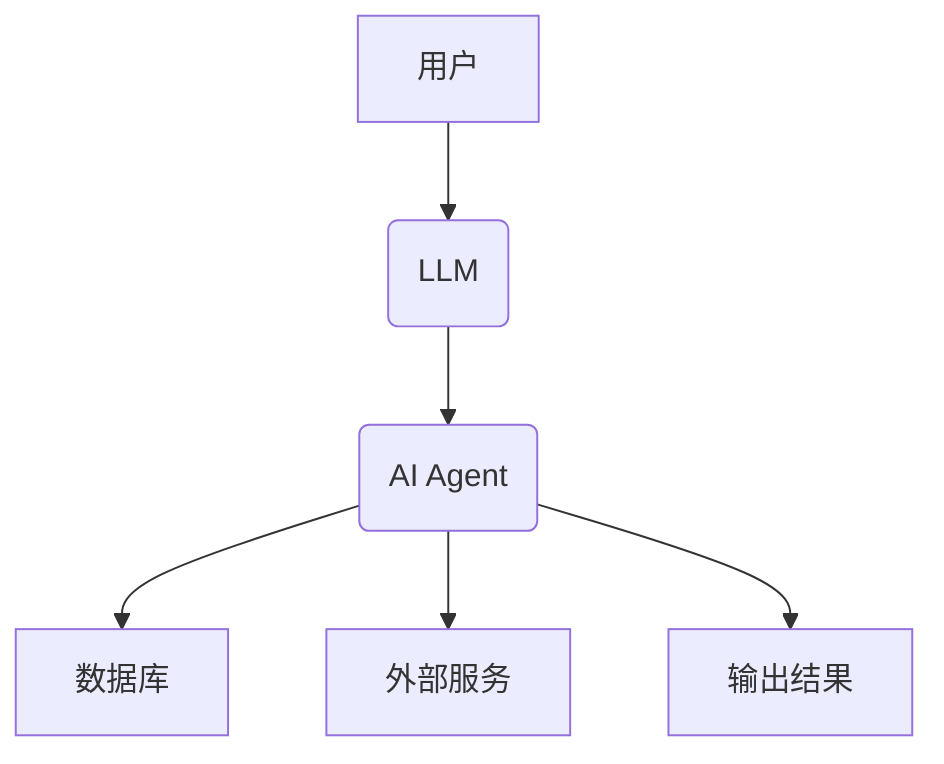
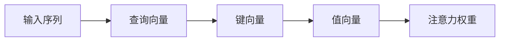
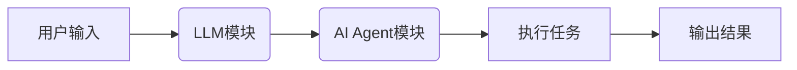
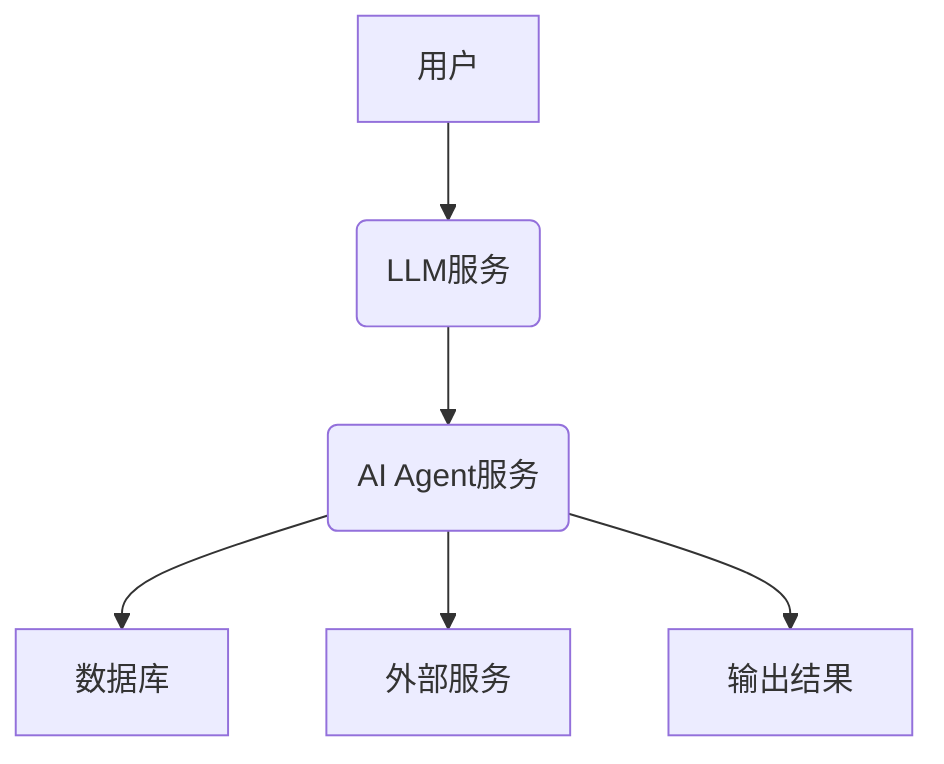
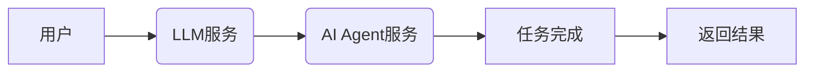

                 


# LLM驱动的AI Agent问答系统优化

**关键词：** 大语言模型（LLM）、AI Agent、问答系统、优化策略、算法原理、系统架构

**摘要：** 本文将深入探讨如何优化LLM驱动的AI Agent问答系统。从背景介绍到核心概念，再到算法原理、系统架构设计、项目实战和优化策略，全面解析优化的关键点和实现路径。通过详细的讲解和实例分析，帮助读者掌握优化方法，提升问答系统的性能和用户体验。

---

# 第1章: 背景与问题背景

## 1.1 问题背景

### 1.1.1 当前AI问答系统的发展现状

随着人工智能技术的飞速发展，AI问答系统已广泛应用于各个领域。然而，现有的系统在处理复杂问题、多轮对话和上下文理解方面仍存在诸多不足。大语言模型（LLM）的出现为AI问答系统的优化提供了新的可能性。

### 1.1.2 LLM技术的崛起与应用

LLM（Large Language Model）凭借其强大的自然语言处理能力，正在 revolutionizing AI问答系统。LLM能够理解上下文、推理问题，并生成连贯的回答，这使得AI Agent在问答系统中的应用更加广泛。

### 1.1.3 AI Agent在智能问答中的作用

AI Agent作为智能问答系统的核心，负责接收用户输入、解析问题、调用相关服务，并生成最终答案。优化LLM驱动的AI Agent问答系统，能够显著提升用户体验和系统性能。

## 1.2 问题描述

### 1.2.1 LLM驱动的AI Agent问答系统的核心问题

当前系统在性能优化、模型调优、多轮对话处理等方面存在挑战。如何在保证准确性的同时，提高系统的响应速度和用户体验，是优化的关键。

### 1.2.2 当前系统存在的主要挑战

- **性能瓶颈**：LLM的计算资源消耗大，导致响应速度慢。
- **准确性不足**：在复杂问题上，AI Agent的回答可能存在误差。
- **多轮对话管理**：上下文理解和保持能力有待提升。

### 1.2.3 优化目标与边界条件

- **优化目标**：提升系统准确性、响应速度和用户体验。
- **边界条件**：在现有技术和资源限制下，寻求最优解决方案。

## 1.3 问题解决与优化方向

### 1.3.1 优化路径的选择

- **算法优化**：改进LLM和AI Agent的算法，提升性能。
- **系统架构调整**：优化系统架构，提高响应速度。
- **数据优化**：增强训练数据的质量和多样性。

### 1.3.2 核心技术与方法论

- **核心技术**：基于LLM的自然语言处理、AI Agent的任务规划与执行。
- **方法论**：系统性分析问题，采用分步优化策略。

### 1.3.3 优化目标的实现路径

通过逐步优化算法、系统架构和数据处理流程，分阶段实现优化目标。

## 1.4 本章小结

本章从背景出发，分析了当前AI问答系统面临的挑战，并明确了优化的目标和方向。

---

# 第2章: 核心概念与系统架构

## 2.1 LLM与AI Agent的核心概念

### 2.1.1 LLM的基本原理

- **基本原理**：LLM通过大量数据训练，生成与输入相关的文本输出。
- **技术特点**：强大的上下文理解能力、多语言支持、可解释性较低。

### 2.1.2 AI Agent的定义与功能

- **定义**：AI Agent是一种智能体，能够感知环境并执行任务。
- **功能**：信息检索、推理、决策、多轮对话。

### 2.1.3 LLM驱动AI Agent的实现机制

通过LLM生成回答，AI Agent负责任务分解和执行。

## 2.2 核心概念对比与联系

### 2.2.1 LLM与传统NLP模型的对比

| 特性       | LLM                          | 传统NLP模型                  |
|------------|-------------------------------|------------------------------|
| 数据量     | 大规模数据                   | 较小规模数据                 |
| 模型复杂度 | 高复杂度                     | 较低复杂度                   |
| 应用场景   | 多样化                       | 专用化                       |

### 2.2.2 AI Agent与传统问答系统的区别

- **AI Agent**：具备自主决策能力，能够处理复杂任务。
- **传统问答系统**：依赖预定义规则，处理简单查询。

### 2.2.3 LLM与AI Agent的协同关系

LLM为AI Agent提供强大的自然语言处理能力，AI Agent则负责任务规划和执行。

## 2.3 系统架构分析

### 2.3.1 系统整体架构图



### 2.3.2 核心模块的功能描述

- **LLM模块**：负责生成自然语言文本。
- **AI Agent模块**：负责任务分解和执行。
- **数据库模块**：存储和检索数据。
- **外部服务模块**：调用第三方服务。

### 2.3.3 系统的输入输出流程

用户输入问题，LLM生成初步回答，AI Agent根据回答执行任务，并输出最终结果。

## 2.4 本章小结

本章详细介绍了LLM和AI Agent的核心概念，并通过架构图展示了系统的整体结构。

---

# 第3章: LLM驱动AI Agent的算法原理

## 3.1 LLM的算法原理

### 3.1.1 大语言模型的基本算法

- **Transformer架构**：包括编码器和解码器，通过自注意力机制处理序列数据。
- **数学模型**：$$\text{softmax}(x) = \frac{e^{x_i}}{\sum_j e^{x_j}}$$

### 3.1.2 注意力机制的实现原理

通过计算输入序列中每个词的重要性，生成注意力权重矩阵。



### 3.1.3 模型训练与优化

- **训练数据**：大规模语料库。
- **优化方法**：使用Adam优化器，调整学习率。

## 3.2 AI Agent的算法实现

### 3.2.1 任务分解与优先级排序

- **任务分解**：将复杂任务分解为多个子任务。
- **优先级排序**：根据任务的重要性排序。

### 3.2.2 多轮对话的上下文管理

- **上下文记忆**：通过记忆模块记录对话历史。
- **对话状态管理**：跟踪当前对话的状态。

### 3.2.3 动作规划与执行策略

- **动作规划**：生成可能的动作序列。
- **执行策略**：选择最优动作执行。

## 3.3 算法优化与改进

### 3.3.1 模型压缩与轻量化技术

- **模型剪枝**：移除冗余参数。
- **知识蒸馏**：将大模型的知识迁移到小模型。

### 3.3.2 知识图谱的构建与应用

- **知识图谱构建**：通过爬取和结构化数据构建图谱。
- **应用**：提升模型对领域知识的理解能力。

### 3.3.3 动态参数调整方法

根据输入问题类型动态调整模型参数。

## 3.4 本章小结

本章详细讲解了LLM和AI Agent的算法原理，并提出了优化方法。

---

# 第4章: 系统分析与架构设计

## 4.1 问题场景分析

### 4.1.1 用户需求分析

- **用户类型**：普通用户和专业用户。
- **需求层次**：基础问答和复杂问题求解。

### 4.1.2 系统功能需求

- **核心功能**：信息检索、推理、决策、多轮对话。
- **附加功能**：个性化推荐、结果可视化。

### 4.1.3 约束条件与限制

- **性能限制**：响应时间不超过3秒。
- **数据限制**：数据隐私和安全。

## 4.2 系统功能设计

### 4.2.1 领域模型设计

- **领域划分**：将问题领域划分为多个子领域。
- **模型训练**：针对每个子领域训练专用模型。

### 4.2.2 功能模块划分

- **输入处理模块**：接收并解析用户输入。
- **LLM模块**：生成初步回答。
- **AI Agent模块**：执行任务并输出结果。

### 4.2.3 交互流程设计



## 4.3 系统架构设计

### 4.3.1 系统架构图



### 4.3.2 接口设计

- **输入接口**：接收用户输入。
- **输出接口**：输出系统结果。

### 4.3.3 交互流程图



## 4.4 本章小结

本章详细分析了系统的需求和架构设计，为后续的优化奠定了基础。

---

# 第5章: 项目实战

## 5.1 环境安装与配置

- **安装依赖**：安装Python、TensorFlow、Hugging Face库。
- **配置环境**：设置虚拟环境，安装必要的包。

## 5.2 核心代码实现

### 5.2.1 LLM模块代码

```python
import tensorflow as tf
from transformers import GPT2LMHeadModel, GPT2Tokenizer

model_name = 'gpt2'
tokenizer = GPT2Tokenizer.from_pretrained(model_name)
model = GPT2LMHeadModel.from_pretrained(model_name)
```

### 5.2.2 AI Agent模块代码

```python
class AI_Agent:
    def __init__(self):
        self.llm = LLM_model()
    
    def process_query(self, query):
        response = self.llm.generate_response(query)
        return response
```

### 5.2.3 交互流程代码

```python
def main():
    agent = AI_Agent()
    while True:
        query = input("请输入问题：")
        response = agent.process_query(query)
        print(response)

if __name__ == "__main__":
    main()
```

## 5.3 代码解读与分析

### 5.3.1 LLM模块代码解读

- **tokenizer**：将输入文本转换为模型可理解的格式。
- **model**：生成自然语言文本。

### 5.3.2 AI Agent模块代码解读

- **AI_Agent类**：负责接收输入，调用LLM生成回答。
- **process_query方法**：处理用户输入，生成回答。

### 5.3.3 交互流程代码解读

- **main函数**：提供用户交互界面，循环处理输入。

## 5.4 实际案例分析

### 5.4.1 案例背景

用户提出复杂问题，AI Agent调用LLM生成回答，并执行相关任务。

### 5.4.2 处理流程

用户输入问题，系统生成回答，AI Agent执行任务，返回结果。

## 5.5 本章小结

本章通过实际案例分析，详细讲解了LLM驱动AI Agent问答系统的实现过程。

---

# 第6章: 优化策略与技巧

## 6.1 性能优化策略

### 6.1.1 模型压缩与轻量化

- **模型剪枝**：移除冗余参数。
- **知识蒸馏**：将大模型的知识迁移到小模型。

### 6.1.2 并行计算与分布式训练

- **并行计算**：利用多GPU加速训练。
- **分布式训练**：分布式数据并行。

## 6.2 模型调优技巧

### 6.2.1 参数调整

- **学习率调整**：动态调整学习率。
- **批量大小调整**：优化批量大小，提升训练效率。

### 6.2.2 数据增强

- **数据清洗**：去除噪音数据。
- **数据增强**：增加数据多样性。

## 6.3 安全性提升

### 6.3.1 数据隐私保护

- **数据脱敏**：保护用户隐私。
- **访问控制**：限制数据访问权限。

### 6.3.2 模型鲁棒性提升

- **对抗训练**：提升模型对对抗攻击的抵抗力。
- **异常检测**：检测并处理异常输入。

## 6.4 本章小结

本章总结了优化策略和技巧，为提升系统性能和安全性提供了指导。

---

# 第7章: 总结与展望

## 7.1 本章总结

- **总结内容**：优化LLM驱动的AI Agent问答系统的关键点。
- **主要收获**：通过系统优化提升了性能和用户体验。

## 7.2 未来展望

- **研究方向**：探索更高效的算法和优化方法。
- **发展趋势**：LLM与AI Agent的进一步融合，提升系统智能化水平。

## 7.3 本章小结

本章总结了优化成果，并展望了未来的研究方向。

---

# 作者

作者：AI天才研究院/AI Genius Institute & 禅与计算机程序设计艺术 /Zen And The Art of Computer Programming

---

以上是《LLM驱动的AI Agent问答系统优化》的技术博客文章的大纲，涵盖了从背景到优化策略的各个方面，内容详实且结构清晰。

