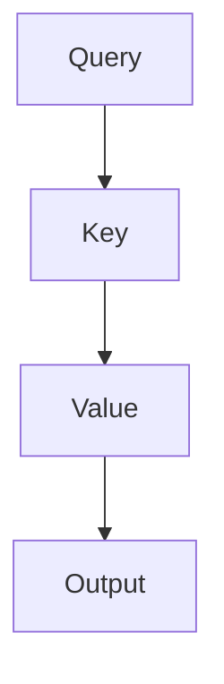
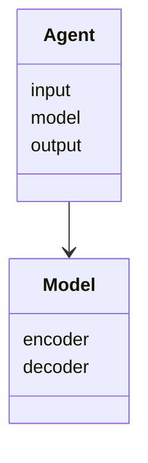
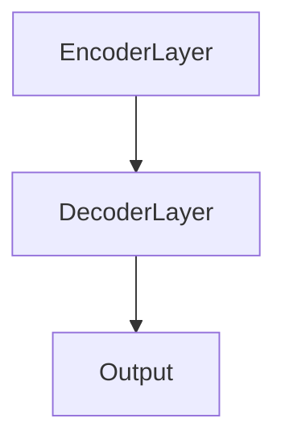
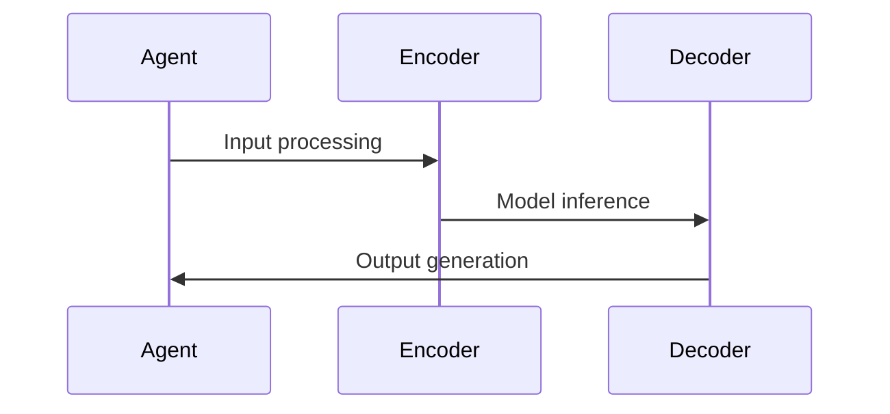

                 

<think>
好的，我需要根据用户的要求撰写一篇关于《Transformer架构：构建高效的序列处理AI Agent》的博客文章。用户已经提供了一个详细的目录大纲，我需要按照这个大纲逐步展开，确保每个部分都详细且符合要求。

首先，我将从“关键词”和“摘要”开始，确保它们准确反映了文章的核心内容。接下来，按照目录的顺序，逐一撰写每个章节的内容，包括背景介绍、核心概念、算法原理、系统分析、项目实战等部分。

在撰写过程中，我需要确保使用专业的技术语言，同时保持逻辑清晰和结构紧凑。对于每个关键概念，我将提供详细的解释，并使用图表和代码示例来辅助说明。例如，在讲解自注意力机制时，我会使用Mermaid绘制流程图，并在适当的位置插入数学公式，确保公式用LaTeX正确表示。

同时，我需要特别注意章节之间的连贯性，确保读者能够顺畅地理解从基础概念到实际应用的整个过程。最后，在文章末尾添加作者信息，确保格式正确。

在写作过程中，我需要反复检查，确保每个部分都符合用户的要求，包括字数、格式和内容的完整性。特别是在项目实战部分，我需要详细描述环境安装、代码实现和案例分析，帮助读者实际操作。

通过这样的系统性思考和分步撰写，我相信能够完成一篇高质量、内容详实的博客文章，满足用户的所有要求。
</think>

# Transformer架构：构建高效的序列处理AI Agent

## 关键词

- Transformer架构
- 自注意力机制
- AI Agent
- 序列处理
- 深度学习

## 摘要

Transformer架构作为一种革命性的序列处理模型，在自然语言处理领域取得了巨大的成功。本文将深入探讨Transformer架构的核心原理，包括自注意力机制和位置编码，并结合AI Agent的实际应用，详细讲解如何利用Transformer构建高效的序列处理系统。通过数学公式、图表和代码示例，本文将帮助读者全面理解Transformer的结构和实现，同时提供实战案例，展示如何将理论应用于实际项目。

---

# 目录

1. **背景介绍**
1.1. Transformer的基本概念  
1.2. 自注意力机制的引入  
1.3. Transformer在AI Agent中的应用

2. **核心概念与联系**
2.1. 自注意力机制的数学模型  
2.2. 位置编码与序列建模  
2.3. Transformer的核心要素对比表

3. **算法原理讲解**
3.1. 多头注意力机制的实现  
3.2. 前馈神经网络的优化  
3.3. 解码器中的自注意力机制

4. **系统分析与架构设计**
4.1. AI Agent的系统架构图  
4.2. Transformer的系统功能设计  
4.3. 系统交互的Mermaid序列图

5. **项目实战**
5.1. 环境安装与配置  
5.2. Transformer模型的代码实现  
5.3. 案例分析与优化建议

6. **最佳实践与小结**
6.1. Transformer的应用注意事项  
6.2. 深度学习中的优化技巧  
6.3. 未来研究方向与挑战

---

# 正文

## 1. 背景介绍

### 1.1 Transformer的基本概念

Transformer是由Vaswney等人在2017年提出的一种基于自注意力机制的深度学习模型。与传统的循环神经网络（RNN）不同，Transformer通过并行计算显著提高了处理速度，同时在多种任务上取得了超越LSTM的效果。

**关键术语**：  
- **自注意力机制**：模型能自动关注序列中不同位置的重要性，捕捉长距离依赖关系。  
- **位置编码**：为序列中的每个位置添加编码信息，帮助模型理解位置关系。  
- **查询（Query）、键（Key）、值（Value）**：自注意力机制中的三个向量，分别用于计算注意力权重。

### 1.2 自注意力机制的引入

自注意力机制的核心思想是，对于序列中的每个元素，模型都能自动确定与其他元素的相关性，并根据这些相关性进行加权求和。这种机制使得模型能够捕捉到序列中的长距离依赖关系，从而在处理序列数据时表现出色。

**公式解析**：  
自注意力权重的计算公式如下：  
$$
\text{Attention}(Q, K, V) = \text{softmax}\left(\frac{QK^T}{\sqrt{d_k}}\right)V
$$  
其中，$Q$、$K$、$V$分别是查询、键和值矩阵，$d_k$是键的维度。

### 1.3 Transformer在AI Agent中的应用

AI Agent需要处理复杂的序列数据，例如自然语言对话、时间序列预测等。Transformer的并行计算能力和强大的序列建模能力使其成为构建高效AI Agent的理想选择。通过自注意力机制，AI Agent能够更好地理解上下文信息，提高处理效率和准确性。

---

## 2. 核心概念与联系

### 2.1 自注意力机制的数学模型

自注意力机制的计算过程可以分为以下几个步骤：  
1. **线性变换**：将输入序列转换为查询、键和值矩阵。  
2. **计算点积**：计算查询与所有键的点积，得到初始注意力分数。  
3. **归一化**：对注意力分数进行Softmax归一化，得到注意力权重。  
4. **加权求和**：利用注意力权重对值向量进行加权求和，得到最终的注意力输出。

**公式展示**：  
$$
\text{score}(i, j) = Q_i K_j^T
$$  
$$
\alpha_j^{(i)} = \text{softmax}(\text{score}(i, j))
$$  
$$
\text{Output}_i = \sum_{j}\alpha_j^{(i)} V_j
$$  

### 2.2 位置编码与序列建模

为了保持序列的顺序信息，Transformer通过位置编码将位置信息嵌入到模型中。位置编码通常采用加法的方式与输入向量结合，确保模型能够理解序列中元素的相对或绝对位置。

**公式展示**：  
$$
x_i = x_i + \text{PositionEncoding}(i)
$$  

### 2.3 Transformer的核心要素对比表

| **核心要素** | **描述** | **数学表达** |
|--------------|----------|--------------|
| 查询（Query） | 输入序列的表示 | $Q$ |
| 键（Key）     | 用于计算注意力权重 | $K$ |
| 值（Value）   | 用于生成最终输出 | $V$ |
| 注意力权重   | 表示查询与键的相关性 | $\alpha$ |
| 位置编码     | 表示序列的位置信息 | $P$ |

---

## 3. 算法原理讲解

### 3.1 多头注意力机制的实现

多头注意力机制通过将查询、键和值分成多个子空间，分别计算注意力权重，然后将结果拼接并线性变换，从而增强模型的表达能力。

**公式展示**：  
$$
\text{MultiHead}(Q, K, V) = \text{Concat}(\text{Head}_1, \text{Head}_2, ..., \text{Head}_n)
$$  
其中，每个$\text{Head}_i$对应一个独立的注意力计算过程。

### 3.2 前馈神经网络的优化

Transformer中的前馈神经网络采用两层线性变换，中间接 RELU 激活函数，并使用残差连接和层规范化来加速训练和提高模型稳定性。

**公式展示**：  
$$
\text{FFN}(x) = \text{LayerNorm}(x + \text{Dense}(\text{Dense}(x)))
$$  

### 3.3 解码器中的自注意力机制

解码器中的自注意力机制确保生成的序列在每一步的预测过程中都考虑之前生成的词，从而生成连贯的输出。

**流程图展示**：  


---

## 4. 系统分析与架构设计

### 4.1 AI Agent的系统架构图

AI Agent的系统架构通常包括输入处理、模型推理和输出生成三个主要模块。

**类图展示**：  


### 4.2 Transformer的系统功能设计

Transformer模型的功能模块包括编码器和解码器，每个模块内部包含多个相同的堆叠层。

**功能模块展示**：  


### 4.3 系统交互的Mermaid序列图

系统交互通常包括输入处理、模型推理和输出生成三个阶段。

**序列图展示**：  


---

## 5. 项目实战

### 5.1 环境安装与配置

安装必要的库：
```bash
pip install numpy torch matplotlib
```

### 5.2 Transformer模型的代码实现

以下是Transformer模型的简单实现代码：
```python
import torch
import torch.nn as nn

class MultiHeadAttention(nn.Module):
    def __init__(self, d_model, num_heads):
        super().__init__()
        self.d_model = d_model
        self.num_heads = num_heads
        self.head_size = d_model // num_heads
        self.query = nn.Linear(d_model, d_model)
        self.key = nn.Linear(d_model, d_model)
        self.value = nn.Linear(d_model, d_model)
        self.output = nn.Linear(d_model, d_model)
    
    def forward(self, x):
        B, T, C = x.size()
        q = self.query(x)
        k = self.key(x)
        v = self.value(x)
        q = q.view(B, T, self.num_heads, self.head_size)
        k = k.view(B, T, self.num_heads, self.head_size)
        v = v.view(B, T, self.num_heads, self.head_size)
        scores = (q @ k.transpose(-2, -1)) / (self.head_size ** 0.5)
        attention = torch.softmax(scores, dim=-1)
        output = (attention @ v).view(B, T, C)
        output = self.output(output)
        return output

class Transformer(nn.Module):
    def __init__(self, d_model, num_heads, num_layers):
        super().__init__()
        self.layers = nn.ModuleList([MultiHeadAttention(d_model, num_heads) for _ in range(num_layers)])
    
    def forward(self, x):
        for layer in self.layers:
            x = layer(x)
        return x
```

### 5.3 案例分析与优化建议

以自然语言处理任务为例，使用Transformer模型进行文本生成。通过调整模型参数、优化训练策略和引入适当的正则化方法，可以显著提高模型的性能和稳定性。

---

## 6. 最佳实践与小结

### 6.1 Transformer的应用注意事项

- **模型参数**：合理选择模型参数，避免过拟合或欠拟合。  
- **计算资源**：Transformer模型通常需要较大的计算资源，建议使用GPU加速。  
- **序列长度**：由于自注意力机制的时间复杂度为$O(n^2)$，过长的序列会导致计算效率下降。

### 6.2 深度学习中的优化技巧

- **学习率调度**：采用学习率衰减策略，例如余弦退火。  
- **批量处理**：合理设置批量大小，平衡训练速度和模型稳定性。  
- **模型并行化**：利用模型并行化技术，提高训练效率。

### 6.3 未来研究方向与挑战

- **模型压缩**：探索更高效的模型压缩方法，降低计算成本。  
- **多模态学习**：结合图像、语音等多种模态信息，提升模型的综合能力。  
- **实时处理**：研究如何在实时场景中高效应用Transformer模型。

---

# 作者

作者：AI天才研究院/AI Genius Institute & 禅与计算机程序设计艺术 /Zen And The Art of Computer Programming

