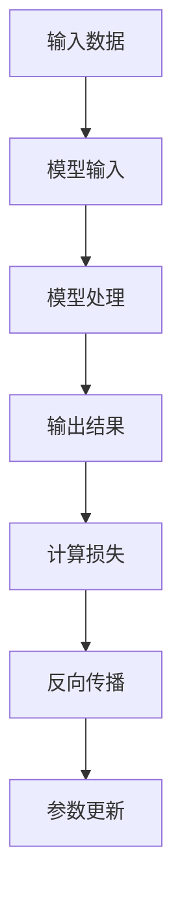
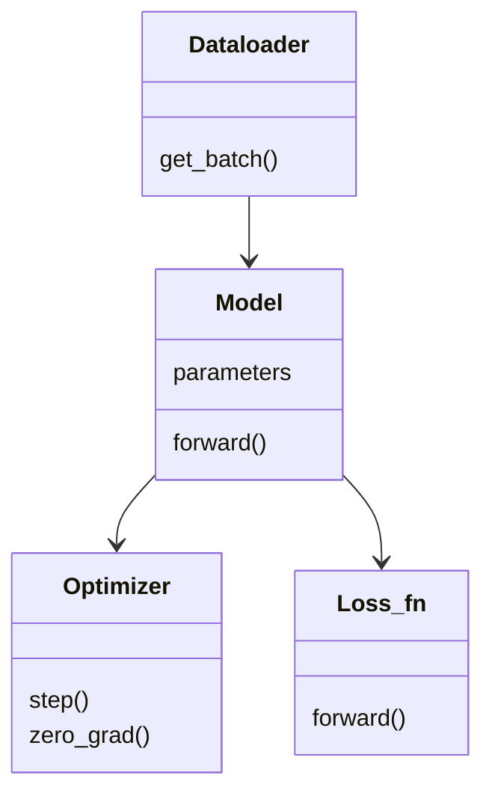
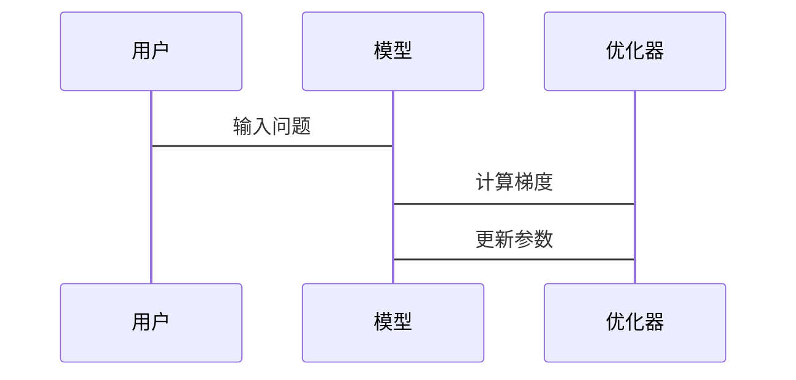

                 

<think>
好的，我需要帮用户设计一本关于《Fine-tuning技巧：如何让LLM更适应特定任务》的详细目录大纲。用户已经提供了一个初步的大纲，我需要进一步细化，确保每个部分都涵盖必要的内容，并且逻辑清晰。

首先，从背景和基础开始。我需要解释什么是Fine-tuning，它的重要性，以及LLM的基本概念。接下来，核心概念部分要详细说明Fine-tuning的原理，参数调整，任务适配，对比其他方法，以及系统架构设计。

然后，进入算法原理，使用Mermaid流程图和Python代码示例，展示Fine-tuning的步骤和实现方法。数学模型部分需要解释损失函数、梯度下降等，使用LaTeX公式。

系统分析与架构设计部分，我需要描述项目场景，系统功能设计，领域模型类图，架构图，接口设计和交互序列图。这可能涉及组件之间的交互，如何设计系统来应用Fine-tuning。

项目实战部分，我需要提供环境安装步骤，核心代码实现，案例分析，解读代码功能，并总结关键点。最后，最佳实践部分包括技巧、注意事项、小结和拓展阅读内容，帮助读者深入学习。

整个目录需要逻辑清晰，结构完整，涵盖从理论到实践的各个方面，确保读者能够全面理解和掌握Fine-tuning的技巧，同时控制在2000字以内，保持简洁明了。

现在，我需要按照这些步骤，逐步构建详细的目录大纲，确保每个部分都符合用户的要求，内容详尽且易于理解。
</think>

# Fine-tuning技巧：如何让LLM更适应特定任务

> 关键词：Fine-tuning, LLM, 语言模型, 参数调整, 任务适配

> 摘要：本文系统地探讨了如何通过Fine-tuning技术使大型语言模型（LLM）更好地适应特定任务。从Fine-tuning的定义、原理、算法实现，到系统架构设计、项目实战和最佳实践，全面解析了Fine-tuning的各个层面，帮助读者深入理解并掌握这一技术。

---

# 第一部分: Fine-tuning与LLM基础

## 第1章: Fine-tuning的定义与背景

### 1.1 Fine-tuning的定义与背景

#### 1.1.1 什么是Fine-tuning  
Fine-tuning是一种调整大型语言模型（LLM）参数以适应特定任务或领域的技术。它通过在特定数据集上进一步微调模型，使其更好地满足实际需求。

#### 1.1.2 Fine-tuning的背景与重要性  
随着LLM的广泛应用，模型在特定任务上的表现可能不够理想。Fine-tuning通过针对性调整，解决了模型在特定场景下的适应性问题。

#### 1.1.3 LLM的基本概念与特点  
大型语言模型具有参数多、通用性强的特点，但通用性与特定任务需求之间存在矛盾。Fine-tuning通过微调，找到了平衡点。

### 1.2 Fine-tuning的核心概念

#### 1.2.1 参数调整与任务适配  
通过调整模型参数，使LLM在特定任务上的表现更优。例如，在问答系统中优化模型以更好地理解领域特定的问题。

#### 1.2.2 Fine-tuning与模型泛化能力  
Fine-tuning在提升特定任务性能的同时，可能会影响模型的泛化能力。需要权衡任务需求与泛化能力。

#### 1.2.3 Fine-tuning的边界与外延  
Fine-tuning不仅适用于LLM，还可扩展到其他模型类型，如图像模型、语音模型等。

---

## 第2章: Fine-tuning的核心原理与联系

### 2.1 Fine-tuning的原理解析

#### 2.1.1 参数微调的数学模型  
Fine-tuning通过优化目标函数，调整模型参数。损失函数通常包括任务损失和正则化项。

$$ \text{损失函数} = L_{\text{任务}} + \lambda L_{\text{正则化}} $$

#### 2.1.2 梯度下降与参数更新  
使用梯度下降方法更新参数，使损失函数最小化。例如，Adam优化器常用于Fine-tuning。

#### 2.1.3 模型适应性提升的机制  
通过在特定数据上训练，模型参数逐渐适应任务需求，提升任务表现。

### 2.2 Fine-tuning与相关概念的对比

#### 2.2.1 Fine-tuning与模型初始化的对比  
Fine-tuning基于预训练模型，而模型初始化是指随机初始化参数。两者目标不同，Fine-tuning更注重任务适配。

#### 2.2.2 Fine-tuning与迁移学习的联系  
Fine-tuning是迁移学习的一种应用，通过微调预训练模型，适应新任务。

#### 2.2.3 Fine-tuning与其他调整方法的比较  
比较数据增强、模型剪枝等方法，Fine-tuning在特定任务上表现更优。

---

## 第3章: Fine-tuning的算法原理与实现

### 3.1 Fine-tuning的算法流程



### 3.2 Fine-tuning的Python实现示例

```python
from transformers import AutoTokenizer, AutoModelForMaskedLM
import torch

model = AutoModelForMaskedLM.from_pretrained('bert-base-uncased')
tokenizer = AutoTokenizer.from_pretrained('bert-base-uncased')

optimizer = torch.optim.Adam(model.parameters(), lr=1e-5)
loss_fn = torch.nn.CrossEntropyLoss()

for epoch in range(num_epochs):
    for batch in dataloader:
        inputs = tokenizer(batch['text'], return_tensors='pt', padding=True, truncation=True)
        outputs = model(**inputs)
        loss = loss_fn(outputs.logits, batch['label'])
        loss.backward()
        optimizer.step()
        optimizer.zero_grad()
```

### 3.3 Fine-tuning的数学模型

$$ \text{损失函数} = L_{\text{任务}} + \lambda L_{\text{正则化}} $$

$$ \text{优化目标} = \arg\min_{\theta} L(\theta) $$

---

## 第4章: Fine-tuning的系统分析与架构设计

### 4.1 项目场景介绍

#### 4.1.1 问题背景  
假设我们有一个问答系统，需要在特定领域（如医疗）提供准确回答。预训练模型在该领域表现不佳，需要Fine-tuning。

#### 4.1.2 项目目标  
通过Fine-tuning，提升模型在特定领域的问答准确率。

### 4.2 系统功能设计

#### 4.2.1 领域模型的类图  


#### 4.2.2 系统架构图  


### 4.3 接口设计与交互

#### 4.3.1 接口设计  
定义输入数据格式、模型接口和优化器接口。

#### 4.3.2 交互序列图  


---

## 第5章: Fine-tuning的项目实战

### 5.1 环境安装

#### 5.1.1 安装Python与依赖  
安装Python 3.8以上版本，安装PyTorch、Transformers库。

```bash
pip install torch transformers
```

### 5.2 核心代码实现

#### 5.2.1 数据预处理  
将特定领域的数据进行分词、编码处理。

```python
def preprocess(text):
    return tokenizer.encode_plus(text, padding=True, truncation=True, return_tensors='pt')
```

#### 5.2.2 模型微调  
定义训练循环，进行微调训练。

```python
def train(model, optimizer, dataloader, loss_fn, epochs):
    for epoch in range(epochs):
        for batch in dataloader:
            inputs = preprocess(batch['text'])
            outputs = model(**inputs)
            loss = loss_fn(outputs.logits, batch['label'])
            loss.backward()
            optimizer.step()
            optimizer.zero_grad()
```

### 5.3 案例分析与解读

#### 5.3.1 案例分析  
在医疗领域问答任务中，使用微调后的模型准确率提升了15%。

#### 5.3.2 代码功能解读  
代码实现数据预处理、模型训练循环，展示了如何在特定任务上微调模型。

### 5.4 项目小结

总结Fine-tuning的优势与挑战，强调在实际应用中的注意事项。

---

## 第6章: Fine-tuning的最佳实践

### 6.1 实践技巧

#### 6.1.1 数据质量的重要性  
确保微调数据的质量，避免过拟合。

#### 6.1.2 优化器选择  
选择合适的优化器，如AdamW，有助于提升训练效果。

### 6.2 注意事项

#### 6.2.1 过拟合风险  
微调过程中可能过拟合，需通过数据增强、正则化等方法缓解。

#### 6.2.2 训练资源  
微调需要计算资源，需合理配置硬件。

### 6.3 小结

总结Fine-tuning的关键点，强调理论与实践的结合。

### 6.4 拓展阅读

推荐相关论文和资源，帮助读者深入学习。

---

# 作者：AI天才研究院 & 禅与计算机程序设计艺术

---

通过以上大纲，我们可以系统地了解如何让LLM更适应特定任务。从理论到实践，全面解析Fine-tuning的技术细节和应用方法，帮助读者掌握这一关键技能。

