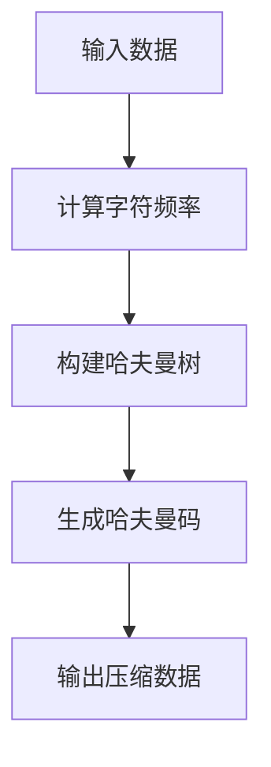
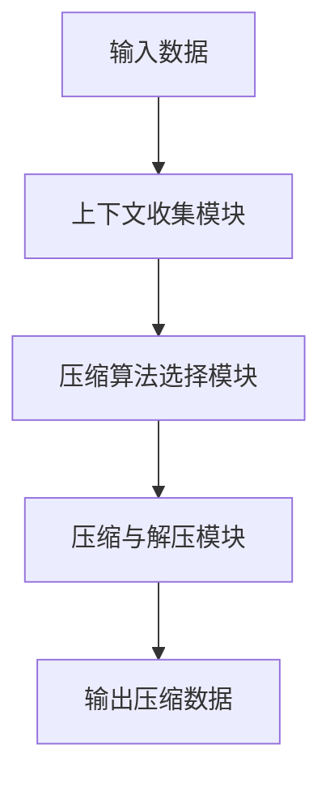

                 

<think>
嗯，用户想要一篇关于上下文压缩优化AI Agent内存使用的技术博客。他给了一个详细的目录大纲，看来他已经有了明确的结构。我需要按照这个结构，逐步填充每个部分的内容，确保每个章节都详细且符合技术要求。

首先，我得先理解每个章节的主题。第一章是背景与概念，需要介绍上下文压缩的基本概念和它对AI Agent的重要性。我得先定义上下文压缩，解释它为什么重要，然后讨论AI Agent的背景和现状。

接下来是核心概念与原理，这里需要深入讲解上下文压缩的原理，可能涉及数据压缩的方法和优化策略。我需要比较不同压缩算法的优缺点，以及它们如何应用在AI Agent中。

然后是算法原理与数学模型，这部分可能需要画一些流程图，比如用mermaid展示压缩算法的步骤，或者用latex公式解释熵的计算。我得确保这些图表清晰易懂，帮助读者理解技术细节。

系统架构与设计部分，我需要描述AI Agent的系统架构，包括各个模块的作用和交互方式。可能还需要画系统架构图和序列图，展示系统的运行流程。

项目实战部分，我得提供一个具体的案例，详细说明如何实现上下文压缩，从环境安装到代码实现，再到案例分析。这部分需要实际操作，让读者能够跟着步骤学习。

最后是总结与最佳实践，我需要回顾整个内容，给出一些实用的建议和注意事项，帮助读者更好地应用这些技术。

在写作过程中，我需要确保每个部分都详细，同时语言要专业但不失清晰。我可能需要查阅相关资料，确保技术细节的准确性，特别是数学公式和算法流程图的正确性。

还有，用户要求使用markdown格式，并且在适当的地方插入mermaid图表和latex公式。我得记得在编写时，按照这些格式要求来组织内容，确保输出符合规范。

总的来说，我需要一步步按照目录大纲，填充每个章节的内容，确保内容全面且符合技术深度要求，帮助读者全面理解上下文压缩在AI Agent中的应用和优化方法。
</think>

# 上下文压缩：优化AI Agent的内存使用

> 关键词：上下文压缩，AI Agent，内存优化，数据压缩，算法优化

> 摘要：上下文压缩是优化AI Agent内存使用的重要技术，通过对上下文数据的压缩，可以显著降低AI Agent的内存占用，提升其运行效率和性能。本文将详细探讨上下文压缩的核心概念、算法原理、系统架构设计以及实际应用案例，帮助读者全面理解如何通过上下文压缩优化AI Agent的内存使用。

---

# 第一章: 上下文压缩的背景与概念

## 1.1 上下文压缩的定义与核心问题

### 1.1.1 上下文压缩的定义

上下文压缩是指通过对上下文数据进行编码、分析和处理，去除冗余信息，从而减少存储或传输数据量的技术。在AI Agent中，上下文压缩主要用于优化内存使用，提升系统的运行效率和性能。

### 1.1.2 上下文压缩的核心问题

1. **数据冗余**：上下文数据中往往包含大量重复或相关性较高的信息，如何去除冗余是核心问题。
2. **压缩效率**：如何在保证数据完整性的前提下，最大化压缩效率。
3. **可恢复性**：压缩后的数据需要能够准确恢复原始上下文，确保AI Agent的正常运行。

### 1.1.3 上下文压缩的目标与意义

1. **目标**：通过压缩上下文数据，降低内存占用，提升系统性能。
2. **意义**：在AI Agent中，上下文压缩是优化资源利用率的关键技术，尤其适用于处理大规模数据的场景。

## 1.2 AI Agent与上下文压缩的关系

### 1.2.1 AI Agent的基本概念

AI Agent是一种智能代理，能够感知环境、执行任务并做出决策。它依赖于上下文数据来理解和响应外部输入。

### 1.2.2 上下文在AI Agent中的作用

1. **数据存储**：存储与任务相关的环境信息。
2. **决策支持**：基于上下文数据进行推理和决策。
3. **状态管理**：维护AI Agent的运行状态。

### 1.2.3 上下文压缩对AI Agent内存优化的意义

通过压缩上下文数据，AI Agent可以在有限的内存资源下处理更大的数据量，提升其运行效率和扩展性。

## 1.3 上下文压缩的背景与现状

### 1.3.1 大型AI Agent的内存挑战

随着AI Agent的复杂度和任务规模的增加，内存使用需求急剧上升，压缩技术成为解决内存不足的关键。

### 1.3.2 上下文压缩技术的发展历程

从简单的哈夫曼编码到现代的深度学习驱动的压缩算法，上下文压缩技术经历了从单一到混合的发展过程。

### 1.3.3 当前上下文压缩技术的现状与趋势

1. **现状**：深度学习模型和混合压缩算法的应用逐渐普及。
2. **趋势**：向智能化、动态化方向发展，压缩算法将更加适应实时任务需求。

---

# 第二章: 上下文压缩的核心概念与原理

## 2.1 上下文压缩的关键属性

### 2.1.1 数据压缩效率

压缩算法的效率直接影响内存占用，需要综合考虑压缩比和计算开销。

### 2.1.2 压缩算法的选择

根据数据类型和应用场景选择合适的压缩算法，如熵编码、语义编码等。

### 2.1.3 压缩后的可恢复性

压缩后的数据需要能够准确恢复原始上下文，确保AI Agent的正确运行。

## 2.2 上下文压缩的实现方式

### 2.2.1 基于熵的压缩方法

1. **熵的定义与计算**
   - 熵是数据的不确定性度量，公式为：$H = -\sum p_i \log_2 p_i$
2. **哈夫曼编码算法**
   - 基于字符频率构建最优前缀码。
3. **LZ77与LZW压缩算法**
   - 通过字典记录重复模式，减少数据冗余。

### 2.2.2 基于语义的压缩方法

1. **语言模型压缩**
   - 利用语言模型预测上下文，去除冗余信息。
2. **知识图谱压缩**
   - 通过构建知识图谱，去除重复知识。
3. **向量量化压缩**
   - 将高维向量映射到低维空间，减少存储空间。

### 2.2.3 混合压缩策略

1. **哈夫曼编码与向量量化结合**
   - 先对数据进行向量量化，再使用哈夫曼编码进一步压缩。
2. **语言模型与熵编码结合**
   - 利用语言模型预测上下文，再使用熵编码进行压缩。
3. **深度学习驱动的混合压缩**
   - 使用神经网络同时优化压缩比和可恢复性。

## 2.3 上下文压缩的优化目标

### 2.3.1 最小化内存占用

通过压缩算法选择和优化，降低上下文数据的存储空间。

### 2.3.2 最大化压缩效率

在保证数据完整性前提下，最大化压缩比。

### 2.3.3 保持数据完整性

确保压缩后的数据能够准确恢复原始上下文。

## 2.4 本章小结

---

# 第三章: 上下文压缩的算法原理与数学模型

## 3.1 常见上下文压缩算法解析

### 3.1.1 基于熵的压缩算法

#### 熵编码的实现流程



#### 熵的数学公式

$$H = -\sum_{i=1}^{n} p_i \log_2 p_i$$

其中，$p_i$ 是第 $i$ 个字符的频率。

### 3.1.2 基于语义的压缩算法

#### 语言模型压缩

通过语言模型预测上下文，去除冗余信息。

#### 向量量化压缩

使用k-means算法对向量进行聚类，减少存储空间。

### 3.1.3 混合压缩算法

#### 哈夫曼编码与向量量化结合

1. 对数据进行向量量化，减少维度。
2. 使用哈夫曼编码压缩量化后的数据。

---

# 第四章: 上下文压缩的系统架构与设计

## 4.1 AI Agent上下文压缩系统架构

### 4.1.1 系统模块划分



### 4.1.2 模块之间的交互关系

1. 上下文收集模块：负责收集和预处理上下文数据。
2. 压缩算法选择模块：根据数据类型选择合适的压缩算法。
3. 压缩与解压模块：执行数据压缩和解压操作。

### 4.1.3 系统的输入输出流程

1. 输入：原始上下文数据。
2. 输出：压缩后的上下文数据。

## 4.2 核心模块设计

### 4.2.1 上下文收集模块

负责收集和预处理上下文数据，确保数据的完整性和准确性。

### 4.2.2 压缩算法选择模块

根据数据类型和任务需求，动态选择最优压缩算法。

### 4.2.3 压缩与解压模块

执行数据压缩和解压操作，确保数据的完整性和高效性。

## 4.3 系统优化策略

### 4.3.1 动态调整压缩算法

根据数据变化和任务需求，实时调整压缩算法。

### 4.3.2 实时上下文更新机制

确保上下文数据的实时性和准确性。

### 4.3.3 压缩效率监控

通过监控压缩效率，优化系统性能。

---

# 第五章: 项目实战

## 5.1 项目背景与目标

### 5.1.1 项目背景

设计一个基于上下文压缩的AI Agent内存优化系统。

### 5.1.2 项目目标

通过上下文压缩技术，优化AI Agent的内存使用。

## 5.2 项目环境与工具安装

1. **环境要求**：Python 3.8以上版本，安装必要的库。
2. **工具安装**：安装`mermaid`、`numpy`、`scikit-learn`等依赖库。

## 5.3 核心代码实现

### 5.3.1 数据预处理模块

```python
import numpy as np

def preprocess_context(context):
    # 数据预处理逻辑
    return processed_context
```

### 5.3.2 压缩算法实现

```python
def huffman_compress(data):
    # 哈夫曼编码实现
    return compressed_data
```

### 5.3.3 系统优化模块

```python
def optimize_compression(data):
    # 动态优化压缩算法
    return optimized_data
```

## 5.4 系统实现与测试

### 5.4.1 系统实现

1. 数据预处理。
2. 压缩算法选择。
3. 数据压缩与解压。

### 5.4.2 测试与优化

通过测试数据压缩比和解压时间，优化系统性能。

## 5.5 项目小结

---

# 第六章: 总结与最佳实践

## 6.1 总结

上下文压缩是优化AI Agent内存使用的重要技术，通过压缩上下文数据，可以显著降低内存占用，提升系统性能。

## 6.2 最佳实践

1. **选择合适的压缩算法**：根据数据类型和任务需求选择最优算法。
2. **动态调整压缩策略**：实时监控数据变化，动态优化压缩算法。
3. **保持数据完整性**：确保压缩后的数据能够准确恢复原始上下文。

## 6.3 小结

通过上下文压缩技术，可以有效优化AI Agent的内存使用，提升系统性能和扩展性。

---

作者：AI天才研究院/AI Genius Institute & 禅与计算机程序设计艺术 /Zen And The Art of Computer Programming

