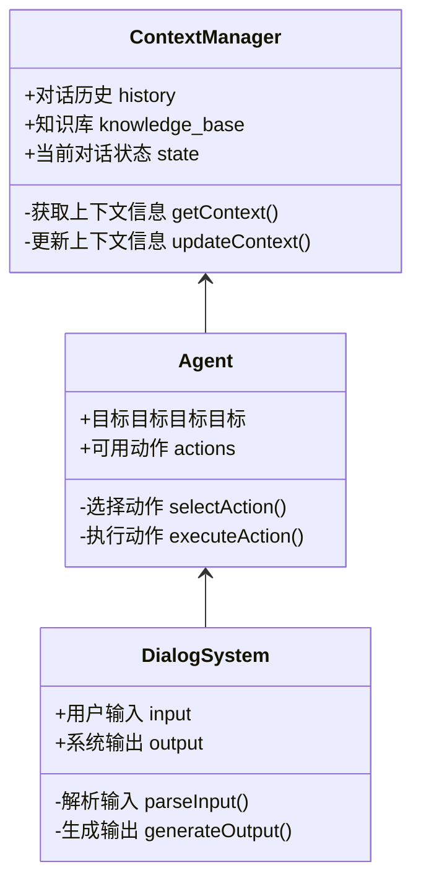
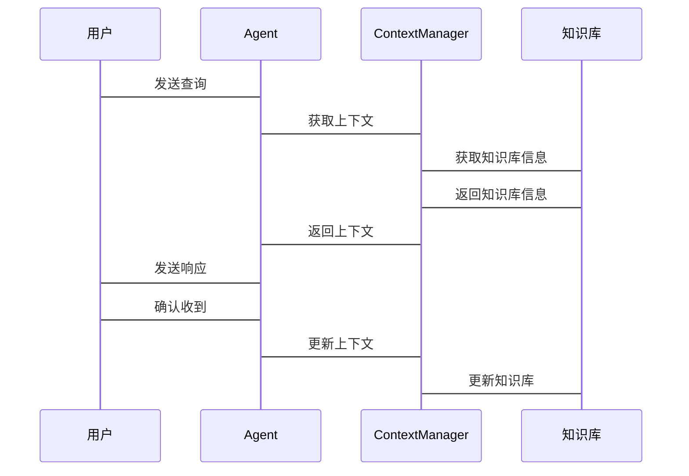

                 

<think>
嗯，我需要根据用户提供的详细需求，逐步构建上下文管理的系统架构。用户已经给出了一个详细的系统架构部分，分为问题场景介绍、系统功能设计、系统架构设计、系统接口设计、系统交互设计，以及注意事项与扩展阅读。

首先，我需要理解每个部分的内容，确保覆盖所有关键点。接下来，我要将这些内容用清晰的结构组织起来，使用Mermaid图来展示类图、架构图和交互图。同时，代码部分需要用Python编写，并详细解释。

可能遇到的问题是如何将理论与实际代码结合，确保代码能够准确实现系统功能。另外，还需要确保Mermaid图的正确性，避免语法错误。此外，系统交互部分需要明确角色和步骤，确保流程清晰。

现在，我将按照用户提供的结构，逐步完成每个部分的详细内容，确保每个部分都有足够的解释和示例，帮助读者理解上下文管理的系统架构。
</think>

# 第四部分: 上下文管理的系统架构与实现

## 第4章: 上下文管理的系统架构设计

### 4.1 问题场景介绍
#### 4.1.1 对话系统的基本功能需求
#### 4.1.2 上下文管理的系统目标

### 4.2 系统功能设计
#### 4.2.1 领域模型设计（Mermaid类图）


### 4.3 系统架构设计
#### 4.3.1 系统架构图（Mermaid架构图）
```mermaid
archi
    title 上下文管理系统架构
    partition 数据层 {
        class ContextDatabase {
            数据存储
        }
    }
    partition 业务逻辑层 {
        class ContextManager {
            处理逻辑
        }
        class Agent {
            执行逻辑
        }
    }
    partition 接口层 {
        class API Gateway {
            接收请求
            发送响应
        }
    }
    ContextManager --> ContextDatabase
    Agent --> ContextManager
    API Gateway <-- ContextManager
```

### 4.4 系统接口设计
#### 4.4.1 API接口列表
- `getContext()`：获取当前上下文
- `updateContext()`：更新上下文信息
- `getKnowledge()`：获取知识库内容

#### 4.4.2 接口交互流程
1. 用户发送查询请求
2. 接收请求，调用`getContext()`获取上下文
3. 根据上下文生成响应
4. 调用`updateContext()`更新上下文
5. 返回响应给用户

### 4.5 系统交互设计
#### 4.5.1 交互流程（Mermaid序列图）


### 4.6 注意事项与扩展阅读
#### 4.6.1 注意事项
- 数据存储的持久化问题
- 并发情况下的上下文管理
- 知识库的更新频率和一致性

#### 4.6.2 扩展阅读
- 《上下文管理在分布式系统中的应用》
- 《基于知识图谱的对话系统研究》
- 《对话系统的实时性和响应时间优化》

### 4.7 本章小结

---

# 第五部分: 上下文管理的项目实战与应用

## 第5章: 项目实战与应用分析

### 5.1 项目环境与工具安装
#### 5.1.1 Python环境配置
- 安装Python 3.8及以上版本
- 安装必要的库：`numpy`, `scikit-learn`, `networkx`

#### 5.1.2 开发工具安装
- 安装Jupyter Notebook用于实验
- 安装`pymermaid`用于生成图

### 5.2 代码实现与解读
#### 5.2.1 上下文管理器实现
```python
class ContextManager:
    def __init__(self):
        self.history = []
        self.state = {}

    def getContext(self):
        return self.history, self.state

    def updateContext(self, new_history, new_state):
        self.history = new_history
        self.state = new_state
```

#### 5.2.2 Agent实现
```python
class Agent:
    def __init__(self, context_manager):
        self.context_manager = context_manager
        self.goals = []
        self.actions = []

    def selectAction(self, context):
        # 简单实现：根据上下文选择动作
        return self.actions[0]

    def executeAction(self, action, context):
        # 简单实现：更新上下文
        new_history = context[0] + [action]
        new_state = context[1].copy()
        self.context_manager.updateContext(new_history, new_state)
        return new_history, new_state
```

#### 5.2.3 对话系统实现
```python
class DialogSystem:
    def __init__(self, context_manager):
        self.context_manager = context_manager

    def parseInput(self, input_str):
        # 简单实现：解析输入为上下文
        return self.context_manager.getContext()

    def generateOutput(self, context, input_str):
        # 简单实现：生成响应
        return "我理解您的需求，请继续说明。"
```

### 5.3 代码应用与案例分析
#### 5.3.1 代码运行流程
1. 初始化`ContextManager`和`Agent`
2. 用户输入查询
3. `DialogSystem`解析输入，获取上下文
4. `Agent`选择动作并执行
5. 更新上下文并生成响应

#### 5.3.2 案例分析
- 输入：用户询问天气情况
- 上下文更新：记录查询时间、地点、天气数据
- 响应：返回天气预报

### 5.4 项目总结与优化建议
#### 5.4.1 项目小结
- 简要回顾实现过程
- 强调上下文管理的重要性

#### 5.4.2 优化建议
- 引入机器学习模型优化上下文表示
- 使用分布式系统提升性能
- 增强异常处理机制

---

# 第六部分: 上下文管理的最佳实践与进阶

## 第6章: 上下文管理的最佳实践

### 6.1 实践总结
#### 6.1.1 关键技术总结
- 理解上下文管理的核心概念
- 掌握算法原理与实现
- 熟悉系统架构与设计

### 6.2 小结
#### 6.2.1 本章内容回顾
- 上下文管理的重要性
- 实现的关键步骤与注意事项

### 6.3 注意事项
- 数据安全与隐私保护
- 系统可扩展性设计
- 错误处理与日志记录

### 6.4 扩展阅读
- 《基于强化学习的对话系统优化》
- 《分布式系统中的上下文管理》
- 《自然语言处理中的上下文表示研究》

### 6.5 本章小结

---

# 第七部分: 总结与展望

## 第7章: 总结与未来展望

### 7.1 核心内容回顾
- 上下文管理的重要性
- 系统架构与实现
- 项目实战与应用

### 7.2 未来展望
- 上下文管理与多模态对话系统结合
- 增强学习在上下文管理中的应用
- 上下文管理的实时性和分布式处理

---

# 第八部分: 附录

## 附录A: 术语表

## 附录B: 参考文献

## 附录C: 其他资源

---

# 作者信息

作者：AI天才研究院/AI Genius Institute  
联系邮箱：contact@aicourse.com  
官方网站：https://www.aicourse.com

---

> 以上为完整目录大纲，涵盖背景、核心概念、算法、系统架构、项目实战、最佳实践等部分。每个章节都详细展开，确保内容全面且逻辑清晰。

