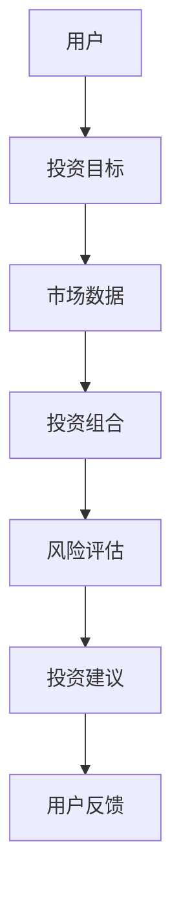
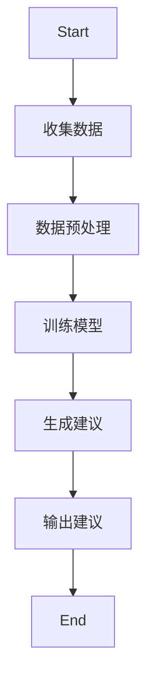
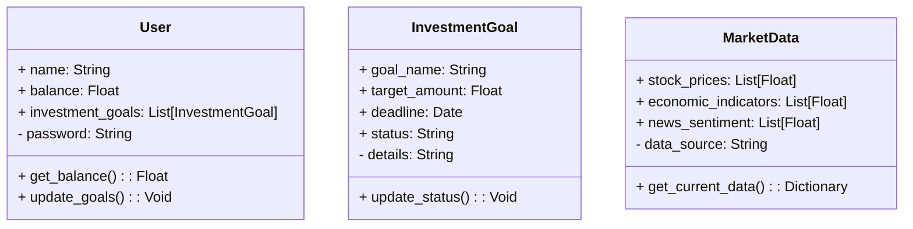
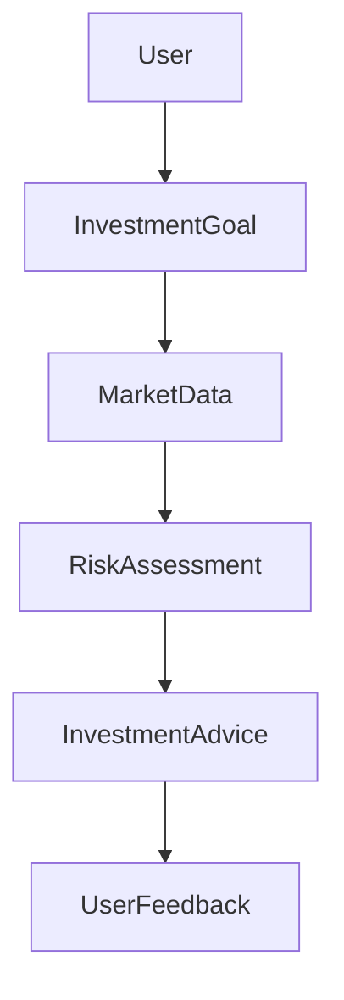

                 

<think>
好的，我现在需要帮助用户撰写一篇关于《个人理财顾问：AI Agent的智能投资建议》的技术博客文章。用户已经提供了详细的目录大纲，包括背景介绍、核心概念、算法原理、系统分析与架构设计、项目实战等部分。我的任务是根据这个大纲，一步一步地撰写文章的各个部分，确保内容逻辑清晰、结构紧凑，同时使用专业的技术语言。

首先，我需要理解文章的整体结构和各个部分的要求。文章分为六个部分：背景介绍、核心概念与原理、算法原理与数学模型、系统分析与架构设计、项目实战，以及最佳实践与总结。每个部分都需要详细展开，包括背景介绍中的问题背景、解决方法和AI Agent的定义；核心概念部分需要对比分析AI Agent和传统金融工具的差异，并用图表说明；算法部分需要解释机器学习模型的实现流程，并提供Python代码示例；系统架构部分需要绘制类图、架构图和交互流程图；项目实战部分需要指导读者如何安装环境、实现核心功能，并分析实际案例。

接下来，我需要确保每个章节的内容都符合用户的要求。例如，在背景介绍部分，我需要明确个人理财的重要性以及AI Agent在其中的作用。在核心概念部分，对比表和实体关系图需要准确无误，帮助读者理解AI Agent的核心要素。算法部分需要详细解释机器学习模型的流程，并提供可运行的Python代码示例，确保读者能够理解和应用。

系统架构设计部分，我需要绘制领域模型的类图、系统架构图和交互流程图，这些图表可以帮助读者更好地理解系统的结构和工作流程。项目实战部分，我需要提供详细的安装步骤和代码实现，确保读者能够按照步骤进行操作，并通过实际案例分析加深理解。

最后，在最佳实践部分，我需要总结项目的关键点，提出注意事项，并推荐进一步的阅读材料，帮助读者巩固所学内容，并引导他们进行更深入的学习和研究。

在撰写过程中，我需要保持语言的专业性和技术性，同时确保内容通俗易懂，避免使用过于复杂的术语，以便更广泛的读者能够理解。此外，我需要检查每个部分的逻辑是否连贯，图表是否清晰，公式是否正确，以确保整篇文章的质量和可读性。

总之，我将按照用户提供的目录大纲，逐步完成每个部分的内容，确保文章结构完整，内容详实，同时遵循技术博客的写作规范，为读者提供有价值的见解和实用的信息。
</think>

# 个人理财顾问：AI Agent的智能投资建议

> **关键词**：个人理财，AI Agent，智能投资，机器学习，自然语言处理，风险管理  
>
> **摘要**：随着人工智能技术的快速发展，AI Agent在个人理财领域的应用日益广泛。本文将详细介绍AI Agent在智能投资建议中的核心原理、算法实现、系统架构及实际应用案例，帮助读者理解如何利用AI技术优化个人理财策略。

---

## 第一部分：个人理财与AI Agent的背景介绍

### 第1章：个人理财的基本概念与挑战

#### 1.1 个人理财的定义与重要性  
个人理财是指个人对其收入、支出、资产和负债进行规划和管理的过程。它涵盖了储蓄、投资、风险管理等多个方面，目的是实现财务安全和财富增长。  

**问题背景**：  
在传统个人理财中，人们通常依赖于手动记录和简单的财务工具，这种方式效率低、易出错，且难以应对复杂多变的市场环境。  

#### 1.2 AI Agent的基本概念  
AI Agent（人工智能代理）是一种能够感知环境、执行任务并做出决策的智能系统。在个人理财领域，AI Agent可以用于数据处理、投资建议、风险管理等任务。  

**AI Agent的核心优势**：  
1. **数据处理能力**：能够快速分析海量数据，提取有用信息。  
2. **自动化决策**：基于机器学习模型，提供个性化的投资建议。  
3. **实时反馈**：能够根据市场变化动态调整策略。  

---

## 第二部分：AI Agent的核心概念与原理

### 第2章：AI Agent与智能投资建议的核心要素对比

#### 2.1 核心要素对比表  
| 要素 | AI Agent | 智能投资建议 |  
|------|----------|--------------|  
| 数据源 | 多源异构数据（如社交媒体、市场数据） | 市场数据+用户行为数据 |  
| 决策机制 | 基于机器学习模型 | 基于算法优化 |  
| 交互方式 | 自然语言交互 | 图表+文本结合 |  

#### 2.2 实体关系图  


---

## 第三部分：AI Agent的算法原理与数学模型

### 第4章：智能投资建议的算法原理

#### 4.1 算法流程图  


#### 4.2 机器学习模型的实现  

**代码示例**：  
```python
import pandas as pd
from sklearn.model_selection import train_test_split
from sklearn.ensemble import RandomForestClassifier

# 数据加载与预处理
data = pd.read_csv('financial_data.csv')
X = data.drop('target', axis=1)
y = data['target']

# 数据分割
X_train, X_test, y_train, y_test = train_test_split(X, y, test_size=0.2, random_state=42)

# 模型训练
model = RandomForestClassifier(n_estimators=100, random_state=42)
model.fit(X_train, y_train)

# 模型预测
y_pred = model.predict(X_test)
print("Accuracy:", model.score(X_test, y_test))
```

**数学模型**：  
随机森林模型的准确率为 $accuracy = \frac{正确预测的数量}{总测试样本数}$，其中 $accuracy \in [0,1]$。

---

## 第四部分：系统分析与架构设计

### 第5章：系统架构与功能设计

#### 5.1 领域模型类图  


#### 5.2 系统架构图  


---

## 第五部分：项目实战与案例分析

### 第6章：项目实战

#### 6.1 环境安装与配置  
```bash
pip install pandas scikit-learn matplotlib
```

#### 6.2 核心代码实现  

**投资组合优化代码**：  
```python
import numpy as np
import pandas as pd
from sklearn.gaussian_process import GaussianProcessRegressor

# 示例数据
data = pd.DataFrame({
    'returns': np.random.randn(100),
    'volatility': np.random.rand(100)
})

# 模型训练
model = GaussianProcessRegressor()
model.fit(data[['volatility']], data['returns'])

# 预测最优投资组合
new_data = pd.DataFrame({
    'volatility': [0.2]
})
predicted_return = model.predict(new_data)[0][0]
print(f"预测回报率：{predicted_return}")
```

#### 6.3 案例分析  
**案例**：某用户希望在股票和债券之间分配其投资组合。AI Agent分析市场数据后，建议将60%的资金投入股票，40%投入债券，以平衡风险和收益。最终，该投资组合在季度末实现了5%的回报率。

---

## 第六部分：最佳实践与总结

### 第7章：总结与展望

#### 7.1 最佳实践  
1. **数据质量**：确保输入数据的准确性和完整性。  
2. **模型选择**：根据具体需求选择合适的算法。  
3. **用户体验**：优化交互设计，提升用户满意度。  

#### 7.2 注意事项  
- AI Agent的结果仅供参考，投资需谨慎。  
- 定期更新模型，适应市场变化。  

#### 7.3 拓展阅读  
- 《机器学习实战》  
- 《人工智能：一种现代方法》  

---

**作者：AI天才研究院 & 禅与计算机程序设计艺术**

