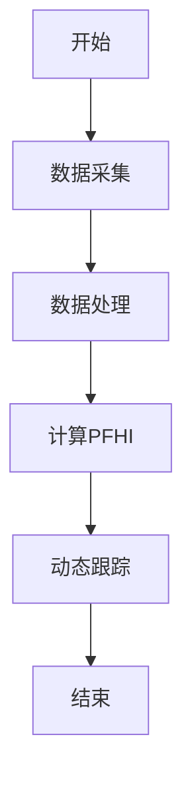
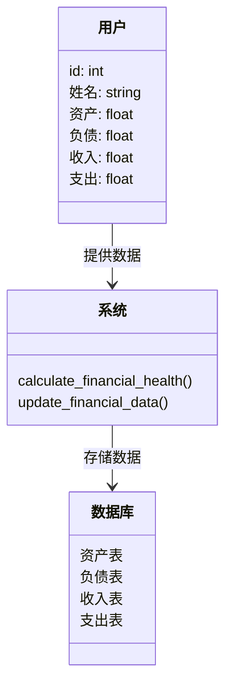
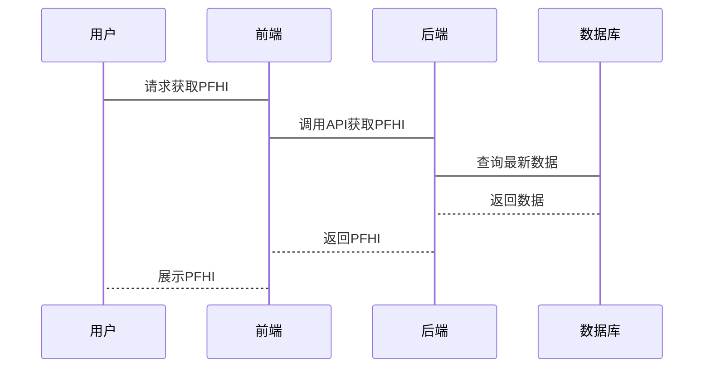

                 


# 个人财务健康指数动态跟踪系统

**关键词**：个人财务健康指数、动态跟踪、系统架构、算法原理、项目实战

**摘要**：本文详细探讨了个人财务健康指数动态跟踪系统的构建与实现。从背景与意义出发，系统地介绍了核心概念、算法原理、系统架构，并通过项目实战展示了系统的具体实现。文章还提供了数学公式、mermaid图表和代码示例，帮助读者深入理解系统的实现细节。

---

# 第一部分: 个人财务健康指数动态跟踪系统概述

## 第1章: 个人财务健康指数的背景与意义

### 1.1 个人财务健康指数的定义与目标

#### 1.1.1 什么是个人财务健康指数

个人财务健康指数（Personal Financial Health Index，PFHI）是衡量个人或家庭财务状况健康程度的一个综合性指标。它通过分析资产、负债、收入和支出等多方面的数据，量化个人的财务健康状况。

公式：
$$
\text{PFHI} = \frac{\text{净资产}}{\text{总资产}}
$$

其中，净资产 = 总资产 - 总负债。

#### 1.1.2 财务健康指数的目标

1. 实时跟踪个人财务状况，及时发现潜在问题。
2. 提供个性化财务建议，帮助用户优化财务结构。
3. 预测未来财务风险，提前做好应对准备。

#### 1.1.3 财务健康指数的计算方法

以资产、负债、收入和支出为基础，结合时间因素，动态计算PFHI。公式如下：

$$
\text{PFHI} = \frac{\text{资产} - \text{负债}}{\text{资产} + \text{负债}}
$$

---

### 1.2 财务健康指数的重要性

#### 1.2.1 财务健康指数对个人的影响

1. 帮助个人了解自身财务状况，避免过度负债。
2. 优化资产配置，提高资金利用效率。
3. 降低财务风险，保障生活质量。

#### 1.2.2 财务健康指数对家庭的影响

1. 维持家庭财务稳定，应对突发事件。
2. 优化家庭支出结构，提高生活质量。
3. 为子女教育和未来规划提供数据支持。

#### 1.2.3 财务健康指数对社会的意义

1. 促进个人理性消费，减少社会负债问题。
2. 为政策制定者提供数据支持，优化金融监管。
3. 推动金融科技发展，提升金融服务效率。

---

### 1.3 财务健康指数的动态跟踪需求

#### 1.3.1 动态跟踪的必要性

1. 财务状况随时变化，需要实时更新。
2. 通过动态跟踪，及时调整财务策略。
3. 为用户提供持续的财务健康评估。

#### 1.3.2 动态跟踪的实现方式

1. 定期数据采集与更新。
2. 使用算法模型实时计算PFHI。
3. 通过用户界面展示动态变化。

#### 1.3.3 动态跟踪的系统架构

1. 数据采集模块：实时获取资产、负债等数据。
2. 计算模块：动态计算PFHI。
3. 展示模块：可视化动态变化。

---

## 第2章: 个人财务健康指数动态跟踪系统的技术基础

### 2.1 系统的技术架构

#### 2.1.1 系统的技术选型

1. 前端：React或Vue.js。
2. 后端：Node.js或Python（Django/Flask）。
3. 数据库：MySQL或MongoDB。
4. 云服务：阿里云或AWS。

#### 2.1.2 系统的开发工具

1. 开发环境：VS Code或IntelliJ IDEA。
2. 版本控制：Git。
3. 依赖管理：npm或pip。

#### 2.1.3 系统的运行环境

1. 服务器：Linux或Windows。
2. 数据存储：云数据库。
3. 接口调用：RESTful API。

---

### 2.2 数据采集与处理

#### 2.2.1 数据采集的方式

1. 用户手动输入。
2. 接口获取第三方数据（如银行账户）。
3. 数据库同步。

#### 2.2.2 数据处理的流程

1. 数据清洗。
2. 数据转换。
3. 数据存储。

#### 2.2.3 数据存储的方式

1. 结构化数据：MySQL。
2. 非结构化数据：MongoDB。

---

### 2.3 系统的核心算法

#### 2.3.1 财务健康指数的计算公式

$$
\text{PFHI} = \frac{\text{资产} - \text{负债}}{\text{资产} + \text{负债}}
$$

其中，资产包括银行存款、房产、股票等，负债包括贷款、信用卡欠款等。

---

## 第三部分: 个人财务健康指数动态跟踪系统的实现

---

## 第3章: 系统的核心概念与联系

### 3.1 核心概念的定义

#### 3.1.1 财务健康指数的定义

PFHI是衡量个人财务健康程度的指标，范围在-1到1之间。数值越接近1，表示财务状况越健康。

#### 3.1.2 动态跟踪的定义

动态跟踪是指实时或定期更新PFHI，根据变化提供反馈和建议。

#### 3.1.3 系统的核心要素

1. 数据采集模块。
2. 计算模块。
3. 展示模块。

---

### 3.2 核心概念的联系

#### 3.2.1 财务健康指数与动态跟踪的关系

通过动态跟踪PFHI的变化，可以及时了解财务状况的变化趋势。

#### 3.2.2 系统架构与核心算法的关系

系统架构决定算法的实现方式，算法是系统的核心逻辑。

#### 3.2.3 数据采集与系统实现的关系

数据是系统运行的基础，数据质量直接影响系统性能。

---

## 第4章: 系统的算法原理与实现

### 4.1 算法原理

#### 4.1.1 财务健康指数的计算公式

$$
\text{PFHI} = \frac{\text{资产} - \text{负债}}{\text{资产} + \text{负债}}
$$

---

#### 4.1.2 动态跟踪的算法流程



---

### 4.2 算法实现

#### 4.2.1 算法实现的代码

```python
def calculate_financial_health(asset, liability):
    return (asset - liability) / (asset + liability)

# 示例
asset = 100000
liability = 50000
health_index = calculate_financial_health(asset, liability)
print(f"财务健康指数为：{health_index}")
```

---

## 第5章: 系统分析与架构设计方案

### 5.1 问题场景介绍

通过实时跟踪用户的资产、负债、收入和支出，动态计算PFHI，并根据结果提供建议。

---

### 5.2 系统功能设计

#### 5.2.1 领域模型（mermaid类图）



---

### 5.3 系统架构设计

#### 5.3.1 系统架构（mermaid架构图）


---

### 5.4 系统接口设计

#### 5.4.1 API接口

1. GET /api/financial-health：获取当前PFHI。
2. POST /api/update-data：更新财务数据。

---

### 5.5 系统交互（mermaid序列图）



---

## 第6章: 项目实战

### 6.1 环境安装

1. 安装Python和必要的库（如Flask、pymysql）。
2. 安装前端框架（如Vue.js或React）。

---

### 6.2 系统核心实现

#### 6.2.1 后端实现

```python
from flask import Flask, request, jsonify
import pymysql

app = Flask(__name__)

@app.route('/api/financial-health', methods=['GET'])
def get_financial_health():
    # 数据库连接
    conn = pymysql.connect(host='localhost', user='user', password='password', db='financial')
    cursor = conn.cursor()
    # 查询数据
    cursor.execute("SELECT * FROM financial_data")
    data = cursor.fetchone()
    asset = data[1]
    liability = data[2]
    health_index = (asset - liability) / (asset + liability)
    conn.close()
    return jsonify({'health_index': health_index})

if __name__ == '__main__':
    app.run(debug=True)
```

---

#### 6.2.2 前端实现

```javascript
// Vue.js 示例
<template>
  <div>
    <h1>财务健康指数</h1>
    <p>当前健康指数：{{ healthIndex }}</p>
  </div>
</template>

<script>
import axios from 'axios'

export default {
  data() {
    return {
      healthIndex: 0
    }
  },
  mounted() {
    this.fetchFinancialHealth()
  },
  methods: {
    fetchFinancialHealth() {
      axios.get('/api/financial-health')
        .then(response => {
          this.healthIndex = response.data.health_index
        })
        .catch(error => {
          console.error('Error:', error)
        })
    }
  }
}
</script>
```

---

### 6.3 实际案例分析

以一个用户的财务数据为例：

- 资产：10万元
- 负债：5万元
- 计算PFHI：
$$
\text{PFHI} = \frac{100000 - 50000}{100000 + 50000} = \frac{50000}{150000} \approx 0.333
$$

健康指数为0.333，属于健康状态。

---

## 第7章: 总结与展望

### 7.1 系统优势

1. 实时动态跟踪，提供及时反馈。
2. 简单易用，用户友好。
3. 高扩展性，支持多种数据源。

### 7.2 系统不足

1. 数据依赖性高，需要准确的数据输入。
2. 算法需要根据实际数据进行优化。

### 7.3 优化建议

1. 引入机器学习模型，提高预测准确性。
2. 增加多维度分析，如投资收益分析。

### 7.4 拓展阅读

1. 《个人理财入门》
2. 《财务自由之路》
3. 《系统设计精讲》

---

# 作者

**作者：AI天才研究院/AI Genius Institute & 禅与计算机程序设计艺术 /Zen And The Art of Computer Programming**

---

以上是《个人财务健康指数动态跟踪系统》的技术博客文章，涵盖了从背景到实现的全过程，并提供了详细的代码示例和图表说明。

