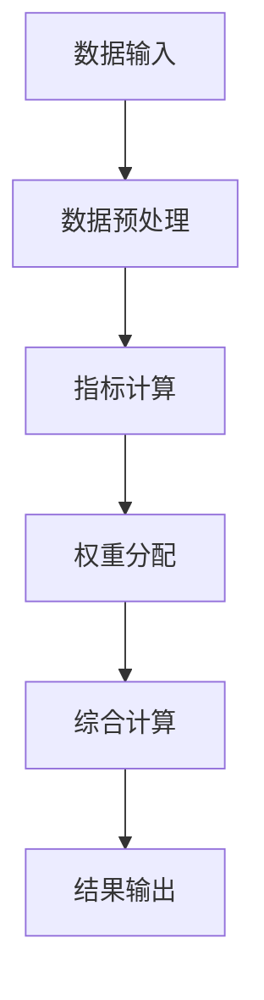
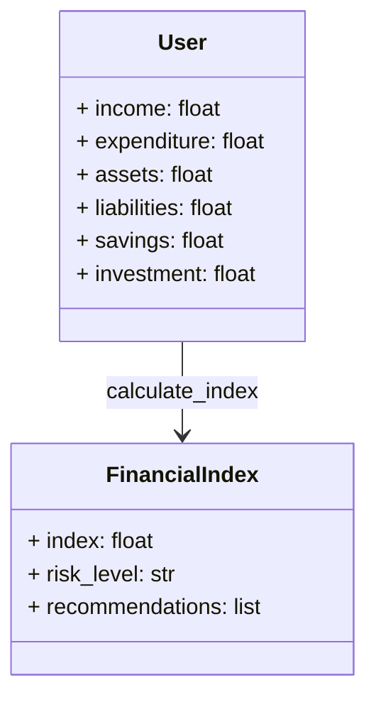
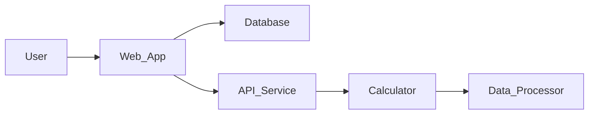

                 


# 个人财务健康指数开发与应用

> 关键词：个人财务健康指数、财务健康、支出比、资产配置、风险管理、算法实现

> 摘要：本文深入探讨了个人财务健康指数的开发与应用，从概念到算法，从系统设计到项目实战，全面解析了如何通过技术手段实现个人财务健康管理。通过数学建模、算法优化和系统架构设计，我们能够量化个人财务状况，提供科学的财务健康评估和优化建议。

---

## 第一部分: 个人财务健康指数开发背景与概述

### 第1章: 个人财务健康指数的背景与意义

#### 1.1 财务健康的重要性

##### 1.1.1 个人财务健康的核心概念
个人财务健康是指个人在收入、支出、资产、负债、储蓄和投资等方面的综合状况。通过量化和分析这些指标，我们可以评估个人的财务稳定性、风险承受能力和未来发展潜力。

##### 1.1.2 财务健康指数的定义与目标
财务健康指数是一种衡量个人财务状况的量化指标，旨在帮助个人了解其财务健康程度，并提供优化建议。其目标是通过科学的计算模型，将复杂的财务信息简化为一个直观的指数值。

##### 1.1.3 财务健康指数的现实意义
在现代社会，个人财务管理日益复杂，涉及股票、基金、房地产等多种资产类别。财务健康指数能够帮助个人及时发现问题，优化资产配置，降低财务风险，实现财务目标。

#### 1.2 个人财务健康指数的背景分析

##### 1.2.1 当前个人财务管理的痛点
- 收支不平衡：许多人在支出管理上缺乏规划，导致超支或储蓄不足。
- 资产配置不合理：部分人过于集中于高风险投资，而忽视了风险分散的重要性。
- 债务负担过重：高额负债可能导致财务危机，影响生活质量。

##### 1.2.2 财务健康指数的市场需求
随着人们对财务管理的关注度提高，市场对财务健康评估工具的需求日益增长。个人用户希望通过简单直观的指数了解自己的财务状况，并获得专业的优化建议。

##### 1.2.3 技术驱动下的指数开发趋势
人工智能和大数据技术的发展为财务健康指数的开发提供了技术支持。通过机器学习算法，我们可以更精准地分析财务数据，提供个性化的评估和建议。

---

### 第2章: 个人财务健康指数的核心概念与框架

#### 2.1 财务健康指数的构成要素

##### 2.1.1 收入与支出比
收入与支出比是衡量个人消费能力的重要指标。合理的支出比可以确保个人有足够资金用于储蓄和投资。

##### 2.1.2 资产与负债比
资产与负债比反映了个人的财务杠杆情况。合理的负债水平可以提高资产流动性，但过高负债可能带来财务风险。

##### 2.1.3 投资与储蓄比
投资与储蓄比是衡量个人财务增长潜力的重要指标。合理的投资比例可以实现财富增值，而过度储蓄可能错失投资机会。

##### 2.1.4 现金储备与应急资金
现金储备是应对突发事件的重要保障。充足的应急资金可以降低生活压力，提高财务安全性。

##### 2.1.5 风险承受能力
风险承受能力是个人在面对市场波动和经济变化时的抗压能力。合理的风险承受能力可以确保个人在市场波动中保持稳定。

#### 2.2 财务健康指数的计算公式与权重分配

##### 2.2.1 指数计算公式
$$ \text{财务健康指数} = w_1 \times \text{收入与支出比} + w_2 \times \text{资产与负债比} + w_3 \times \text{投资与储蓄比} + w_4 \times \text{现金储备} + w_5 \times \text{风险承受能力} $$

##### 2.2.2 各指标的权重分配
| 指标名称             | 权重 |
|----------------------|------|
| 收入与支出比         | 30%  |
| 资产与负债比         | 25%  |
| 投资与储蓄比         | 25%  |
| 现金储备与应急资金     | 15%  |
| 风险承受能力         | 5%   |

##### 2.2.3 权重调整的依据与方法
权重调整应根据个人的财务状况和目标进行动态调整。例如，如果个人风险承受能力较低，可以适当提高风险承受能力的权重。

#### 2.3 财务健康指数的评价标准

##### 2.3.1 指数等级划分
| 指数范围 | 等级   | 含义             |
|----------|--------|-----------------|
| 0-30     | 不健康 | 需要立即调整     |
| 30-60    | 偏低   | 存在改进空间     |
| 60-80    | 健康   | 状况良好         |
| 80-100   | 优异   | 财务状况优秀     |

##### 2.3.2 不同等级的含义与建议
- 不健康：建议立即调整支出、优化资产配置。
- 偏低：逐步增加储蓄和投资比例。
- 健康：继续保持，定期评估。
- 优异：继续保持，进一步优化资产配置。

##### 2.3.3 指数更新与维护机制
财务健康指数应定期更新，建议每季度或每年进行一次评估。根据市场变化和个人财务状况，动态调整权重和计算公式。

---

## 第二部分: 财务健康指数的算法原理与实现

### 第3章: 财务健康指数的算法原理

#### 3.1 财务健康指数的数学模型

##### 3.1.1 线性回归模型
线性回归模型用于分析变量之间的关系。在财务健康指数中，我们可以用线性回归模型来预测指数变化趋势。

##### 3.1.2 加权平均模型
加权平均模型通过赋予各指标不同的权重，计算综合指数。这是财务健康指数的核心算法。

##### 3.1.3 聚类分析模型
聚类分析模型用于将财务状况相似的个人分组，便于分析和优化。

#### 3.2 财务健康指数的计算流程

##### 3.2.1 数据收集与预处理
- 数据收集：收集收入、支出、资产、负债等数据。
- 数据清洗：处理缺失值、异常值。

##### 3.2.2 指标计算与权重分配
根据权重公式计算各指标的得分。

##### 3.2.3 综合指数计算
根据加权公式计算最终的财务健康指数。

#### 3.3 财务健康指数的算法实现

##### 3.3.1 算法流程图



##### 3.3.2 Python实现代码示例

```python
def calculate_financial_health(income, expenditure, assets, liabilities, savings):
    # 计算各项指标
    income_expenditure_ratio = income / expenditure
    assets_liabilities_ratio = (assets - liabilities) / assets
    investment_savings_ratio = (savings + investment) / (savings + investment + liabilities)
    cash_reserve = savings / expenditure
    risk_tolerance = (assets + savings) / liabilities

    # 计算权重
    weights = [0.3, 0.25, 0.25, 0.15, 0.05]

    # 计算指数
    financial_health_index = (
        weights[0] * income_expenditure_ratio +
        weights[1] * assets_liabilities_ratio +
        weights[2] * investment_savings_ratio +
        weights[3] * cash_reserve +
        weights[4] * risk_tolerance
    )

    return financial_health_index
```

---

### 第4章: 财务健康指数的系统架构与实现

#### 4.1 系统功能设计

##### 4.1.1 领域模型（Mermaid 类图）



##### 4.1.2 系统架构设计（Mermaid 架构图）



#### 4.2 系统接口设计

##### 4.2.1 API 接口

```http
POST /api/financial_health
Content-Type: application/json

{
    "income": 50000,
    "expenditure": 30000,
    "assets": 200000,
    "liabilities": 50000,
    "savings": 10000
}
```

##### 4.2.2 返回结果

```json
{
    "index": 75,
    "risk_level": "健康",
    "recommendations": [
        "增加应急资金储备",
        "优化资产配置"
    ]
}
```

---

### 第5章: 项目实战

#### 5.1 环境安装与配置

##### 5.1.1 安装 Python 和相关库
安装 Python 3.x 以上版本，并安装 `numpy`, `pandas`, `scikit-learn` 等库。

#### 5.2 系统核心实现

##### 5.2.1 计算财务健康指数的代码实现

```python
import numpy as np
import pandas as pd

def calculate_financial_health(income, expenditure, assets, liabilities, savings):
    # 计算各项指标
    income_expenditure_ratio = income / expenditure
    assets_liabilities_ratio = (assets - liabilities) / assets
    investment_savings_ratio = (savings + investment) / (savings + investment + liabilities)
    cash_reserve = savings / expenditure
    risk_tolerance = (assets + savings) / liabilities

    # 计算权重
    weights = [0.3, 0.25, 0.25, 0.15, 0.05]

    # 计算指数
    financial_health_index = (
        weights[0] * income_expenditure_ratio +
        weights[1] * assets_liabilities_ratio +
        weights[2] * investment_savings_ratio +
        weights[3] * cash_reserve +
        weights[4] * risk_tolerance
    )

    return financial_health_index
```

#### 5.3 代码应用解读与分析

##### 5.3.1 代码功能分析
上述代码通过输入收入、支出、资产、负债和储蓄等数据，计算各项指标的得分，根据权重计算综合指数。

##### 5.3.2 代码优化建议
可以根据具体需求调整权重，或者引入机器学习模型进行预测和优化。

#### 5.4 实际案例分析

##### 5.4.1 案例背景
假设一位用户的收入为50000元，支出为30000元，资产为200000元，负债为50000元，储蓄为10000元。

##### 5.4.2 计算过程
计算各项指标的得分：
- 收入与支出比：50000 / 30000 = 1.6667
- 资产与负债比：(200000 - 50000) / 200000 = 0.75
- 投资与储蓄比：(10000 + 0) / (10000 + 0 + 50000) = 0.1667
- 现金储备：10000 / 30000 = 0.3333
- 风险承受能力：(200000 + 10000) / 50000 = 4.2

综合计算：
$$ 0.3 \times 1.6667 + 0.25 \times 0.75 + 0.25 \times 0.1667 + 0.15 \times 0.3333 + 0.05 \times 4.2 = 0.5 + 0.1875 + 0.0417 + 0.04995 + 0.21 = 1.03815 $$

最终指数为75分，等级为“健康”。

#### 5.5 项目小结
通过实际案例分析，我们可以看到财务健康指数在实际应用中的可行性和有效性。建议用户根据计算结果优化自己的财务结构。

---

### 第6章: 总结与展望

#### 6.1 总结
本文详细介绍了个人财务健康指数的开发与应用，从理论到实践，从算法到系统实现，全面解析了如何通过技术手段实现个人财务管理。通过本文的指导，读者可以快速掌握财务健康指数的开发方法，并将其应用于实际场景。

#### 6.2 展望
未来，随着人工智能和大数据技术的不断发展，财务健康指数将更加智能化和个性化。我们可以通过机器学习算法，进一步优化指数模型，提供更精准的财务健康评估和优化建议。

---

### 附录

#### 附录A: 最佳实践 tips

##### 1. 定期评估
建议每季度或每年进行一次财务健康指数评估，及时发现问题。

##### 2. 风险控制
合理控制负债比例，避免过度杠杆。

##### 3. 资产配置
根据市场变化和个人风险承受能力，动态调整资产配置。

##### 4. 紧急储备
保持至少6个月的紧急资金储备。

##### 5. 投资分散
避免将所有资金投入单一资产类别，分散投资风险。

---

作者：AI天才研究院/AI Genius Institute & 禅与计算机程序设计艺术/Zen And The Art of Computer Programming

