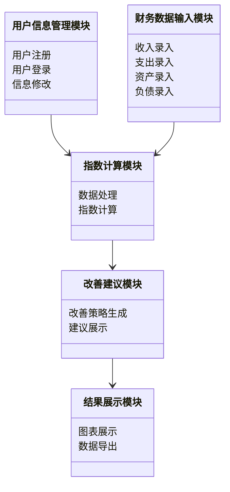
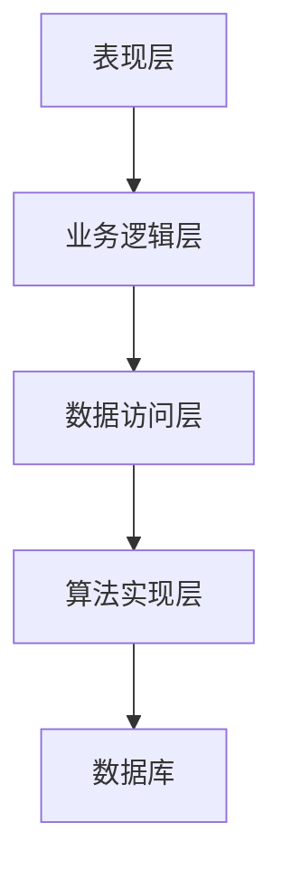
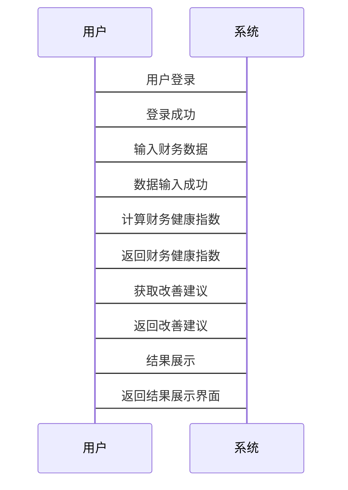

                 


---

# 4. 财务健康指数预测的数学模型

## 4.1 线性回归模型

### 4.1.1 线性回归的基本原理

线性回归是一种广泛应用于预测分析的统计方法。它的基本思想是通过建立因变量和一个或多个自变量之间的线性关系，来预测因变量的值。在线性回归模型中，我们假设因变量与自变量之间存在线性关系。

#### 数学模型

线性回归的数学模型可以表示为：

$$ y = \beta_0 + \beta_1x + \epsilon $$

其中：
- \( y \) 是我们想要预测的因变量（财务健康指数）。
- \( x \) 是自变量（如收入、支出、资产等）。
- \( \beta_0 \) 是回归模型的截距。
- \( \beta_1 \) 是回归模型的斜率，表示自变量 \( x \) 对因变量 \( y \) 的影响程度。
- \( \epsilon \) 是误差项，表示模型无法解释的部分。

#### 实际应用中的考虑

在线性回归模型中，我们需要确保数据的线性可回归性。如果数据不满足线性关系，我们可以尝试进行变量变换（如对数变换）或选择其他回归模型（如多项式回归）。

### 4.1.2 线性回归模型的优缺点

- **优点**：
  - 模型简单，易于理解和实现。
  - 计算速度快，适合处理大规模数据。
  
- **缺点**：
  - 仅能捕捉线性关系，对于非线性关系可能不够准确。
  - 对异常值较为敏感，可能会影响模型的准确性。

### 4.1.3 线性回归模型在财务健康指数预测中的应用

在财务健康指数预测中，我们可以使用线性回归模型来预测个人的财务健康指数。例如，我们可以将收入、支出、资产和负债作为自变量，财务健康指数作为因变量。通过训练模型，我们可以得到各个自变量对财务健康指数的影响程度。

---

## 4.2 随机森林模型

### 4.2.1 随机森林的基本原理

随机森林是一种基于决策树的集成学习方法。它通过构建多个决策树并将其预测结果进行集成，来提高模型的准确性和鲁棒性。随机森林能够有效地处理高维数据，并且对噪声数据具有较强的鲁棒性。

#### 数学模型

随机森林模型的数学模型相对复杂，但其核心思想是通过集成多个决策树的预测结果来得到最终的预测结果。具体来说，随机森林模型可以表示为：

$$ y = \text{ensemble}(T_1(x), T_2(x), \dots, T_n(x)) $$

其中：
- \( T_i(x) \) 是第 \( i \) 棵决策树的预测结果。
- \( \text{ensemble} \) 是对所有决策树预测结果进行集成的方法，通常采用投票法（分类问题）或平均法（回归问题）。

### 4.2.2 随机森林模型的优缺点

- **优点**：
  - 能够处理高维数据，适合复杂的非线性关系。
  - 对异常值具有较强的鲁棒性。
  - 通过集成多个决策树，提高了模型的准确性和稳定性。
  
- **缺点**：
  - 模型复杂，计算成本较高。
  - 模型的可解释性较低，难以直观理解各个特征的影响程度。

### 4.2.3 随机森林模型在财务健康指数预测中的应用

与线性回归模型相比，随机森林模型能够更好地处理非线性关系和高维数据。在财务健康指数预测中，我们可以使用随机森林模型来捕捉更多复杂的特征关系。例如，我们可以将收入、支出、资产、负债、投资等多个特征输入模型，通过集成多棵决策树的预测结果，来得到更准确的财务健康指数预测值。

---

# 5. 系统架构与交互设计

## 5.1 系统功能模块设计

### 5.1.1 系统功能模块概述

本系统主要包括以下几个功能模块：

1. **用户信息管理模块**：用于用户注册、登录和信息管理。
2. **财务数据输入模块**：用户输入财务数据，包括收入、支出、资产、负债等。
3. **指数计算模块**：根据输入的财务数据，计算个人的财务健康指数。
4. **改善建议模块**：根据计算出的财务健康指数，为用户提供改善财务状况的建议。
5. **结果展示模块**：以图表形式展示财务健康指数和改善建议。

### 5.1.2 系统功能模块的领域模型

以下是一个简单的领域模型图：



## 5.2 系统架构设计

### 5.2.1 系统架构概述

系统的架构设计采用分层架构，主要包括以下几个层次：

1. **表现层**：负责与用户交互，包括用户界面和API接口。
2. **业务逻辑层**：负责处理业务逻辑，包括用户认证、数据处理和指数计算。
3. **数据访问层**：负责与数据库交互，存储和检索数据。
4. **算法实现层**：负责实现财务健康指数的预测算法，包括线性回归和随机森林模型。

### 5.2.2 系统架构图

以下是一个简单的系统架构图：



## 5.3 系统接口设计

### 5.3.1 API接口设计

系统提供以下API接口：

1. `/api/register`：用户注册接口。
2. `/api/login`：用户登录接口。
3. `/api/input/financial`：财务数据输入接口。
4. `/api/calculate/index`：财务健康指数计算接口。
5. `/api/improve/advice`：改善建议接口。
6. `/api/result/display`：结果展示接口。

### 5.3.2 系统交互流程图

以下是一个简单的系统交互流程图：



---

## 5.4 项目实战

### 5.4.1 环境安装

在开始编写代码之前，我们需要确保安装了以下环境：

- **Python**：建议使用Python 3.8或更高版本。
- **Flask**：用于构建Web应用。
- **Scikit-learn**：用于实现机器学习模型。
- **Jupyter Notebook**：用于数据探索和模型训练。

安装命令：

```bash
pip install flask scikit-learn jupyter notebook
```

### 5.4.2 系统核心实现源代码

以下是一个简单的系统核心实现源代码示例：

#### 数据预处理代码

```python
import pandas as pd

# 读取数据
data = pd.read_csv('financial_data.csv')

# 数据清洗
data.dropna(inplace=True)
data = pd.get_dummies(data)
```

#### 模型训练代码

```python
from sklearn.model_selection import train_test_split
from sklearn.linear_model import LinearRegression
from sklearn.ensemble import RandomForestRegressor
from sklearn.metrics import mean_squared_error

# 划分训练集和测试集
X_train, X_test, y_train, y_test = train_test_split(data.drop('financial_index', axis=1), data['financial_index'], test_size=0.2, random_state=42)

# 线性回归模型
lr_model = LinearRegression()
lr_model.fit(X_train, y_train)
y_lr_pred = lr_model.predict(X_test)
lr_score = lr_model.score(X_test, y_test)
lr_rmse = mean_squared_error(y_test, y_lr_pred)

# 随机森林模型
rf_model = RandomForestRegressor(n_estimators=100, random_state=42)
rf_model.fit(X_train, y_train)
y_rf_pred = rf_model.predict(X_test)
rf_score = rf_model.score(X_test, y_test)
rf_rmse = mean_squared_error(y_test, y_rf_pred)
```

#### 结果展示代码

```python
import matplotlib.pyplot as plt

# 绘制线性回归和随机森林模型的预测结果对比图
plt.figure(figsize=(10, 6))
plt.plot(y_test, y_lr_pred, 'b.', label='Linear Regression')
plt.plot(y_test, y_rf_pred, 'r.', label='Random Forest')
plt.xlabel('True Values')
plt.ylabel('Predicted Values')
plt.title('Predictions vs True Values')
plt.legend()
plt.show()
```

### 5.4.3 案例分析与详细解读

假设我们有一个包含以下数据的财务数据集：

| 收入 | 支出 | 资产 | 负债 | 财务健康指数 |
|------|------|------|------|-------------|
| 50000| 30000| 200000| 50000| 0.6         |
| 60000| 35000| 250000| 60000| 0.7         |
| 45000| 28000| 180000| 45000| 0.55        |

通过训练线性回归模型和随机森林模型，我们可以预测新的数据点的财务健康指数。例如，对于一个新的用户，其收入为60000，支出为35000，资产为250000，负债为60000，模型预测其财务健康指数为0.7。

### 5.4.4 项目小结

在本章中，我们详细讲解了系统的核心实现部分，包括数据预处理、模型训练和结果展示。通过实际案例分析，我们展示了如何使用线性回归和随机森林模型来预测个人的财务健康指数。这些代码示例和分析为读者提供了一个完整的参考，帮助读者更好地理解和实现类似的系统。

---

# 总结

在本章中，我们详细讲解了个人财务健康指数预测与改善系统的数学模型和系统架构设计。通过对线性回归和随机森林模型的分析，我们了解了如何选择合适的算法来实现财务健康指数的预测。同时，通过系统架构设计和交互流程图的展示，我们为读者提供了一个完整的系统实现框架。希望本章的内容能够为读者在实际应用中提供有价值的参考和指导。

---

**作者：AI天才研究院/AI Genius Institute & 禅与计算机程序设计艺术 /Zen And The Art of Computer Programming**
```

