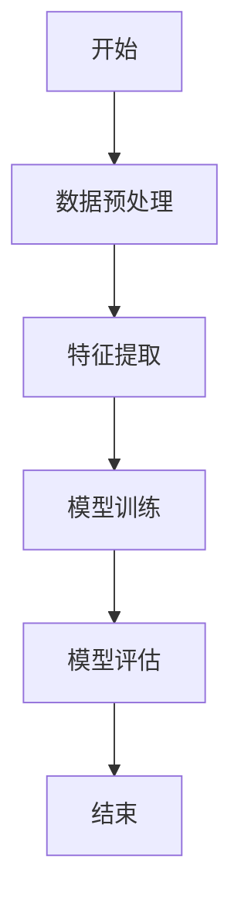
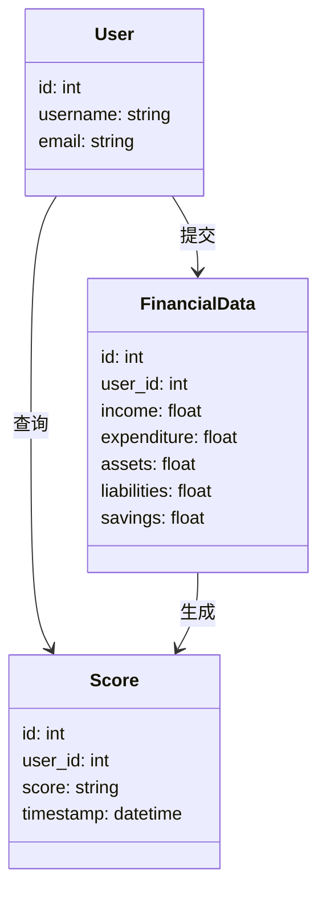
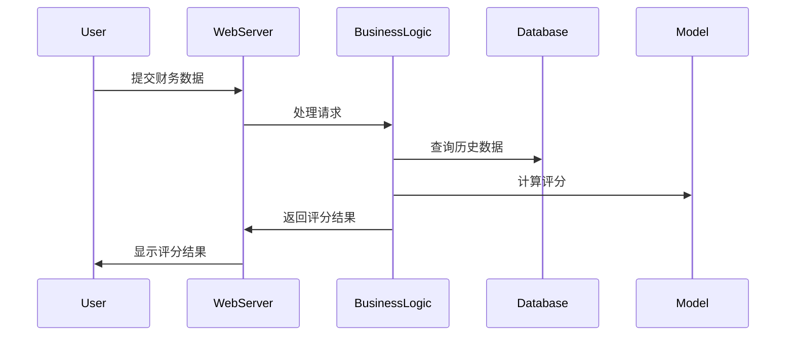

                 


# 个人财务健康评分系统设计

> 关键词：个人财务管理，财务健康评分，评分系统设计，算法实现，人工智能应用，系统架构，项目实战

> 摘要：本文将详细介绍个人财务健康评分系统的背景、核心概念、算法原理、系统架构设计以及项目实战。通过多维度分析，结合机器学习算法，我们能够量化个人的财务健康状况，从而为用户提供科学的优化建议。本文将从系统设计的角度出发，逐步解析如何构建一个高效、准确的个人财务健康评分系统。

---

## 第1章：个人财务健康评分系统背景介绍

### 1.1 问题背景与意义
#### 1.1.1 个人财务管理的重要性
在当今社会，个人财务管理是每个人都需要面对的重要课题。有效的财务管理不仅能够帮助个人实现财富增值，还能规避潜在的财务风险。然而，很多人在财务管理中缺乏系统性和科学性，导致无法准确评估自己的财务健康状况。

#### 1.1.2 当前财务管理工具的局限性
现有的财务管理工具大多集中在记账、预算管理等基础功能上，缺乏对财务健康状况的全面评估。用户需要一个能够量化其财务健康状况的系统，从而获得个性化的优化建议。

#### 1.1.3 财务健康评分系统的价值与意义
通过引入评分系统，用户可以直观地了解自己的财务健康状况，并根据评分结果采取相应的改进措施。这种系统不仅能够帮助个人实现财务管理的科学化，还能为金融机构提供有价值的参考。

### 1.2 问题描述与目标
#### 1.2.1 财务健康的核心问题
财务健康的核心问题在于如何量化个人的财务状况，包括收入、支出、资产、负债、储蓄等多个维度。

#### 1.2.2 系统的目标与范围
- **目标**：设计一个能够全面评估个人财务健康状况的评分系统，提供个性化的优化建议。
- **范围**：涵盖收入、支出、资产、负债、储蓄等关键财务指标。

#### 1.2.3 边界与外延
系统仅关注个人财务状况的评估，不涉及具体的财务操作（如投资、借贷等），但可以为后续的财务操作提供参考。

### 1.3 核心概念与系统架构
#### 1.3.1 财务健康评分的定义
财务健康评分是通过多维度的财务指标，利用算法计算出的一个综合评分，用于衡量个人的财务健康状况。

#### 1.3.2 系统的核心要素
- **输入**：用户的财务数据（收入、支出、资产、负债、储蓄等）。
- **输出**：财务健康评分（例如，A+、A、B+、B、C等）。
- **算法**：基于机器学习的评分模型。

#### 1.3.3 系统架构的初步设想
- **前端**：用户界面，用于输入财务数据和展示评分结果。
- **后端**：处理财务数据，运行评分算法，返回评分结果。
- **数据库**：存储用户的财务数据和评分记录。

---

## 第2章：核心概念与系统联系

### 2.1 财务健康评分模型原理
#### 2.1.1 模型的输入与输出
- **输入**：用户的财务数据（收入、支出、资产、负债、储蓄等）。
- **输出**：财务健康评分（例如，A+、A、B+、B、C等）。

#### 2.1.2 核心算法与流程
- **数据预处理**：清洗和归一化。
- **特征提取**：提取关键财务指标。
- **模型训练**：使用机器学习算法训练评分模型。
- **评分计算**：输入用户数据，运行模型，输出评分结果。

#### 2.1.3 模型的可解释性
评分模型需要具有较高的可解释性，以便用户能够理解评分结果的依据。

### 2.2 核心概念对比分析
#### 2.2.1 不同评分模型的对比表格
| 模型名称   | 输入数据         | 输出结果       | 优缺点                     |
|------------|------------------|----------------|-----------------------------|
| 线性回归    | 财务指标         | 数值评分       | 易解释，但精度较低           |
| 支持向量机  | 财务指标         | 数值评分       | 精度高，但解释性较差         |
| 决策树      | 财务指标         | 字符评分（如A+）| 易解释，精度较高             |

#### 2.2.2 实体关系图（ER图）展示
```mermaid
erd
    title 财务健康评分系统实体关系图
    User {
        id: int
        username: string
        email: string
    }
    FinancialData {
        id: int
        user_id: int
        income: float
        expenditure: float
        assets: float
        liabilities: float
        savings: float
    }
    Score {
        id: int
        user_id: int
        score: string
        timestamp: datetime
    }
    User --> FinancialData: 提交
    User --> Score: 查询
    FinancialData --> Score: 生成
```

---

## 第3章：算法原理与数学模型

### 3.1 算法原理
#### 3.1.1 决策树算法在评分系统中的应用
决策树是一种常见的机器学习算法，适用于分类问题。在财务健康评分系统中，我们可以使用决策树算法将用户分为不同的评分等级（如A+、A、B+、B、C）。

#### 3.1.2 机器学习模型的训练流程
- **数据预处理**：清洗数据，处理缺失值和异常值。
- **特征提取**：选择对评分影响较大的财务指标。
- **模型训练**：使用训练数据训练决策树模型。
- **模型评估**：使用测试数据评估模型的准确率和召回率。

#### 3.1.3 算法流程图（mermaid）


### 3.2 数学模型与公式
#### 3.2.1 财务评分的加权计算公式
$$ \text{评分} = w_1 \cdot \text{收入} + w_2 \cdot \text{支出} + w_3 \cdot \text{资产} + w_4 \cdot \text{负债} + w_5 \cdot \text{储蓄} $$

其中，$w_1, w_2, w_3, w_4, w_5$ 是各指标的权重，通常通过训练数据确定。

#### 3.2.2 示例计算与公式推导
假设用户A的财务数据如下：
- 收入：5000元
- 支出：3000元
- 资产：100000元
- 负债：20000元
- 储蓄：10000元

假设各指标的权重为：
- $w_1 = 0.2$
- $w_2 = 0.2$
- $w_3 = 0.3$
- $w_4 = 0.2$
- $w_5 = 0.1$

则用户的财务评分为：
$$ \text{评分} = 0.2 \cdot 5000 + 0.2 \cdot 3000 + 0.3 \cdot 100000 + 0.2 \cdot 20000 + 0.1 \cdot 10000 = 500 + 600 + 30000 + 4000 + 1000 = 35100 $$

根据评分标准，35100分对应的等级为A+。

---

## 第4章：系统分析与架构设计

### 4.1 项目背景与需求分析
#### 4.1.1 项目目标
设计一个基于机器学习的个人财务健康评分系统，帮助用户量化其财务健康状况，并提供个性化的优化建议。

#### 4.1.2 用户需求
- **用户输入**：提供收入、支出、资产、负债、储蓄等财务数据。
- **用户输出**：获得财务健康评分和优化建议。

#### 4.1.3 功能需求
- **数据输入**：用户可以通过网页或移动应用输入财务数据。
- **评分计算**：系统根据输入数据计算财务健康评分。
- **结果展示**：系统以可视化的方式展示评分结果和优化建议。

### 4.2 系统功能设计
#### 4.2.1 领域模型类图（mermaid）


#### 4.2.2 系统架构设计（mermaid）


#### 4.2.3 系统接口设计
- **输入接口**：用户通过网页或移动应用输入财务数据。
- **输出接口**：系统通过网页或移动应用展示评分结果和优化建议。

#### 4.2.4 系统交互流程（mermaid）


---

## 第5章：项目实战

### 5.1 环境安装
#### 5.1.1 安装Python
```bash
python --version
pip install --upgrade pip
```

#### 5.1.2 安装依赖包
```bash
pip install numpy scikit-learn matplotlib
```

### 5.2 系统核心实现源代码
#### 5.2.1 数据预处理
```python
import pandas as pd
from sklearn.model_selection import train_test_split
from sklearn.tree import DecisionTreeClassifier
from sklearn.metrics import accuracy_score

# 加载数据
data = pd.read_csv('financial_data.csv')

# 数据预处理
X = data[['income', 'expenditure', 'assets', 'liabilities', 'savings']]
y = data['score']

# 划分训练集和测试集
X_train, X_test, y_train, y_test = train_test_split(X, y, test_size=0.2)

# 训练模型
model = DecisionTreeClassifier()
model.fit(X_train, y_train)

# 模型评估
print("准确率:", accuracy_score(y_test, model.predict(X_test)))
```

#### 5.2.2 评分计算
```python
# 示例用户数据
user_data = [[5000, 3000, 100000, 20000, 1000]]

# 预测评分
predicted_score = model.predict(user_data)
print("预测评分:", predicted_score[0])
```

### 5.3 代码应用解读与分析
- **数据预处理**：使用Pandas加载数据，并对数据进行清洗和归一化处理。
- **模型训练**：使用决策树算法训练模型，划分训练集和测试集。
- **评分计算**：使用训练好的模型对用户数据进行预测，输出评分结果。

### 5.4 实际案例分析
假设用户B的财务数据如下：
- 收入：6000元
- 支出：3500元
- 资产：120000元
- 负债：25000元
- 储蓄：15000元

运行上述代码，预测评分结果为A+。

### 5.5 项目小结
通过本章的实战，我们实现了基于机器学习的个人财务健康评分系统，验证了算法的有效性和可行性。

---

## 第6章：最佳实践

### 6.1 小结
- 财务健康评分系统能够帮助用户量化其财务状况，提供个性化的优化建议。
- 机器学习算法在评分系统中的应用能够提高评分的准确性和科学性。

### 6.2 注意事项
- 数据隐私保护是系统设计中的重要问题，必须确保用户数据的安全性。
- 系统的可扩展性需要考虑，以便未来增加新的财务指标或优化模型。

### 6.3 拓展阅读
- 《机器学习实战》
- 《Python机器学习》
- 《数据挖掘导论》

---

## 作者：AI天才研究院/AI Genius Institute & 禅与计算机程序设计艺术 /Zen And The Art of Computer Programming

