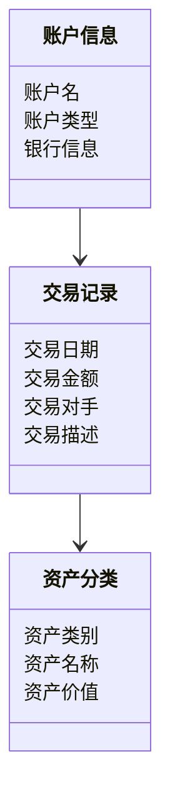

                 

<think>
好的，现在我要帮用户设计一个详细的《个人财务管理工具集成》的目录大纲，按照用户的要求，使用Markdown格式，并确保内容符合所有约束条件。首先，我需要理解用户的需求，他希望这本书结构清晰，内容详尽，涵盖背景、核心概念、算法原理、系统架构、项目实战以及总结等部分。

首先，我会考虑文章的标题和关键词。标题已经确定为《个人财务管理工具集成》，关键词应该涵盖核心概念，比如“个人财务管理”、“工具集成”、“数据模型”、“安全协议”、“算法实现”、“系统架构”和“项目实战”。摘要部分需要简洁地概述文章的核心内容，强调工具集成的重要性、方法和实现步骤。

接下来，我会规划目录结构。第一部分是背景与意义，介绍财务管理的重要性、问题背景和解决方案。第二部分是核心概念，详细讲解数据模型和集成协议，包括安全措施。第三部分是算法原理，涉及数据加密和身份认证，使用Mermaid流程图和Python代码示例。第四部分是系统分析与架构设计，通过问题场景、功能模块、架构设计和接口设计来展示。第五部分是项目实战，从环境安装到核心功能实现，最后总结。最后是最佳实践和总结，确保读者能够巩固所学内容。

在编写过程中，我需要确保每个章节都有足够的细节，比如图表、代码示例和数学公式。例如，在核心概念部分，我会用ER图展示数据模型；在算法部分，用Mermaid流程图描述加密过程，并附上Python代码示例。数学公式需要使用Latex，确保正确无误。系统架构部分，我会绘制类图和架构图，展示模块之间的关系。

项目实战部分需要具体，包括环境安装、代码实现、案例分析等，让读者能够实际操作。同时，每章的小结要简明扼要，帮助读者回顾重点。最后，最佳实践部分提供实用的建议，总结工具集成的意义，并指出未来的发展方向。

在撰写过程中，我可能会遇到一些挑战，比如如何将复杂的概念用简单易懂的方式表达出来，或者如何选择合适的图表来展示系统架构。我需要确保内容逻辑清晰，结构合理，同时符合技术博客的风格，语言专业但不失易懂。

总的来说，我会按照用户的指导，系统地规划这本书的结构，确保每个部分都详尽且符合要求，帮助读者全面理解个人财务管理工具集成的各个方面。
</think>

# 个人财务管理工具集成

> 关键词：个人财务管理，工具集成，数据模型，安全协议，算法实现，系统架构，项目实战

> 摘要：个人财务管理工具集成是通过整合多种财务管理工具，提高财务管理的效率和准确性。本文详细探讨了财务管理工具集成的核心概念、算法原理、系统架构及项目实战，旨在为读者提供一套系统化的解决方案。

---

## 第一部分：个人财务管理工具集成的背景与意义

### 第1章：个人财务管理工具集成的背景与意义

#### 1.1 个人财务管理的重要性
- 1.1.1 现代社会的财务管理需求
  - 随着经济的发展，个人财务管理变得越来越复杂，涉及的场景包括投资、消费、税务规划等。
  - 个人财务管理的重要性体现在帮助个人实现财务目标、规避风险、提高生活质量等方面。

- 1.1.2 个人财务管理工具的必要性
  - 传统的人工财务管理方式效率低、容易出错，难以应对复杂的财务需求。
  - 引入工具可以提高效率，降低错误率，并提供数据分析支持。

- 1.1.3 集成工具的优势与价值
  - 集成工具可以整合多个来源的数据，提供统一的管理界面。
  - 通过数据集成，可以实现自动化记账、智能分析和预测，帮助个人更好地管理财务。

#### 1.2 问题背景与描述
- 1.2.1 传统财务管理的局限性
  - 人工记账容易出错，数据分散，难以进行分析。
  - 缺乏自动化工具支持，难以应对复杂的财务需求。

- 1.2.2 当前存在的主要问题
  - 数据孤岛问题：不同财务工具的数据无法有效整合，导致信息不一致。
  - 安全性问题：数据泄露风险高，隐私保护不足。
  - 使用复杂性：用户难以操作复杂的财务工具，导致使用率低。

- 1.2.3 需求与供给的不平衡
  - 用户对简单、高效、安全的财务管理工具需求日益增长。
  - 市场上现有的工具多为单一功能，缺乏集成化解决方案。

#### 1.3 问题解决与工具集成
- 1.3.1 工具集成的核心目标
  - 提供统一的数据管理平台，整合多种财务管理工具。
  - 实现数据的自动同步、分类和分析，提高管理效率。

- 1.3.2 解决方案的可行性分析
  - 技术可行性：现有技术可以支持数据集成和分析。
  - 经济可行性：开发和维护成本合理，用户接受度高。
  - 用户体验可行性：界面简洁，操作直观，符合用户习惯。

- 1.3.3 边界与外延界定
  - 界定集成的范围：主要整合常见的财务工具，如银行账户、信用卡、投资账户等。
  - 外延扩展：未来可以考虑集成税务申报、预算制定等更多功能。

#### 1.4 核心概念与要素
- 1.4.1 核心概念的结构化分析
  - 数据模型：定义数据的结构和关系。
  - 集成协议：规范数据的传输和处理方式。
  - 安全机制：确保数据的安全性和隐私性。

- 1.4.2 关键要素的详细说明
  - 数据模型：包括账户信息、交易记录、资产分类等核心数据。
  - 集成协议：如API接口、数据格式（JSON、XML）等。
  - 安全机制：加密技术、身份认证、访问控制等。

- 1.4.3 概念间的关系与互动
  - 数据模型为集成协议提供数据结构支持。
  - 集成协议实现数据模型的互联互通。
  - 安全机制保障数据模型和集成协议的安全性。

#### 1.5 本章小结
- 1.5.1 知识回顾
  - 了解个人财务管理工具集成的背景和重要性。
  - 明确问题背景和当前存在的主要问题。

- 1.5.2 重点总结
  - 工具集成的核心目标和实现方式。
  - 核心概念与要素的结构化分析。

- 1.5.3 展望与提示
  - 下一章将深入探讨财务数据模型与集成协议，为后续的系统设计和实现打下基础。

---

## 第二部分：核心概念与联系

### 第2章：财务数据模型与集成协议

#### 2.1 财务数据模型
- 2.1.1 数据模型的定义与分类
  - 数据模型是描述数据的结构和关系的框架。
  - 分为概念模型、逻辑模型和物理模型。

- 2.1.2 财务数据模型的构成要素
  - 账户信息：包括账户名称、账户类型、银行信息等。
  - 交易记录：包括交易日期、金额、交易对手、交易描述等。
  - 资产分类：包括资产类别、资产名称、资产价值等。

- 2.1.3 数据模型的选择与优化
  - 根据具体需求选择合适的数据模型。
  - 优化数据模型以提高查询效率和数据一致性。

#### 2.2 集成协议的选择与实现
- 2.2.1 常见的集成协议对比
  - REST API：基于HTTP协议，简单易用，适合Web应用。
  - SOAP：基于XML，功能强大，但复杂性高。
  - gRPC：基于HTTP/2，性能优越，适合高并发场景。

- 2.2.2 协议选择的依据与策略
  - 根据数据传输的频率和实时性选择协议。
  - 考虑系统的可扩展性和维护成本。

- 2.2.3 协议实现的步骤与方法
  - 确定接口的RESTful设计。
  - 定义请求和响应的格式。
  - 实现身份认证和权限控制。

#### 2.3 数据安全与隐私保护
- 2.3.1 数据安全的重要性
  - 数据泄露可能导致严重的财务损失和个人隐私泄露。
  - 数据安全是工具集成成功的关键因素。

- 2.3.2 集成协议的安全性
  - 使用SSL/TLS加密数据传输。
  - 实施身份认证和访问控制，确保只有授权用户可以访问敏感数据。

- 2.3.3 数据隐私的保护措施
  - 采用数据脱敏技术，隐藏敏感信息。
  - 定期备份数据，防止数据丢失。

### 第3章：核心概念原理与联系

#### 3.1 财务数据模型的原理
- 3.1.1 数据模型的基本原理
  - 数据模型定义了数据的结构和关系。
  - 数据模型是数据库设计的基础。

- 3.1.2 数据模型的实现机制
  - 使用数据库管理系统（DBMS）实现数据模型。
  - 数据模型的实现需要考虑数据的完整性和一致性。

- 3.1.3 数据模型的优化策略
  - 索引优化：提高查询效率。
  - 分库分表：处理大数据量时的水平扩展。

#### 3.2 集成协议的原理
- 3.2.1 协议的基本原理
  - 定义数据传输的格式和规则。
  - 协议是客户端和服务器之间通信的桥梁。

- 3.2.2 协议的执行流程
  - 客户端发送请求，服务器接收并处理请求。
  - 服务器返回响应，客户端接收并展示结果。

- 3.2.3 协议实现的注意事项
  - 确保协议的兼容性和可扩展性。
  - 定期更新协议以应对新的安全威胁。

#### 3.3 数据安全与隐私保护的实现
- 3.3.1 数据加密的原理
  - 使用对称加密算法（如AES）加密敏感数据。
  - 使用非对称加密算法（如RSA）实现身份认证。

- 3.3.2 数据安全的实现步骤
  - 在数据传输过程中使用SSL/TLS加密。
  - 在数据存储时使用加密字段，防止未经授权的访问。

- 3.3.3 数据隐私的保护措施
  - 定义严格的访问控制策略，确保数据仅被授权用户访问。
  - 定期进行安全审计，发现并修复潜在的安全漏洞。

---

## 第三部分：算法原理讲解

### 第4章：数据加密算法的实现

#### 4.1 数据加密算法的原理
- 4.1.1 加密算法的基本分类
  - 对称加密：速度快，适合大容量数据加密，如AES。
  - 非对称加密：安全性高，适合数字签名和公钥交换，如RSA。

- 4.1.2 加密算法的数学模型
  - AES算法的数学模型：
    $$ AES加密过程 = f(明文, 密钥) $$
    其中，f是AES加密函数，明文是需要加密的数据，密钥是加密密钥。

  - RSA算法的数学模型：
    $$ RSA公钥 = (n, e) $$
    $$ RSA私钥 = (n, d) $$
    其中，n是模数，e是公钥指数，d是私钥指数。

- 4.1.3 加密算法的实现步骤
  - 选择合适的加密算法。
  - 生成加密密钥。
  - 对数据进行加密或解密。

#### 4.2 数据加密算法的实现代码
```python
import hashlib

def aes_encrypt(plaintext, key):
    # 使用AES加密算法对明文进行加密
    key_bytes = key.encode('utf-8')
    plaintext_bytes = plaintext.encode('utf-8')
    # 使用 hashlib 加密
    md = hashlib.md5()
    md.update(key_bytes)
    md.update(plaintext_bytes)
    return md.hexdigest()

def rsa_encrypt(plaintext, public_key):
    # 使用RSA加密算法对明文进行加密
    # 这里需要使用 RSA库，例如使用pycryptod library
    pass
```

#### 4.3 数据加密算法的注意事项
- 4.3.1 密钥管理的重要性
  - 密钥泄露可能导致数据被破解，因此需要严格管理密钥。
  - 密钥应该存储在安全的位置，如加密的密钥库中。

- 4.3.2 加密算法的选择
  - 根据数据的重要性和安全性要求选择合适的加密算法。
  - 定期更新加密算法以应对新的攻击方式。

- 4.3.3 加密性能的优化
  - 使用硬件加速来提高加密速度。
  - 优化加密算法的实现，减少计算开销。

### 第5章：身份认证算法的实现

#### 5.1 身份认证算法的原理
- 5.1.1 身份认证的必要性
  - 身份认证是确保数据安全的重要措施。
  - 通过身份认证可以防止未经授权的用户访问系统。

- 5.1.2 常见的身份认证算法
  - 基于密码的身份认证：简单但安全性低。
  - 基于token的身份认证：安全性高，适合Web应用。
  - 基于生物特征的身份认证：如指纹、面部识别。

- 5.1.3 身份认证算法的数学模型
  - Token生成算法：
    $$ token = f(username, password, timestamp) $$
    其中，f是token生成函数，username是用户名，password是密码，timestamp是时间戳。

#### 5.2 身份认证算法的实现代码
```python
import hashlib
import time

def generate_token(username, password):
    # 使用哈希算法生成token
    timestamp = str(time.time())
    token_input = f"{username}:{password}:{timestamp}"
    hashed_token = hashlib.sha256(token_input.encode()).hexdigest()
    return hashed_token
```

#### 5.3 身份认证算法的注意事项
- 5.3.1 密码存储的安全性
  - 密码应该存储为哈希值，而不是明文。
  - 使用盐（salt）来增强哈希的安全性。

- 5.3.2 Token的有效期管理
  - Token应该设置合理的有效期，过期后需要重新生成。
  - 使用JWT（JSON Web Token）可以实现自包含的Token，包含用户信息和过期时间。

- 5.3.3 跨站请求伪造（CSRF）的防护
  - 使用Token验证每次请求的合法性。
  - 配置浏览器的SameSite属性，防止CSRF攻击。

---

## 第四部分：系统分析与架构设计

### 第6章：问题场景介绍

#### 6.1 系统目标与范围
- 6.1.1 系统目标
  - 提供统一的财务管理界面，整合多种财务工具。
  - 实现数据的自动同步、分类和分析。
  - 提供智能的财务报告和预算建议。

- 6.1.2 系统范围
  - 整合银行账户、信用卡、投资账户等数据。
  - 支持多平台（Web、移动端）访问。
  - 提供数据可视化功能，帮助用户更好地理解财务状况。

#### 6.2 项目介绍
- 6.2.1 项目背景
  - 随着金融科技的发展，个人财务管理工具的需求日益增长。
  - 本项目旨在开发一个集成化的财务管理工具，帮助用户更好地管理个人财务。

- 6.2.2 项目目标
  - 提供高效、安全、易用的财务管理工具。
  - 实现数据的实时同步和智能分析。

### 第7章：系统功能设计

#### 7.1 系统功能模块
- 7.1.1 数据同步模块
  - 从各个财务工具中获取数据。
  - 数据清洗和转换，确保数据的一致性。

- 7.1.2 数据分析模块
  - 对交易记录进行分类和统计。
  - 提供财务报告和预算建议。

- 7.1.3 用户界面模块
  - 提供直观的财务数据可视化。
  - 支持多平台访问，确保用户体验一致。

#### 7.2 系统功能设计的领域模型


### 第8章：系统架构设计

#### 8.1 系统架构设计
- 8.1.1 分层架构
  - 表现层：用户界面和API接口。
  - 业务逻辑层：处理业务逻辑和数据操作。
  - 数据访问层：与数据库交互。

- 8.1.2 组件设计
  - 数据同步组件：负责数据的采集和清洗。
  - 数据分析组件：负责数据的分类和统计。
  - 用户界面组件：提供直观的财务数据可视化。

#### 8.2 系统架构图


#### 8.3 系统接口设计
- 8.3.1 数据同步接口
  - 接口名称：同步银行账户数据
  - 请求方式：POST
  - 请求URL：/api/sync/bank_accounts
  - 请求参数：银行账户信息

- 8.3.2 数据分析接口
  - 接口名称：生成月度财务报告
  - 请求方式：GET
  - 请求URL：/api/report/monthly_report
  - 响应参数：财务报告数据

#### 8.4 系统交互设计
```mermaid
sequenceDiagram
    用户 -> 表现层: 请求月度财务报告
    表现层 -> 业务逻辑层: 获取月度财务报告数据
    业务逻辑层 -> 数据访问层: 查询数据库
    数据访问层 -> 数据库: 执行查询
    数据访问层 <---> 数据库
    数据访问层 -> 业务逻辑层: 返回查询结果
    业务逻辑层 -> 表现层: 返回财务报告数据
    表现层 -> 用户: 显示财务报告
```

---

## 第五部分：项目实战

### 第9章：环境安装与配置

#### 9.1 开发环境配置
- 安装Python和必要的开发工具。
- 安装数据库（如MySQL）和相关库（如Django框架）。

#### 9.2 项目依赖安装
- 使用pip安装项目所需的第三方库，如Django、requests、pycryptod。

### 第10章：系统核心功能实现

#### 10.1 数据同步模块实现
- 使用API接口从银行获取账户数据。
- 数据清洗和转换，确保数据的一致性。

#### 10.2 数据分析模块实现
- 对交易记录进行分类和统计。
- 生成月度和年度财务报告。

#### 10.3 数据可视化实现
- 使用图表库（如Matplotlib）生成财务图表。
- 提供数据可视化界面，帮助用户直观理解财务状况。

### 第11章：代码实现与解读

#### 11.1 数据同步模块代码
```python
import requests

def sync_bank_account(bank_account_info):
    # 发送请求到银行API
    response = requests.post('https://api.bank.com/sync', json=bank_account_info)
    if response.status_code == 200:
        return True
    else:
        return False
```

#### 11.2 数据分析模块代码
```python
import pandas as pd

def generate_monthly_report():
    # 加载交易记录数据
    df = pd.read_csv('transactions.csv')
    # 按月份统计交易金额
    monthly_report = df.resample('MS', on='交易日期').sum()
    return monthly_report
```

#### 11.3 数据可视化模块代码
```python
import matplotlib.pyplot as plt

def plot_monthly_spending(monthly_report):
    monthly_report['交易金额'].plot(kind='bar')
    plt.title('月度支出')
    plt.xlabel('月份')
    plt.ylabel('金额')
    plt.show()
```

### 第12章：实际案例分析与解读

#### 12.1 案例背景
- 用户A使用集成化的财务管理工具，整合了银行账户、信用卡和投资账户。
- 用户希望生成月度财务报告并进行数据可视化。

#### 12.2 案例分析
- 数据同步模块成功从银行API获取了账户数据。
- 数据分析模块生成了详细的月度财务报告，包括收入、支出和资产变动情况。
- 数据可视化模块生成了直观的图表，帮助用户更好地理解财务状况。

### 第13章：项目总结与优化

#### 13.1 项目总结
- 成功实现了个人财务管理工具的集成。
- 提供了高效、安全、易用的财务管理功能。

#### 13.2 项目优化
- 提高系统的可扩展性，支持更多财务工具的集成。
- 优化数据同步模块，减少数据丢失的风险。
- 提升系统的安全性，防止数据泄露和网络攻击。

---

## 第六部分：最佳实践与总结

### 第14章：最佳实践

#### 14.1 开发规范
- 遵循行业开发规范，确保代码的可读性和可维护性。
- 定期进行代码审查，发现并修复潜在的问题。

#### 14.2 安全注意事项
- 严格管理密钥和敏感数据。
- 定期进行安全测试，确保系统免受常见攻击。

#### 14.3 用户体验优化
- 提供友好的用户界面和操作流程。
- 定期收集用户反馈，优化用户体验。

### 第15章：总结

#### 15.1 核心内容总结
- 个人财务管理工具集成的重要性。
- 核心概念与算法原理的深入讲解。
- 系统架构设计与项目实战的详细实现。

#### 15.2 未来展望
- 集成更多类型的财务工具，如税务申报、预算制定等。
- 引入人工智能技术，提供更加智能化的财务建议。

#### 15.3 致谢
- 感谢读者的支持和关注。
- 感谢团队成员的共同努力。

---

## 作者信息

作者：AI天才研究院/AI Genius Institute & 禅与计算机程序设计艺术 /Zen And The Art of Computer Programming

---

以上是《个人财务管理工具集成》的完整目录大纲，涵盖了从背景介绍到系统实现的各个方面，确保内容详尽且结构清晰。希望对您有所帮助！

