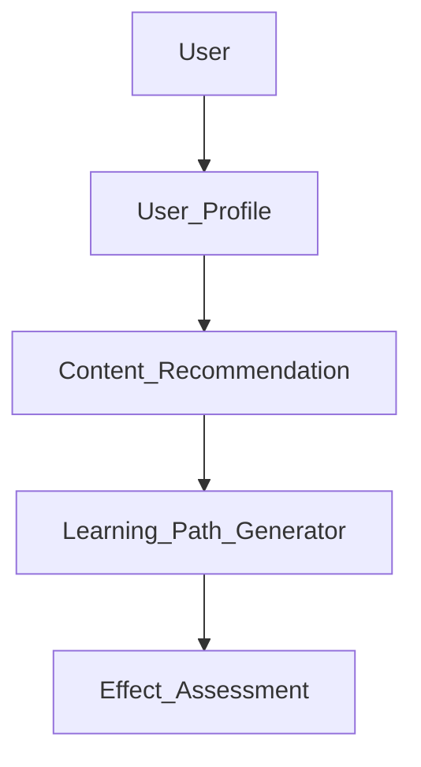

                 

# 目录大纲：《个性化学习路径AI Agent：LLM辅助的自适应教育》

---

## # 第一部分: 个性化学习路径的背景与核心概念

### ## 第1章: 个性化学习路径的现状与挑战

#### ### 1.1 个性化学习的定义与重要性
- 个性化学习的定义
- 个性化学习的重要性
- 当前教育中的痛点与个性化学习的必要性

#### ### 1.2 AI Agent与LLM的定义与特点
- AI Agent的基本概念
- LLM的核心特点与优势
- AI Agent与LLM在教育中的结合

#### ### 1.3 自适应教育的定义与实现方式
- 自适应教育的概念
- 基于AI的自适应学习系统的特点
- 自适应教育的实现路径

#### ### 1.4 本章小结

---

## # 第二部分: LLM辅助的个性化学习路径设计

### ## 第2章: LLM在个性化学习中的核心作用

#### ### 2.1 LLM的基本原理与技术特点
- 大语言模型的工作原理
- LLM在教育中的应用优势
- LLM的局限性与改进方向

#### ### 2.2 AI Agent在个性化学习中的角色
- AI Agent作为学习路径规划者的功能
- AI Agent与教师、学生的互动方式
- AI Agent的决策逻辑与优化策略

#### ### 2.3 个性化学习路径的设计框架
- 学习目标的分解与优先级排序
- 学习资源的筛选与推荐机制
- 学习进度的动态调整与反馈

#### ### 2.4 本章小结

---

## # 第三部分: 个性化学习路径的系统架构与算法原理

### ## 第3章: 系统架构设计

#### ### 3.1 系统功能模块划分
- 用户画像模块
- 内容推荐模块
- 学习路径生成模块
- 学习效果评估模块

#### ### 3.2 系统架构图（Mermaid）

#### ### 3.3 本章小结

---

## # 第四部分: 项目实战与案例分析

### ## 第4章: 项目实战

#### ### 4.1 环境安装与配置
- 开发工具安装
- 数据集准备
- 模型训练环境配置

#### ### 4.2 核心代码实现
- 用户画像模块实现
- 内容推荐算法实现
- 学习路径生成算法实现

#### ### 4.3 案例分析与效果评估
- 实际案例分析
- 系统性能评估
- 用户反馈与优化

#### ### 4.4 本章小结

---

## # 第五部分: 总结与展望

### ## 第5章: 总结与未来展望

#### ### 5.1 最佳实践 tips
- 系统设计中的注意事项
- 项目实施中的关键点
- 使用中的常见问题解答

#### ### 5.2 未来的发展方向
- 新技术的应用潜力
- 教育模式的创新
- 个性化学习的未来趋势

#### ### 5.3 本章小结

---

## # 作者

作者：AI天才研究院/AI Genius Institute & 禅与计算机程序设计艺术 /Zen And The Art of Computer Programming

---

以上是《个性化学习路径AI Agent：LLM辅助的自适应教育》的技术博客文章的目录大纲。每一章都细化到三级目录，涵盖从背景介绍到项目实战的各个方面，内容丰富且逻辑清晰。

