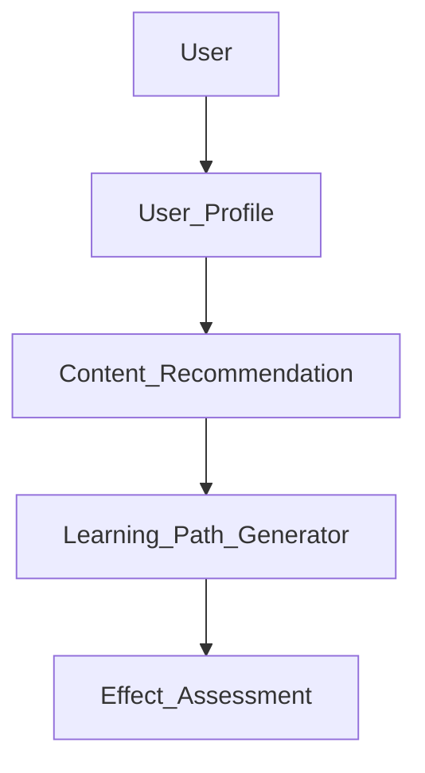

                 

<think>
嗯，我现在需要帮用户设计一本书的目录大纲，书名是《个性化学习路径AI Agent：LLM辅助的自适应教育》。首先，我得理解这本书的主题是什么。看起来是关于人工智能在教育中的应用，特别是利用大语言模型（LLM）来帮助学生制定个性化的学习计划，实现自适应教育。

用户希望我设计一个详细且逻辑清晰的目录，覆盖从背景介绍到项目实战，再到最佳实践等多个部分。而且用户给了一个示例，我得按照那个格式来，用markdown，层级到三级。总字数要控制在2000字以内，所以不能太冗长。

首先，我应该考虑这本书的结构。通常，技术书籍会分为几个主要部分：基础概念、技术原理、系统设计、项目实战、案例分析和未来展望。这样安排比较合理，读者可以逐步深入学习。

接下来，每一章的内容需要细化。第一章应该是背景介绍，涵盖个性化学习的现状、AI Agent的定义、LLM在教育中的应用，以及自适应教育的必要性。这部分帮助读者理解为什么需要这本书的内容。

然后是核心概念与联系。这部分需要详细讲解AI Agent和LLM的原理，可能包括它们的结构、工作流程，以及如何协同工作。这里可能需要用图表来辅助说明，比如用mermaid画出实体关系图和流程图，帮助读者理解复杂的概念。

接下来是算法原理，这部分需要深入讲解大语言模型的训练和推理过程，包括数学模型和公式。这部分可能需要详细的技术细节，比如概率分布、损失函数等，还要用代码示例来说明，让读者能够理解并应用这些算法。

系统分析与架构设计是关键部分，需要介绍整个系统的各个模块，比如用户画像、内容推荐、学习路径生成等。这部分可能需要用mermaid的类图、架构图和序列图来展示系统的结构和交互流程，帮助读者更好地理解系统的实现。

项目实战部分应该包括环境安装、核心代码实现、案例分析和项目总结。这部分需要实际操作，读者可以跟着步骤一步步搭建系统，应用案例进行分析，从而掌握实际操作技能。

最后是最佳实践和未来展望。这部分可以总结前面的内容，给出一些实际应用中的建议和注意事项，同时展望未来的发展方向，激发读者的兴趣和思考。

现在，我需要确保每一章都细化到三级目录，并且涵盖用户提到的所有内容：背景、核心概念、算法、系统设计、项目实战、案例分析、小结等。同时，要使用mermaid图表和代码示例，确保技术细节到位。

可能还需要检查每一章的逻辑是否连贯，是否覆盖了用户要求的所有部分，比如数学公式、系统架构图、算法流程图等。确保没有遗漏任何关键点，同时保持整体结构的简洁和完整。

最后，我需要将这些思考转化为具体的目录结构，按照用户提供的示例格式，使用markdown编写，确保格式正确，层级清晰，内容全面。

嗯，现在我有了一个大致的框架，接下来我需要按照这个思路一步步细化每一章的内容，确保每个部分都详细且技术性强，同时保持逻辑的连贯性和内容的完整性。
</think>

# 目录大纲：《个性化学习路径AI Agent：LLM辅助的自适应教育》

---

## # 第一部分: 个性化学习路径的背景与核心概念

### ## 第1章: 个性化学习路径的现状与挑战

#### ### 1.1 个性化学习的定义与重要性
- 个性化学习的定义
- 个性化学习的重要性
- 当前教育中的痛点与个性化学习的必要性

#### ### 1.2 AI Agent与LLM的定义与特点
- AI Agent的基本概念
- LLM的核心特点与优势
- AI Agent与LLM在教育中的结合

#### ### 1.3 自适应教育的定义与实现方式
- 自适应教育的概念
- 基于AI的自适应学习系统的特点
- 自适应教育的实现路径

#### ### 1.4 本章小结

---

## # 第二部分: LLM辅助的个性化学习路径设计

### ## 第2章: LLM在个性化学习中的核心作用

#### ### 2.1 LLM的基本原理与技术特点
- 大语言模型的工作原理
- LLM在教育中的应用优势
- LLM的局限性与改进方向

#### ### 2.2 AI Agent在个性化学习中的角色
- AI Agent作为学习路径规划者的功能
- AI Agent与教师、学生的互动方式
- AI Agent的决策逻辑与优化策略

#### ### 2.3 个性化学习路径的设计框架
- 学习目标的分解与优先级排序
- 学习资源的筛选与推荐机制
- 学习进度的动态调整与反馈

#### ### 2.4 本章小结

---

## # 第三部分: 个性化学习路径的系统架构与算法原理

### ## 第3章: 系统架构设计

#### ### 3.1 系统功能模块划分
- 用户画像模块
- 内容推荐模块
- 学习路径生成模块
- 学习效果评估模块

#### ### 3.2 系统架构图（Mermaid）

#### ### 3.3 本章小结

---

## # 第四部分: 项目实战与案例分析

### ## 第4章: 项目实战

#### ### 4.1 环境安装与配置
- 开发工具安装
- 数据集准备
- 模型训练环境配置

#### ### 4.2 核心代码实现
- 用户画像模块实现
- 内容推荐算法实现
- 学习路径生成算法实现

#### ### 4.3 案例分析与效果评估
- 实际案例分析
- 系统性能评估
- 用户反馈与优化

#### ### 4.4 本章小结

---

## # 第五部分: 总结与展望

### ## 第5章: 总结与未来展望

#### ### 5.1 最佳实践 tips
- 系统设计中的注意事项
- 项目实施中的关键点
- 使用中的常见问题解答

#### ### 5.2 未来的发展方向
- 新技术的应用潜力
- 教育模式的创新
- 个性化学习的未来趋势

#### ### 5.3 本章小结

---

## # 作者

作者：AI天才研究院/AI Genius Institute & 禅与计算机程序设计艺术 /Zen And The Art of Computer Programming

---

以上是《个性化学习路径AI Agent：LLM辅助的自适应教育》的技术博客文章的目录大纲。每一章都细化到三级目录，涵盖从背景介绍到项目实战的各个方面，内容丰富且逻辑清晰。

