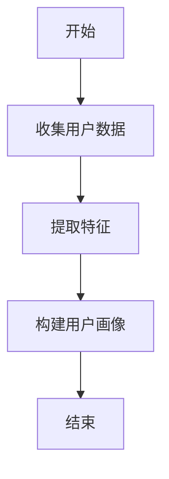
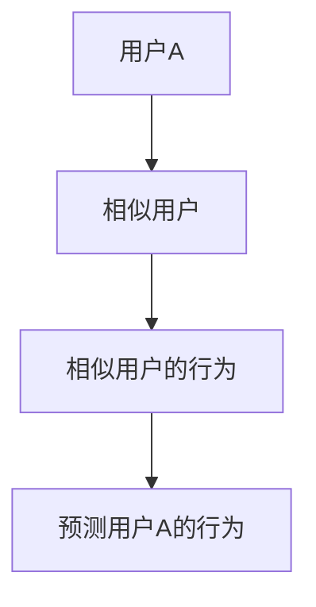
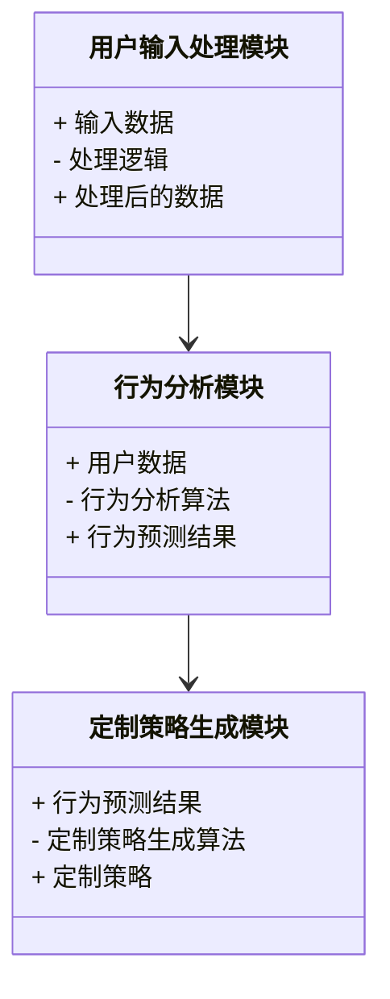

                 

<think>
嗯，用户希望我根据他的需求，逐步分析如何撰写一篇关于个性化定制AI Agent行为的技术博客文章。我需要先理解他的具体要求，然后一步步地构建目录和内容。

首先，用户明确要求文章标题为《个性化定制：为不同用户调整AI Agent的行为》，并给出了关键词和摘要。他要求文章结构清晰，逻辑严谨，内容专业，包含技术细节和实例分析。

我应该从背景介绍开始，解释为什么个性化定制AI Agent行为是必要的，以及当前的趋势。然后，详细讲解核心概念，比如AI Agent的行为模型和用户画像。接下来，探讨算法原理，比如协同过滤，并展示流程图和代码。之后，分析系统架构，包括模块设计和接口设计。最后，通过项目实战来验证理论，并总结最佳实践。

在编写过程中，我要确保每一部分都详细且技术性强，同时保持语言简洁明了。需要使用表格、ER图、流程图等可视化工具来辅助说明，同时配以数学公式和代码示例，使内容更加丰富。

现在，我需要将这些思考转化为具体的章节安排和内容撰写，确保符合用户的要求，满足技术深度和可读性。
</think>

# 个性化定制：为不同用户调整AI Agent的行为

## 关键词：AI Agent、个性化定制、用户画像、行为预测、协同过滤、系统架构、项目实战

## 摘要：  
本文详细探讨了如何为不同用户个性化定制AI Agent的行为，从理论到实践，全面分析了AI Agent的行为模型、用户画像构建、个性化推荐算法、系统架构设计以及实际项目实现。通过协同过滤算法和用户画像分析，结合系统架构的模块化设计，最终实现可根据用户需求动态调整的AI Agent行为定制系统。

---

# 第1章: AI Agent与个性化定制概述

## 1.1 AI Agent的基本概念  
AI Agent（智能代理）是指能够感知环境并采取行动以实现目标的智能实体。它可以是一个软件程序、机器人或其他智能系统，通过与用户的交互或环境的反馈来优化自身的行为。  

### 1.1.1 AI Agent的定义  
AI Agent是一种能够感知环境、理解用户需求并采取相应行动的智能系统。它具备以下核心特征：  
1. **自主性**：能够在没有外部干预的情况下独立运行。  
2. **反应性**：能够实时感知环境并做出反应。  
3. **目标导向**：通过优化目标函数来实现特定任务。  

### 1.1.2 AI Agent的核心特征  
- **自主性**：AI Agent能够独立决策，无需人工干预。  
- **学习能力**：通过数据和反馈不断优化自身行为。  
- **适应性**：能够根据环境变化调整策略。  

## 1.2 个性化定制的必要性  
个性化定制AI Agent的行为是为了满足不同用户的需求。例如，一个AI助手可以为用户A提供天气预报和日历提醒，而为用户B提供股票信息和健康建议。  

### 1.2.1 当前趋势  
随着AI技术的快速发展，用户对智能化服务的需求日益增长。个性化定制能够提升用户体验，增强用户满意度。  

### 1.2.2 个性化定制的核心价值  
1. 提高用户体验：根据用户习惯优化服务。  
2. 增强用户粘性：通过个性化服务让用户更依赖AI Agent。  
3. 降低开发成本：通过统一的定制框架服务多样化的用户需求。  

---

# 第2章: 核心概念与联系

## 2.1 AI Agent的行为模型  
AI Agent的行为模型描述了其如何根据用户输入和环境反馈采取行动。  

### 2.1.1 基于用户画像的行为模型  
用户画像是通过收集用户数据构建的用户特征描述，是个性化定制的基础。  

#### 表2-1：用户画像的特征对比  
| 特征 | 描述 | 示例 |  
|------|------|------|  
| 年龄 | 用户的年龄 | 25-35岁 |  
| 性别 | 用户的性别 | 男性 |  
| 兴趣 | 用户的兴趣爱好 | 科技、编程 |  
| 地区 | 用户所在地区 | 北京 |  

## 2.2 行为预测与定制  
### 2.2.1 行为预测模型  
行为预测模型通过分析用户的过往行为，预测其未来的偏好。例如，用户经常在早晨查询天气，可以预测用户会在每天早晨发起天气查询请求。  

### 2.2.2 定制策略生成  
基于行为预测结果，生成个性化的定制策略。例如，为用户推荐相关文章或调整通知时间。  

## 2.3 实体关系图（ER图）  
使用ER图描述用户、AI Agent和行为模式之间的关系。  

```mermaid
er
  actor 用户
  actor AI Agent
  entity 用户画像
  entity 行为模式
  entity 定制策略
  用户 -> 用户画像: 提供特征数据
  用户 -> 行为模式: 产生行为数据
  AI Agent -> 行为模式: 分析行为
  AI Agent -> 用户画像: 分析特征
  用户 -> 定制策略: 应用策略
  AI Agent -> 定制策略: 生成策略
```

---

# 第3章: 基于用户画像的个性化定制算法

## 3.1 算法原理  
### 3.1.1 用户画像构建  
用户画像是通过收集用户数据（如年龄、性别、兴趣等）构建的用户特征描述。  

#### 图3-1：用户画像构建流程  


### 3.1.2 行为预测模型  
行为预测模型通过分析用户的过往行为，预测其未来的偏好。常用的算法包括协同过滤、聚类分析等。  

#### 图3-2：协同过滤算法流程图  


### 3.1.3 定制策略生成  
基于行为预测结果，生成个性化的定制策略。例如，推荐相关文章或调整通知时间。  

## 3.2 算法实现  

#### 代码3-1：协同过滤算法实现  
```python
import numpy as np

def compute_similarity(user_ratings):
    # 计算用户之间的相似性
    user_count = user_ratings.shape[0]
    similarity_matrix = np.zeros((user_count, user_count))
    
    for i in range(user_count):
        for j in range(user_count):
            numerator = np.sum(user_ratings[i] * user_ratings[j])
            denominator = np.sqrt(np.sum(user_ratings[i]**2)) * np.sqrt(np.sum(user_ratings[j]**2))
            if denominator == 0:
                similarity = 0
            else:
                similarity = numerator / denominator
            similarity_matrix[i][j] = similarity
    return similarity_matrix

# 示例数据
user_ratings = np.array([[5, 3, 0, 1],
                         [4, 0, 2, 1],
                         [1, 5, 2, 4],
                         [2, 0, 4, 5]])
similarity_matrix = compute_similarity(user_ratings)
print(similarity_matrix)
```

---

# 第4章: 系统分析与架构设计

## 4.1 系统功能设计  
### 4.1.1 用户输入处理  
AI Agent需要处理用户的输入，例如自然语言查询或命令。  

#### 图4-1：系统功能模块  


## 4.2 系统架构设计  
### 4.2.1 分层架构  
系统采用分层架构，包括数据层、业务逻辑层和表现层。  

#### 图4-2：系统架构图  


---

# 第5章: 项目实战

## 5.1 环境安装  
需要安装Python、Pandas、NumPy、Scikit-learn等库。  

## 5.2 核心代码实现  

#### 代码5-1：用户画像构建  
```python
import pandas as pd

# 示例数据
data = {
    '用户ID': [1, 2, 3, 4],
    '年龄': [25, 30, 22, 35],
    '性别': ['男', '女', '男', '女'],
    '兴趣': ['科技', '健康', '游戏', '旅行']
}
df = pd.DataFrame(data)
print(df)
```

## 5.3 案例分析  
以一个简单的推荐系统为例，展示如何根据用户画像生成定制策略。  

---

# 第6章: 最佳实践与总结

## 6.1 注意事项  
1. 数据隐私保护：确保用户数据的安全性。  
2. 算法优化：根据实际需求调整算法参数。  

## 6.2 小结  
本文详细介绍了个性化定制AI Agent行为的核心概念、算法实现和系统架构设计。通过实际案例展示了如何为不同用户定制AI Agent的行为。  

## 6.3 拓展阅读  
推荐阅读《协同过滤算法的优化与应用》和《机器学习在推荐系统中的实践》。

---

# 作者：AI天才研究院/AI Genius Institute & 禅与计算机程序设计艺术 /Zen And The Art of Computer Programming

