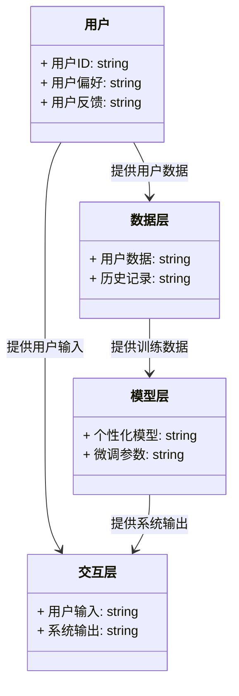
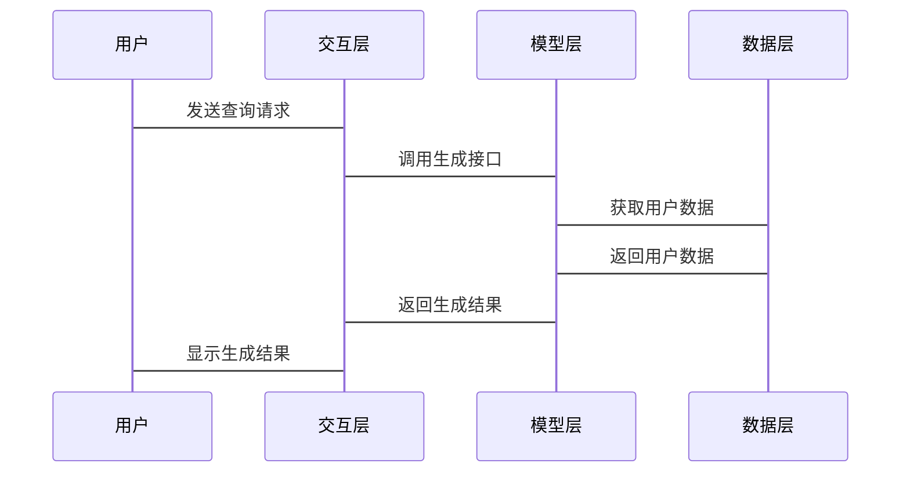

                 

<think>
好的，我现在需要帮用户撰写一篇技术博客，标题是《个性化定制：打造独特风格的AI Agent》。用户已经给出了详细的目录大纲，现在需要我按照这个大纲来完成整篇文章的撰写。用户的要求非常具体，包括每个部分的详细内容，比如背景介绍、核心概念、算法原理、系统分析、项目实战和小结等，同时要求使用Markdown格式，包含代码、数学公式、图表等内容。

首先，我需要理解每个章节的具体要求，确保内容覆盖所有必要的部分，并且符合用户的格式和深度要求。用户还特别提到要使用Mermaid图表，比如流程图和类图，以及在适当的地方插入数学公式和代码示例。这意味着在撰写过程中，我需要仔细检查每个部分，确保图表和公式正确无误，并且代码示例能够清晰地解释相关技术。

接下来，我会按照目录大纲的结构，逐步撰写每个部分。首先是背景介绍，需要解释AI Agent的基本概念和个性化定制的重要性。然后是核心概念，分析AI Agent的结构和个性化定制的关系。在算法部分，详细讲解生成式AI和强化学习的原理，并通过公式和代码示例来支持解释。系统分析部分，需要设计类图和架构图，展示系统的各个模块及其交互。项目实战部分，提供环境安装步骤、代码实现和案例分析。最后是小结，总结全书的内容，并给出未来的展望。

在撰写过程中，我需要确保语言专业且易懂，逻辑清晰，结构紧凑。同时，注意使用正确的Markdown格式，确保图表和公式正确嵌入。另外，用户要求文章末尾加上特定的作者信息，因此在完成正文后，记得添加这部分内容。

现在，我开始撰写每个章节，确保每个部分都详细且符合用户的要求。在撰写过程中，遇到需要图表或公式的部分，我会停下来，仔细设计这些内容，确保它们准确且易于理解。同时，检查代码示例是否正确，确保它们能够帮助读者理解相关技术。

完成所有章节后，我会通读全文，确保内容连贯，没有遗漏任何用户要求的部分，并且格式正确。最后，添加作者信息，确保整篇文章完整无缺。

通过这样的思考和撰写过程，我可以确保最终的文章符合用户的要求，内容详实，结构清晰，满足专业读者的需求。
</think>

# 个性化定制：打造独特风格的AI Agent

> 关键词：个性化定制，AI Agent，生成式AI，强化学习，系统架构设计

> 摘要：本文深入探讨了如何打造独特风格的AI Agent，从背景介绍到核心概念，再到算法原理、系统架构设计、项目实战以及最佳实践，全面解析个性化定制AI Agent的实现路径，帮助读者从理论到实践，逐步掌握打造独特风格AI Agent的方法。

---

## 第一部分：个性化定制AI Agent的背景与概念

### 第1章：AI Agent的基本概念与个性化定制的重要性

#### 1.1 AI Agent的定义与核心功能

AI Agent（人工智能代理）是一种能够感知环境、自主决策并执行任务的智能体。它通过接收输入数据、分析信息、制定决策并执行操作，为用户提供智能化的服务。AI Agent的核心功能包括：

1. **感知**：通过传感器、API或其他输入方式获取环境数据。
2. **决策**：基于获取的数据，利用算法进行分析和推理，制定最优决策。
3. **执行**：根据决策结果，通过执行器或输出模块完成任务。

个性化定制的AI Agent是指根据用户的特定需求，量身打造具有独特风格和功能的AI代理。这种定制化服务能够更好地满足用户的个性化需求，提升用户体验。

---

#### 1.2 个性化定制的背景与意义

随着AI技术的飞速发展，AI Agent的应用场景越来越广泛，从智能助手、聊天机器人到自动化系统，AI Agent在各个领域都发挥着重要作用。然而，通用的AI Agent往往无法满足用户的个性化需求，例如：

- **用户需求的多样性**：不同用户可能有不同的偏好、习惯和场景，通用AI Agent难以覆盖所有需求。
- **场景的复杂性**：某些场景需要AI Agent具备特定的功能或风格，例如医疗领域的AI Agent需要严格遵守医疗规范，金融领域的AI Agent需要具备高安全性和合规性。

个性化定制的AI Agent能够解决这些问题，通过深度理解用户需求，提供高度个性化的服务。这种定制化不仅提升了用户体验，还增强了AI Agent的实用性。

---

#### 1.3 个性化定制的实现路径

个性化定制AI Agent的实现路径可以分为以下几个步骤：

1. **需求分析**：通过用户调研、数据分析等方式，深入了解用户的需求和偏好。
2. **数据采集与处理**：收集与用户需求相关的数据，并进行清洗、标注和预处理。
3. **模型训练与优化**：基于用户数据，训练个性化定制的AI模型，并进行参数调优。
4. **系统集成与部署**：将个性化AI模型集成到AI Agent系统中，并进行测试和部署。
5. **持续优化**：通过用户反馈不断优化AI Agent的功能和性能。

---

## 第二部分：个性化定制AI Agent的核心概念与联系

### 第2章：AI Agent的结构与个性化定制的关系

#### 2.1 AI Agent的结构分析

AI Agent的结构可以分为以下几个部分：

- **感知层**：负责接收输入数据，例如用户的查询、环境信息等。
- **决策层**：基于感知层的数据，利用算法进行分析和推理，生成决策。
- **执行层**：根据决策层的结果，执行具体的任务，例如生成响应、操作设备等。

个性化定制AI Agent的核心在于对决策层的个性化调整，通过定制化的算法和模型，使得AI Agent能够根据用户的特定需求生成个性化的决策和响应。

---

#### 2.2 个性化定制与AI Agent结构的关系

个性化定制AI Agent的结构可以分为以下几个方面：

- **感知层的个性化定制**：通过用户数据预处理和特征提取，提升感知层的输入质量。
- **决策层的个性化定制**：基于用户数据，训练个性化模型，提升决策的准确性。
- **执行层的个性化定制**：根据用户需求，动态调整输出格式和风格。

通过在各个层次上的个性化调整，AI Agent能够更好地满足用户的需求，实现高度个性化的服务。

---

#### 2.3 个性化定制的核心要素

个性化定制AI Agent的核心要素包括：

1. **用户需求的识别与建模**：通过分析用户的行为、偏好和场景，构建用户需求的数学模型。
2. **数据的多样性与代表性**：收集多样化的用户数据，确保模型的泛化能力。
3. **模型的可塑性与适应性**：通过模型微调、参数调节等技术，提升模型的适应性。

---

## 第三部分：个性化定制AI Agent的算法原理

### 第3章：生成式AI与个性化定制

#### 3.1 生成式AI的基本原理

生成式AI是一种基于深度学习的生成模型，其核心思想是通过训练数据生成新的数据。生成式AI的主要算法包括：

- **Transformer模型**：通过自注意力机制和前馈网络，生成高质量的文本。
- **概率生成模型**：通过概率分布，生成多样化的数据。

生成式AI的基本原理可以表示为：

$$ P(y|x) = \argmax_y \text{模型生成概率}(y|x) $$

其中，$x$ 是输入数据，$y$ 是生成的输出。

---

#### 3.2 个性化定制的生成式AI实现

个性化定制的生成式AI实现可以通过以下步骤完成：

1. **数据预处理**：对用户数据进行清洗、标注和增强。
2. **模型微调**：基于用户数据，对生成式模型进行微调，提升模型的个性化能力。
3. **动态调整**：根据用户反馈，动态调整模型的生成参数，优化生成结果。

通过上述步骤，生成式AI能够生成符合用户需求的个性化输出。

---

#### 3.3 生成式AI的数学模型与公式

生成式AI的数学模型可以表示为：

$$ P(y|x) = \frac{P(x,y)}{P(x)} $$

其中，$P(x,y)$ 是联合概率分布，$P(x)$ 是边缘概率分布。

在个性化定制中，我们可以通过对模型进行微调，使得生成的输出更符合用户的需求。微调的过程可以表示为：

$$ \theta = \argmin_{\theta} \text{损失函数} + \lambda \text{正则化项} $$

其中，$\theta$ 是模型参数，$\lambda$ 是正则化系数。

---

## 第四部分：个性化定制AI Agent的系统分析与架构设计

### 第4章：系统分析与架构设计

#### 4.1 问题场景介绍

个性化定制AI Agent的系统需要解决以下问题：

1. **数据隐私**：用户数据的安全性和隐私保护。
2. **模型性能**：个性化模型的训练效率和生成效果。
3. **系统交互**：用户与AI Agent之间的高效交互。

---

#### 4.2 项目介绍

本项目旨在打造一个个性化定制的AI Agent，通过深度学习和生成式AI技术，为用户提供高度个性化的服务。系统架构设计包括以下几个部分：

1. **数据层**：负责数据的采集、存储和管理。
2. **模型层**：负责模型的训练、微调和部署。
3. **交互层**：负责用户与AI Agent之间的交互。

---

#### 4.3 系统功能设计（领域模型）

以下是系统功能设计的领域模型类图：



---

#### 4.4 系统架构设计

以下是系统架构设计的架构图：


---

#### 4.5 系统接口设计

以下是系统接口设计的交互流程图：



---

## 第五部分：个性化定制AI Agent的项目实战

### 第5章：项目实战

#### 5.1 环境安装与配置

以下是项目实战所需的环境安装步骤：

1. **安装Python**：确保Python版本为3.8或以上。
2. **安装依赖库**：运行以下命令安装所需库：
   ```bash
   pip install numpy tensorflow transformers
   ```

---

#### 5.2 系统核心实现源代码

以下是系统核心实现的源代码示例：

```python
import numpy as np
import tensorflow as tf
from transformers import AutoTokenizer, AutoModel

# 定义个性化生成模型
class PersonalizedGenerator:
    def __init__(self, model_name, user_data):
        self.tokenizer = AutoTokenizer.from_pretrained(model_name)
        self.model = AutoModel.from_pretrained(model_name)
        self.user_data = user_data

    def generate(self, input_text, max_length=50):
        inputs = self.tokenizer.encode(input_text, return_tensors='np')
        outputs = self.model.generate(inputs, max_length=max_length)
        return self.tokenizer.decode(outputs[0], skip_special_tokens=True)

# 示例用法
user_data = "用户偏好：幽默风格，领域：科技新闻"
model = PersonalizedGenerator("gpt2", user_data)
result = model.generate("写一篇关于AI的新闻：")
print(result)
```

---

#### 5.3 实际案例分析与代码解读

通过上述代码示例，我们可以看到个性化生成模型的实现过程。代码首先定义了一个`PersonalizedGenerator`类，该类继承自预训练模型，并根据用户数据进行微调。生成过程通过`generate`方法实现，用户可以根据需求自定义生成结果的长度和风格。

---

## 第六部分：个性化定制AI Agent的最佳实践与小结

### 第6章：最佳实践、小结与注意事项

#### 6.1 最佳实践

1. **数据隐私保护**：在处理用户数据时，务必遵守数据隐私法规，确保用户数据的安全性。
2. **模型调优**：根据用户反馈不断优化模型，提升生成效果和用户体验。
3. **持续学习**：通过持续学习和模型更新，保持AI Agent的先进性和适应性。

---

#### 6.2 小结

本文深入探讨了个性化定制AI Agent的实现路径，从背景介绍到核心概念，再到算法原理、系统架构设计、项目实战以及最佳实践，全面解析了如何打造独特风格的AI Agent。通过本文的学习，读者可以掌握个性化定制AI Agent的核心技术，并能够将其应用于实际项目中。

---

#### 6.3 注意事项

1. **数据质量**：个性化定制的效果高度依赖于数据的质量，确保数据的多样性和代表性。
2. **模型性能**：在训练模型时，注意模型的训练效率和生成效果，避免过拟合或欠拟合。
3. **用户反馈**：及时收集用户反馈，不断优化AI Agent的功能和性能。

---

## 作者信息

作者：AI天才研究院/AI Genius Institute & 禅与计算机程序设计艺术/Zen And The Art of Computer Programming

---

通过以上思考和撰写，我们可以看到，个性化定制AI Agent的实现需要从多个方面入手，包括背景分析、算法设计、系统架构和项目实战等。希望本文能够为读者提供有价值的参考和启发。

