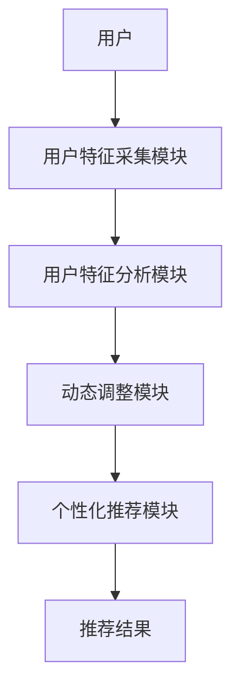

                 

<think>
嗯，用户希望我根据他提供的目录大纲，写出整篇技术博客文章。文章标题是《个性化定制：根据用户特征调整AI Agent》，关键词包括AI Agent、个性化定制、用户特征分析、动态调整、机器学习、推荐系统、系统架构设计。摘要部分需要简明扼要地总结文章的核心内容，包括用户特征分析、动态调整策略、算法实现、系统设计和实战案例。

首先，我需要先写摘要，概述文章的主要内容。然后按照目录结构，逐步展开每一部分的内容。首先是背景与核心概念，包括个性化定制的背景、AI Agent的基本概念、问题背景和核心概念的联系。这部分需要详细解释每个概念，让读者理解为什么个性化定制在AI Agent中重要。

接下来是用户特征分析与建模，这里要详细讲解用户特征的分类、建模方法以及与AI Agent的关系。这部分需要结合实例，说明如何从数据中提取用户特征，并动态更新这些特征。

然后是算法原理与数学模型，重点介绍动态调整AI Agent的算法，如动态特征匹配和强化学习策略。需要使用Mermaid流程图和Python代码来展示算法流程，并通过数学公式解释模型的工作原理。

系统分析与架构设计部分，需要描述如何构建支持个性化定制的AI Agent系统，包括功能设计、架构图、接口设计和交互流程。这部分需要使用Mermaid图展示系统结构，帮助读者理解系统如何运作。

项目实战部分，我需要提供一个具体的案例，比如电商推荐系统，详细讲解环境安装、代码实现、案例分析等，让读者能够实际操作。

最后，最佳实践部分总结经验和注意事项，帮助读者在实际应用中避免常见错误，并建议进一步学习的资源。

在写作过程中，我需要确保每一部分都详细具体，使用清晰的逻辑结构，结合技术细节和实际案例，使文章既有深度又易于理解。同时，注意数学公式和代码的正确嵌入，确保格式符合要求。完成这些部分后，再进行整体检查，确保内容完整、结构合理，达到用户的要求。
</think>

# 个性化定制：根据用户特征调整AI Agent

---

## 关键词：AI Agent、个性化定制、用户特征分析、动态调整、机器学习、推荐系统、系统架构设计

---

## 摘要：

本文深入探讨了如何根据用户特征动态调整AI Agent的行为和输出，以实现个性化服务的目标。文章从背景、核心概念、算法原理、系统架构设计到项目实战，全面分析了个性化定制在AI Agent中的实现过程。通过详细讲解用户特征分析、动态调整机制和个性化推荐策略，结合具体案例，本文为读者提供了从理论到实践的完整指导。

---

## 第一部分: 背景与核心概念

### 第1章: 个性化定制与AI Agent概述

#### 1.1 个性化定制的背景与意义

个性化定制是当前人工智能领域的热点话题。随着用户需求的多样化，传统的通用AI Agent已无法满足用户的个性化需求。通过根据用户特征动态调整AI Agent的行为，可以实现更精准的服务，提升用户体验。

- **背景**：个性化定制的核心在于“用户特征分析”，这包括用户的兴趣、行为习惯、偏好等多个维度。通过分析这些特征，AI Agent能够动态调整其输出内容、交互方式等。
- **意义**：个性化定制能够提高用户满意度，降低用户流失率，同时为企业创造更大的商业价值。

#### 1.2 AI Agent的基本概念

AI Agent是一种能够感知环境并自主决策的智能体。它能够根据输入的信息执行任务，例如回答问题、推荐商品、提供服务等。

- **定义**：AI Agent是具有感知和行动能力的智能系统，能够通过与用户的交互不断优化自身行为。
- **分类**：根据功能不同，AI Agent可以分为任务型和交互型。任务型AI Agent专注于完成特定任务（如推荐系统），交互型AI Agent则注重与用户的实时对话。

#### 1.3 问题背景与问题描述

个性化定制的核心问题在于如何根据用户特征动态调整AI Agent的行为。具体来说，我们需要解决以下问题：

- **用户特征分析**：如何采集和分析用户的特征数据？
- **动态调整机制**：如何根据用户特征动态调整AI Agent的行为？
- **个性化推荐策略**：如何设计推荐算法，以满足用户的个性化需求？

#### 1.4 核心概念与联系

个性化定制与AI Agent的核心概念之间存在密切联系：

- **用户特征分析**：是个性化定制的基础。
- **动态调整机制**：是实现个性化服务的关键。
- **个性化推荐策略**：是提升用户体验的核心手段。

---

## 第二部分: 核心概念与联系

### 第2章: 用户特征分析与建模

#### 2.1 用户特征分析的原理

用户特征分析是个性化定制的核心步骤。我们可以通过以下方式采集用户特征数据：

- **数据采集**：通过用户行为日志、用户调查问卷等方式获取用户数据。
- **数据处理**：对采集到的数据进行清洗、标准化和特征提取。

#### 2.2 用户特征建模方法

用户特征建模是个性化定制的关键环节。以下是几种常见的建模方法：

- **基于统计的特征建模**：通过统计方法（如聚类分析）提取用户特征。
- **基于机器学习的特征建模**：使用监督学习或无监督学习算法提取特征。
- **基于深度学习的特征建模**：利用神经网络提取深层次特征。

#### 2.3 用户特征与AI Agent的关系

用户特征直接影响AI Agent的行为。通过分析用户特征，AI Agent可以动态调整其输出内容和交互方式，从而提供更个性化的服务。

---

## 第三部分: 算法原理与数学模型

### 第3章: 动态调整AI Agent的算法原理

#### 3.1 动态特征匹配算法

动态特征匹配算法是一种基于用户特征动态调整AI Agent行为的算法。以下是其实现步骤：

1. 采集用户特征数据。
2. 对用户特征进行分析和建模。
3. 根据用户特征匹配合适的AI Agent行为。

**代码实现**：

```python
def dynamic_feature_matching(user_features):
    # 用户特征分析
    user_profile = analyze_user_features(user_features)
    # 特征匹配
    matched_behavior = match_behavior(user_profile)
    return matched_behavior
```

**数学模型**：

$$ \text{相似度} = \frac{\sum_{i=1}^{n} w_i \cdot x_i}{\sqrt{\sum_{i=1}^{n} w_i^2} \cdot \sqrt{\sum_{i=1}^{n} x_i^2}} $$

其中，$w_i$ 是特征权重，$x_i$ 是用户特征向量。

---

## 第四部分: 系统分析与架构设计

### 第4章: 系统功能设计与实现

#### 4.1 问题场景介绍

我们以一个电商推荐系统为例，介绍如何根据用户特征动态调整AI Agent的推荐策略。

#### 4.2 系统功能设计

系统功能设计包括以下步骤：

1. 用户特征采集与分析。
2. AI Agent行为调整。
3. 个性化推荐。

**系统架构图**：



---

## 第五部分: 项目实战

### 第5章: 个性化推荐系统实现

#### 5.1 环境安装

安装所需的依赖库：

```bash
pip install numpy scikit-learn
```

#### 5.2 核心代码实现

```python
import numpy as np
from sklearn.metrics.pairwise import cosine_similarity

def compute_similarity(user_features, item_features):
    # 计算余弦相似度
    similarity_matrix = cosine_similarity(user_features, item_features)
    return similarity_matrix

def main():
    # 示例数据
    user_features = np.array([[1, 0, 1], [0, 1, 1]])
    item_features = np.array([[1, 1, 0], [0, 0, 1]])
    # 计算相似度
    similarity_matrix = compute_similarity(user_features, item_features)
    print(similarity_matrix)

if __name__ == "__main__":
    main()
```

#### 5.3 代码解读与分析

- **compute_similarity函数**：计算用户特征与商品特征的余弦相似度。
- **main函数**：生成示例数据并计算相似度矩阵。

#### 5.4 实际案例分析

以电商推荐系统为例，假设我们有两名用户和三件商品。我们通过计算相似度矩阵，为每位用户推荐最相似的商品。

---

## 第六部分: 最佳实践

### 6.1 小结

个性化定制的核心在于根据用户特征动态调整AI Agent的行为。通过用户特征分析、动态调整机制和个性化推荐策略，我们可以实现更精准的个性化服务。

### 6.2 注意事项

- 在实际应用中，需要注意用户隐私保护。
- 动态调整机制需要实时更新用户特征。
- 推荐系统需要考虑计算效率。

### 6.3 拓展阅读

- 《机器学习实战》
- 《深度学习入门：基于Python的理论与实现》
- 《推荐系统导论》

---

## 作者：AI天才研究院/AI Genius Institute & 禅与计算机程序设计艺术 /Zen And The Art of Computer Programming

