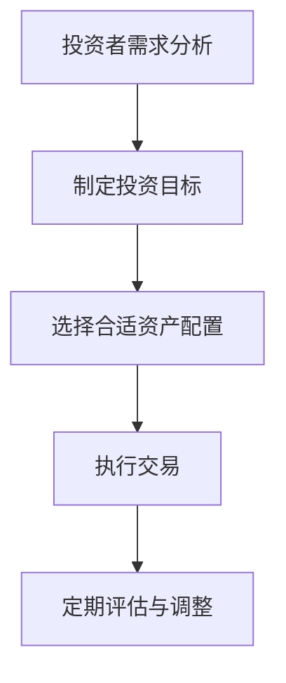
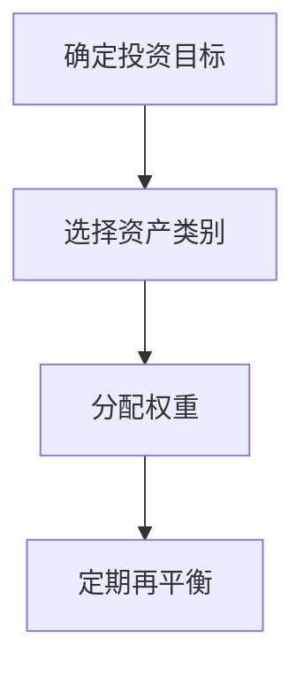
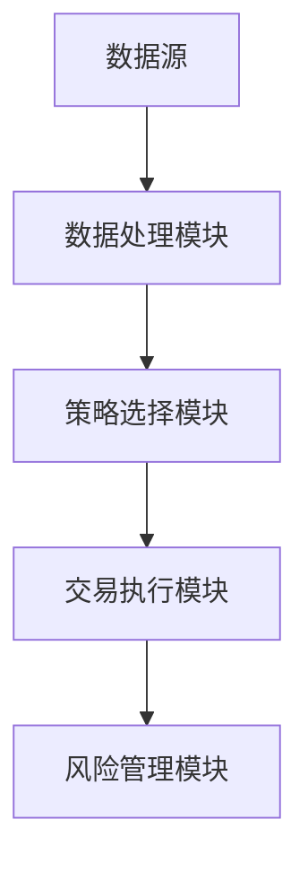
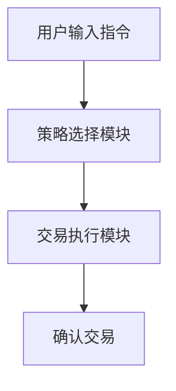

                 

<think>
嗯，我现在要写一篇关于《个性化投资策略》的技术博客文章，根据用户提供的目录大纲来组织内容。首先，我需要理解每章的核心内容和要求，然后逐步填充每个部分的具体内容。

首先，用户要求文章的结构包括标题、关键词、摘要，然后是七章内容，每章有详细的子章节。我需要确保每部分都涵盖背景介绍、核心概念、算法原理、系统架构、项目实战以及最佳实践等内容。

第一章是个性化投资策略的概述，我需要从基本概念开始，然后介绍其重要性、适用场景和未来趋势。这可能涉及到定义什么是个性化投资，与传统投资的区别，以及为什么它变得越来越重要。我还需要使用一些图表来辅助说明，比如系统架构图。

接下来的第二章是资产配置与风险偏好。这里需要详细讲解资产配置的原理，包括均值-方差优化模型和有效前沿的概念。我需要用数学公式和图表来解释这些概念，比如用LaTeX公式表示优化模型，并用mermaid图展示有效前沿。

第三章是投资组合的量化分析，这部分需要涉及数据处理、量化模型的构建与优化。我需要解释如何从数据中提取特征，构建多因子模型，并使用Python代码实现这些过程。同时，我还需要讨论模型的回测和评估方法。

第四章是风险管理与对冲策略，这里需要讨论如何管理投资组合中的风险，包括风险分散化、对冲机制以及VaR和CVaR等风险指标。可能需要使用数学公式来描述这些指标，并用代码实现风险评估。

第五章是机器学习在个性化投资中的应用，这里需要介绍如何利用机器学习算法，如回归和分类，来预测股票价格和识别投资机会。我需要解释机器学习的基本原理，并展示如何使用Python代码进行实际应用。

第六章是系统架构与自动化交易，这部分需要设计一个自动化交易系统的架构，包括数据获取、策略执行和风险管理模块。我需要用mermaid图展示系统架构，并解释各个模块的功能。

最后一章是项目实战与最佳实践，这里需要提供一个完整的项目案例，展示如何从数据获取到策略实现再到风险控制的全过程。同时，我需要给出一些最佳实践的建议，如数据清洗的重要性、模型评估的准确性等。

在整个写作过程中，我需要确保每一部分都使用清晰的技术语言，逻辑连贯，并且包含足够的细节和例子。例如，在量化分析部分，我会用具体的Python代码来展示如何处理数据和构建模型。同时，我会用图表来辅助说明复杂的概念，如系统架构图和流程图。

另外，用户提到要使用mermaid图表和LaTeX公式，我需要确保这些内容正确嵌入到文章中。例如，在讲解均值-方差优化模型时，我会使用LaTeX公式来展示数学模型，并用mermaid图展示有效前沿。

最后，我需要在文章末尾加上作者信息，确保文章的完整性和专业性。

总的来说，我需要按照用户提供的目录大纲，逐步填充每个章节的内容，确保每部分都符合技术博客的要求，内容详实，结构清晰，语言专业，同时包含必要的图表和代码示例。
</think>

# 个性化投资策略

> 关键词：个性化投资，资产配置，风险管理，量化分析，机器学习，系统架构，自动化交易

> 摘要：个性化投资策略是根据投资者的特定需求和市场环境，量身定制的投资方案。本文从基础概念到高级算法，系统地介绍了个性化投资策略的核心理论、构建方法、系统架构和实战案例，深入分析了风险管理与对冲策略，探讨了机器学习在投资中的应用，并总结了最佳实践和未来趋势。

---

# 第一章: 个性化投资策略概述

## 1.1 个性化投资的基本概念

### 1.1.1 投资的定义与分类
投资是指将资金投入到金融资产或实体项目中，以期望在未来获得收益或资本增值。根据投资对象的不同，可以将投资分为股票、债券、基金、房地产等多种类型。

### 1.1.2 个性化投资的核心概念
个性化投资强调根据投资者的财务状况、风险偏好、投资目标等因素，量身定制投资策略。与传统投资相比，个性化投资更注重灵活性和针对性。

### 1.1.3 个性化投资与传统投资的区别
| 方面 | 个性化投资 | 传统投资 |
|------|------------|----------|
| 投资者需求 | 高度定制 | 标准化产品 |
| 风险偏好 | 精准匹配 | 一刀切 |
| 投资目标 | 针对性更强 | 更通用 |

### 1.1.4 个性化投资的流程



## 1.2 个性化投资的重要性

### 1.2.1 投资者需求的多样性
不同投资者有不同的风险承受能力和收益目标，例如，年轻投资者可能更愿意承担高风险以追求高回报，而保守投资者则倾向于低风险投资。

### 1.2.2 个性化投资的优势
- 提高投资效率
- 降低风险
- 优化投资回报

### 1.2.3 个性化投资的挑战
- 数据获取难度
- 模型复杂性
- 市场波动性

## 1.3 个性化投资的适用场景

### 1.3.1 不同类型投资者的需求
- 高净值客户
- 机构投资者
- 个人投资者

### 1.3.2 不同投资目标的匹配
- 短期收益
- 长期增值
- 资产保值

### 1.3.3 不同市场环境下的策略调整
- 牛市
- 熊市
- 通货膨胀

## 1.4 个性化投资的未来趋势

### 1.4.1 数字化与智能化投资的发展
技术的进步使得个性化投资更加精确和高效，例如利用大数据和人工智能优化投资组合。

### 1.4.2 个性化投资在金融创新中的作用
推动金融产品和服务的创新，满足多样化的投资需求。

### 1.4.3 个性化投资的可持续性与风险控制
通过科学的风险管理，确保个性化投资的长期稳健。

## 1.5 本章小结
个性化投资是一种基于投资者特定需求的投资策略，通过精准匹配资产配置和风险偏好，优化投资回报。然而，其实施面临复杂性和挑战，需要结合技术手段进行创新。

---

# 第二章: 资产配置与风险偏好

## 2.1 资产配置的基本原理

### 2.1.1 资产配置的定义与分类
资产配置是指将资金分配到不同资产类别以实现投资目标。常见的资产类别包括股票、债券、现金等。

### 2.1.2 资产配置的优化方法
- 均值-方差优化
- 风险平价
- 基于因子模型的优化

### 2.1.3 资产配置与投资绩效的关系
资产配置决定了投资组合的风险和收益，是实现投资目标的核心。

### 2.1.4 资产配置的数学模型
$$
\text{目标函数：} \min \sigma^2 \\
\text{约束条件：} \sum w_i = 1, \sum w_i r_i = R
$$

### 2.1.5 资产配置的流程



## 2.2 风险偏好与收益目标

### 2.2.1 风险偏好的分类
- 保守型
- 平衡型
- 进取型
- �激进型

### 2.2.2 收益目标的设定
根据风险偏好和投资期限，设定合理的收益目标。

### 2.2.3 风险偏好与资产配置的匹配
| 风险偏好 | 资产配置 |
|----------|----------|
| 保守型   | 高比例债券 |
| 平衡型   | 中比例股票和债券 |
| 进取型   | 高比例股票 |
| 红进型   | 极高比例高风险资产 |

## 2.3 资产配置的数学模型

### 2.3.1 均值-方差优化模型
$$
\text{目标函数：} \min \sigma^2 \\
\text{约束条件：} \sum w_i = 1, \sum w_i r_i = R
$$

### 2.3.2 Markowitz有效前沿的解释
Markowitz有效前沿展示了在给定风险下，收益最高的投资组合，或在给定收益下，风险最低的投资组合。

### 2.3.3 线性规划与非线性优化的对比
- 线性规划：简单、快速，适用于线性关系。
- 非线性优化：更复杂，但能处理更多实际问题。

## 2.4 风险管理的核心策略

### 2.4.1 风险分散化原理
通过投资不同资产类别来降低非系统性风险。

### 2.4.2 风险对冲机制
利用衍生品对冲市场风险。

### 2.4.3 风险预算的制定与调整
根据市场变化和投资者需求，动态调整风险预算。

## 2.5 本章小结
资产配置是个性化投资的核心，通过优化资产配置和风险管理，可以实现投资目标与风险偏好的最佳匹配。

---

# 第三章: 投资组合的量化分析

## 3.1 数据收集与处理

### 3.1.1 市场数据的获取与清洗
从数据源获取历史价格、收益等数据，并进行清洗和预处理。

### 3.1.2 数据特征的提取与分析
计算均值、方差、相关系数等统计指标。

### 3.1.3 数据可视化与趋势预测
使用图表展示数据趋势，并进行预测。

## 3.2 投资组合的量化模型

### 3.2.1 简单平均模型
$$
w_i = \frac{1}{n}
$$

### 3.2.2 加权平均模型
$$
w_i = \frac{r_i}{\sum r_j}
$$

### 3.2.3 多因子模型的构建与应用
$$
R_i = \alpha + \beta_1 F_1 + \beta_2 F_2 + \cdots + \beta_k F_k + \epsilon
$$

## 3.3 量化模型的优化与验证

### 3.3.1 模型的回测与评估
通过历史数据验证模型的收益和风险表现。

### 3.3.2 模型的参数优化
使用网格搜索等方法优化模型参数。

### 3.3.3 模型的鲁棒性测试
测试模型在不同市场条件下的表现。

## 3.4 量化投资的注意事项

### 3.4.1 数据偏差的风险
确保数据的准确性和代表性。

### 3.4.2 模型过拟合的问题
避免过度拟合训练数据。

### 3.4.3 市场变化的影响
定期评估和调整模型。

## 3.5 本章小结
量化分析为个性化投资提供了科学的方法，通过数据驱动的投资决策，提高了投资的准确性和效率。

---

# 第四章: 风险管理与对冲策略

## 4.1 风险管理的核心目标

### 4.1.1 风险管理的定义与作用
风险管理是指识别、评估和控制投资中的各种风险，以确保投资目标的实现。

### 4.1.2 风险管理的目标
- 降低投资组合的波动性
- 减少潜在损失
- 提高投资的稳定性

## 4.2 风险管理的策略

### 4.2.1 风险分散化
通过投资不同资产类别来降低风险。

### 4.2.2 风险对冲
使用衍生品对冲市场风险。

### 4.2.3 风险控制
设定止损点，限制潜在损失。

## 4.3 风险对冲的实现

### 4.3.1 期权对冲
利用期权对冲价格波动风险。

### 4.3.2 期货对冲
使用期货对冲利率或汇率风险。

### 4.3.3 组合对冲
通过多空组合对冲市场风险。

## 4.4 风险管理的数学模型

### 4.4.1 VaR模型
$$
\text{VaR} = \text{损失在一定置信水平下的最大值}
$$

### 4.4.2 CVaR模型
$$
\text{CVaR} = \text{VaR的平均损失}
$$

## 4.5 本章小结
有效的风险管理是个性化投资成功的关键，通过多种策略和模型，可以显著降低投资风险。

---

# 第五章: 机器学习在个性化投资中的应用

## 5.1 机器学习的基本原理

### 5.1.1 机器学习的定义与分类
机器学习是通过数据训练模型，使其能够自动学习和改进的技术。主要分为监督学习、无监督学习和强化学习。

### 5.1.2 机器学习在投资中的应用
- 股票价格预测
- 投资机会识别
- 风险评估

## 5.2 机器学习算法的选择

### 5.2.1 监督学习算法
- 线性回归
- 支持向量机
- 随机森林

### 5.2.2 无监督学习算法
- K-means聚类
- 主成分分析

### 5.2.3 强化学习算法
- Q-learning
- DQN

## 5.3 机器学习模型的实现

### 5.3.1 数据预处理
清洗数据，处理缺失值，归一化等。

### 5.3.2 模型训练
使用训练数据训练模型，并进行交叉验证。

### 5.3.3 模型评估
通过测试数据评估模型的准确性和稳定性。

## 5.4 机器学习在个性化投资中的案例

### 5.4.1 股票价格预测
使用LSTM模型预测股票价格。

### 5.4.2 投资组合优化
利用机器学习优化投资组合的收益与风险。

## 5.5 本章小结
机器学习为个性化投资提供了强大的工具，通过模型训练和预测，提高了投资决策的科学性和准确性。

---

# 第六章: 系统架构与自动化交易

## 6.1 自动化交易的定义与优势

### 6.1.1 自动化交易的定义
自动化交易是指通过计算机系统自动执行交易指令，无需人工干预。

### 6.1.2 自动化交易的优势
- 提高交易效率
- 减少人为错误
- 抓住短期交易机会

## 6.2 自动化交易系统的架构

### 6.2.1 系统组成
- 数据获取模块
- 策略执行模块
- 风险管理模块

### 6.2.2 系统架构设计



## 6.3 系统接口设计

### 6.3.1 数据接口
- 数据获取接口
- 数据存储接口

### 6.3.2 交易接口
- 交易下单接口
- 交易状态查询接口

## 6.4 系统交互流程

### 6.4.1 交易流程



## 6.5 本章小结
自动化交易系统通过高效的系统架构和接口设计，实现了快速、精准的交易执行，是个性化投资的重要工具。

---

# 第七章: 项目实战与最佳实践

## 7.1 项目背景与目标

### 7.1.1 项目背景
基于个性化投资策略，构建一个自动化交易系统。

### 7.1.2 项目目标
实现资产配置、风险管理和自动化交易功能。

## 7.2 系统核心实现

### 7.2.1 环境安装
安装Python、Pandas、NumPy等必要的库。

### 7.2.2 核心代码实现
```python
import pandas as pd
import numpy as np

# 数据处理
data = pd.read_csv('data.csv')
returns = data.pct_change().dropna()

# 资产配置
weights = np.array([0.6, 0.3, 0.1])
portfolio_value = np.dot(returns, weights)

# 风险管理
VaR = np.percentile(portfolio_value, 5)
```

### 7.2.3 代码应用解读
- 数据处理：计算收益率
- 资产配置：分配权重
- 风险管理：计算VaR值

## 7.3 实际案例分析

### 7.3.1 数据来源与处理
使用历史股票数据进行回测。

### 7.3.2 模型评估与优化
通过回测结果优化投资组合。

## 7.4 项目小结

### 7.4.1 项目总结
通过项目实战，验证了个性化投资策略的有效性和可行性。

### 7.4.2 最佳实践
- 数据清洗的重要性
- 模型评估的准确性
- 系统架构的合理性

## 7.5 本章小结
项目实战展示了个性化投资策略的实际应用，强调了数据处理、模型优化和系统架构的重要性。

---

# 第八章: 最佳实践与未来展望

## 8.1 最佳实践

### 8.1.1 数据处理
确保数据的准确性和完整性。

### 8.1.2 模型选择
根据实际情况选择合适的模型。

### 8.1.3 系统设计
注重系统的可扩展性和可维护性。

## 8.2 未来展望

### 8.2.1 人工智能的深入应用
AI技术将推动投资决策的智能化。

### 8.2.2 区块链技术的应用
区块链将改变金融资产的交易和管理方式。

### 8.2.3 可持续投资的发展
绿色金融和ESG投资将越来越重要。

## 8.3 本章小结
个性化投资策略的发展需要结合新技术和新理念，不断优化和创新。

---

# 结语

个性化投资策略是投资领域的重要发展趋势，通过科学的资产配置、风险管理和技术驱动，可以为投资者创造更大的价值。未来，随着技术的进步和市场的变化，个性化投资策略将更加智能化和个性化。

---

# 作者：AI天才研究院/AI Genius Institute & 禅与计算机程序设计艺术 /Zen And The Art of Computer Programming

