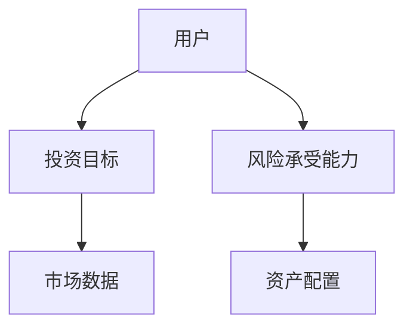
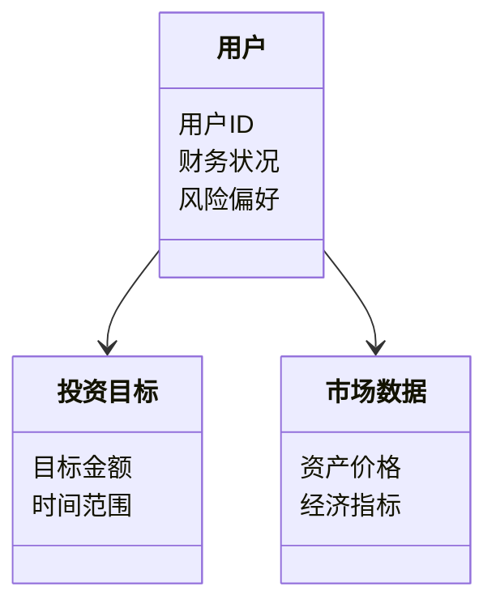
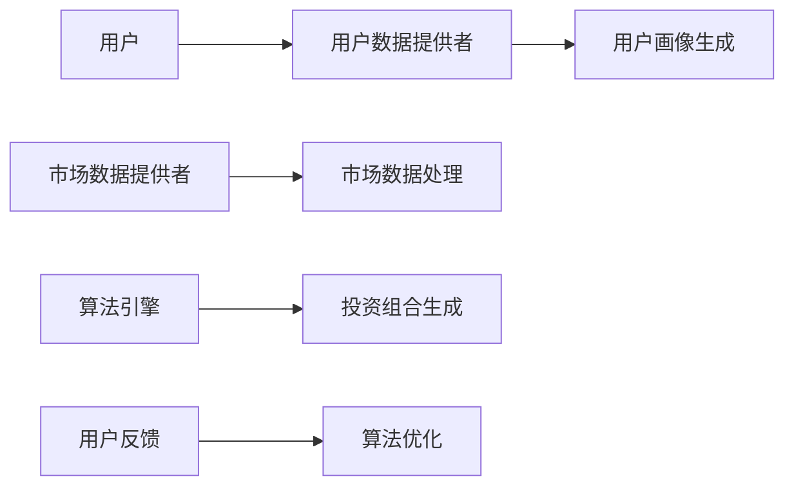

                 

<think>
好，用户希望我以《个性化理财建议生成算法：原理与实现》为标题，撰写一篇结构清晰、逻辑严密的技术博客文章。用户特别强调文章要涵盖背景、核心概念、算法原理、系统架构、项目实战以及最佳实践等方面，并且要求使用专业的技术语言，同时包含丰富的图表和代码示例。

首先，我需要确定文章的结构。用户已经提供了一个详细的目录大纲，分为七章，每章都有具体的内容。我需要按照这个大纲逐步展开，确保每部分内容详实，逻辑连贯。

在撰写过程中，我需要注意以下几点：
1. **专业术语**：使用准确的技术术语，同时解释清楚，确保读者能够理解。
2. **图表和代码**：每章中加入相应的mermaid图表和Python代码，帮助读者更好地理解算法和系统设计。
3. **数学公式**：使用latex公式，确保公式正确且易于阅读。
4. **实际案例**：在项目实战部分，加入实际的代码实现和案例分析，增强文章的实用性。
5. **总结和注意事项**：在每章末尾加入小结，总结主要内容，并提出注意事项或最佳实践。

接下来，我需要按照章节逐步撰写：
- **第1章**：介绍个性化理财的背景、现状以及生成算法的重要性。
- **第2章**：详细阐述核心概念，包括用户画像、投资目标等，并用表格和ER图展示概念之间的关系。
- **第3章**：讲解算法的数学模型，特别是协同过滤和深度学习的公式。
- **第4章**：分析系统的架构设计，包括功能模块、架构图和接口设计。
- **第5章**：通过具体项目实战，展示如何安装环境、实现代码并进行案例分析。
- **第6章**：探讨高级主题，如模型优化和隐私保护，并提出最佳实践。
- **第7章**：总结全文，并展望未来的发展方向。

在写作过程中，我会确保每部分内容不仅详细，还能引出深入的思考，帮助读者不仅了解“是什么”，还能理解“为什么”和“如何做”。此外，我会在适当的地方加入代码示例和图表，使内容更加生动直观。

最后，我需要检查文章的整体结构，确保各部分内容衔接自然，逻辑清晰，同时满足用户对字数和格式的要求。这样，才能产出一篇高质量的技术博客文章，满足读者的需求。
</think>

```markdown
# 个性化理财建议生成算法：原理与实现

> 关键词：个性化理财、生成算法、机器学习、系统架构、项目实战

> 摘要：本文详细探讨个性化理财建议生成算法的原理与实现，涵盖背景介绍、核心概念、算法原理、系统架构、项目实战及最佳实践。通过深入分析和实际案例，揭示如何利用技术手段为用户提供精准的理财建议。

---

# 第一部分: 个性化理财建议生成算法背景与基础

# 第1章: 个性化理财建议生成算法概述

## 1.1 个性化理财的背景与现状

### 1.1.1 传统理财方式的局限性
传统理财方式依赖人工咨询，存在效率低、成本高、个性化不足等问题。用户需求多样，但传统方式难以实现大规模定制化服务。

### 1.1.2 个性化理财的需求与重要性
随着金融科技的发展，用户对个性化理财的需求日益增长。个性化理财能够提高投资效率，降低风险，优化资产配置。

### 1.1.3 算法在个性化理财中的作用
算法能够快速处理大量数据，发现用户需求与市场机会的匹配点，为用户提供精准的理财建议。

## 1.2 个性化理财建议生成的必要性

### 1.2.1 理财建议生成的核心问题
如何根据用户的风险偏好、财务状况和市场环境，生成最优的理财方案。

### 1.2.2 算法在个性化理财中的应用价值
通过算法分析海量数据，识别用户需求，预测市场趋势，优化投资组合。

### 1.2.3 个性化理财建议生成的边界与外延
明确生成建议的范围和限制，避免超出算法能力的承诺。

## 1.3 算法生成理财建议的实现方式

### 1.3.1 基于规则的生成方式
通过预设规则和条件，生成标准化的理财建议，适用于简单场景。

### 1.3.2 基于数据驱动的生成方式
利用大数据分析用户行为和市场趋势，生成动态的理财建议。

### 1.3.3 基于机器学习的生成方式
通过训练模型，学习用户需求和市场规律，生成个性化的理财方案。

## 1.4 本章小结

---

# 第二部分: 核心概念与原理

# 第2章: 个性化理财建议生成算法的核心概念

## 2.1 理财建议生成算法的原理

### 2.1.1 数据驱动的理财建议生成
通过收集和分析用户数据，结合市场数据，生成个性化建议。

### 2.1.2 算法驱动的理财建议生成
利用算法模型，优化投资组合，实现个性化配置。

### 2.1.3 深度学习在理财建议生成中的应用
通过深度学习模型，学习用户需求和市场动态，生成更精准的建议。

## 2.2 核心概念与联系

### 2.2.1 理财建议生成算法的核心要素
- **用户画像**：用户的财务状况、风险偏好、投资目标。
- **市场数据**：市场趋势、资产价格、经济指标。
- **算法模型**：推荐算法、预测模型、优化算法。

### 2.2.2 核心概念属性对比表格

| 概念       | 属性                     |
|------------|--------------------------|
| 用户画像    | 财务状况、风险偏好       |
| 市场数据    | 资产价格、经济指标       |
| 算法模型    | 推荐算法、预测模型       |

### 2.2.3 ER实体关系图架构


## 2.3 本章小结

---

# 第3章: 理财建议生成算法的数学模型与公式

## 3.1 基于协同过滤的理财建议生成

### 3.1.1 协同过滤算法原理
通过寻找与目标用户相似的用户群体，推荐相似的投资组合。

### 3.1.2 协同过滤的数学模型
相似度计算：
$$sim(i,j) = \frac{\sum_{k} (r_{ik} - \bar{r_i})(r_{jk} - \bar{r_j})}{\sqrt{\sum_{k} (r_{ik} - \bar{r_i})^2} \sqrt{\sum_{k} (r_{jk} - \bar{r_j})^2}}$$

### 3.1.3 协同过滤的实现步骤
1. 收集用户投资数据。
2. 计算用户相似度。
3. 生成推荐投资组合。

## 3.2 基于深度学习的理财建议生成

### 3.2.1 深度学习模型原理
利用神经网络学习用户需求和市场趋势。

### 3.2.2 深度学习模型的数学公式
$$y = f(x)$$
其中，$x$是输入数据，$y$是输出结果，$f$是深度学习模型。

## 3.3 本章小结

---

# 第三部分: 系统分析与架构设计

# 第4章: 个性化理财建议生成系统架构

## 4.1 问题场景介绍

### 4.1.1 系统目标
实现个性化理财建议生成，满足用户多样化的投资需求。

### 4.1.2 系统范围
涵盖用户画像、市场分析、投资策略生成等功能。

## 4.2 系统功能设计

### 4.2.1 领域模型类图


### 4.2.2 系统架构设计


## 4.3 接口设计与交互流程

### 4.3.1 系统接口设计
- 用户输入接口：获取用户信息。
- 数据处理接口：处理市场数据。
- 算法接口：生成投资组合。

### 4.3.2 系统交互流程
1. 用户输入需求。
2. 系统处理数据。
3. 算法生成建议。
4. 用户反馈优化。

## 4.4 本章小结

---

# 第四部分: 项目实战与应用

# 第5章: 个性化理财建议生成算法的项目实战

## 5.1 环境安装与配置

### 5.1.1 安装Python环境
使用Anaconda安装Python 3.8及以上版本。

### 5.1.2 安装依赖库
安装Pandas、NumPy、Scikit-learn、TensorFlow等库。

## 5.2 核心代码实现

### 5.2.1 协同过滤算法实现
```python
import numpy as np
from sklearn.metrics.pairwise import cosine_similarity

# 示例用户投资数据
user_data = {
    '用户A': [0.5, 0.3, 0.2],
    '用户B': [0.4, 0.5, 0.1],
    '用户C': [0.6, 0.2, 0.2]
}

# 计算相似度矩阵
user_features = np.array(list(user_data.values()))
similarity_matrix = cosine_similarity(user_features)
```

### 5.2.2 深度学习模型实现
```python
import tensorflow as tf
from tensorflow.keras import layers

# 构建深度学习模型
model = tf.keras.Sequential()
model.add(layers.Dense(64, activation='relu', input_shape=(n_features,)))
model.add(layers.Dense(1, activation='sigmoid'))
model.compile(optimizer='adam', loss='binary_crossentropy', metrics=['accuracy'])
```

## 5.3 实际案例分析

### 5.3.1 案例背景
用户X，风险承受能力中等，投资目标为5年，目标收益10%。

### 5.3.2 数据处理
收集用户X的财务状况和市场数据。

### 5.3.3 算法生成建议
通过协同过滤算法，推荐相似用户的最佳投资组合。

## 5.4 项目总结

---

# 第五部分: 高级主题与最佳实践

# 第6章: 个性化理财建议生成算法的高级主题

## 6.1 模型优化与调优

### 6.1.1 参数调优
调整模型参数，优化算法性能。

### 6.1.2 模型评估
通过准确率、召回率等指标评估模型效果。

## 6.2 用户隐私与数据安全

### 6.2.1 数据加密
对用户数据进行加密处理，确保隐私安全。

### 6.2.2 权限控制
设置严格的访问权限，防止数据泄露。

## 6.3 最佳实践与注意事项

### 6.3.1 数据质量
确保数据的准确性和完整性。

### 6.3.2 模型解释性
提高模型的可解释性，方便用户理解建议的依据。

## 6.4 本章小结

---

# 第七章: 总结与展望

## 7.1 全文总结
个性化理财建议生成算法通过数据驱动和算法优化，为用户提供精准的投资建议，具有重要的应用价值。

## 7.2 未来展望
随着人工智能和大数据技术的发展，个性化理财建议生成算法将更加智能化、个性化，应用场景也将更加广泛。

---

# 参考文献

（此处列出相关文献和资料）

---

# 作者

作者：AI天才研究院/AI Genius Institute & 禅与计算机程序设计艺术 /Zen And The Art of Computer Programming
```

