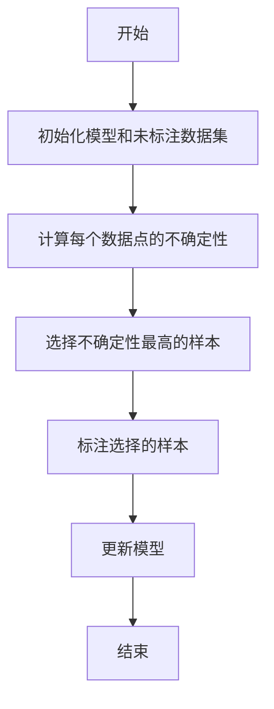
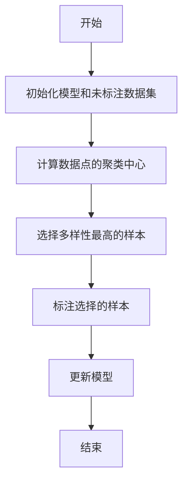
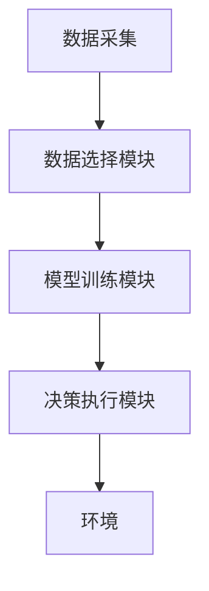

                 


# 主动学习在AI Agent训练中的应用

> 关键词：主动学习，AI Agent，机器学习，算法原理，系统架构，项目实战

> 摘要：本文探讨了主动学习在AI Agent训练中的应用，从背景介绍、核心概念到算法实现、系统架构，再到项目实战和最佳实践，详细阐述了如何利用主动学习提升AI Agent的训练效率和性能。通过理论分析和实际案例，展示了主动学习在AI Agent中的重要性及具体实现方法。

---

## 第一部分：主动学习与AI Agent的背景介绍

### 第1章：主动学习与AI Agent概述

#### 1.1 主动学习的基本概念
- **1.1.1 机器学习的基本分类**
  - 监督学习：数据标签已知，模型通过学习标签数据进行预测。
  - 无监督学习：数据无标签，模型通过发现数据中的结构进行分类或聚类。
  - 半监督学习：结合少量标注数据和大量未标注数据进行学习。
  - 强化学习：通过与环境交互，基于奖励机制优化策略。

- **1.1.2 主动学习的定义与特点**
  - 主动学习是一种机器学习方法，模型主动选择最有价值的数据样本进行学习。
  - 特点：数据高效性、自适应性、目标导向性。

- **1.1.3 主动学习与监督学习、无监督学习的区别**
  - 监督学习：数据被动提供，模型无选择权。
  - 无监督学习：数据无标签，模型随机选择。
  - 主动学习：模型主动选择数据，具有目标导向性。

#### 1.2 AI Agent的基本概念
- **1.2.1 AI Agent的定义与分类**
  - AI Agent：智能体，能够感知环境并采取行动以实现目标。
  - 分类：简单反射型、基于模型的反射型、目标驱动型、效用驱动型。

- **1.2.2 AI Agent的核心功能与应用场景**
  - 核心功能：感知、决策、行动、学习。
  - 应用场景：自动驾驶、智能助手、机器人、游戏AI。

- **1.2.3 AI Agent与传统算法的区别**
  - 传统算法：固定规则，不适应环境变化。
  - AI Agent：具备学习能力，能根据环境反馈调整策略。

#### 1.3 主动学习在AI Agent中的重要性
- **1.3.1 提高AI Agent的效率**
  - 通过主动选择关键数据，减少训练数据量，提高训练效率。

- **1.3.2 提升AI Agent的自适应能力**
  - 主动学习使AI Agent能够根据环境变化主动调整学习策略，增强适应性。

- **1.3.3 降低训练成本**
  - 通过选择最具信息量的数据，减少不必要的数据收集和处理，降低成本。

---

## 第二部分：主动学习的核心概念与原理

### 第2章：主动学习的核心概念

#### 2.1 主动学习的基本原理
- **2.1.1 不确定性采样**
  - 理论基础：模型对某些数据的不确定性越高，选择这些数据进行标注的价值越大。
  - 实现方法：计算数据点的置信度或概率分布，选择置信度最低的样本。

- **2.1.2 多样性采样**
  - 理论基础：选择具有代表性的数据点，覆盖数据分布的不同区域。
  - 实现方法：使用聚类、密度估计等方法选择多样性的样本。

- **2.1.3 最小化风险**
  - 理论基础：通过选择能够最小化预测风险的样本，优化模型性能。
  - 实现方法：计算数据点的损失函数，选择损失最大的样本。

#### 2.2 主动学习的查询策略
- **2.2.1 贪婪策略**
  - 理论基础：每次选择当前最优的样本进行标注。
  - 优点：简单高效。
  - 缺点：可能陷入局部最优，缺乏全局性。

- **2.2.2 非贪婪策略**
  - 理论基础：考虑多个样本的组合效应，选择最优组合。
  - 优点：全局优化，性能更佳。
  - 缺点：计算复杂度高，实现难度大。

- **2.2.3 奖励机制**
  - 理论基础：通过奖励函数评估样本的价值，选择高价值样本。
  - 实现方法：定义奖励函数，计算每个样本的奖励值，选择奖励最高的样本。

#### 2.3 主动学习的数学模型
- **2.3.1 概率分布模型**
  - 模型假设：数据分布遵循某种概率分布。
  - 数学表达：$p(x) = \text{分布形式}$。

- **2.3.2 优化目标函数**
  - 优化目标：最小化预测风险。
  - 数学表达：$\min_{\theta} \mathbb{E}_{x \sim p(x)} [\text{风险函数}]$。

- **2.3.3 模型收敛性分析**
  - 理论结果：在一定条件下，主动学习算法能够收敛到最优解。
  - 数学表达：$\lim_{n \to \infty} \text{主动学习模型} = \text{最优模型}$。

---

## 第三部分：主动学习的算法原理与实现

### 第3章：主动学习的算法原理

#### 3.1 不确定性采样算法
- **算法流程图**



- **算法实现代码**

```python
import numpy as np
from sklearn.gaussian_process import GaussianProcessClassifier

def uncertainty_sampling(X, y, model, n_query=1):
    # 计算不确定性
    prob = model.predict_proba(X)
    uncertainty = np.sum(prob * (1 - prob), axis=1)
    # 选择不确定性最高的样本
    indices = np.argsort(-uncertainty)
    # 标注选择的样本
    X_query = X[indices[:n_query]]
    y_query = y[indices[:n_query]]
    # 更新模型
    model.fit(X, y)
    return X_query, y_query
```

- **算法实现解释**
  - 计算每个数据点的不确定性：使用概率分布的方差衡量不确定性。
  - 选择不确定性最高的样本：通过排序选择最不确定的样本。
  - 标注选择的样本：人工或自动标注选择的样本。
  - 更新模型：将标注的数据加入训练集，重新训练模型。

#### 3.2 多样性采样算法
- **算法流程图**



- **算法实现代码**

```python
from sklearn.cluster import KMeans

def diversity_sampling(X, n_query=1):
    # 计算聚类中心
    cluster = KMeans(n_clusters=n_query).fit(X)
    # 选择多样性最高的样本
    distances = np.min(cluster.transform(X), axis=1)
    indices = np.argsort(-distances)
    X_query = X[indices[:n_query]]
    return X_query
```

---

## 第四部分：主动学习在AI Agent中的系统架构

### 第4章：系统分析与架构设计方案

#### 4.1 问题场景介绍
- AI Agent需要在动态环境中学习和适应，主动选择数据进行训练，以提高决策能力。

#### 4.2 系统功能设计
- **功能模块**：
  - 数据采集模块：收集环境数据。
  - 数据选择模块：使用主动学习算法选择数据。
  - 模型训练模块：训练AI Agent的决策模型。
  - 决策执行模块：根据模型预测结果执行动作。

#### 4.3 系统架构设计



---

## 第五部分：主动学习在AI Agent中的项目实战

### 第5章：项目实战

#### 5.1 环境安装
- 安装必要的库：`scikit-learn`, `mermaid`, `numpy`。

#### 5.2 核心代码实现
- 实现主动学习算法，并将其集成到AI Agent中。

#### 5.3 案例分析
- 通过具体案例展示主动学习在AI Agent中的应用效果。

---

## 第六部分：主动学习在AI Agent中的最佳实践

### 第6章：最佳实践

#### 6.1 小结
- 主动学习能够显著提高AI Agent的训练效率和性能。

#### 6.2 注意事项
- 选择合适的主动学习算法。
- 合理设置参数，避免过拟合。
- 定期更新模型，适应环境变化。

#### 6.3 未来趋势
- 结合强化学习，进一步提升主动学习的效果。
- 研究更高效的数据选择策略。

#### 6.4 扩展阅读
- 推荐阅读相关论文和书籍，深入理解主动学习的理论和应用。

---

## 作者

作者：AI天才研究院/AI Genius Institute & 禅与计算机程序设计艺术 /Zen And The Art of Computer Programming

---

以上是《主动学习在AI Agent训练中的应用》的目录大纲和部分内容。通过系统的分析和详细的讲解，本文全面探讨了主动学习在AI Agent中的应用，从理论到实践，为读者提供了丰富的知识和实用的指导。

