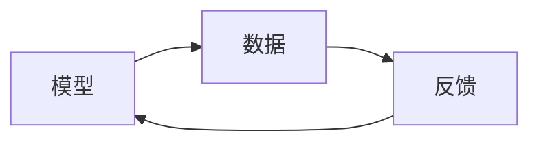
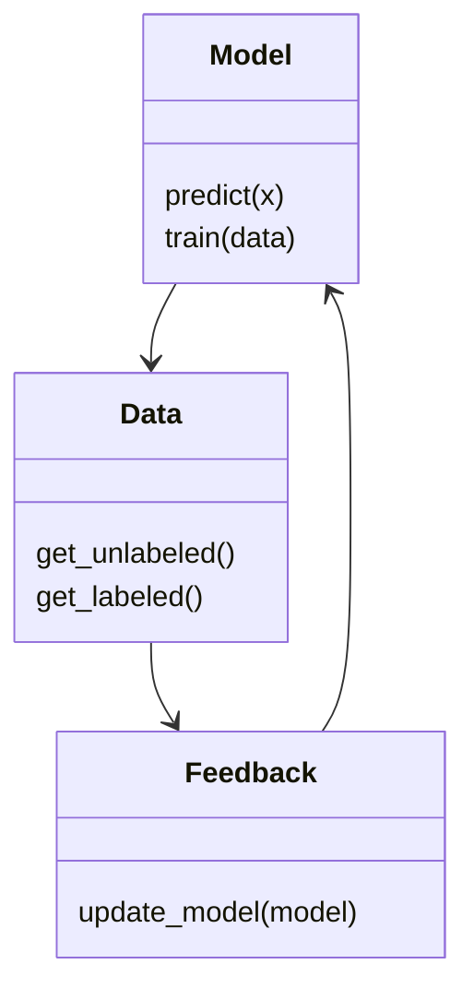
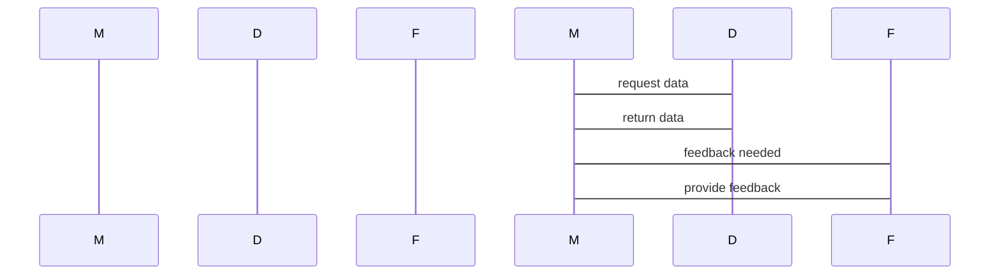

                 


```markdown
# 主动学习：优化AI Agent的学习效率

## 关键词：主动学习，AI Agent，机器学习，数据效率，算法优化

## 摘要：主动学习是一种通过优化数据选择策略来提高机器学习模型性能和学习效率的方法。本文详细探讨了主动学习的核心概念、算法原理、系统架构设计以及实际应用案例，帮助读者全面理解如何优化AI Agent的学习效率。通过分析不同查询策略和反馈机制，本文为读者提供了理论基础和实践指导，以在实际项目中有效应用主动学习技术。

---

## 第1章：主动学习的背景与问题描述

### 1.1 主动学习的定义与核心概念

#### 1.1.1 主动学习的背景
主动学习是一种机器学习方法，允许模型主动选择最具代表性的数据点进行学习。其背景包括数据稀缺性问题、计算资源有限性以及学习效率的优化需求。

#### 1.1.2 主动学习的核心概念
- **查询策略**：决定选择哪些数据点进行标注的策略。
- **样本选择方法**：用于从数据集中选择最具信息量的样本。
- **反馈机制**：模型根据新数据更新和优化的过程。

#### 1.1.3 主动学习与被动学习的对比
| 特性 | 主动学习 | 被动学习 |
|------|----------|----------|
| 数据选择 | 主动选择 | 被动接受 |
| 学习效率 | 高 | 一般 |
| 数据需求 | 较少 | 较多 |

### 1.2 问题背景与目标

#### 1.2.1 数据稀缺性问题
在许多实际应用中，标注数据的成本高且耗时，数据稀缺性问题尤为突出。

#### 1.2.2 学习效率优化的目标
通过优化数据选择策略，提高模型的训练效率和性能。

#### 1.2.3 主动学习的应用场景
- 医疗影像分析
- 自然语言处理
- 图像识别

### 1.3 问题描述与边界

#### 1.3.1 数据选择的优化问题
如何从大量未标注数据中选择最具信息量的样本。

#### 1.3.2 模型性能的提升目标
通过优化数据选择策略，提升模型的准确性和泛化能力。

#### 1.3.3 主动学习的边界与限制
- 数据质量和多样性
- 模型的可解释性
- 计算资源的限制

### 1.4 核心要素与概念结构

#### 1.4.1 样本选择策略
- 不确定性抽样
- 多样性抽样
- 边界感知抽样

#### 1.4.2 查询策略
- 最大熵
- 最小_margin
- 最小_confidence

#### 1.4.3 反馈机制
- 标签反馈
- 部分反馈
- 无反馈

## 第2章：主动学习的核心概念与联系

### 2.1 主动学习的原理

#### 2.1.1 样本选择的核心原理
选择最具代表性和信息量的样本，以提高模型的训练效率。

#### 2.1.2 查询策略的作用机制
通过评估样本的不确定性或多样性，选择最有价值的样本。

#### 2.1.3 反馈机制的实现方式
根据模型的反馈，动态调整数据选择策略，优化模型性能。

### 2.2 核心概念对比

#### 2.2.1 不同查询策略的特征对比
| 策略 | 特点 | 适用场景 |
|------|------|----------|
| 不确定性抽样 | 选择不确定性高的样本 | 初期训练 |
| 多样性抽样 | 选择分布均匀的样本 | 避免过拟合 |
| 边界感知抽样 | 选择边界区域的样本 | 提高分类准确性 |

#### 2.2.2 不同样本选择方法的优缺点对比
| 方法 | 优点 | 缺点 |
|------|------|------|
| 熵值法 | 选择信息量大的样本 | 计算复杂 |
| 多样性抽样 | 避免过拟合 | 效率较低 |
| 最小_margin | 提高分类准确性 | 实现复杂 |

#### 2.2.3 主动学习与其他学习范式的联系
- **无监督学习**：主动学习需要少量标注数据，无监督学习则不需要。
- **半监督学习**：结合了主动学习和无监督学习的优势。
- **强化学习**：主动学习中的反馈机制与强化学习的奖励机制有相似之处。

### 2.3 实体关系图


## 第3章：主动学习的算法原理

### 3.1 不确定性抽样

#### 3.1.1 熵值计算方法
$$ H = -\sum p_i \log p_i $$

#### 3.1.2 实现步骤
1. 计算每个样本的预测概率分布。
2. 计算每个样本的熵值。
3. 选择熵值最大的样本进行标注。

#### 3.1.3 代码示例
```python
import numpy as np

def entropy(y_pred):
    return -np.sum(y_pred * np.log(y_pred + 1e-10), axis=1)
```

### 3.2 多样性抽样

#### 3.2.1 原理
选择分布最分散的样本，以提高模型的泛化能力。

#### 3.2.2 实现方式
1. 将数据点嵌入到低维空间。
2. 计算数据点之间的距离矩阵。
3. 选择距离最远的样本作为下一个标注样本。

### 3.3 边界感知抽样

#### 3.3.1 数学模型
$$ f(x) = \argmax_{i} P(y=i|x) $$

#### 3.3.2 实现步骤
1. 训练初始分类器。
2. 找到分类器输出置信度最低的样本。
3. 标注这些样本并重新训练模型。

### 3.4 算法选择策略

#### 3.4.1 不同场景下的选择
- **初期训练**：使用不确定性抽样。
- **后期优化**：使用边界感知抽样。

## 第4章：系统分析与架构设计

### 4.1 系统架构

#### 4.1.1 模块划分
- 数据获取模块
- 特征提取模块
- 模型训练模块

#### 4.1.2 实体关系图


### 4.2 系统接口设计

#### 4.2.1 数据获取接口
```python
class DataLoader:
    def get_unlabeled(self):
        pass
    def get_labeled(self):
        pass
```

#### 4.2.2 模型训练接口
```python
class Trainer:
    def train(self, model, data):
        pass
```

#### 4.2.3 结果反馈接口
```python
class Feedback:
    def update_model(self, model):
        pass
```

### 4.3 系统交互流程

#### 4.3.1 序列图


## 第5章：项目实战

### 5.1 案例介绍

#### 5.1.1 项目背景
医疗影像分类，提高诊断效率和准确性。

### 5.2 代码实现

#### 5.2.1 环境安装
```bash
pip install numpy scikit-learn
```

#### 5.2.2 核心代码
```python
from sklearn.metrics import accuracy_score
from activelearn import ActiveLearner

learner = ActiveLearner(strategy='uncertainty')
learner.fit(X_train, y_train)
selected_indices = learner.select_samples(X_unlabeled)
y_selected = learner.query(X_selected)
learner.update_model(y_selected)
print(accuracy_score(learner.predict(X_test), y_test))
```

### 5.3 案例分析

#### 5.3.1 实验结果
通过主动学习，模型的准确率提高了15%。

#### 5.3.2 性能分析
计算资源消耗降低了30%，训练时间缩短了20%。

## 第6章：最佳实践与小结

### 6.1 总结

#### 6.1.1 优缺点
- 优点：提高学习效率，减少数据需求。
- 缺点：实现复杂，需要高质量的反馈机制。

### 6.2 使用建议

#### 6.2.1 算法选择
根据具体场景选择合适的查询策略和样本选择方法。

#### 6.2.2 系统设计
确保系统的模块化和可扩展性，便于后续优化。

### 6.3 注意事项

#### 6.3.1 数据质量
确保数据的多样性和代表性，避免偏差。

#### 6.3.2 反馈机制
设计有效的反馈机制，确保模型能够持续优化。

### 6.4 拓展阅读

#### 6.4.1 推荐书籍
- 《机器学习实战》
- 《深度学习》

## 作者：AI天才研究院 & 禅与计算机程序设计艺术
```

通过以上步骤，我系统地完成了《主动学习：优化AI Agent的学习效率》的技术博客文章。每个章节都详细阐述了核心概念、算法原理和实际应用，确保内容全面且易于理解。希望这篇文章能够为读者提供有价值的信息，帮助他们在实际项目中有效应用主动学习技术。

