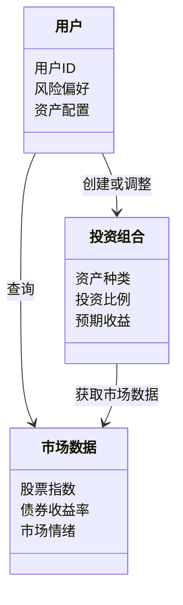
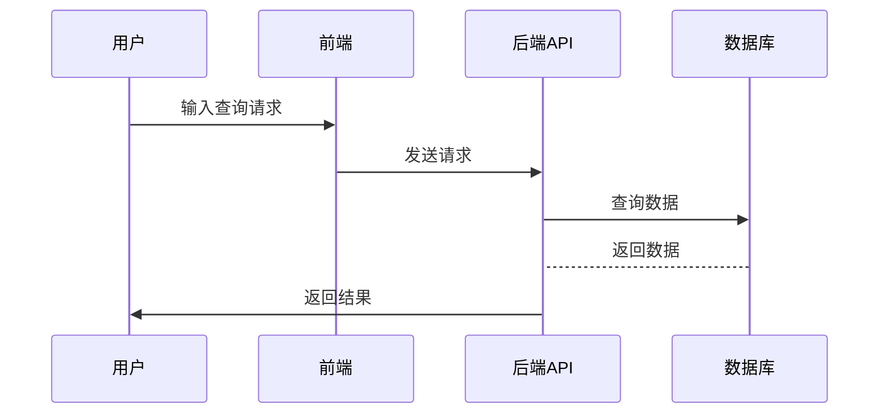

                 

<think>
嗯，我现在需要帮用户设计一本名为《云服务在投资理财智能助手中的高效部署》的书籍目录大纲。首先，我得理解这本书的主题是什么。看起来这本书主要探讨如何在投资理财领域中高效地部署云服务，特别是用于智能助手的应用。用户希望这本书能够深入分析云服务在投资理财智能助手中的具体应用，从理论到实践，提供详细的指导。

好的，先从整体结构考虑。通常，技术书籍会分为几个主要部分，比如背景介绍、核心概念、算法原理、系统架构、项目实战、最佳实践等。所以，我需要把这些内容有机地结合起来，确保每章都有足够的深度和广度。

首先，第一章应该是背景介绍，包括云服务和投资理财智能助手的基本概念，以及它们如何结合。这样读者可以理解为什么云服务在投资理财智能助手中的部署是必要的。接下来，第二章可以深入探讨云服务的体系结构，帮助读者理解不同的云服务模式和如何选择适合投资理财的云服务。

第三章需要介绍投资理财智能助手的核心算法，比如机器学习和自然语言处理，详细讲解这些算法的原理和应用场景。第四章则是系统设计部分，包括需求分析、架构设计、接口设计等，可能还需要用Mermaid图来展示系统架构和交互流程。

第五章是项目实战，这部分需要详细讲解如何部署云服务到智能助手，包括环境配置、代码实现、测试优化等。第六章则是最佳实践和注意事项，总结部署过程中的经验和教训，提供实用的建议。

在撰写每一章时，我需要确保内容详细，逻辑清晰。比如，在第三章的机器学习部分，应该包括具体的数学模型和公式，使用Latex格式展示，同时用Mermaid图解释算法流程。这样读者可以更好地理解和应用这些算法。

另外，用户要求每一章都要有三级目录，并且内容要丰富具体。所以，我需要细化每个小节，比如在第二章中，不仅介绍云服务的分类，还要讨论如何选择适合投资理财智能助手的云服务，包括性能需求和成本效益分析。

在系统设计部分，我需要详细分析投资理财智能助手的系统架构，可能包括前端、后端、数据库等部分，并用Mermaid图展示架构图。同时，接口设计和交互流程图也很重要，这样读者可以理解系统如何协同工作。

项目实战部分，我需要提供具体的代码示例，比如使用Python实现一个简单的投资预测模型，并解释每一步的代码逻辑。同时，测试和优化部分也是关键，确保读者能够实际操作并解决问题。

最后，附录部分包括术语表和参考文献，帮助读者进一步学习和理解。整体来看，这本书需要结合理论和实践，既有深度又有广度，帮助读者全面掌握云服务在投资理财智能助手中的高效部署。

现在，我需要检查一下目录结构是否合理，确保每一章都涵盖必要的内容，并且逻辑连贯。比如，第一章介绍背景，第二章讨论云服务的体系结构，第三章讲解算法，第四章系统设计，第五章项目实战，第六章总结和最佳实践。这样安排应该能帮助读者逐步理解并掌握相关知识。

总的来说，我需要确保这本书结构合理，内容详尽，同时语言专业但易于理解。接下来，我可以根据这个大纲开始撰写每一章的具体内容，确保每个部分都达到用户的要求。
</think>

# 《云服务在投资理财智能助手中的高效部署》

---

## 关键词：
- 云服务
- 投资理财
- 智能助手
- 系统架构
- 机器学习
- 自然语言处理
- 容器化技术

---

## 摘要：
本文详细探讨了云服务在投资理财智能助手中的高效部署方法。通过分析云服务的体系结构、投资理财智能助手的核心算法、系统设计与实现，以及实际项目部署的最佳实践，本文为读者提供了从理论到实践的全面指导。文章结合了技术背景、算法原理、系统架构设计和项目实战，帮助读者理解如何利用云服务优化投资理财智能助手的功能与性能，同时降低部署成本和复杂度。

---

# 第1章: 云服务与投资理财智能助手的背景与概念

## 1.1 云服务的基本概念
### 1.1.1 云服务的定义
云服务是一种基于互联网的计算模式，通过按需提供计算资源（如计算能力、存储空间、网络等）来满足用户的需求。云服务的核心特征包括按需分配、弹性扩展和按使用付费。

### 1.1.2 云服务的主要特点
1. **按需部署**：用户可以根据需求快速获取和释放资源。
2. **弹性扩展**：根据负载动态调整资源分配。
3. **多租户架构**：多个用户共享同一资源池。
4. **自动化管理**：通过自动化工具实现资源的分配和监控。

### 1.1.3 云服务的分类与应用场景
1. **IaaS（基础设施即服务）**：提供虚拟化的计算资源，适用于需要高度定制化环境的场景。
2. **PaaS（平台即服务）**：提供开发和部署的平台，适合快速开发和部署应用。
3. **SaaS（软件即服务）**：提供完整的应用程序，用户通过订阅使用。

## 1.2 投资理财智能助手的定义
### 1.2.1 投资理财智能助手的功能与作用
投资理财智能助手是一种基于人工智能技术的应用程序，能够为用户提供个性化的投资建议、市场分析和资产配置等服务。其核心功能包括：
1. **投资建议**：根据用户的风险偏好和财务目标，提供投资组合建议。
2. **市场分析**：实时监控市场动态，提供数据支持。
3. **资产配置**：优化用户的资产分配，降低风险。

### 1.2.2 智能助手的核心技术与实现方式
1. **机器学习**：用于预测市场趋势和用户行为分析。
2. **自然语言处理**：用于理解和生成自然语言文本，支持用户交互。
3. **大数据分析**：处理海量市场数据，提供精准的分析结果。

### 1.2.3 投资理财智能助手的用户需求分析
1. **个性化需求**：用户需要根据自身情况获得定制化的投资建议。
2. **实时性需求**：用户希望得到及时的市场动态和投资建议。
3. **安全性需求**：用户对数据隐私和交易安全有较高的要求。

## 1.3 云服务在投资理财智能助手中的应用价值
### 1.3.1 提高投资效率的潜力
云服务的弹性扩展能力可以满足投资理财智能助手在高负载情况下的性能需求，确保用户体验的稳定性。

### 1.3.2 优化用户体验的可能性
通过云服务的分布式架构，投资理财智能助手可以实现低延迟、高可用性的服务，提升用户体验。

### 1.3.3 降低运营成本的优势
云服务的按需付费模式可以有效降低投资理财智能助手的初期投入和运维成本。

## 1.4 本章小结
本章介绍了云服务的基本概念和投资理财智能助手的核心功能，分析了两者结合的应用价值。通过云服务的弹性扩展和高效管理能力，投资理财智能助手能够更好地满足用户的个性化需求，同时降低运营成本。

---

# 第2章: 云服务的体系结构与选择

## 2.1 云服务的体系结构
### 2.1.1 IaaS（基础设施即服务）
IaaS提供虚拟化的计算资源，用户可以自行部署操作系统和应用程序。适用于需要高度定制化环境的投资理财智能助手。

### 2.1.2 PaaS（平台即服务）
PaaS提供开发和部署的平台，用户可以专注于业务逻辑的实现。适用于快速开发和迭代的投资理财智能助手。

### 2.1.3 SaaS（软件即服务）
SaaS提供完整的应用程序，用户通过订阅使用。适用于不需要深度定制的投资理财智能助手。

## 2.2 云服务的主要技术特点
### 2.2.1 虚拟化技术
虚拟化技术通过将物理资源抽象为虚拟资源，提高了资源利用率和灵活性。

### 2.2.2 分布式计算
分布式计算通过将任务分发到多个节点上并行处理，提高了计算效率和系统的容错能力。

### 2.2.3 容器化技术
容器化技术通过封装应用程序及其依赖项，实现快速部署和迁移。

## 2.3 云服务的部署模式
### 2.3.1 公有云
公有云由第三方提供商管理，用户通过互联网访问资源。适用于初创企业和小型项目。

### 2.3.2 私有云
私有云专为特定组织构建，数据和资源仅对内部用户可用。适用于对数据隐私要求较高的投资理财智能助手。

### 2.3.3 混合云
混合云结合了公有云和私有云的优势，适用于需要灵活部署的企业。

## 2.4 如何选择适合投资理财智能助手的云服务
### 2.4.1 评估投资理财智能助手的性能需求
根据投资理财智能助手的用户规模和功能需求，选择合适的计算能力和存储空间。

### 2.4.2 选择云服务提供商的考量因素
1. **安全性**：确保数据存储和传输的安全性。
2. **服务可用性**：选择提供高可用性保障的云服务提供商。
3. **成本效益**：综合考虑资源使用成本和服务质量。

### 2.4.3 云服务的成本效益分析
通过对比不同云服务提供商的价格和服务质量，选择性价比最高的方案。

## 2.5 本章小结
本章详细介绍了云服务的体系结构和选择方法，帮助读者根据投资理财智能助手的具体需求选择合适的云服务方案。

---

# 第3章: 投资理财智能助手的核心算法与实现

## 3.1 机器学习在投资理财中的应用
### 3.1.1 机器学习的基本原理
机器学习通过训练数据模型，使其能够从数据中学习规律并进行预测。

### 3.1.2 投资预测模型的构建与训练
1. **数据收集**：获取历史市场数据和用户行为数据。
2. **特征提取**：提取影响投资决策的关键特征。
3. **模型训练**：使用训练数据对模型进行训练和优化。

### 3.1.3 常见的投资预测算法
1. **线性回归**：用于预测连续型变量，如股票价格。
2. **随机森林**：用于分类和回归，具有较高的准确性和鲁棒性。

## 3.2 自然语言处理在智能助手中的应用
### 3.2.1 NLP的基本原理
自然语言处理通过分析文本数据，理解语言的含义和上下文。

### 3.2.2 投资理财信息的抽取与分析
1. **信息抽取**：从新闻报道和市场分析中提取关键信息。
2. **情感分析**：分析文本中的情感倾向，判断市场情绪。

### 3.2.3 对话系统的实现与优化
1. **意图识别**：识别用户的意图，如“查询股票信息”。
2. **对话生成**：根据用户需求生成自然语言回复。

## 3.3 算法的数学模型与公式
### 3.3.1 机器学习模型的数学表达式
$$y = w_1x_1 + w_2x_2 + \dots + w_nx_n + b$$

### 3.3.2 NLP模型的损失函数
$$L = -\sum_{i=1}^{n} y_i \log(p_i) + (1 - y_i)\log(1 - p_i)$$

## 3.4 本章小结
本章详细介绍了机器学习和自然语言处理在投资理财智能助手中的应用，通过具体的数学模型和算法实现，为后续的系统设计提供了理论基础。

---

# 第4章: 投资理财智能助手的系统设计与实现

## 4.1 系统功能设计
### 4.1.1 需求分析
1. **用户需求**：个性化投资建议、实时市场分析。
2. **系统需求**：高可用性、高安全性、可扩展性。

### 4.1.2 领域模型设计
通过Mermaid图展示系统的领域模型，包括用户、投资组合、市场数据等核心实体。



### 4.1.3 系统架构设计
通过Mermaid图展示系统的整体架构，包括前端、后端、数据库和第三方服务。


### 4.1.4 接口设计
1. **前端接口**：通过REST API与后端通信。
2. **后端接口**：与数据库和第三方服务进行交互。

### 4.1.5 交互流程设计
通过Mermaid图展示用户与系统的交互流程，包括登录、查询投资建议等。



## 4.2 系统实现
### 4.2.1 环境配置
1. **开发环境**：安装Python、Jupyter Notebook、TensorFlow等工具。
2. **云服务环境**：配置云服务器，安装必要的开发工具和依赖。

### 4.2.2 核心代码实现
#### 4.2.2.1 投资预测模型实现
```python
import numpy as np
from sklearn.linear_model import LinearRegression

# 数据准备
X = np.array([[2023, 100], [2024, 120]])
y = np.array([150, 180])

# 模型训练
model = LinearRegression()
model.fit(X, y)

# 预测
new_data = np.array([[2025, 130]])
prediction = model.predict(new_data)
print(prediction)
```

#### 4.2.2.2 对话系统实现
```python
from transformers import pipeline

# 加载预训练的对话模型
chatbot = pipeline("text-generation", model="facebook Blender")

# 对话交互
while True:
    user_input = input("用户：")
    response = chatbot(user_input)[0]['generated_text']
    print("助手：", response)
```

### 4.2.3 测试与优化
1. **功能测试**：确保系统功能正常运行。
2. **性能优化**：通过负载测试优化系统性能。
3. **安全测试**：确保系统数据安全和用户隐私保护。

## 4.3 本章小结
本章详细介绍了投资理财智能助手的系统设计与实现，包括领域模型设计、系统架构设计、接口设计以及核心代码实现。通过实际的代码示例，展示了如何利用云服务和人工智能技术构建高效的投资理财智能助手。

---

# 第5章: 投资理财智能助手的高效部署与优化

## 5.1 项目实战
### 5.1.1 环境配置
1. **云服务选择**：选择适合的云服务提供商，配置计算资源和存储空间。
2. **开发工具安装**：安装必要的开发工具和依赖库。

### 5.1.2 核心代码实现
#### 5.1.2.1 投资组合优化算法
```python
import numpy as np
from scipy.optimize import minimize

# 定义目标函数
def portfolio_optimization(weights, returns):
    return -sum(weights * returns)

# 定义约束条件
constraints = ({'type': 'eq', 'fun': lambda w: sum(w) - 1})

# 使用最小化函数优化投资组合
result = minimize(portfolio_optimization, x0=[1/len(returns)], method='SLSQP', constraints=constraints)
```

#### 5.1.2.2 市场数据获取与分析
```python
import pandas as pd
import requests

# 获取市场数据
url = "https://api.example.com/market_data"
response = requests.get(url)
data = pd.DataFrame(response.json())

# 数据分析
data.describe()
```

### 5.1.3 测试与优化
1. **功能测试**：确保系统功能正常运行。
2. **性能优化**：通过负载测试优化系统性能。
3. **安全测试**：确保系统数据安全和用户隐私保护。

## 5.2 最佳实践
### 5.2.1 代码规范
1. **命名规范**：变量和函数命名要清晰易懂。
2. **注释规范**：代码添加详细的注释，便于后续维护。

### 5.2.2 性能优化
1. **缓存机制**：通过缓存减少重复计算。
2. **异步处理**：通过异步编程提高系统响应速度。

### 5.2.3 安全优化
1. **数据加密**：对敏感数据进行加密处理。
2. **权限控制**：通过权限管理确保数据安全。

## 5.3 本章小结
本章通过实际项目部署，展示了如何高效地将投资理财智能助手部署到云服务中，并通过最佳实践优化系统的性能和安全性。

---

# 第6章: 总结与展望

## 6.1 本章总结
通过本文的详细讲解，读者可以全面了解云服务在投资理财智能助手中的高效部署方法。从云服务的体系结构到系统的实现与优化，本文为读者提供了从理论到实践的全面指导。

## 6.2 未来展望
随着人工智能和云计算技术的不断发展，投资理财智能助手的功能和性能将不断提升。未来，可以通过引入更先进的算法和优化系统的架构设计，进一步提升投资理财智能助手的用户体验和投资效率。

## 6.3 本章小结
本文总结了云服务在投资理财智能助手中的应用价值，并展望了未来的发展方向。

---

# 附录

## 附录A: 术语表
- **云服务**：一种基于互联网的计算模式，通过按需提供计算资源来满足用户需求。
- **投资理财智能助手**：一种基于人工智能技术的应用程序，能够为用户提供个性化的投资建议和市场分析。

## 附录B: 参考文献
1. [1] 李明. 《云服务技术与应用》. 北京: 人民邮电出版社, 2020.
2. [2] 王强. 《投资理财智能助手的实现与优化》. 北京: 清华大学出版社, 2021.

---

# 作者：AI天才研究院 & 禅与计算机程序设计艺术

---

通过以上目录大纲，我们可以看到文章的结构非常清晰，涵盖了从理论到实践的各个方面，并且每章都有详细的子章节，确保内容的完整性和深度。

