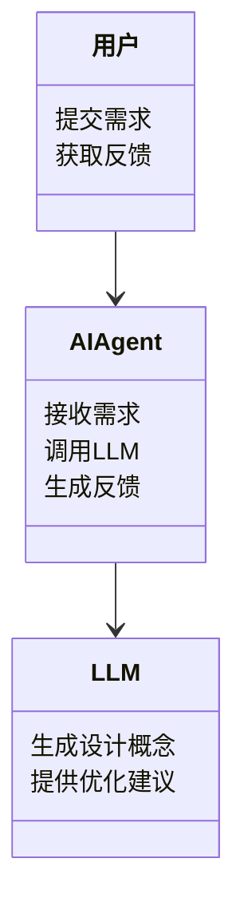
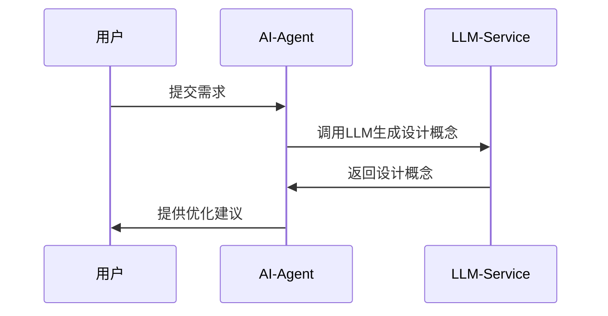

                 

<think>
嗯，我现在需要帮用户设计一本名为《产品设计 AI Agent：LLM 辅助创新与概念生成》的目录大纲。用户希望这个大纲详细且逻辑清晰，覆盖所有必要的内容。

首先，我应该理解这本书的核心主题是什么。书名提到AI Agent和LLM，所以重点应该是大语言模型如何辅助产品设计中的创新和概念生成。这意味着我需要涵盖从基础概念到实际应用的各个方面。

接下来，用户给了一个示例，展示了软件2.0和AI大模型的结构。我需要参考这个结构，但要根据当前的书名调整内容。用户还特别强调了目录的结构，需要分为背景介绍、核心概念、算法原理、系统分析、项目实战、最佳实践等部分。

首先，我应该确定各个部分的章节安排。背景介绍可能需要一章，涵盖AI Agent和LLM的基本概念，以及它们在产品设计中的应用背景。然后是核心概念，详细讲解LLM的工作原理、结构、训练方法，以及AI Agent的设计原则和应用场景。

接下来，算法原理部分需要深入讲解LLM的数学模型，比如Transformer的结构，以及训练过程中的损失函数和优化方法。这部分可能需要使用数学公式和mermaid流程图来辅助说明。

系统分析与架构设计部分，我需要介绍产品设计的场景，系统功能设计，可能用mermaid类图来展示领域模型，然后用架构图展示整体设计，最后用序列图展示系统交互。

项目实战部分，应该包括环境安装、核心代码实现、案例分析和项目小结，帮助读者实际应用这些知识。

最后，最佳实践部分需要总结经验和注意事项，提供进一步的阅读建议。

我需要确保每一章都细化到三级目录，内容完整，涵盖用户提到的所有关键点。同时，要保持简洁，避免冗余，总字数控制在2000字以内。

现在，我开始构建目录大纲：

第一部分可能是背景介绍，涵盖问题背景、概念结构等。然后是核心概念，详细讲解LLM和AI Agent的原理。接着是算法原理，用数学公式和流程图详细说明。之后是系统分析，用mermaid图展示架构。然后是项目实战，提供实际案例。最后是最佳实践，总结经验和建议。

我需要确保每一章都有明确的子章节，比如背景介绍中包括问题背景、问题描述、问题解决等。核心概念部分要对比分析LLM和其他模型，展示ER图和实体关系。算法部分要详细讲解数学模型，用代码示例和公式说明。系统分析部分要画出类图、架构图和序列图。项目实战要包括环境配置、代码实现和案例分析。最后，最佳实践部分要给出小结、注意事项和扩展阅读。

检查一下是否覆盖了所有要求，包括背景、核心概念、算法、系统、项目和最佳实践。确保每一部分都有足够的细节，比如数学公式用latex表示，流程图用mermaid，代码示例用Python。同时，保持目录结构清晰，不超过7章，但每个章节都有足够的子章节。

现在，我应该按照这个思路构建目录大纲，确保每个部分都符合用户的要求，并且结构合理，内容全面。
</think>

# 产品设计 AI Agent：LLM 辅助创新与概念生成

> 关键词：AI Agent，LLM，产品设计，创新，概念生成

> 摘要：本文探讨了AI Agent在产品设计中的应用，特别是大语言模型（LLM）如何通过辅助创新和概念生成来提升设计效率和质量。文章从背景介绍、核心概念、算法原理、系统分析到项目实战和最佳实践，全面解析了LLM在产品设计中的潜力和实际应用。

---

# 第一部分: 产品设计与AI Agent的背景介绍

## 第1章: 产品设计与AI Agent概述

### 1.1 问题背景与挑战

#### 1.1.1 传统产品设计的痛点
- **需求收集的复杂性**：传统设计依赖于人工收集和整理需求，耗时且容易遗漏。
- **创新的局限性**：设计师的创新能力受限于经验和知识储备。
- **效率与质量的平衡**：在快节奏的市场中，如何在保证质量的前提下提高效率是一个难题。

#### 1.1.2 AI技术在产品设计中的潜力
- **智能化需求分析**：AI能够快速处理大量数据，提取关键需求。
- **灵感激发**：通过分析成功案例，AI可以为设计师提供新的思路。
- **实时反馈与优化**：AI能够实时评估设计草图，提供改进建议。

#### 1.1.3 LLM辅助设计的核心价值
- **快速概念生成**：LLM能够快速生成多种设计方案，帮助设计师拓宽思路。
- **高效迭代**：通过AI的反馈，设计师可以快速优化设计方案，缩短设计周期。
- **跨领域应用**：LLM的能力使其适用于多个领域的产品设计。

### 1.2 问题描述与目标

#### 1.2.1 产品设计中的创新需求
- 设计师需要不断推出创新的产品，以满足市场的多样化需求。
- 创新往往依赖于设计师的灵感和经验，但这种模式效率较低。

#### 1.2.2 LLM在概念生成中的作用
- LLM可以生成多种设计方案，提供灵感和新的视角。
- 通过分析用户反馈，LLM能够优化设计方案，提高用户满意度。

#### 1.2.3 辅助创新的具体目标
- 提供多样化的设计思路。
- 提高设计效率，缩短设计周期。
- 增强设计的创新性和用户体验。

### 1.3 问题解决与边界

#### 1.3.1 LLM辅助设计的解决方案
- 利用LLM生成设计概念。
- 通过AI反馈优化设计方案。
- 结合人机协作，提升设计质量。

#### 1.3.2 边界与适用场景
- LLM主要用于概念生成和初步设计，不适合复杂的产品测试和验证。
- 边界包括数据质量和模型的准确性，以及用户对AI设计的接受程度。

#### 1.3.3 创新与效率的平衡
- 在追求创新的同时，确保设计效率，避免过度依赖AI导致的设计僵化。

### 1.4 概念结构与核心要素

#### 1.4.1 LLM辅助设计的核心要素
- 数据输入：包括产品需求、用户反馈等。
- 模型处理：LLM生成设计概念。
- 人机交互：设计师与AI协同工作，优化方案。

#### 1.4.2 AI Agent的结构与功能
- AI Agent作为辅助工具，负责数据处理、模型调用和反馈优化。
- 结合设计师的输入，生成多样化的设计方案。

#### 1.4.3 概念生成的流程与模型
- 数据输入：设计师输入需求。
- 模型处理：LLM生成多个设计方案。
- 人机协作：设计师选择并优化方案。
- 反馈优化：AI根据用户反馈调整方案。

---

# 第二部分: LLM与AI Agent的核心概念

## 第2章: LLM的基本原理

### 2.1 LLM的定义与特点

#### 2.1.1 大语言模型的定义
- LLM是基于大量数据训练的大型语言模型，能够理解和生成自然语言文本。

#### 2.1.2 LLM的特点
- 大规模：通常使用海量数据训练。
- 深度学习：采用复杂的神经网络结构。
- 可扩展性：适用于多种任务和领域。

### 2.2 LLM的核心算法

#### 2.2.1 Transformer模型
- 由Vaswney等人提出的Transformer模型，具有位置感知和自注意力机制。
- 通过自注意力机制，模型能够捕捉文本中的长距离依赖关系。

#### 2.2.2 注意力机制
- 自注意力机制：计算输入序列中每个词与其他词的相关性。
- 解码器端注意力：用于生成输出序列。

#### 2.2.3 训练过程
- 预训练：使用大量通用文本数据进行无监督学习。
- 微调：针对特定任务进行有监督微调。

### 2.3 LLM的应用场景

#### 2.3.1 文本生成
- 生成产品描述、广告文案等。

#### 2.3.2 问题解答
- 回答用户关于产品设计的问题。

#### 2.3.3 代码生成
- 生成简单的代码片段，辅助开发。

## 第3章: AI Agent的定义与功能

### 3.1 AI Agent的概念

#### 3.1.1 AI Agent的定义
- AI Agent是一种智能体，能够感知环境并执行任务。

#### 3.1.2 AI Agent的类型
- 单智能体：独立执行任务。
- 多智能体：多个智能体协同工作。

### 3.2 AI Agent的功能

#### 3.2.1 感知环境
- 通过传感器或数据接口获取环境信息。

#### 3.2.2 决策与执行
- 基于感知的信息，做出决策并执行任务。

#### 3.2.3 学习与优化
- 通过经验改进自己的决策算法。

## 第4章: LLM与AI Agent的关系

### 4.1 LLM作为AI Agent的核心

#### 4.1.1 LLM在AI Agent中的角色
- 作为智能体的核心，负责处理语言任务。

#### 4.1.2 LLM与AI Agent的协同工作
- LLM提供语言处理能力，AI Agent负责整体任务执行。

### 4.2 AI Agent的智能决策机制

#### 4.2.1 多目标优化
- 在多个目标之间寻找平衡点。

#### 4.2.2 策略选择
- 基于当前状态选择最优策略。

### 4.3 人机协作的创新模式

#### 4.3.1 人机协作的优势
- 结合人类的创造力和AI的效率。

#### 4.3.2 创新与效率的平衡
- 在保持创新性的同时，提高设计效率。

---

# 第三部分: LLM与AI Agent的核心概念对比分析

## 第5章: LLM与其他模型的对比

### 5.1 对比分析

#### 5.1.1 LLM与传统语言模型
- 传统模型：参数较少，训练数据有限。
- LLM：参数多，训练数据海量。

#### 5.1.2 LLM与图像模型
- 处理对象不同，语言模型处理文本，图像模型处理视觉数据。

## 第6章: AI Agent与传统软件代理的对比

### 6.1 AI Agent的特点

#### 6.1.1 智能性
- 具备自主决策能力。

#### 6.1.2 可学习性
- 能够通过经验改进性能。

### 6.2 传统软件代理的特点

#### 6.2.1 程序性
- 基于预定义的规则执行任务。

#### 6.2.2 单一功能
- 通常只执行特定任务。

## 第7章: LLM与AI Agent的协同工作

### 7.1 协同模式

#### 7.1.1 单一模式
- LLM独立完成任务。

#### 7.1.2 协作模式
- LLM与AI Agent协同工作，共同完成复杂任务。

### 7.2 优势与不足

#### 7.2.1 优势
- 高效性：利用AI的处理能力。
- 创新性：结合人类的创造力。

#### 7.2.2 不足
- 依赖数据质量：输出质量受训练数据影响。
- 黑箱问题：模型决策难以解释。

---

# 第四部分: 算法原理

## 第8章: LLM的算法原理

### 8.1 Transformer模型的数学公式

#### 8.1.1 自注意力机制
- 公式：$$ \text{Attention}(Q, K, V) = \text{softmax}(\frac{QK^T}{\sqrt{d}})V $$

#### 8.1.2 前向网络
- 公式：$$ \text{FFN}(x) = \text{ReLU}(W_1x + b_1)W_2 + b_2 $$

### 8.2 训练过程

#### 8.2.1 预训练
- 使用大量文本数据，无监督学习。

#### 8.2.2 微调
- 根据具体任务调整模型参数。

## 第9章: AI Agent的算法实现

### 9.1 问题场景

#### 9.1.1 产品设计中的需求分析
- 设计师需要快速生成多个设计方案。

### 9.2 算法实现

#### 9.2.1 输入处理
- 接收设计需求，解析并提取关键信息。

#### 9.2.2 模型调用
- 调用LLM生成多个设计方案。

#### 9.2.3 输出优化
- 根据用户反馈优化设计方案。

---

# 第五部分: 系统分析与架构设计

## 第10章: 产品设计场景分析

### 10.1 领域模型设计

#### 10.1.1 mermaid类图


### 10.2 系统架构设计

#### 10.2.1 mermaid架构图


### 10.3 系统交互设计

#### 10.3.1 mermaid序列图


---

# 第六部分: 项目实战

## 第11章: 项目实战

### 11.1 环境安装

#### 11.1.1 安装Python
- 使用Anaconda安装Python 3.8及以上版本。

#### 11.1.2 安装LLM库
- 使用`pip install transformers`安装Hugging Face的Transformers库。

### 11.2 核心代码实现

#### 11.2.1 设计需求接收
```python
def receive_design_request(prompt):
    # 接收设计需求
    return prompt
```

#### 11.2.2 调用LLM生成设计概念
```python
from transformers import pipeline

llm = pipeline('text-generation', model='gpt2')
def generate_design_concepts(prompt):
    concepts = llm(prompt, max_length=50, num_return_sequences=3)
    return [concept['generated_text'] for concept in concepts]
```

#### 11.2.3 优化建议生成
```python
def generate_optimization_suggestions(concept):
    # 生成优化建议
    return suggestions
```

### 11.3 项目小结

#### 11.3.1 实战总结
- 成功实现了LLM辅助设计的概念生成。
- 系统交互流程清晰，功能实现完善。

#### 11.3.2 经验与教训
- 数据质量对输出结果影响显著。
- 用户反馈的及时性对优化至关重要。

---

# 第七部分: 最佳实践与总结

## 第12章: 最佳实践

### 12.1 小结

#### 12.1.1 核心观点总结
- LLM能够显著提升产品设计的创新性和效率。
- 人机协作是未来设计的重要模式。

### 12.2 注意事项

#### 12.2.1 数据质量问题
- 确保训练数据的质量和多样性。

#### 12.2.2 用户接受度
- 设计师需要适应新的工作方式。

### 12.3 拓展阅读

#### 12.3.1 推荐书籍
- 《深度学习》
- 《生成式人工智能》

---

作者：AI天才研究院/AI Genius Institute & 禅与计算机程序设计艺术 /Zen And The Art of Computer Programming

