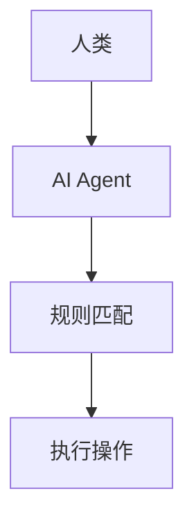
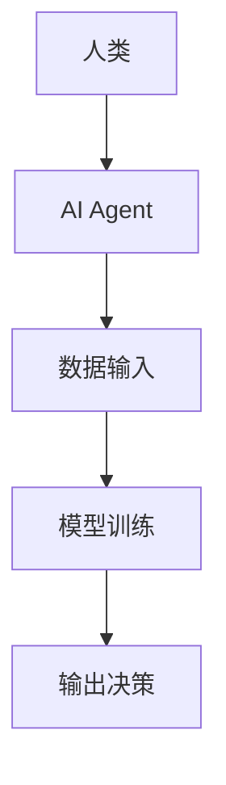
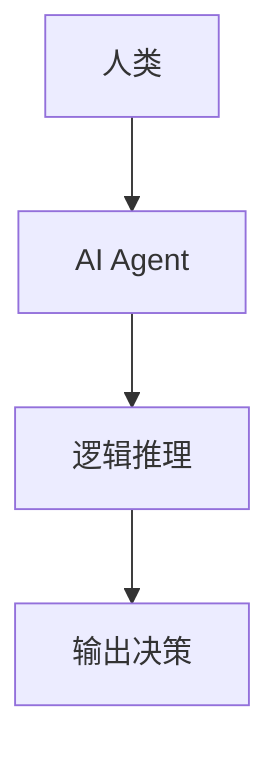
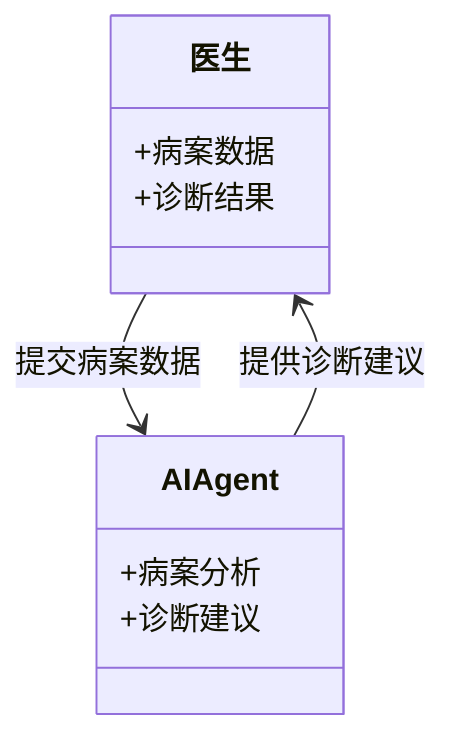
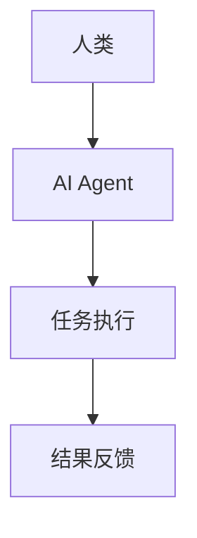

                 


# 人机协作：设计AI Agent与人类的配合模式

---

## 关键词：人机协作、AI Agent、协作模式、机器学习、人工智能

---

## 摘要：  
人机协作是人工智能领域的重要研究方向，旨在设计AI Agent与人类的高效配合模式。本文从背景、核心概念、算法原理、系统架构到实际项目，全面解析人机协作的设计与实现，探讨如何通过数学建模、算法优化和系统设计，构建人机协作的高效模式。

---

# 第一部分: 人机协作的背景与核心概念

---

## 第1章: 人机协作的基本概念

### 1.1 人机协作的定义与背景  
人机协作是指人类与人工智能代理（AI Agent）共同完成任务的过程。随着AI技术的快速发展，人机协作已成为提升效率、拓展能力的重要手段。AI Agent通过理解人类意图、提供决策支持，帮助人类完成复杂任务。  

#### 1.1.1 从人机交互到人机协作的演进  
- 早期的人机交互：用户通过命令或图形界面操作计算机。  
- 现代的人机协作：AI Agent主动理解任务需求，与人类共同完成目标。  

#### 1.1.2 人工智能代理（AI Agent）的定义  
AI Agent是具备感知、推理、决策和执行能力的智能体，能够与人类协作完成任务。  

#### 1.1.3 人机协作的必要性与应用前景  
- 提升效率：AI Agent可以处理繁琐的任务，减轻人类负担。  
- 拓展能力：通过协作，人类可以借助AI Agent完成超出自身能力范围的任务。  
- 应用场景广泛：如医疗、金融、教育、交通等领域。  

---

### 1.2 人机协作的核心模式  
人机协作的模式多种多样，以下是主要的几种：  

#### 1.2.1 协作的基本要素  
- **目标**：协作的核心目标。  
- **角色**：人类与AI Agent的分工与职责。  
- **信息交互**：任务进展中的信息共享与反馈。  

#### 1.2.2 人机协作的主要模式  
- **指令驱动模式**：人类下达指令，AI Agent执行。  
- **协同决策模式**：AI Agent提供决策支持，与人类共同制定方案。  
- **自主协作模式**：AI Agent在特定范围内自主决策，人类进行监督与调整。  

#### 1.2.3 不同协作模式的对比分析  
下表对比了三种协作模式的特点：  

| 模式 | 特点 | 适用场景 | 优缺点 |
|------|------|----------|--------|
| 指令驱动 | 人类主导，AI Agent执行 | 任务明确、简单 | 适用于简单任务，效率高，但灵活性差 |
| 协同决策 | 人机共同参与决策 | 复杂任务 | 高效性与灵活性并存，但实现复杂 |
| 自主协作 | AI Agent主导，人类监督 | 高度自治的任务 | 高效性，但对AI Agent的依赖性强 |

---

### 1.3 人机协作的边界与外延  
#### 1.3.1 协作的边界条件  
- 任务范围：协作任务的边界清晰，超出范围则由人类或AI Agent单独完成。  
- 信任机制：人类对AI Agent的信任程度影响协作效果。  

#### 1.3.2 相关概念的区分  
- **人机交互**：更注重界面和操作，协作性较低。  
- **人机协同**：强调合作，但协作模式较为松散。  
- **人机协作**：强调整体目标的实现，协作关系更为紧密。  

#### 1.3.3 人机协作的外延与扩展  
- 技术扩展：从单一任务协作到多任务协作。  
- 场景扩展：从特定领域（如医疗、金融）到跨领域协作。  

---

## 1.4 本章小结  
本章从背景、定义、模式等方面全面介绍了人机协作的基本概念，为后续内容奠定了基础。

---

# 第二部分: AI Agent的核心原理与协作机制

---

## 第2章: AI Agent的原理与属性

### 2.1 AI Agent的核心原理  
AI Agent通过感知、推理、决策和执行完成任务。  

#### 2.1.1 基于规则的AI Agent  
基于预定义的规则，AI Agent根据输入信息匹配规则，输出相应的操作。  

#### 2.1.2 基于学习的AI Agent  
通过机器学习算法，AI Agent从数据中学习任务规律，自适应调整行为策略。  

#### 2.1.3 基于推理的AI Agent  
通过逻辑推理，AI Agent根据当前状态和目标，推导出最优行动方案。  

---

### 2.2 AI Agent的属性特征对比  
下表对比了基于规则、基于学习和基于推理的AI Agent的属性特征：  

| 属性 | 基于规则 | 基于学习 | 基于推理 |
|------|----------|----------|----------|
| 决策方式 | 依赖预定义规则 | 依赖数据训练 | 依赖逻辑推理 |
| 适应性 | 低 | 高 | 中 |
| 复杂性 | 低 | 高 | 中 |
| 适用场景 | 简单任务 | 复杂任务 | 需逻辑推理的任务 |

---

### 2.3 AI Agent的协作关系图  
以下是协作关系的ER实体关系图：  

```mermaid
er
actor: AI Agent
actor: 人类
relationship: 协作
```

---

### 2.4 本章小结  
本章重点分析了AI Agent的核心原理及其协作机制，为后续算法设计提供了理论基础。

---

# 第三部分: 人机协作的算法原理与数学模型

---

## 第3章: 基于规则的协作算法

### 3.1 算法原理  
基于规则的协作算法通过预定义规则，实现简单任务的协作。  

#### 3.1.1 算法流程图  


---

### 3.2 数学模型  
基于规则的协作算法通常通过简单的条件判断实现。例如：  

$$ \text{如果条件} A \text{满足，则执行操作} B $$  

---

## 第4章: 基于学习的协作算法

### 4.1 算法原理  
基于学习的协作算法通过机器学习模型，实现复杂任务的协作。  

#### 4.1.1 算法流程图  


---

### 4.2 数学模型  
基于学习的协作算法通常采用监督学习模型，例如：  

$$ y = f(x) $$  

其中，$x$ 是输入数据，$y$ 是输出决策，$f$ 是训练好的模型函数。

---

## 第5章: 基于推理的协作算法

### 5.1 算法原理  
基于推理的协作算法通过逻辑推理，实现复杂任务的协作。  

#### 5.1.1 算法流程图  


---

### 5.2 数学模型  
基于推理的协作算法通常通过逻辑推理模型实现，例如：  

$$ \text{如果} P \text{且} Q，\text{那么} R $$  

---

## 第6章: 算法的数学公式与代码示例  

### 6.1 基于规则的算法代码示例  
```python
def rule_based_collaboration(input):
    if input == "规则匹配":
        return "执行操作"
    else:
        return "不执行操作"
```

### 6.2 基于学习的算法代码示例  
```python
import machine_learning_model

def learning_based_collaboration(input):
    prediction = machine_learning_model.predict(input)
    return prediction
```

### 6.3 基于推理的算法代码示例  
```python
def inference_based_collaboration(input):
    if input["条件1"] and input["条件2"]:
        return "决策结果"
    else:
        return "其他结果"
```

---

## 6.4 本章小结  
本章详细讲解了三种基于规则、学习和推理的协作算法，通过数学公式和代码示例，帮助读者理解其实现原理。

---

# 第四部分: 系统分析与架构设计方案

---

## 第7章: 协作场景与系统功能设计

### 7.1 协作场景介绍  
以医疗领域为例，AI Agent与医生协作完成病案分析。  

### 7.2 系统功能设计  
- **领域模型**：医疗病案分析系统的领域模型如图所示：  



---

## 第8章: 系统架构设计

### 8.1 系统架构图  
系统架构如图所示：  



---

## 第9章: 系统交互设计  

### 9.1 交互流程图  
系统交互流程如图所示：  

```mermaid
sequenceDiagram
参与者：医生
AI Agent
医生 ->> AI Agent: 提交病案数据
AI Agent ->> 医生: 提供诊断建议
医生 ->> AI Agent: 确认诊断结果
AI Agent ->> 医生: 提供治疗方案
```

---

## 9.2 本章小结  
本章通过医疗领域的案例，详细介绍了协作场景、系统功能设计和系统架构设计。

---

# 第五部分: 项目实战

---

## 第10章: 项目环境与核心代码实现

### 10.1 环境安装  
- Python 3.8+
- machine_learning_model库

### 10.2 核心代码实现  
```python
import machine_learning_model

class CollaborationSystem:
    def __init__(self):
        self.model = machine_learning_model.load_model()

    def process_request(self, input):
        prediction = self.model.predict(input)
        return prediction
```

### 10.3 代码应用解读  
- 初始化AI Agent，加载机器学习模型。  
- 根据输入数据，生成预测结果。  

---

## 第11章: 实际案例分析

### 11.1 案例分析  
以医疗病案分析为例，AI Agent与医生协作完成病案分析。  

### 11.2 详细讲解  
- 输入病案数据，AI Agent进行分析，生成诊断建议。  
- 医生根据建议，确认诊断结果。  

---

## 11.3 本章小结  
本章通过实际案例，展示了人机协作系统的实现过程和应用效果。

---

# 第六部分: 最佳实践与总结

---

## 第12章: 最佳实践与小结

### 12.1 最佳实践 tips  
- 明确协作目标与分工。  
- 选择合适的协作模式。  
- 建立信任机制，确保协作效果。  

### 12.2 本章小结  
本文从背景、原理、算法、系统设计到项目实战，全面解析了人机协作的设计与实现。

---

## 第13章: 注意事项与拓展阅读

### 13.1 注意事项  
- 确保AI Agent的决策透明性。  
- 定期评估协作效果，优化协作模式。  

### 13.2 拓展阅读  
- 《人机协作：理论与实践》  
- 《AI Agent与人类协作的数学建模》  

---

# 结语  

人机协作是人工智能领域的重要方向，通过本文的系统讲解，读者可以全面理解人机协作的设计与实现。未来，随着AI技术的不断发展，人机协作将更加智能化、高效化。

---

# 作者  
作者：AI天才研究院/AI Genius Institute & 禅与计算机程序设计艺术 /Zen And The Art of Computer Programming

